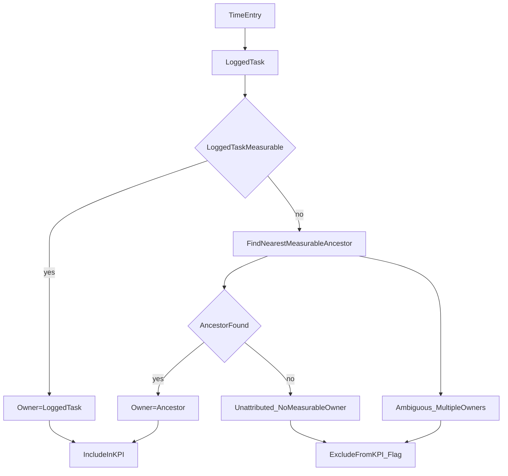

# Attribution Engine Full V1 Plan

## Outcome

Ship a versioned attribution engine that:

- Preserves raw `timeEntries` as logged.
- Computes KPI/calculator person-hours through deterministic attribution rules.
- Flags and excludes ambiguous time from KPI by policy.
- Adds visibility (what was attributed, what was excluded, why).
- Provides reassignment tools to resolve attribution issues.

## Selected Product Decisions

- Scope: **Full v1** (engine + observability + reassignment + migration/backfill).
- Ambiguity policy: **Soft allow + flag**:
  - ambiguous time is **excluded from KPI totals**,
  - surfaced in UI counters and issue lists,
  - fixable via reassignment/measurable edits.

## Core Attribution Model

- A task is **measurable** when it has `workQuantity > 0`, `workUnit`, and `workCategory`.
- For each time entry, compute attribution candidate set in the task branch.
- Rules:
  1. If logged task is measurable, attribute to itself.
  2. Else use nearest measurable ancestor in same branch.
  3. If no measurable owner exists, mark `unattributed:noMeasurableOwner`.
  4. If multiple measurable owners are valid by branch/work-type constraints, mark `ambiguous:multipleOwners`.
- KPI/calculator include only `attributed` entries; excluded buckets are reported.

## Implementation Workstreams

### 1) Attribution Domain + Engine (versioned)

- Add attribution types and result schema in `[/Users/bemoy/Developer/time-tracking/src/lib/types.ts](/Users/bemoy/Developer/time-tracking/src/lib/types.ts)`:
  - `AttributionStatus` (`attributed | unattributed | ambiguous`)
  - `AttributionReason`
  - `AttributedEntry` (entry id + ownerTaskId + status/reason)
  - `AttributionEngineVersion` (start with `v1`)
- Add engine module (new): `[/Users/bemoy/Developer/time-tracking/src/lib/attribution/engine.ts](/Users/bemoy/Developer/time-tracking/src/lib/attribution/engine.ts)`
  - deterministic pure functions:
    - measurable detection
    - ancestor traversal
    - per-entry attribution
    - summary counters
- Keep current rollup utility as compatibility layer, then migrate callers to engine-backed aggregation in `[/Users/bemoy/Developer/time-tracking/src/lib/time-rollup.ts](/Users/bemoy/Developer/time-tracking/src/lib/time-rollup.ts)`.

### 2) KPI + Calculator Integration

- Update KPI pipeline in `[/Users/bemoy/Developer/time-tracking/src/components/KpiSection.tsx](/Users/bemoy/Developer/time-tracking/src/components/KpiSection.tsx)` and `[/Users/bemoy/Developer/time-tracking/src/lib/kpi.ts](/Users/bemoy/Developer/time-tracking/src/lib/kpi.ts)`:
  - consume engine-attributed person-hours only,
  - exclude ambiguous/unattributed from denominator,
  - expose excluded totals and counts.
- Update calculator historical source in `[/Users/bemoy/Developer/time-tracking/src/components/CalculatorSheet.tsx](/Users/bemoy/Developer/time-tracking/src/components/CalculatorSheet.tsx)`:
  - use same KPI source-of-truth output,
  - display quality hint (e.g., “Xh excluded due to ambiguity”).

### 3) Observability UI (why numbers are what they are)

- Extend Settings productivity section in `[/Users/bemoy/Developer/time-tracking/src/pages/SettingsView.tsx](/Users/bemoy/Developer/time-tracking/src/pages/SettingsView.tsx)` and `[/Users/bemoy/Developer/time-tracking/src/components/KpiSection.tsx](/Users/bemoy/Developer/time-tracking/src/components/KpiSection.tsx)`:
  - counters for `attributed`, `unattributed`, `ambiguous` hours/entries,
  - compact issue list grouped by reason.
- Add task-level attribution breakdown panel (new component) in task detail flow:
  - new: `[/Users/bemoy/Developer/time-tracking/src/components/TaskAttributionBreakdown.tsx](/Users/bemoy/Developer/time-tracking/src/components/TaskAttributionBreakdown.tsx)`
  - wire into `[/Users/bemoy/Developer/time-tracking/src/pages/TaskDetail.tsx](/Users/bemoy/Developer/time-tracking/src/pages/TaskDetail.tsx)`.

### 4) Reassignment UX + Data Operations

- Add entry reassignment action sheet/modal:
  - new component: `[/Users/bemoy/Developer/time-tracking/src/components/ReassignEntrySheet.tsx](/Users/bemoy/Developer/time-tracking/src/components/ReassignEntrySheet.tsx)`
- Extend DB operations in `[/Users/bemoy/Developer/time-tracking/src/lib/db.ts](/Users/bemoy/Developer/time-tracking/src/lib/db.ts)`:
  - safe `reassignTimeEntry(entryId, newTaskId)` update,
  - optional bulk reassignment helper for a task subtree.
- Add audit metadata strategy (append-only note/event) via existing notes store hooks:
  - reuse task notes infra to record reassignment actions.

### 5) Migration + Backfill Strategy

- No destructive migration needed for raw entries.
- Add cached attribution snapshot store (optional but recommended for performance):
  - new store in DB version bump (e.g., `attributionSnapshots`) with engine version key.
- Backfill job:
  - runs lazily on app start after store init in `[/Users/bemoy/Developer/time-tracking/src/App.tsx](/Users/bemoy/Developer/time-tracking/src/App.tsx)`,
  - computes snapshots in chunks,
  - invalidates on task/time-entry changes.
- Include “recompute attribution” control in Settings for diagnostics.

### 6) Guardrails in Create/Edit Flows

- Keep measurable setup explicit in create/edit UIs:
  - ensure template/task creation paths in `[/Users/bemoy/Developer/time-tracking/src/components/CreateTaskSheet.tsx](/Users/bemoy/Developer/time-tracking/src/components/CreateTaskSheet.tsx)` and template forms remain aligned.
- Add non-blocking warnings where ambiguity is likely (no hard block per selected policy).

### 7) Test Matrix (required)

- Unit tests for attribution engine (new):
  - `[/Users/bemoy/Developer/time-tracking/src/lib/attribution/engine.test.ts](/Users/bemoy/Developer/time-tracking/src/lib/attribution/engine.test.ts)`
  - cases: self measurable, ancestor measurable, none measurable, ambiguous multi-owner, mixed subtree.
- KPI/calculator parity tests:
  - `[/Users/bemoy/Developer/time-tracking/src/lib/kpi.test.ts](/Users/bemoy/Developer/time-tracking/src/lib/kpi.test.ts)`
- Reassignment operation tests:
  - `[/Users/bemoy/Developer/time-tracking/src/lib/db.test.ts](/Users/bemoy/Developer/time-tracking/src/lib/db.test.ts)`
- UI smoke/integration tests for warnings and counters.

## Rollout Plan

1. Build engine + tests behind feature flag.
2. Wire KPI/calculator to engine output and add counters.
3. Add task-level breakdown and reassignment UX.
4. Enable snapshot cache + backfill + recompute control.
5. Remove old rollup path after parity verification.

## Acceptance Criteria

- KPI/calculator use identical attributed-hour source.
- Ambiguous/unattributed time is never silently included in KPI.
- Users can see why hours were excluded and fix via reassignment.
- Raw time-entry history remains intact and auditable.
- Engine behavior is deterministic and covered by automated tests.

