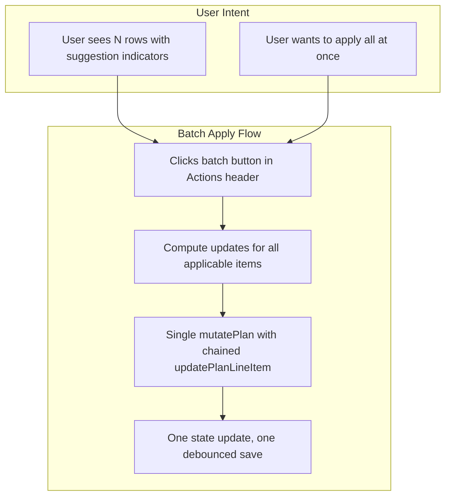
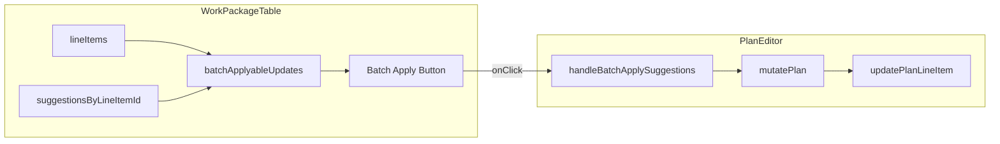

# Batch Apply Suggestions Button - UX Plan

## Current Behavior

The existing per-row "Apply suggestions" (magic) button in [WorkPackageTable.tsx](src/pages/planning/WorkPackageTable.tsx) uses `handleMagicApply(item, suggestion)` to apply phase suggestions (crew, rate, time hours) from KPI data to that single line item. The logic lives in `getMagicPhaseUpdates` / `canApplyMagic` and calls `onUpdate(item.id, updates)` for each click.

PlanEditor's `handleUpdateItem` passes each update through `mutatePlan`, which triggers one debounced save per call. **Multiple sequential `onUpdate` calls would race**: each `setCurrentPlan` receives the previous state, so later updates could overwrite earlier ones. A batch operation must use a **single** `mutatePlan` call.

---

## Proposed Interaction Model




---

## Placement

**Location**: Actions column header (`th.planning-view__wp-actions-col`). The column already contains per-row magic buttons; a header-level "apply all" button is the natural scoping for a batch action.

**Rationale**:

- Keeps batch control in the same column as the per-row actions (spatial consistency)
- Follows existing pattern: SettingsRemediationView uses bulk buttons above the list; here the table header is the analogous "list-level" control
- Avoids adding a new toolbar or cluttering the items-header (which PlanEditor owns)

**Visual**: Same `planning-view__wp-action-btn planning-view__wp-action-btn--magic` styles as the per-row button, with SparklesIcon. Optionally a tooltip like "Apply suggested values to all applicable rows".

---

## Implementation Outline

### 1. WorkPackageTable changes

- **Compute batch updates**: Reuse `getMagicPhaseUpdates` / `canApplyMagic`. Build an array of `{ itemId, updates }` for all `lineItems` where `canApplyMagic(item, suggestion)` is true.
- **New prop**: `onBatchApplySuggestions?: (updates: Array<{ itemId: string; updates: Partial<PlanLineItem> }>) => void`
- **Batch button**: Render in the Actions column header when `!isLocked && onBatchApplySuggestions` and `batchApplyableCount > 0`. Disabled when `batchApplyableCount === 0`.
- **Header layout**: Use flexbox in the header cell to stack "Actions" label and the batch button, preserving alignment with the existing design.

### 2. PlanEditor changes

- **Handler**: `handleBatchApplySuggestions(updates)` that calls:

```ts
  mutatePlan((prev) => {
    let result = prev;
    for (const { itemId, updates: u } of updates) {
      result = updatePlanLineItem(result, itemId, u);
    }
    return result;
  });
  

```

- **Pass to WorkPackageTable**: `onBatchApplySuggestions={handleBatchApplySuggestions}` (only when not read-only/locked).

### 3. CSS

- Add rules for the batch button in the header (e.g. `.planning-view__wp-actions-col .planning-view__wp-batch-apply`) so it fits in the sticky header and aligns with the column.
- Reuse `.planning-view__wp-action-btn--magic` for visual consistency.

---

## Edge Cases and Accessibility

- **Empty state**: When no items have actionable suggestions, the batch button is hidden or disabled. Prefer disabled with a tooltip ("No suggestions to apply") so users understand the feature exists.
- **Accessibility**: `aria-label="Apply suggestions to all applicable work packages"`, `title="Apply suggested values to all rows"`.
- **Locked/read-only**: Do not render or enable the batch button when `isLocked` (same as per-row magic button).

---

## Files to Modify


| File                                                                                                           | Change                                                                                                     |
| -------------------------------------------------------------------------------------------------------------- | ---------------------------------------------------------------------------------------------------------- |
| [src/pages/planning/WorkPackageTable.tsx](src/pages/planning/WorkPackageTable.tsx)                             | Add `onBatchApplySuggestions` prop; compute `batchApplyableUpdates`; render batch button in Actions header |
| [src/pages/planning/PlanEditor.tsx](src/pages/planning/PlanEditor.tsx)                                         | Add `handleBatchApplySuggestions` and pass as prop                                                         |
| [src/styles/components/planning/work-package-table.css](src/styles/components/planning/work-package-table.css) | Style batch button in header cell                                                                          |


---

## Data Flow




