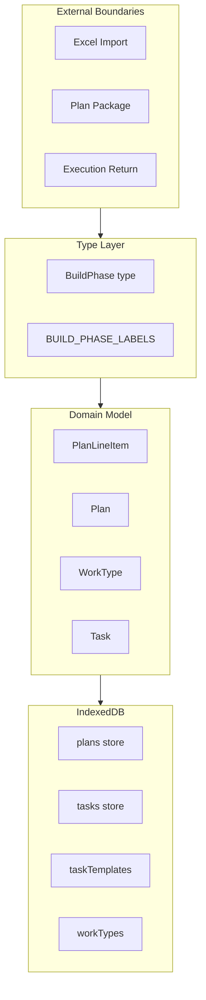

# Build Phase Semantic Migration: Full Migration Plan

## Goal

Migrate from `build-up`/`tear-down` to `assembly`/`dismantle` everywhere: type literals, property names, stored data, and data transfer schemas. Achieve strict naming consistency so future Excel project phase import can use canonical terms without mapping.

## Architecture Context

---

## Phase 1: Canonical Types and Mapping Layer

**Objective:** Introduce `assembly`/`dismantle` as the canonical phase values. All new code uses them. Legacy values are mapped only at import boundaries.

### 1.1 Type Definition Update

**File:** [src/lib/types.ts](src/lib/types.ts)

- Change `BuildPhase = 'assembly' | 'dismantle'`
- Update `BUILD_PHASE_LABELS`: `'Assembly'`, `'Dismantle'`
- Update `BUILD_PHASES`: `['assembly', 'dismantle']`
- Add `LEGACY_PHASE_TO_CANONICAL: Record<string, BuildPhase>` for import normalization:
  - `'build-up'` -> `'assembly'`
  - `'tear-down'` -> `'dismantle'`
  - `'assembly'` -> `'assembly'`
  - `'dismantle'` -> `'dismantle'`

### 1.2 Property Access Mapping (Internal Bridge)

Property names remain `buildUp`*/`tearDown`* in Phase 1. Add explicit mapping in [src/lib/planning/plan-model.ts](src/lib/planning/plan-model.ts):

- `getPhaseFields`: `phase === 'assembly'` -> read buildUp fields; `phase === 'dismantle'` -> read tearDown fields
- `phaseFieldUpdates`: `phase === 'assembly'` -> prefix `buildUp`; `phase === 'dismantle'` -> prefix `tearDown`
- `getPhaseQuantity`: `phase === 'dismantle'` for tearDownQuantity override
- Update `PhaseFields` usage and `isPhaseActive` to use new phase values

### 1.3 Schedule Span Mapping

**File:** [src/lib/planning/scheduling/schedule-span.ts](src/lib/planning/scheduling/schedule-span.ts)

- `hasPhaseDatesFor`: `phase === 'assembly'` -> buildUp dates; `phase === 'dismantle'` -> tearDown dates
- `getPhaseSpan`, `getWorkCalendarPhaseSpans`: use assembly/dismantle in conditionals
- Keep `PhaseDateValues` field names (buildUpStartDate, etc.) for now

### 1.4 Import Boundary Normalization

**CSV/Excel import** ([src/lib/interop/import.ts](src/lib/interop/import.ts)):

- Extend `VALID_BUILD_PHASES` to accept both: `['build-up', 'tear-down', 'assembly', 'dismantle']`
- Normalize parsed values to canonical via `LEGACY_PHASE_TO_CANONICAL` before use
- Emit canonical `BuildPhase` in `ImportedWorkPackage`

**Plan package** ([src/lib/interop/data-transfer/plan-package.ts](src/lib/interop/data-transfer/plan-package.ts)):

- `parsePhaseLineItemId`: accept `build-up`/`tear-down`/`assembly`/`dismantle`; normalize to canonical
- `toPhaseLineItemId`: emit `assembly`/`dismantle` (new format)
- `isLegacySinglePhaseLineItem`: allow both legacy and canonical `buildPhase` values

**Execution return** ([src/lib/interop/data-transfer/execution-return-import.ts](src/lib/interop/data-transfer/execution-return-import.ts)):

- `normalizeTaskBuildPhase`: map `build-up` -> `assembly`, `tear-down` -> `dismantle`
- `parsePhaseLineItemId`: accept legacy + canonical; return canonical

### 1.5 Iteration Updates

Replace all `BUILD_PHASES` and phase literals across:

- [src/lib/planning/plan-suggestions.ts](src/lib/planning/plan-suggestions.ts) – `buildPhaseSuggestion` calls: use `'assembly'` and `'dismantle'`; keep `LineItemSuggestion.buildUp` / `.tearDown` keys for now (rename in Phase 2). Consumers [LineItemCard](src/pages/planning/LineItemCard.tsx), [WorkPackageTable](src/pages/planning/WorkPackageTable.tsx): use `displayPhase === 'assembly' ? suggestion.buildUp : suggestion.tearDown` (displayPhase is canonical; suggestion keys stay legacy until Phase 2)
- [src/lib/planning/release-selection.ts](src/lib/planning/release-selection.ts) – `parsePlanSelectionToken`: accept `build-up`/`tear-down` via `LEGACY_PHASE_TO_CANONICAL`, return canonical
- [src/lib/planning/scheduling/capacity.ts](src/lib/planning/scheduling/capacity.ts)
- [src/lib/planning/plan-model.ts](src/lib/planning/plan-model.ts)
- [src/pages/field-plan/field-plan-model.ts](src/pages/field-plan/field-plan-model.ts)
- [src/pages/planning/hooks/useExecutionReturnForProgress.ts](src/pages/planning/hooks/useExecutionReturnForProgress.ts) – replace `li.phase === 'tear-down' ? 'tear-down' : 'build-up'` with `li.phase ?? 'assembly'` (phase is already normalized on import)
- All other files that compare `phase === 'build-up'` or iterate `BUILD_PHASES`

### 1.6 UI Labels and Phase 1 CSS

- `BUILD_PHASE_LABELS` drives all UI; will show "Assembly" and "Dismantle" immediately
- [src/pages/planning/schedule/PlanScheduleInputs.tsx](src/pages/planning/schedule/PlanScheduleInputs.tsx): Replace hardcoded legend strings "Build-up" and "Tear-down" with `BUILD_PHASE_LABELS['assembly']` and `BUILD_PHASE_LABELS['dismantle']`
- **CSS classes:** Add `.field-plan-row__phase-badge--assembly` and `.field-plan-row__phase-badge--dismantle` with the same styles as `--build-up` and `--tear-down` respectively (duplicate rules or comma selector). Update [FieldPlanPhaseView](src/pages/field-plan/components/FieldPlanPhaseView.tsx) to use the phase value directly in the class (e.g. `field-plan-row__phase-badge--${phase}`). This avoids mapping phase to legacy class names.

**Deliverable:** App displays "Assembly"/"Dismantle", accepts legacy import data. All internal logic uses canonical phase values. Property names unchanged.

---

## Phase 2: Property Rename and Persistence Migration

**Objective:** Rename all `buildUp`*/`tearDown`* to `assembly*`/`dismantle*`. Migrate IndexedDB stores.

### 2.1 Plan Model Property Rename

**File:** [src/lib/planning/plan-model.ts](src/lib/planning/plan-model.ts)

Rename `PlanLineItem` fields:

- `buildUpRate` -> `assemblyRate`, `buildUpCrew` -> `assemblyCrew`, etc. (12 buildUp fields)
- `tearDownRate` -> `dismantleRate`, `tearDownCrew` -> `dismantleCrew`, etc. (12 tearDown fields)
- `tearDownQuantity` -> `dismantleQuantity`

Update `Plan`:

- `buildUpStartDate` -> `assemblyStartDate`, `buildUpEndDate` -> `assemblyEndDate`
- `tearDownStartDate` -> `dismantleStartDate`, `tearDownEndDate` -> `dismantleEndDate`

Update `getPhaseFields`, `phaseFieldUpdates`, `getPhaseQuantity`, `isPhaseActive` to use new property names with `phase === 'assembly'` / `phase === 'dismantle'`.

### 2.2 Schedule Span Property Rename

**File:** [src/lib/planning/scheduling/schedule-span.ts](src/lib/planning/scheduling/schedule-span.ts)

- `PhaseDateField`: `assemblyStartDate`, `assemblyEndDate`, `dismantleStartDate`, `dismantleEndDate`
- `PhaseDateValues`, `readPhaseDateValues`, `PHASE_FIELDS`, `hasPhaseDatesFor`, `getPhaseSpan`, `getWorkCalendarPhaseSpans`, `getPlanEffectiveSpan`
- [src/pages/planning/schedule/schedule-date-ui.ts](src/pages/planning/schedule/schedule-date-ui.ts) re-exports `PhaseDateField` from schedule-span; callers (PlanScheduleInputs, PlanScheduleInputsPanel, ScheduleView, PlanEditor) receive updated types automatically

### 2.3 WorkType and Task Property Rename

**File:** [src/lib/types.ts](src/lib/types.ts)

- `WorkType`: `buildUpRate` -> `assemblyRate`, `tearDownRate` -> `dismantleRate`
- `Task`, `TaskTemplate`: keep `buildPhase` (value is already `BuildPhase`; no rename needed)

### 2.4 Plans Repo

**File:** [src/lib/db/plans-repo.ts](src/lib/db/plans-repo.ts)

- Update defaults: `assemblyStartDate`, `assemblyEndDate`, `dismantleStartDate`, `dismantleEndDate`

### 2.5 IndexedDB Migration

**File:** [src/lib/db/migrations/apply-db-migrations.ts](src/lib/db/migrations/apply-db-migrations.ts)

Add migration **version 29** (current is 28):

- **plans store:** For each plan, transform `Plan` and each `PlanLineItem` in `plan.lineItems`:
  - Rename buildUp* -> assembly*, tearDown* -> dismantle* (including nested lineItems)
- **tasks store:** `buildPhase` values: `'build-up'` -> `'assembly'`, `'tear-down'` -> `'dismantle'`
- **taskTemplates store:** Same buildPhase value mapping
- **workTypes store:** Rename `buildUpRate` -> `assemblyRate`, `tearDownRate` -> `dismantleRate`
- **executionReturnLineItems store:** Transform each record: `phase` value (`build-up`/`tear-down` -> `assembly`/`dismantle`)
- **executionReturnUnplannedTasks store:** `buildPhase` value mapping in each snapshot

Note: `executionReturns` store holds metadata only (no payload); payload data lives in `executionReturnLineItems` and `executionReturnUnplannedTasks`.

Follow existing migration patterns (e.g. `backfillStore`, or `getAll().then()` with `put()` for nested structures).

### 2.6 Plan Suggestions and plan-package Merge Structure

**File:** [src/lib/planning/plan-suggestions.ts](src/lib/planning/plan-suggestions.ts)

- Rename `LineItemSuggestion.buildUp` -> `assembly`, `LineItemSuggestion.tearDown` -> `dismantle`
- Update `generatePlanSuggestions` to emit `assembly`/`dismantle` keys
- Update consumers: [LineItemCard](src/pages/planning/LineItemCard.tsx), [WorkPackageTable](src/pages/planning/WorkPackageTable.tsx) – use `suggestion[displayPhase]` or explicit `assembly`/`dismantle`

**File:** [src/lib/interop/data-transfer/plan-package.ts](src/lib/interop/data-transfer/plan-package.ts)

- `mergeLegacyPhaseItems(sourceWorkPackageId, buildUpItem, tearDownItem)`: rename to `(sourceWorkPackageId, assemblyItem, dismantleItem)`; update internal references
- `normalizeSerializedLineItems`: change bucket shape from `{ buildUp, tearDown }` to `{ assembly, dismantle }`; when parsing legacy items, map `buildPhase === 'build-up'` -> `assembly`, `'tear-down'` -> `dismantle` for bucket key assignment

### 2.7 Work Type Export/Import

**Files:** [src/lib/interop/work-type-export.ts](src/lib/interop/work-type-export.ts), [src/lib/interop/work-type-import.ts](src/lib/interop/work-type-import.ts)

- **Export:** CSV headers and columns: `assemblyRate`, `dismantleRate` (replacing `buildUpRate`, `tearDownRate`)
- **Import:** Parse and validate `assemblyRate`, `dismantleRate`; support legacy headers during transition if desired, then strict mode

### 2.8 Global Search-Replace

Systematic updates across codebase for:

- `buildUp` -> `assembly`, `tearDown` -> `dismantle` (camelCase property names) – order: replace `tearDown` first to avoid partial matches, then `buildUp`
- `build-up` -> `assembly`, `tear-down` -> `dismantle` (string literals in phase comparisons)
- `buildUpStartDate` -> `assemblyStartDate`, etc.

**Additional key files** (beyond Phase 2.1–2.4): [PlanEditor](src/pages/planning/PlanEditor.tsx), [PlanScheduleInputs](src/pages/planning/schedule/PlanScheduleInputs.tsx), [PlanScheduleInputsPanel](src/pages/planning/schedule/PlanScheduleInputsPanel.tsx), [SharedScheduleView](src/pages/planning/SharedScheduleView.tsx), [WorkPackageTable](src/pages/planning/WorkPackageTable.tsx), [LineItemCard](src/pages/planning/LineItemCard.tsx), [FieldPlanPlanDetail](src/pages/field-plan/components/FieldPlanPlanDetail.tsx), [WorkTypeFormSheet](src/components/WorkTypeFormSheet.tsx), [CreateTaskSheet](src/components/CreateTaskSheet.tsx), [TaskWorkQuantity](src/components/TaskWorkQuantity.tsx), [AddLineItemForm](src/pages/planning/AddLineItemForm.tsx), [schedule-hierarchy](src/lib/planning/scheduling/schedule-hierarchy.ts), [shared-row-aggregates](src/lib/planning/scheduling/shared-row-aggregates.test.ts), [wrap-up-v2-projection](src/lib/planning/wrap-up-v2-projection.ts), [template-export](src/lib/interop/template-export.ts). See grep results (~100 files) for full scope.

**Deliverable:** All properties use assembly/dismantle. DB migrated. No legacy property names remain in code or storage.

---

## Phase 3: Data Transfer Schema and Line Item ID Format

**Objective:** Canonical phase values and property names in exported/imported data. Excel import contract uses strict naming.

### 3.1 Plan Package Contract

**File:** [src/lib/interop/data-transfer/contracts.ts](src/lib/interop/data-transfer/contracts.ts)

- `LegacyPlanPackageLineItem.buildPhase`: type remains `BuildPhase`; only values `assembly`/`dismantle` emitted
- `ExecutionReturnLineItem.phase`: same

### 3.2 Line Item ID Format

**File:** [src/lib/interop/data-transfer/plan-package.ts](src/lib/interop/data-transfer/plan-package.ts)

- `toPhaseLineItemId`: emit `{sourceWorkPackageId}::phase::assembly` or `{sourceWorkPackageId}::phase::dismantle`
- `parsePhaseLineItemId`: retain parsing of `build-up`/`tear-down` for backward-compatible import of legacy plan packages; normalize to canonical and return `assembly`/`dismantle`

### 3.3 Schema Version

- Consider bumping `DATA_TRANSFER_SCHEMA_VERSION` to `1.2` if format change is breaking
- Add `1.2` to `DATA_TRANSFER_SCHEMA_COMPAT` if needed
- Document phase value and property name changes in schema

### 3.4 Excel/CSV Import Contract

**File:** [src/lib/interop/import.ts](src/lib/interop/import.ts)

- **Strict mode (required for goal):** `VALID_BUILD_PHASES = ['assembly', 'dismantle']` only. Reject `build-up`/`tear-down`.
- CSV column header: keep `buildphase` for backward compatibility with existing templates
- Validation error message: `Valid: assembly, dismantle`
- Phase 1–2: Import accepts both legacy and canonical; Phase 3: strict canonical only; Phase 4: no legacy parsing anywhere

**Deliverable:** Exported plan packages and execution returns use `assembly`/`dismantle`. Excel import requires `assembly`/`dismantle` in the phase column. Backward-compatible import of **legacy plan packages** (file format) still supported via `parsePhaseLineItemId`; CSV import is strict.

---

## Phase 4: UI, Styling, and Cleanup

**Objective:** Align CSS and UI with new terminology. Remove legacy mapping.

### 4.1 CSS Classes and Variables

**Files:** [src/styles/components/field-plan.css](src/styles/components/field-plan.css), [src/styles/_variables.css](src/styles/_variables.css), [src/styles/_dark.css](src/styles/_dark.css)

- `.field-plan-row__phase-badge--build-up` -> `.field-plan-row__phase-badge--assembly`
- `.field-plan-row__phase-badge--tear-down` -> `.field-plan-row__phase-badge--dismantle`
- `--wp-phase-buildup-`* -> `--wp-phase-assembly-`*
- `--wp-phase-teardown-`* -> `--wp-phase-dismantle-`*

### 4.2 Component Updates

- [src/pages/field-plan/components/FieldPlanPhaseView.tsx](src/pages/field-plan/components/FieldPlanPhaseView.tsx): Filter by `assembly`/`dismantle`; use new CSS classes
- [src/components/WorkTypePicker.tsx](src/components/WorkTypePicker.tsx): "Assembly"/"Dismantle" (already from BUILD_PHASE_LABELS)

### 4.3 Remove Legacy Mapping

- Remove `LEGACY_PHASE_TO_CANONICAL` if no longer used
- `parsePhaseLineItemId`: drop support for `build-up`/`tear-down` (only accept `assembly`/`dismantle`)
- CSV import: remove legacy phase values from validation
- `normalizeTaskBuildPhase`: simplify to identity for canonical values

### 4.4 Test Updates

- **~40+ test files** touch phase or property names. Update:
  - Phase literals: `'build-up'` -> `'assembly'`, `'tear-down'` -> `'dismantle'`
  - Property access: `.buildUpRate`, `.buildUpCrew`, etc. -> `.assemblyRate`, `.assemblyCrew`, etc.; same for tearDown -> dismantle
  - Row/issue keys: `phase:plan-a:build-up` -> `phase:plan-a:assembly`, etc.
  - Line item IDs in fixtures: `line-1::phase::build-up` -> `line-1::phase::assembly`
- Run full test suite after each phase
- Key test files: plan-package.test, execution-return-import.test, plan-suggestions.test, schedule-hierarchy.test, shared-row-aggregates.test, SidebarIssuesPanel.test, schedule-assistant-synthesis.test, import.test, release-selection.test, capacity tests, plan-model.test

**Deliverable:** UI and styles match new semantics. Legacy phase value support removed. All tests pass.

---

## Phase Summary

| Phase | Scope                                 | Deployable             | Risk                        |
| ----- | ------------------------------------- | ---------------------- | --------------------------- |
| 1     | Types, labels, mapping, import compat | Yes                    | Low                         |
| 2     | Property renames, DB migration        | Yes (requires Phase 1) | Medium – migration must run |
| 3     | Data transfer, Excel contract         | Yes (requires Phase 2) | Low                         |
| 4     | CSS, cleanup, legacy removal          | Yes (requires Phase 3) | Low                         |

## Excel Import Readiness

After Phase 3, Excel project phase import can:

- Use `assembly` and `dismantle` in the phase column
- Map 1:1 with internal `BuildPhase`
- Avoid any legacy mapping layer
- Rely on consistent property names (`assemblyRate`, `dismantleRate`, `assemblyStartDate`, etc.) for any programmatic schema or documentation

---

## Ambiguities Resolved and Risks

| Area                              | Resolution                                                                                                                                                                                           |
| --------------------------------- | ---------------------------------------------------------------------------------------------------------------------------------------------------------------------------------------------------- |
| **Phase 1 CSS**                   | Add `--assembly` and `--dismantle` classes explicitly; use `field-plan-row__phase-badge--${phase}`. Avoids vague "map via data attribute."                                                           |
| **LineItemSuggestion keys**       | Phase 1: keep `buildUp`/`tearDown`; consumers use `displayPhase === 'assembly' ? suggestion.buildUp : suggestion.tearDown`. Phase 2: rename to `assembly`/`dismantle`.                               |
| **DB migration version**          | Explicitly version 29.                                                                                                                                                                               |
| **executionReturns store**        | Holds metadata only; migrate `executionReturnLineItems` and `executionReturnUnplannedTasks`.                                                                                                         |
| **schedule-hierarchy phaseRowId** | `phase:${plan.id}:${phase}` – when `phase` is `assembly`/`dismantle`, row IDs change. Tests (e.g. `schedule-hierarchy.test.ts`, `shared-row-aggregates.test.ts`) must update expected keys.          |
| **Search-replace order**          | Replace `tearDown` before `buildUp` to avoid accidental partial matches (neither overlaps, but order is deterministic).                                                                              |
| **Plan package merge bucket**     | `mergeLegacyPhaseItems` and `normalizeSerializedLineItems` use internal `bucket.buildUp`/`bucket.tearDown` – rename to `assembly`/`dismantle` in Phase 2.                                            |
| **work-type-export/import**       | CSV columns `buildUpRate`/`tearDownRate` must become `assemblyRate`/`dismantleRate`; add to Phase 2.                                                                                                 |
| **template-export**               | Exports `buildPhase` (value); when Task uses canonical `BuildPhase`, export emits `assembly`/`dismantle` automatically. No property rename.                                                          |
| **Rollback**                      | IDB migrations are one-way. If Phase 2 migration fails, consider wrapping in try/catch and logging; failed transactions typically abort. No automated rollback; backup before migration recommended. |

