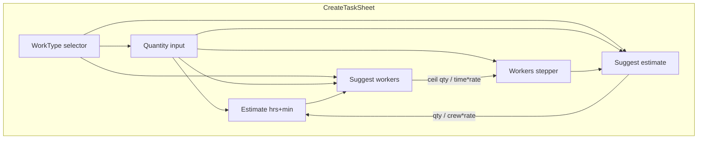

# Calculator Integration in Task Creation

## Context

- **CreateTaskSheet** flow: Title → WorkType (when blank) → Quantity → Estimate → Workers → Create
- **Calculator logic** (from [CalculatorSheet.tsx](src/components/CalculatorSheet.tsx)): Given quantity, rate (WorkType expected or historical KPI), and one of (time, crew), solve for the other
  - Solve for **crew**: `crew = qty / (time × rate)` — need time
  - Solve for **time**: `time = qty / (crew × rate)` — need crew
- Rate sources: WorkType.expectedProductivity (expected) or `computeWorkTypeKpis` + `findKpiByKey` (historical)

---

## Design Options

### Option A: Inline "Suggest" Buttons (Minimal UI)

**Placement**: One button next to Estimate, one next to Workers.

**Behavior**:

- **"Suggest estimate"** (next to Estimate): Uses current quantity + workers + rate → computes time → fills estimate (hrs/min). Enabled when: workType selected, quantity > 0, workers > 0.
- **"Suggest workers"** (next to Workers): Uses current quantity + estimate + rate → computes crew → fills workers. Enabled when: workType selected, quantity > 0, estimate > 0.

**Rate source**: Use WorkType.expectedProductivity (simple; no KPI load). Optional: add small "Historical" toggle if we want both sources.

**Pros**: Minimal UI, no extra screens, direct action.
**Cons**: No rate-source choice; no provenance/confidence display; user may not notice the buttons.

---

### Option B: Collapsible "Use Calculator" Section

**Placement**: Between Quantity and Estimate, an expandable section "Suggest from calculator".

**Behavior**:

- Collapsed by default. Expand to show:
  - Solve for: [Estimate | Workers] (pills)
  - If Estimate: "Crew size" stepper (or use current workers). "Calculate" → fills estimate.
  - If Workers: "Available time (hrs)" input. "Calculate" → fills workers.
- Optionally: Productivity source (Expected | Historical) — requires KPI load.
- Small provenance: "Based on {rate} from Work Type" or "Historical avg (N tasks)".

**Pros**: Discoverable, room for source selection and provenance.
**Cons**: More UI; needs KPI load (async) for historical rate.

---

### Option C: Shared Calculator Module + Inline Result

**Approach**: Extract calculation logic to a shared module (e.g. `src/lib/calculator.ts`).

**Content**:

- `computeProductivityResult(solveFor, qty, rate, timeHours, crew)` — pure function
- `getRateForWorkType(workType, kpis?)` — returns expected or historical rate

**CreateTaskSheet**: Uses module for inline suggest. No CalculatorSheet UI reuse; just logic.
**CalculatorSheet**: Imports from same module (refactor).

**Behavior in CreateTaskSheet**: Same as Option A, but with clean separation. Optionally show a compact provenance ("55 m²/person-hr expected") below the suggest button.

**Pros**: DRY, testable, cleaner architecture.
**Cons**: Still minimal UX unless combined with A or B.

---

### Option D: Calculator Popover on Estimate/Workers

**Placement**: Small calculator icon or "Calculate" link next to Estimate and Workers labels.

**Behavior**: Click opens a compact popover (or inline dropdown) with:

- Solve for: [Estimate | Workers]
- Known value input (crew or time)
- "Apply" → prefills the form and closes

**Pros**: Clear affordance, doesn't clutter main form.
**Cons**: Popover/dropdown adds UI complexity; may feel interruptive.

---

### Option E: Hybrid — Suggest Buttons + Optional Source

**Placement**: Same as Option A, but add a small "Rate: Expected (55 m²/hr)" or "Historical (48 m²/hr, 5 tasks)" text when expanded.

**Behavior**:

- Primary: "Suggest estimate" and "Suggest workers" buttons (always use WorkType.expectedProductivity for simplicity).
- Optional expansion: "Also use historical rate" — loads KPIs when expanded, shows both options (e.g. "Expected: 2h 10m" vs "Historical: 2h 30m") and lets user pick.

**Pros**: Simple default (expected rate only); power users get historical.
**Cons**: Slightly more logic; KPI load only when "historical" requested.

---

## Recommendation: Option A + C

1. **Extract calculator logic** to `src/lib/calculator.ts`:
  - `computeProductivityResult(solveFor: 'crew'|'time', qty, rate, timeHours, crew)` — returns crew value or time in minutes
  - Refactor [CalculatorSheet.tsx](src/components/CalculatorSheet.tsx) to use it
2. **Add inline Suggest buttons** in CreateTaskSheet:
  - "Suggest estimate" next to Estimate section — uses quantity, workers, WorkType.expectedProductivity
  - "Suggest workers" next to Workers section — uses quantity, estimate, WorkType.expectedProductivity
3. **No KPI load in CreateTaskSheet** initially — use expected rate only. Keeps flow fast and avoids async.
4. **Optional enhancement** (Phase 2): Add "Historical" source when we want KPI-backed suggestions (requires passing `tasks` to CreateTaskSheet and async KPI load).

---

## Implementation Sketch (Option A + C)

### 1. Create [src/lib/calculator.ts](src/lib/calculator.ts)

```typescript
export type SolveFor = 'crew' | 'time';

export function computeProductivityResult(
  solveFor: SolveFor,
  qty: number,
  rate: number,
  timeHours: number,
  crew: number,
): { crew?: number; estimatedMinutes?: number } | null;
```

- For `crew`: return `Math.ceil(qty / (timeHours * rate))`
- For `time`: return `Math.round((qty / (crew * rate)) * 60)` (minutes)

### 2. Refactor CalculatorSheet

- Import `computeProductivityResult` from calculator.ts
- Replace inline `computeResult` with shared function (adapt for full `CalcResult` shape if needed, or keep thin wrapper)

### 3. Update CreateTaskSheet

- When `showWork && showEstimate` and workType + quantity present:
  - Add "Suggest" button next to Estimate label
  - On click: `timeHours = (estHours + estMinutes/60)`, use workers. If solving for time: `timeHours = qty / (workers * rate)`, then set estHours/estMinutes from result.
  - Actually: "Suggest estimate" means solve for TIME. Input = workers. Output = estimate. So we use current workers. `timeHours = qty / (workers * rate)`, convert to hrs+min, set state.
- When `showWork && showWorkers` and workType + quantity present:
  - Add "Suggest" button next to Workers label
  - On click: "Suggest workers" = solve for CREW. Input = time (from estimate). `crew = ceil(qty / (timeHours * rate))`, set workers.
- Guard: `workers > 0` for estimate suggestion; `estimate > 0` for workers suggestion.
- Show small hint: "Based on {rate} {unit}/person-hr" from workType.

### 4. CreateTaskSheet needs `tasks` prop for future historical rate?

- For Option A (expected only): No. CreateTaskSheet does not need tasks.
- For Phase 2 (historical): Parent would pass `tasks`, and we'd load KPIs when user toggles "Historical". Defer.

---

## Flow Diagram




---

## Files to Modify


| File                                                                     | Change                                                             |
| ------------------------------------------------------------------------ | ------------------------------------------------------------------ |
| [src/lib/calculator.ts](src/lib/calculator.ts)                           | New — shared `computeProductivityResult`                           |
| [src/components/CalculatorSheet.tsx](src/components/CalculatorSheet.tsx) | Refactor to use calculator module                                  |
| [src/components/CreateTaskSheet.tsx](src/components/CreateTaskSheet.tsx) | Add Suggest estimate / Suggest workers buttons, wire to calculator |


---

## Edge Cases

1. **No WorkType selected** (blank mode): Suggest buttons disabled or hidden.
2. **Quantity = 0 or empty**: Suggest disabled.
3. **Rate = 0**: WorkType.expectedProductivity is required and > 0; guard in calculator.
4. **Suggest workers but estimate = 0**: Disable button or show "Enter estimate first".
5. **Suggest estimate but workers = 0**: Disable or default workers = 1 for calc.

