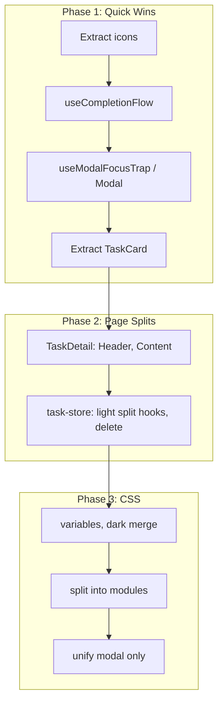

# Codebase Refactoring Plan

## Guiding Rule: 500-Line Cap

**Keep each file/block under ~500 lines.** Beyond that, a file is likely doing too much and should be split. Complexity may justify smaller targets.

## Current Offenders


| File                                          | Lines | Action                                                  |
| --------------------------------------------- | ----- | ------------------------------------------------------- |
| [index.css](src/index.css)                    | 2930  | Split + variables + dark merge + modal unification      |
| [task-store.ts](src/lib/stores/task-store.ts) | 598   | Light split: extract hooks, delete ops (~450 + 60 + 90) |
| [TaskDetail.tsx](src/pages/TaskDetail.tsx)    | 584   | TaskDetailHeader, TaskDetailContent, useCompletionFlow  |
| [TodayView.tsx](src/pages/TodayView.tsx)      | 579   | Extract TaskCard only; keep ActiveTimerSection inline   |


---

## Part 1: CSS Refactoring (2930 → many files, each <500)

### 1.1 Split into modular files

Create a CSS architecture under `src/styles/`:

```
src/styles/
├── _variables.css    # :root, CSS custom properties, keyframes
├── _base.css         # Reset, body, main, accessibility
├── _utilities.css    # Modal shell, backdrop, obvious shared classes
├── _dark.css         # Consolidated prefers-color-scheme: dark
└── components/
    ├── timer.css
    ├── task-row.css
    ├── task-card.css
    ├── modal.css     # All dialogs use shared .backdrop + .modal
    ├── task-detail.css
    ├── today-view.css
    ├── project.css
    └── ...
```

Import from a single `index.css` entrypoint.

### 1.2 Introduce utility classes (where obvious)

Add shared utilities only for clear wins. Focus on modal (1.5) first. Optional: `.btn--start`, `.btn--stop`, `.input` for repeated button/input patterns. Avoid over-abstracting task-row vs task-card or section layouts—they differ enough that shared base classes can create more overrides than they save.

### 1.3 Consolidate dark mode

Dark mode rules are scattered across many blocks. Move all `@media (prefers-color-scheme: dark)` into `_dark.css`. Use variables for dark colors so overrides are minimal.

### 1.4 Expand CSS variables (eliminate hardcoded hex)

There are ~50 hardcoded hex values. Add these variables to `:root` and the dark-mode block:

- `--color-ready-hover`, `--color-recording-hover` (replace repeated #15803d, #b91c1c)
- `--color-bg-subtle`, `--color-bg-blocked`, `--color-border-cancel` (replace #f9fafb, #fffbeb, #d1d5db)
- `--color-amber`, `--color-amber-muted` (replace #f59e0b, #b45309, #fbbf24)
- `--color-gray-mid` (replace #6b7280)
- For dark mode: `--color-bg-elevated` (252525), `--color-bg-hover` (2a2a2a), etc.

This removes repetition and simplifies dark mode. **Est. savings: ~80–120 lines** (fewer duplicate dark blocks, shorter rules).

### 1.5 Unify modal/dialog CSS (highest-impact reduction)

All modals share the same structure: backdrop + content box. Currently 5–6 nearly identical blocks:

- delete-confirm-backdrop + project-picker-backdrop (identical)
- delete-confirm, project-picker, install-prompt, complete-confirm, complete-prompt, delete-project-confirm (same shell: background, radius, padding, shadow, animation)

Replace with one `.backdrop` and one `.modal` (+ optional `--modal-max-width`). Dialogs differ only in layout of inner content. **Est. savings: ~250–350 lines**.

### 1.6 Deferred: Unify task-row and task-card

Layouts differ (row vs card with progress). Shared base may require more overrides than savings. Revisit if CSS continues to grow.

### 1.7 Deferred: Unify section + list pattern

Section structures differ across task-list, today-view, project-detail (project badge vs plain title). Revisit if needed.

### 1.8 Optional: Tailwind migration (maximum reduction)

Introducing Tailwind would replace most custom CSS with utility classes. `index.css` could shrink to ~100–200 lines (config + custom components). Larger migration; consider if you want maximum reduction.

---

### 1.9 Target layout (each file <500 lines)

Resulting structure:

```
src/styles/
├── _variables.css     ~80
├── _base.css          ~120
├── _utilities.css     ~100  (modal + obvious shared classes)
├── _dark.css          ~80
└── components/
    ├── timer.css      ~120
    ├── task-row.css   ~150
    ├── task-card.css  ~140
    ├── task-detail.css ~200
    ├── today-view.css  ~150
    ├── modal.css       ~150  (all dialogs unified)
    ├── project.css     ~200
    └── ...
```

Main `index.css` only imports. Largest file ~200 lines.

---

## Part 2: TypeScript/React Refactoring

### 2.1 Extract `useCompletionFlow` hook

The completion flow (handleComplete, handleConfirmCompleteOnly, handleConfirmCompleteAll, handlePromptYes) is duplicated in [TodayView.tsx](src/pages/TodayView.tsx), [TaskList.tsx](src/pages/TaskList.tsx), and [TaskDetail.tsx](src/pages/TaskDetail.tsx). TaskDetail differs (single task vs list). Keep hook API simple—possibly separate variants for list vs detail, or thin shared helpers rather than one complex hook.

### 2.2 Extract shared dialog wrapper

Five components share the same modal behavior: focus trap, body scroll lock, backdrop click, Escape key. Extract:

```ts
// src/components/Modal.tsx or src/lib/hooks/useModalFocusTrap.ts
export function useModalFocusTrap(isOpen: boolean, onClose: () => void) {
  // Single implementation of focus trap + body overflow
}
```

And/or a `<Modal backdrop onClick={onClose}>` wrapper that handles backdrop, focus trap, and ARIA. DeleteTaskConfirm, DeleteProjectConfirm, CompleteParentConfirm, CompleteParentPrompt, ProjectPicker would use it.

Saves ~~30 lines per dialog × 5 = **~~150 lines**, plus reduces bug surface (one implementation).

### 2.3 Shared icon component

Icons (Play, Pause, Check, Chevron, Trash, Warning, Blocked, etc.) are duplicated in [TaskRow.tsx](src/components/TaskRow.tsx), [TodayView.tsx](src/pages/TodayView.tsx), [ProjectDetail.tsx](src/pages/ProjectDetail.tsx), [DeleteTaskConfirm.tsx](src/components/DeleteTaskConfirm.tsx), [DeleteProjectConfirm.tsx](src/components/DeleteProjectConfirm.tsx), [CompleteParentConfirm.tsx](src/components/CompleteParentConfirm.tsx), [CompleteParentPrompt.tsx](src/components/CompleteParentPrompt.tsx).

Create `src/components/icons.tsx`:

```ts
// Named exports: PlayIcon, PauseIcon, CheckIcon, ChevronIcon, ExpandChevronIcon, TrashIcon, WarningIcon, BlockedIcon, ...
// Each takes optional className and aria-hidden
```

Saves ~100+ lines across files and ensures icon consistency.

### 2.4 Extract TaskCard to its own file

[TaskCard](src/pages/TodayView.tsx) is a ~230-line component defined inside TodayView. Move to `src/components/TaskCard.tsx` with clear props. Brings TodayView under 350 lines.

---

## Part 3: Light split task-store (598 → 3 files, each <500)

[task-store.ts](src/lib/stores/task-store.ts) at 598 lines—only 98 over. Light split avoids cross-file state complexity:

```
src/lib/stores/
├── task-store.ts       # Core + project ops (~450 lines); re-exports delete and hooks
├── task-store-delete.ts # getDeletePreview, deleteTaskWithEntries (~90)
└── task-store-hooks.ts  # useTaskStore, useTask, useSubtasks, useProjectTasks, useActiveTasks (~60)
```

Or keep as one file and extract only hooks (~60 lines) to get core under 540. Revisit full split if store grows.

---

## Part 4: Split TaskDetail (584 → <500)

Extract 2 subcomponents to bring TaskDetail under 450 lines:

- **TaskDetailHeader** — back button, title edit, project badge (~50 lines)
- **TaskDetailContent** — status section, timer/action buttons, subtask list, add form (~200 lines)

Use `useCompletionFlow` (2.1) to remove ~40 lines of completion logic. Keep API simple—TaskDetail has different flow (single task) than list views.

---

## Part 5: Split TodayView (579 → <450)

- Extract **TaskCard** to `components/TaskCard.tsx` (~230 lines) — already in 2.4
- Keep **ActiveTimerSection** and **task grouping logic** inline (~80 lines combined); extracting adds file overhead for little benefit
- TodayView becomes ~350 lines after TaskCard extraction

---

## Part 6: Recommended Order




Phase 1 first (low risk). CSS last (needs visual QA).

---

## Risk and Scope Notes

- **500-line rule**: Primary target. index.css is worst; task-store and pages are marginal. Balanced splits avoid over-abstraction.
- **CSS**: Split + variables + dark merge + modal unification. Defer task-row/card and section unification.
- **Tailwind**: Optional. Larger migration.
- **Testing**: After each extraction, verify timer flows, completion dialogs, dark mode, touch targets (44px).

---

## Summary


| Area               | Current    | Target                     | Approach                                 |
| ------------------ | ---------- | -------------------------- | ---------------------------------------- |
| index.css          | 2930 lines | Many files, each under 250 | Split + variables + dark + modal only    |
| task-store.ts      | 598 lines  | 3 files or extract hooks   | Light split: hooks, delete; core+project |
| TaskDetail.tsx     | 584 lines  | Under 450                  | TaskDetailHeader, TaskDetailContent      |
| TodayView.tsx      | 579 lines  | Under 450                  | TaskCard only; keep rest inline          |
| Completion logic   | 3 copies   | 1 hook (simple API)        | useCompletionFlow                        |
| Dialog boilerplate | 5 copies   | 1 hook/wrapper             | useModalFocusTrap or Modal               |
| Icons              | 6+ files   | 1 icons module             | components/icons.tsx                     |


