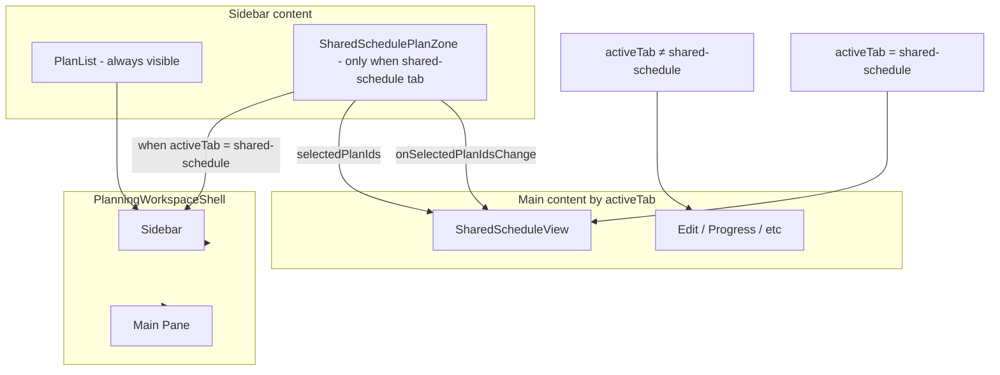

# Contextual Shared Schedule Zone + Remove Collapsible Sidebar

## Architecture




- **Sidebar is additive, not replacement:** When `activeTab === 'shared-schedule'`, the sidebar shows BOTH `SharedSchedulePlanZone` (plan selection checkboxes) AND `PlanList` (for interacting with plans — select, create, delete, wrap up). Users can always interact with the plan list.
- When `activeTab !== 'shared-schedule'`: sidebar shows only `PlanList`.
- Layout when Shared Schedule is active: plan selection zone at top (compact), plan list below. Sidebar content area scrolls to accommodate both; the plans section effectively shrinks or shares space.

---

## 1. Remove Collapsible Sidebar

### 1.1 State and persistence

- **[usePlanningWorkspaceState.ts](src/pages/planning/hooks/usePlanningWorkspaceState.ts)**: Remove `sidebarCollapsed` state, `toggleSidebarCollapsed`, and `sessionStorage` for `planning_sidebar_collapsed`. Remove from returned object.
- **[PlanningView.tsx](src/pages/PlanningView.tsx)**: Remove `sidebarCollapsed` and `onToggleSidebar` props from `PlanningWorkspaceShell`.

### 1.2 Shell UI

- **[PlanningWorkspaceShell.tsx](src/pages/planning/workspace/PlanningWorkspaceShell.tsx)**: Remove `sidebarCollapsed` and `onToggleSidebar` props. Remove the collapse button from the sidebar header. Remove `isSidebarIconsOnly` and the conditional `planning-workspace__sidebar--icons` class. Drop the `{!isSidebarIconsOnly && (...)}` guard around sidebar content so content is always shown. Remove `isSidebarVisible` and always render the aside (no conditional wrapper). In the footer, remove the `!isSidebarIconsOnly &&` conditional around the tab label span so labels are always visible.

### 1.3 CSS

- **[planning-workspace.css](src/styles/components/planning-workspace.css)**: Remove `.planning-workspace__sidebar--icons` and its nested overrides (lines 62-81).

### 1.4 Tests

- **[PlanningWorkspaceShell.test.tsx](src/pages/planning/workspace/PlanningWorkspaceShell.test.tsx)**: Remove `sidebarCollapsed` and `onToggleSidebar` from props. Update assertion (see section 5.1).

---

## 2. Create SharedSchedulePlanZone Component

### 2.1 New component (compact add-on, not a full sidebar replacement)

- **Create [SharedSchedulePlanZone.tsx](src/pages/planning/SharedSchedulePlanZone.tsx)** in the same folder as `PlanList`.

**Purpose:** A compact section that appears *above* the plan list when on Shared Schedule tab. It does NOT replace `PlanList` — `PlanList` stays visible for plan interaction.

**Props:**

- `plans`, `projects`, `selectedPlanIds`, `onSelectedPlanIdsChange`

**Structure (compact, no duplication):**

- Single zone with heading "Plans for shared schedule" or "Include in grid".
- Filter plans with same logic as [SharedScheduleView.tsx](src/pages/planning/SharedScheduleView.tsx) lines 66-69: `draft`, `active`, or `reviewed` (exclude `received`, `session-closed`).
- Flat or grouped (Active / Archive) checkbox list — keep compact. Use `planning-sidebar__zone` and a compact list style.
- **List items:** checkbox `<label>` per plan (similar to current [SharedScheduleView.tsx](src/pages/planning/SharedScheduleView.tsx) lines 288-300). Include plan title and meta (project · status).
- **Do NOT include:** New Plan button, full Active/Archive structure (PlanList provides those below). This is an add-on section only.
- **Telemetry:** When selection changes (checkbox toggle), call `trackTelemetryEvent('shared_schedule_plan_selection_change')`. Import from `../../lib/telemetry/telemetry`.

**Shared logic:** Reuse `sortPlansForSidebar` and `isPlanArchived` from [plan-lifecycle](src/lib/planning/plan-lifecycle.ts) for grouping if using Active/Archive, or a simple flat list of selectable plans.

### 2.2 SidebarZone extraction (optional)

- If `SharedSchedulePlanZone` uses `SidebarZone` for the zone heading, extract it from `PlanList` into [SidebarZone.tsx](src/pages/planning/SidebarZone.tsx). If the zone is a simple `<h3>` + list, extraction may be unnecessary.

### 2.3 Styles

- Add classes for the shared-schedule zone list (e.g. `shared-schedule-plan-zone__item`, `shared-schedule-plan-zone__option`) in [schedule-view.css](src/styles/components/schedule-view.css) or [planning-workspace.css](src/styles/components/planning-workspace.css). Reuse patterns from `.shared-schedule__plan-option` but adapt for vertical sidebar layout (single column, compact rows).

---

## 3. Integrate Contextual Zone in PlanningWorkspaceShell

### 3.1 Additive sidebar content (both zone and plan list when Shared Schedule)

- **[PlanningWorkspaceShell.tsx](src/pages/planning/workspace/PlanningWorkspaceShell.tsx)**: Inside `planning-workspace__sidebar-content`:
  - **Always** render `PlanList` with current props (so users can always interact with plans).
  - **When** `activeTab === 'shared-schedule'`: render `SharedSchedulePlanZone` *above* `PlanList` as an additional section. Pass `plans`, `projects`, `selectedPlanIdsForSharedSchedule`, `onSetSelectedPlanIdsForSharedSchedule`.
  - Layout: wrap both in a flex column or stack. The `planning-workspace__sidebar-content` is already `overflow-y: auto`, so the combined content scrolls. The plan selection zone is compact at top; the plan list below gets the remaining space (or scrolls with it).

**Example structure:**

```jsx
<div className="planning-workspace__sidebar-content">
  {activeTab === 'shared-schedule' && (
    <SharedSchedulePlanZone
      plans={plans}
      projects={projects}
      selectedPlanIds={selectedPlanIdsForSharedSchedule}
      onSelectedPlanIdsChange={onSetSelectedPlanIdsForSharedSchedule}
    />
  )}
  <PlanList ... />
</div>
```

### 3.2 Footer

- Footer (Shared Schedule, Insights tabs) remains unchanged except: remove the `!isSidebarIconsOnly &&` conditional around the tab label `<span>` (see 1.2). Footer is always visible with full labels.

---

## 4. Remove Plan Selection from SharedScheduleView

### 4.1 UI

- **[SharedScheduleView.tsx](src/pages/planning/SharedScheduleView.tsx)**: Remove the entire `schedule-view__block` containing "Plan Selection" (lines 274-305). Keep header, empty state ("Select at least one plan..."), crew pool, work calendar, and schedule grid.

### 4.2 Props

- `SharedScheduleView` keeps `selectedPlanIds` and `onSelectedPlanIdsChange` — state remains in the shell; the zone updates it. No prop changes.

### 4.3 Default selection

- The `useEffect` that sets default selection when `selectedPlanIds` is empty (lines 86-100) stays as-is. It runs when the view mounts; the sidebar zone will reflect the updated selection.

### 4.4 Cleanup

- **[schedule-view.css](src/styles/components/schedule-view.css)**: `SharedSchedulePlanZone` uses new class names (e.g. `shared-schedule-plan-zone__option`). Remove `.shared-schedule__plan-selector`, `.shared-schedule__plan-option`, `.shared-schedule__plan-option-title`, `.shared-schedule__plan-option-meta` (lines 920-949). Migrate any needed patterns into the new zone styles.

---

## 5. Tests

### 5.1 PlanningWorkspaceShell

- **[PlanningWorkspaceShell.test.tsx](src/pages/planning/workspace/PlanningWorkspaceShell.test.tsx)**: 
  - Remove `sidebarCollapsed` and `onToggleSidebar` props.
  - When `activeTab="shared-schedule"`, the sidebar contains BOTH SharedSchedulePlanZone (plan selection) and PlanList. Expect plan selection content (e.g. "Plan A" in a checkbox context, or zone heading "Plans for shared schedule") and PlanList content (e.g. "New Plan", "Active") to both appear. Update assertions accordingly.

### 5.2 SharedScheduleView

- If there are tests that assert on the Plan Selection block in the main content, update them to assert on sidebar content or remove those assertions.

---

## File Summary


| Action | File                                                                                            |
| ------ | ----------------------------------------------------------------------------------------------- |
| Modify | [usePlanningWorkspaceState.ts](src/pages/planning/hooks/usePlanningWorkspaceState.ts)           |
| Modify | [PlanningView.tsx](src/pages/PlanningView.tsx)                                                  |
| Modify | [PlanningWorkspaceShell.tsx](src/pages/planning/workspace/PlanningWorkspaceShell.tsx)           |
| Modify | [PlanList.tsx](src/pages/planning/PlanList.tsx) — only if SidebarZone extracted                 |
| Modify | [SharedScheduleView.tsx](src/pages/planning/SharedScheduleView.tsx)                             |
| Modify | [planning-workspace.css](src/styles/components/planning-workspace.css)                          |
| Modify | [schedule-view.css](src/styles/components/schedule-view.css)                                    |
| Modify | [PlanningWorkspaceShell.test.tsx](src/pages/planning/workspace/PlanningWorkspaceShell.test.tsx) |
| Create | [SharedSchedulePlanZone.tsx](src/pages/planning/SharedSchedulePlanZone.tsx)                     |
| Create | [SidebarZone.tsx](src/pages/planning/SidebarZone.tsx) — optional, only if used                  |


---

## Implementation Order

1. Remove collapsible sidebar (state, shell, CSS, tests).
2. Create `SharedSchedulePlanZone` (compact add-on section) and styles.
3. Update `PlanningWorkspaceShell`: when `activeTab === 'shared-schedule'`, render `SharedSchedulePlanZone` above `PlanList`; always render `PlanList`.
4. Remove Plan Selection block from `SharedScheduleView`; remove obsolete CSS.
5. Adjust and run tests.

