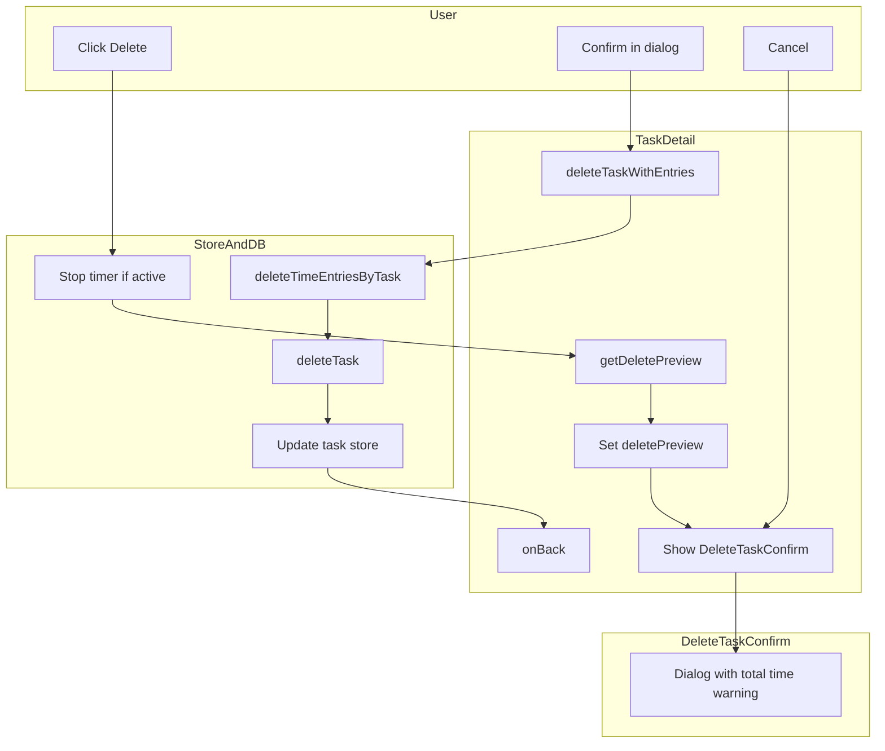

# Delete Task Implementation Plan

Hard delete tasks and their time entries. Show a warning when the task has tracked time. Cascade delete parent and subtasks. Irreversible.

---

## 1. Database Layer

**File:** [src/lib/db.ts](src/lib/db.ts)

Add two functions:

`**deleteTimeEntriesByTask(taskId: string): Promise<void>**`

- Use `getTimeEntriesByTask(taskId)` then delete each entry: `db.delete('timeEntries', entry.id)`
- Run in a single transaction for atomicity (all or nothing)
- idb supports `db.transaction('timeEntries', 'readwrite')` for batched deletes

`**deleteTask(id: string): Promise<void>**`

- `db.delete('tasks', id)`
- No cascade at DB layer; cascade logic lives in the store

---

## 2. Delete Logic (Store)

**File:** [src/lib/stores/task-store.ts](src/lib/stores/task-store.ts)

Add imports: `getTimeEntriesByTask`, `getSubtasks`, `deleteTask`, `deleteTimeEntriesByTask` from db; `stopTimer` from timer-store; `durationMs`, `formatDurationShort` from types.

`**getDeletePreview(taskId: string): Promise<DeletePreview>**`

```ts
interface DeletePreview {
  taskIds: string[];      // ids to delete (task + subtasks if parent)
  totalTimeMs: number;    // sum of all entry durations for these tasks
  hasActiveTimer: boolean;
}
```

- Load task; if not found, return or throw
- If `parentId === null`: get subtasks via `getSubtasks(taskId)`; collect task + subtask ids
- If `parentId !== null`: single task
- For each task id, call `getTimeEntriesByTask` and sum `durationMs(startUtc, endUtc)`
- If `activeTimer?.taskId` is in the set: include that elapsed time in total and set `hasActiveTimer: true`
- Return `{ taskIds, totalTimeMs, hasActiveTimer }`

`**deleteTaskWithEntries(taskId: string): Promise<void>**`

- Call `getDeletePreview(taskId)` to get `taskIds`
- If `hasActiveTimer`: call `stopTimer()` first (saves the entry)
- In order: for each id in `taskIds`, call `deleteTimeEntriesByTask(id)` then `deleteTask(id)`
- For a parent, delete subtasks first (to avoid referential oddness), then parent
- Update store: `setState({ tasks: state.tasks.filter(t => !taskIds.includes(t.id)) })`
- Call `refreshTasks()` or manually filter to keep DB and store in sync

---

## 3. Confirmation Dialog Component

**File:** `src/components/DeleteTaskConfirm.tsx` (new)

Props: `isOpen: boolean`, `taskTitle: string`, `totalTimeMs: number`, `subtaskCount: number`, `onConfirm: () => void`, `onCancel: () => void`

- Uses `role="dialog"` and `aria-modal="true"` (or `aria-modal` equivalent)
- Focus trap when open
- Content:
  - Title: "Delete task?"
  - If `totalTimeMs > 0`: "This will permanently delete [task title][ and X subtasks] and {formatDurationShort(totalTimeMs)} of tracked time."
  - Else: "This will permanently delete [task title][ and X subtasks]."
  - Both: "This cannot be undone."
  - Buttons: Cancel (secondary), Delete (destructive, 44px min height)
- Backdrop click or Escape closes via `onCancel`
- Styled as modal overlay (mobile-friendly; can be bottom sheet or centered)

---

## 4. TaskDetail Integration

**File:** [src/pages/TaskDetail.tsx](src/pages/TaskDetail.tsx)

- Add state: `showDeleteConfirm: boolean`
- Add "Delete" button in the action area (e.g. after "Mark Blocked"), styled as destructive
- On Delete click:
  1. Call `getDeletePreview(task.id)` (async)
  2. Set `deletePreview` state: `{ totalTimeMs, subtaskCount }` (or full preview)
  3. Set `showDeleteConfirm = true`
- Render `DeleteTaskConfirm` when `showDeleteConfirm`
- On confirm:
  1. Call `deleteTaskWithEntries(task.id)`
  2. Close dialog, call `onBack()` to leave the (now-deleted) detail view
- On cancel: close dialog only

---

## 5. Active Timer Handling

- In `deleteTaskWithEntries`, if `hasActiveTimer`:
  - Call `stopTimer()` before any deletes (saves the current session as a time entry)
  - Re-run `getDeletePreview` or sum total including the new entry
  - Alternative: stop timer in the UI before opening the dialog, then preview and delete
- Simpler: always call `stopTimer()` if `activeTimer.taskId` is in the delete set, then proceed with delete. The new entry will be included in the next sum; for the dialog we show "will delete X" – if we stop right before opening, we can either (a) open dialog after stop, then preview again, or (b) stop inside `deleteTaskWithEntries` and accept that the preview total might be slightly low. Safer: stop first in the flow, then fetch preview.

**Flow:**

1. User clicks Delete
2. Preview: if `hasActiveTimer`, stop timer first, await, then get preview
3. Show dialog with final totals
4. On confirm: `deleteTaskWithEntries` (timer already stopped)

---

## 6. Delete from List Views (Optional)

- **TaskList / TodayView:** No delete from list in this plan. Delete only from TaskDetail.
- If desired later: long-press or swipe could open a sheet that navigates to detail or shows the same confirm dialog.

---

## 7. Sync Queue

No changes. Pending time entries are read from IndexedDB. When we delete entries, they no longer exist; the sync queue will simply not see them. Any in-memory cache would be refreshed by the next `getPendingTimeEntries` call.

---

## Data Flow




---

## Files Summary


| File                                                         | Action                                                |
| ------------------------------------------------------------ | ----------------------------------------------------- |
| [src/lib/db.ts](src/lib/db.ts)                               | Add `deleteTimeEntriesByTask`, `deleteTask`           |
| [src/lib/stores/task-store.ts](src/lib/stores/task-store.ts) | Add `getDeletePreview`, `deleteTaskWithEntries`       |
| `src/components/DeleteTaskConfirm.tsx`                       | Create dialog component                               |
| [src/pages/TaskDetail.tsx](src/pages/TaskDetail.tsx)         | Add Delete button and confirmation flow               |
| `src/index.css`                                              | Add styles for dialog/backdrop and destructive button |


---

## Confirmation Copy (Reference)

- With time: "This will permanently delete [title] and its 3 subtasks, including 4h 15m of tracked time. This cannot be undone."
- Single task with time: "This will permanently delete [title] and 1h 20m of tracked time. This cannot be undone."
- No time: "This will permanently delete [title]. This cannot be undone."

