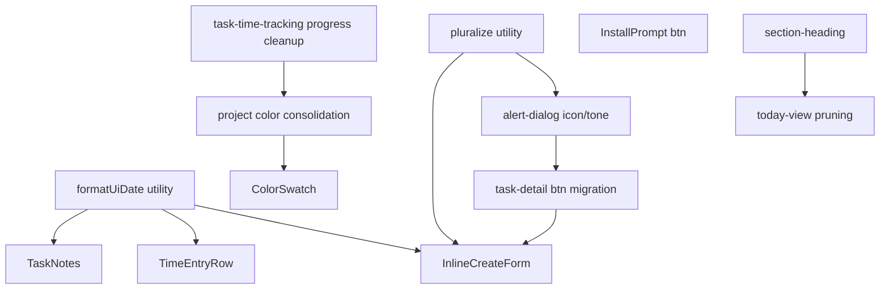

# Duplicate Refactoring Plan

This plan addresses 12 duplication findings across styles, components, and logic. Refactors are ordered by dependency and impact.

---

## Phase 1: Utilities (Foundation)

These utilities have no dependencies and can be implemented first. They unlock cleaner code in later phases.

### 1.1 pluralize utility (Low impact)

**Location:** Create `src/lib/utils/pluralize.ts`

**Current pattern (repeated in 8+ files):**

```ts
{count} {count === 1 ? 'entry' : 'entries'}
{subtaskCount} subtask{subtaskCount !== 1 ? 's' : ''}
```

**Abstraction:**

```ts
export function pluralize(count: number, singular: string, plural?: string): string {
  return `${count} ${count === 1 ? singular : (plural ?? singular + 's')}`;
}
```

**Migration targets:**

- [TaskTimeTracking.tsx](src/components/TaskTimeTracking.tsx) L224: `pluralize(breakdown.entryCount, 'entry', 'entries')`
- [NetworkStatus.tsx](src/components/NetworkStatus.tsx) L46
- [SettingsView.tsx](src/pages/SettingsView.tsx) L68
- [ProjectList.tsx](src/pages/ProjectList.tsx) L99
- [DeleteTaskConfirm.tsx](src/components/DeleteTaskConfirm.tsx) L32
- [CompleteParentConfirm.tsx](src/components/CompleteParentConfirm.tsx) L31
- [DeleteProjectConfirm.tsx](src/components/DeleteProjectConfirm.tsx) L35
- [PurgeResetConfirm.tsx](src/components/PurgeResetConfirm.tsx) L22–24
- [PurgeEntriesConfirm.tsx](src/components/PurgeEntriesConfirm.tsx) L23
- [TaskNotes.tsx](src/components/TaskNotes.tsx) L76
- [TaskRow.tsx](src/components/TaskRow.tsx) L92

### 1.2 formatUiDate utility (Low impact)

**Location:** Create `src/lib/utils/formatUiDate.ts`

**Current split:**

- [TaskNotes.tsx](src/components/TaskNotes.tsx) L125–139: `formatRelativeTime(isoDate)` — "just now", "5m ago", "yesterday", etc.
- [TimeEntryRow.tsx](src/components/TimeEntryRow.tsx) L20–23: `toLocaleDateString('en-US', { month: 'short', day: 'numeric' })`

**Abstraction:**

```ts
export function formatUiDate(isoDate: string, mode: 'relative' | 'short', locale = 'en-US'): string {
  // mode 'relative': same logic as formatRelativeTime
  // mode 'short': month + day format for TimeEntryRow
}
```

---

## Phase 2: Style Primitives

### 2.1 alert-dialog icon + title--tone (Medium impact)

**Problem:** `delete-confirm__icon`, `delete-confirm__btn-icon`, `complete-confirm__btn-icon` are still referenced in components but their semantics are tied to `alert-dialog`. [modal.css](src/styles/components/modal.css) contains legacy `.delete-confirm`, `.complete-confirm` families that are no longer used (components render [AlertDialog](src/components/AlertDialog.tsx) instead).

**Actions:**

1. In [alert-dialog.css](src/styles/components/alert-dialog.css):
  - Add `.alert-dialog__icon` (24×24 for title icon) and `.alert-dialog__icon--sm` (18×18 for button icon)
  - Ensure `.alert-dialog__title--danger` exists (it does at L26–28); add `--success`, `--warning` if needed
2. Update [AlertDialog.tsx](src/components/AlertDialog.tsx) to apply `alert-dialog__title--${tone}` when `tone` is passed
3. In confirm components, replace `delete-confirm__icon` / `complete-confirm__btn-icon` with `alert-dialog__icon` / `alert-dialog__icon--sm`
4. Remove from [modal.css](src/styles/components/modal.css): `.delete-confirm`, `.delete-confirm__*`, `.complete-confirm`, `.complete-prompt`, `.complete-confirm__*`, `.complete-prompt__*` (lines 24–194). Keep `.delete-project-confirm*`, `.project-picker*`, `.delete-confirm-backdrop` (project-picker-backdrop)

### 2.2 section-heading primitive (Low impact)

**Problem:** Uppercase muted section headings repeated in [settings.css](src/styles/components/settings.css), [project.css](src/styles/components/project.css), [today-view.css](src/styles/components/today-view.css), [task-time-tracking.css](src/styles/components/task-time-tracking.css).

**Pattern:** `font-size: var(--font-body); font-weight: 600; text-transform: uppercase; letter-spacing: 0.05em; color: var(--color-text-muted)`

**Actions:**

1. Create `src/styles/components/section-heading.css`:
  ```css
   .section-heading { /* base */ }
   .section-heading--blocked { color: var(--color-recording); }
   .section-heading--completed { color: var(--color-ready); }
  ```
2. Replace `settings-view__section-title`, `project-detail__section-title`, `today-view__section-title`, `task-time-tracking__section-label` with `section-heading` + modifier classes where applicable
3. Import in [index.css](src/index.css)

---

## Phase 3: Button Migrations

### 3.1 task-detail button migration to btn (Medium impact)

**Problem:** [task-detail.css](src/styles/components/task-detail.css) L284–340 defines `.task-detail__btn`, `.task-detail__btn--primary`, `--secondary`, `--complete`, `--block`, `--unblock` that duplicate [btn.css](src/styles/components/btn.css).

**Mapping:**


| task-detail                 | btn                                  |
| --------------------------- | ------------------------------------ |
| task-detail__btn (base)     | btn                                  |
| task-detail__btn--primary   | btn btn--primary                     |
| task-detail__btn--secondary | btn btn--secondary                   |
| task-detail__btn--complete  | btn btn--success                     |
| task-detail__btn--block     | btn (add btn--warning or use custom) |
| task-detail__btn--unblock   | btn btn--success                     |


**Actions:**

1. Add `btn--warning` to [btn.css](src/styles/components/btn.css) for block (amber/orange) if needed
2. Update [TaskDetail.tsx](src/pages/TaskDetail.tsx), [TaskDetailHeader.tsx](src/components/TaskDetailHeader.tsx), [TaskDetailSubtasks.tsx](src/components/TaskDetailSubtasks.tsx): replace `task-detail__btn*` with `btn btn--*`
3. Update `task-detail__delete-link` to use `btn btn--ghost` or keep as custom text link (design choice)
4. Remove `.task-detail__btn*` from task-detail.css

### 3.2 InstallPrompt button normalization (Low impact)

**Problem:** [install-prompt.css](src/styles/components/install-prompt.css) L60–82 defines `.install-prompt__btn`, `--dismiss`, `--install` duplicating btn patterns.

**Actions:**

1. In [InstallPrompt.tsx](src/components/InstallPrompt.tsx): replace `install-prompt__btn install-prompt__btn--dismiss` with `btn btn--ghost btn--sm`, `install-prompt__btn install-prompt__btn--install` with `btn btn--primary btn--sm`
2. Remove `.install-prompt__btn*` from install-prompt.css

---

## Phase 4: CSS Cleanups (Remove Dead Code)

### 4.1 task-time-tracking progress cleanup (Medium impact)

**Problem:** [task-time-tracking.css](src/styles/components/task-time-tracking.css) L147–217 contains `.task-time-tracking__budget-*`, `__budget-bar`, `__budget-fill`, `__budget-pct` rules. [TaskTimeTracking.tsx](src/components/TaskTimeTracking.tsx) now uses [StatusProgressBar](src/components/StatusProgressBar.tsx) (status-progress.css).

**Actions:**

1. Remove from task-time-tracking.css: `task-time-tracking__budget`, `__budget-header`, `__budget-header-left`, `__budget-bar-row`, `__budget-bar`, `__budget-pct`, `__budget-pct--*`, `__budget-fill`, `__budget-fill--*`
2. Keep `task-time-tracking__variance` and `__variance--*` (used for variance text)
3. Keep `task-time-tracking__estimate-btn`, `__set-estimate`

### 4.2 project color style consolidation (Medium impact)

**Problem:** [project.css](src/styles/components/project.css) retains `.project-list__color-picker`, `.project-list__color-swatch*` (L61–84) and `.project-detail__color-dot`, `.project-detail__color-picker`, `.project-detail__color-swatch*` (L186–246). [ProjectList](src/pages/ProjectList.tsx) and [ProjectDetail](src/pages/ProjectDetail.tsx) use [ProjectColorPicker](src/components/ProjectColorPicker.tsx) and [ProjectColorDot](src/components/ProjectColorDot.tsx) with [project-color-picker.css](src/styles/components/project-color-picker.css).

**Actions:**

1. Remove from project.css: `project-list__color-picker`, `project-list__color-swatch`, `project-list__color-swatch--selected`; `project-detail__color-picker`, `project-detail__color-swatch`, `project-detail__color-swatch--selected`
2. For header color toggle: ProjectDetail uses `project-detail__color-dot` on a `<button>`. Either:
  - Keep `project-detail__color-dot` (sizing/layout for header) and use ProjectColorDot styling via shared ColorSwatch later, or
  - Use `ProjectColorDot size="lg"` in a button wrapper
3. Remove `project-list__item-dot` (L120–125) — ProjectList uses `ProjectColorDot`, so this is dead

### 4.3 today-view CSS pruning (Low impact)

**Problem:** [today-view.css](src/styles/components/today-view.css) defines `.today-view__active-*`, `.today-view__stop-btn`, `.today-view__project-dot` (L24–86, L204–209). [TodayView.tsx](src/pages/TodayView.tsx) does not render these; it uses TaskCard, CountBadge, ProjectColorDot.

**Actions:**

1. Remove: `today-view__active-timer`, `__active-header`, `__active-label`, `__active-task`, `__active-task-title`, `today-view__stop-btn`, `today-view__project-dot`
2. Retain: `today-view__section`, `today-view__section-title`, `today-view__project-badge`, `today-view__task-list`, `today-view__blocked-task*`, `today-view__empty`, `today-view__quick-add*`, `today-view__icon`, etc.

---

## Phase 5: Component Abstractions

### 5.1 InlineCreateForm component (Medium impact)

**Problem:** Same pattern in [TodayView.tsx](src/pages/TodayView.tsx) (quick add), [ProjectDetail.tsx](src/pages/ProjectDetail.tsx) (add task), [TaskDetailSubtasks.tsx](src/components/TaskDetailSubtasks.tsx) (add subtask), [ProjectPicker.tsx](src/components/ProjectPicker.tsx) (create project).

**Pattern:** `input` + submit button + `disabled={!value.trim()}` + optional trailing content.

**Props:**

```ts
interface InlineCreateFormProps {
  placeholder: string;
  submitLabel: string;
  value: string;
  onChange: (value: string) => void;
  onSubmit: () => void;
  disabled?: boolean;
  trailingContent?: ReactNode;
  inputClassName?: string;
  layout?: 'row' | 'block';
}
```

**Actions:**

1. Create `src/components/InlineCreateForm.tsx`
2. Migrate TodayView quick-add, ProjectDetail add-task, TaskDetailSubtasks add-subtask, ProjectPicker create form
3. Adjust layout classes per usage (e.g. `today-view__quick-add` vs `project-detail__add-task`)

### 5.2 ColorSwatch component (Low impact)

**Problem:** [ProjectColorDot](src/components/ProjectColorDot.tsx) and [ProjectColorPicker](src/components/ProjectColorPicker.tsx) share inline color styling and sizing. ProjectColorDot uses inline `style`; ProjectColorPicker uses CSS classes.

**Abstraction:**

```ts
interface ColorSwatchProps {
  color: string;
  size?: 'sm' | 'md' | 'lg';
  selected?: boolean;
  shape?: 'dot' | 'swatch';
  interactive?: boolean;
  onClick?: () => void;
  'aria-label'?: string;
}
```

**Actions:**

1. Create `src/components/ColorSwatch.tsx` with shared sizing (sm: 7–8px, md: 10–12px, lg: 24–32px) and shape (dot vs swatch with border/selected state)
2. Refactor ProjectColorDot to use ColorSwatch (presentational)
3. Refactor ProjectColorPicker to render ColorSwatch for each option (interactive)
4. Ensure [project-color-picker.css](src/styles/components/project-color-picker.css) works with ColorSwatch or consolidate

---

## Phase 6: Optional Polish

### 6.1 ProjectPicker create button

[ProjectPicker](src/components/ProjectPicker.tsx) uses `project-picker__create-btn` which is custom. After InlineCreateForm, the submit could use `btn btn--primary`. The "Create project" reveal button (`project-picker__add-btn`) may stay custom for dashed-border styling.

---

## Execution Order Summary




**Recommended sequence:**

1. Utilities: pluralize, formatUiDate
2. Style primitives: alert-dialog, section-heading
3. Button migrations: task-detail, InstallPrompt
4. CSS cleanups: task-time-tracking, project, today-view
5. Components: InlineCreateForm, ColorSwatch

---

## File Change Summary


| File                                           | Action                                |
| ---------------------------------------------- | ------------------------------------- |
| `src/lib/utils/pluralize.ts`                   | Create                                |
| `src/lib/utils/formatUiDate.ts`                | Create                                |
| `src/styles/components/alert-dialog.css`       | Add icon/tone classes                 |
| `src/styles/components/section-heading.css`    | Create                                |
| `src/styles/components/modal.css`              | Remove delete/complete-confirm blocks |
| `src/styles/components/task-detail.css`        | Remove task-detail__btn*              |
| `src/styles/components/install-prompt.css`     | Remove install-prompt__btn*           |
| `src/styles/components/task-time-tracking.css` | Remove budget-* rules                 |
| `src/styles/components/project.css`            | Remove color-picker/swatch/item-dot   |
| `src/styles/components/today-view.css`         | Remove active/stop-btn/project-dot    |
| `src/components/AlertDialog.tsx`               | Apply tone to title                   |
| `src/components/InlineCreateForm.tsx`          | Create                                |
| `src/components/ColorSwatch.tsx`               | Create                                |
| 15+ components/pages                           | Migrate to new utils/components       |


