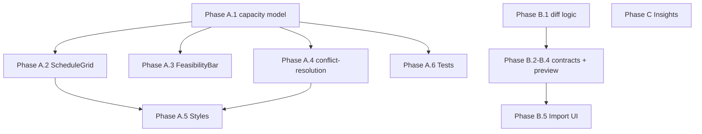

# Feature Plan Priorities A-C Implementation Plan

## Overview

This plan implements the three non-deferred priorities identified in the codebase vs feature-plan comparison:

| Priority | Scope                            | Exit Criteria                                                                                            |
| -------- | -------------------------------- | -------------------------------------------------------------------------------------------------------- |
| **A**    | Excess capacity indicators       | `isOverStaffed`, `overStaffedDayCount`; FeasibilityBar and ConflictResolutionBanner show excess feedback |
| **B**    | Plan package import transparency | Line-item preview (new/updated/unchanged); explicit merge summary after import                           |
| **C**    | Insights estimation calibration  | "Use with caution" labeling; direct estimation guidance cues                                             |

---

## Phase A — Excess Capacity Indicators

**Ref:** [assigned_crew_vs_estimate_feedback_39e3a395.plan.md](.cursor/plans/assigned_crew_vs_estimate_feedback_39e3a395.plan.md)

Capacity model already has `assignedCapacityPersonHours`. Add excess detection and surface it across schedule UI.

### A.1 Extend capacity model

**File:** [src/lib/planning/scheduling/capacity.ts](src/lib/planning/scheduling/capacity.ts)

- Add to `DailyCapacity`: `isOverStaffed: boolean` — true when `day.isWorkDay && day.requiredPersonHours > 0 && assignedCapacityPersonHours > requiredPersonHours + 0.01`
- Add to `CapacitySummary`: `overStaffedDayCount: number` — count of days with `isOverStaffed`
- In the `days.map` (lines 148–166), compute `isOverStaffed` per day
- Add `overStaffedDayCount` to the returned object (line 168+)

### A.2 ScheduleGrid day header badge and styling

**File:** [src/pages/planning/schedule/ScheduleGrid.tsx](src/pages/planning/schedule/ScheduleGrid.tsx)

- Extend `formatUtilBadge` signature to accept `isOverStaffed?: boolean`
- Add badge logic: when `isOverStaffed`, return `{required}h / {assignedCapacity}h (+{excess}h excess)`
- When balanced and `assignedCrewTotal > 0`: show `{required}h ({crew} crew → {assignedCapacity}h) {pct}%` for transparency
- Apply `schedule-grid__day-util--over-staffed` when `cap.isOverStaffed` (line ~456)
- Add `schedule-grid__day-col--over-staffed` to day column when over-staffed (line ~429)

### A.3 FeasibilityBar

**File:** [src/pages/planning/schedule/FeasibilityBar.tsx](src/pages/planning/schedule/FeasibilityBar.tsx)

- When `overStaffedDayCount > 0`: add informational segment `X days with excess crew capacity` — use amber/info styling (not error)
- Mirror pattern of existing `overAssignedCrewDayCount` block (lines 33–40)

### A.4 ConflictResolutionBanner and conflict-resolution module

**File:** [src/lib/planning/scheduling/conflict-resolution.ts](src/lib/planning/scheduling/conflict-resolution.ts)

- Add `ExcessCapacitySuggestion` interface: `{ dayCount: number; message: string }`
- Add `excessCapacitySuggestion` to `ConflictSuggestions` (optional, set when `overStaffedDayCount > 0`)
- Add to `hasConflicts`: also true when `excessCapacitySuggestion != null` (or treat excess as informational and don’t block — plan says advisory only; keep `hasConflicts` for blocking issues; add separate `hasExcessAdvisory` or include excess in a non-blocking section)
- Plan says "advisory only" — so excess should not trigger `hasConflicts`. Add `excessCapacitySuggestion?: { dayCount: number }` and export `formatExcessSuggestionSummary(suggestion)` helper

**File:** [src/pages/planning/schedule/ConflictResolutionBanner.tsx](src/pages/planning/schedule/ConflictResolutionBanner.tsx)

- When `capacity.overStaffedDayCount > 0` and expanded: show advisory line: `X day(s) have excess crew capacity — reduce crew in Crew/day to match demand, or leave as buffer.`
- Use distinct styling (e.g. info/amber, not error)

### A.5 Styles

**File:** [src/styles/components/schedule-view.css](src/styles/components/schedule-view.css)

- Add `.schedule-grid__day-util--over-staffed` (amber/info, distinct from `--over` and `--over-worker`)
- Add `.schedule-grid__day-col--over-staffed` for day column highlight
- Ensure dark mode variants in `_dark.css` if needed

### A.6 Unit tests

**File:** [src/lib/planning/scheduling/capacity.test.ts](src/lib/planning/scheduling/capacity.test.ts)

- Add test: 20h total, 2 days, 4 crew each → 10h/day required, 4×8=32h capacity/day → `isOverStaffed` false (balanced)
- Add test: Same setup, 6 crew each → 6×8=48h capacity, 10h required → `isOverStaffed` true, `assignedCapacityPersonHours` = 48, `overStaffedDayCount` = 2

---

## Phase B — Plan Package Import Transparency

**Ref:** Feature plan Phase B exit criteria: "Preview what changes on re-import (new/updated/unchanged line items)", "Explicit merge summary after import"

### B.1 Line-item diff logic

**File:** [src/lib/interop/data-transfer/plan-package.ts](src/lib/interop/data-transfer/plan-package.ts)

- Add `PlanPackageLineItemDiffAction`: `'new' | 'updated' | 'unchanged' | 'removed'`
- Add `PlanPackageLineItemDiff`: `{ lineItemId: string; title: string; action: PlanPackageLineItemDiffAction; changedFields?: string[] }`
- Add `diffPlanPackageLineItems(existing: Plan, incoming: Plan): PlanPackageLineItemDiff[]`:
  - `incoming.lineItems` by id → for each: if not in existing → `new`; else diff plan-relevant fields (title, workQuantity, crew, timeHours, productivityRate, scheduledStart, scheduledEnd, crewByDate) → `unchanged` or `updated` with `changedFields`
  - `existing.lineItems` not in incoming → `removed` (will become `removedFromSource` after merge)
- Fields to diff (planner-controlled): `title`, `workQuantity`, `crew`, `timeHours`, `productivityRate`, `scheduledStart`, `scheduledEnd`, `crewByDate` (shallow compare keys/values)

### B.2 Extend PlanPackageImportPreview

**File:** [src/lib/interop/data-transfer/contracts.ts](src/lib/interop/data-transfer/contracts.ts)

- Add to `PlanPackageImportPreview`: `lineItemDiffs?: PlanPackageLineItemDiff[]` — populated only when `existing` plan exists and we can diff
- Add `lineItemDiffSummary?: { new: number; updated: number; unchanged: number; removed: number }`

### B.3 Update previewPlanPackageImport

**File:** [src/lib/interop/data-transfer/plan-package.ts](src/lib/interop/data-transfer/plan-package.ts)

- When `existing` exists: call `diffPlanPackageLineItems(existing, envelope.payload.plan)` and attach to preview
- Compute and attach `lineItemDiffSummary`

### B.4 Extend apply result with merge summary

**File:** [src/lib/interop/data-transfer/plan-package.ts](src/lib/interop/data-transfer/plan-package.ts)

- Change `applyPlanPackageImport` return to: `{ applied: boolean; merged: boolean; reason: string; mergeSummary?: { newCount: number; updatedCount: number; unchangedCount: number; removedCount: number } }`
- When `merged === true`: compute merge summary from the diff (or recompute after merge) and return it

### B.5 Import UI — show line-item preview and merge summary

**File:** [src/pages/field-plan/FieldPlanOverlay.tsx](src/pages/field-plan/FieldPlanOverlay.tsx)

- In `field-plan-import-card` section (lines 409–451): when `preview.lineItemDiffs` exists, render collapsible "Line item changes" with counts and list (new / updated / unchanged / removed)
- After apply: when `result.mergeSummary` exists, include in `onMessage` e.g. "Merged: X new, Y updated, Z unchanged, W removed"

**File:** [src/pages/settings/SettingsDataTransferView.tsx](src/pages/settings/SettingsDataTransferView.tsx) (if plan package import exists there)

- Mirror the same preview and post-apply summary behavior

**File:** [src/pages/field-plan/useFieldPlanImport.ts](src/pages/field-plan/useFieldPlanImport.ts)

- Update `handleApplyImport` to pass through `mergeSummary` from `applyPlanPackageImport` result into the message callback

---

## Phase C — Insights Estimation Calibration

**Ref:** Feature plan Phase C: "Work-type variance and confidence presented as planning guidance", "Use with caution signaling for weak sample reliability"

### C.1 "Use with caution" labeling

**File:** [src/pages/planning/InsightsView.tsx](src/pages/planning/InsightsView.tsx)

- For "Less Reliable for Estimating" section (high-variance rows): add explicit "Use with caution" badge/label when `confidence === 'insufficient' || confidence === 'low'`
- Add helper: `needsCautionLabel(kpi): boolean` — true when `confidence === 'insufficient'` or `confidence === 'low'`

### C.2 Estimation guidance in Stable section

**File:** [src/pages/planning/InsightsView.tsx](src/pages/planning/InsightsView.tsx)

- Add short intro text above the Stable table: "Use these rates for planning when sample size and variance are sufficient."
- For high-variance section: "Use with caution — limited samples or high variance. Prefer template or manual rates until more data is available."

### C.3 Optional: Planning guidance per row

- For rows with `confidence === 'insufficient'`: show inline hint "Add more completed tasks to improve reliability"
- Keep minimal to avoid clutter; can be a tooltip or small secondary line

---

## Implementation Order

Phase A and B can proceed in parallel. Phase C is independent.

---

## Files Summary

| Phase | File                           | Changes                                                       |
| ----- | ------------------------------ | ------------------------------------------------------------- |
| A     | `capacity.ts`                  | `isOverStaffed`, `overStaffedDayCount`                        |
| A     | `ScheduleGrid.tsx`             | `formatUtilBadge` excess branch; `--over-staffed` classes     |
| A     | `FeasibilityBar.tsx`           | Excess day count (informational)                              |
| A     | `conflict-resolution.ts`       | Excess advisory suggestion                                    |
| A     | `ConflictResolutionBanner.tsx` | Excess message in expanded state                              |
| A     | `schedule-view.css`            | `--over-staffed` styles                                       |
| A     | `capacity.test.ts`             | Excess capacity tests                                         |
| B     | `plan-package.ts`              | `diffPlanPackageLineItems`, extended preview and apply result |
| B     | `contracts.ts`                 | `PlanPackageLineItemDiff`, preview fields                     |
| B     | `FieldPlanOverlay.tsx`         | Line-item diff preview; merge summary in message              |
| B     | `useFieldPlanImport.ts`        | Pass merge summary to message                                 |
| B     | `SettingsDataTransferView.tsx` | Same preview/summary if plan import present                   |
| C     | `InsightsView.tsx`             | "Use with caution" labels; estimation guidance text           |

---

## Deferred / Out of Scope

- **Phase D (Supabase sync)** — deferred per request
- **Min crew hint** in Crew/day row ([assigned_crew plan](.cursor/plans/assigned_crew_vs_estimate_feedback_39e3a395.plan.md) §3) — optional, can add later
- **Cell-level excess indicator** — plan says "defer if clutter"
- **"Show days" scroll action** in ConflictResolutionBanner — optional

