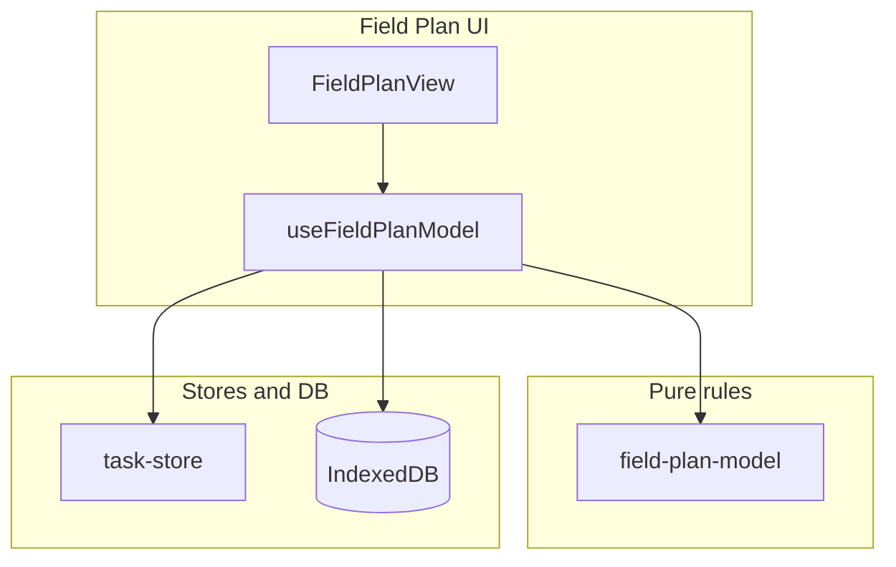

# Field Plan: Action Plan

Derived from the Field Plan architecture assessment. **Execution order:** M1 → M2 → M3 → M4 in one PR or sequential commits (each milestone is independently shippable).

**Out of scope here** (track separately):

- Per-plan memoization for `allActiveLineItems` — only after profiling shows need.
- Renaming `field-plan-overlay-helpers` / `field-plan-overlay-types` — churn-only; do when touching those files for another reason.

---

## Ambiguity and how this plan addresses it

| Topic | Risk | Resolution in this plan |
|--------|------|-------------------------|
| `canExecute` prop vs `lineItem.planCanExecute` | Row uses a prop; helper uses `planCanExecute` on the summary. If they diverge, swipe vs batch could disagree. | **Invariant:** Parents must pass `canExecute={lineItem.planCanExecute}` (or equivalent) for every row. M1 implementation step: verify [`FieldPlanPlanDetail`](src/pages/field-plan/components/FieldPlanPlanDetail.tsx) and [`FieldPlanPhaseView`](src/pages/field-plan/components/FieldPlanPhaseView.tsx) call sites; add a one-line comment on `FieldPlanLineItemRow` props if the prop stays. Optional cleanup: derive `canExecute` only from `lineItem` inside the row and drop the prop (larger API change — only if you want to enforce invariant in types). |
| Order of checks in `handleReleaseToToday` | Unclear whether duplicate-task check runs before or after helper. | **Defined order:** (1) `!isLineItemEligibleForRelease(lineItem)` → return; (2) existing `alreadyReleased` task query → return. Rationale: helper is cheap; duplicate check is the extra idempotency guard. |
| M1 “no behavior change” | Hard to prove without a baseline. | Treat **golden paths** (pending, no tasks, executable plan, not removed) as unchanged; add explicit manual QA rows below. |
| M3 product vs docs | “Optional UI hint” leaves owner unclear. | **Default for M3:** comments only; any visible copy requires an explicit product ticket or stakeholder sign-off. |
| M4 future behavior | Comment might be wrong if Phases is later expanded to session-closed. | If product changes scope, **replace the comment** in the same PR as the behavior change (do not only change code). |

---

## Optional enhancements (not required for the core plan)

- **M2 — FAB during apply:** Also disable the import FAB while `isApplyingImport` is true so users cannot start a second file pick while an import merge is running. Wire: `disabled={model.isLoadingPreview || model.isApplyingImport}` (names from hook return). Reason: same double-action class as loading preview; verify `useFieldPlanModel` exposes `isApplyingImport`.
- **M1 — Action sheet parity:** In [`FieldPlanActionSheet`](src/pages/field-plan/components/FieldPlanActionSheet.tsx) `FieldPlanActionList`, optionally gate “Release to Today” with `isLineItemEligibleForRelease(lineItem)` so button visibility matches the helper (today it uses `pending && tasks.length === 0` only). Low priority if `handleReleaseToToday` already no-ops safely.
- **Regression test:** Export a pure `canReleaseToToday(lineItem, tasks): boolean` that composes `isLineItemEligibleForRelease` + duplicate detection for unit tests without mounting the hook — only if test coverage for M1 is required by team policy.

---

## Manual QA checklist (after M1–M2)

- Release: pending line item, no linked tasks, executable plan → creates task; repeat → no duplicate (existing behavior).
- Release: swipe/batch/action sheet all behave consistently for eligible vs ineligible rows.
- Import: open file picker, slow/large JSON — FAB disabled and not double-firing during preview load; (optional) FAB disabled during apply import.

---

## Milestone M1 — Release eligibility: single source of truth

**Goal:** Swipe/batch/programmatic release paths cannot drift from `isLineItemEligibleForRelease` in [`src/pages/field-plan/field-plan-model.ts`](src/pages/field-plan/field-plan-model.ts).

**Implementation**

1. [`src/pages/field-plan/components/FieldPlanLineItemRow.tsx`](src/pages/field-plan/components/FieldPlanLineItemRow.tsx): Replace the inline `canRelease` expression with `isLineItemEligibleForRelease(lineItem)` (remove duplication of `canExecute && !removedFromSource && status === 'pending' && linkedTasks.length === 0`). Ensure `canExecute` from props still gates swipe/actions as today — `isLineItemEligibleForRelease` already encodes `planCanExecute` on the summary; confirm parent always passes `canExecute` consistent with `lineItem.planCanExecute` for the selected plan (it should).
2. [`src/pages/field-plan/useFieldPlanModel.ts`](src/pages/field-plan/useFieldPlanModel.ts): At the start of `handleReleaseToToday`, return early if `!isLineItemEligibleForRelease(lineItem)`, then keep the existing `alreadyReleased` task check (still required). Remove redundant checks that are fully subsumed by the helper if any duplication remains.

**Tests**

- Extend [`src/pages/field-plan/field-plan-model.test.ts`](src/pages/field-plan/field-plan-model.test.ts) only if new edge cases appear; existing `isLineItemEligibleForRelease` tests remain authoritative.
- Optional: one test that `handleReleaseToToday` is a no-op when the helper returns false — only if you add a thin testable wrapper or export a pure `shouldReleaseToToday` function; **not required** if the hook stays integration-only.

**Acceptance criteria**

- Batch release ([`FieldPlanReleaseBatchButton`](src/pages/field-plan/components/FieldPlanReleaseBatchButton.tsx)), row swipe, and `handleReleaseToToday` all rely on the same eligibility rules.
- No behavior change for valid user flows; blocked/deferred/completed line items cannot create tasks via release.

---

## Milestone M2 — Import FAB: loading state

**Goal:** Users cannot double-trigger plan import while preview is loading; assistive tech sees a busy state.

**Implementation**

1. [`src/components/Fab.tsx`](src/components/Fab.tsx): Add optional `disabled?: boolean` and `aria-busy?: boolean` (or `ariaBusy` mapped to `aria-busy`) and pass through to the underlying `<button>`. This keeps Field Plan consistent with other screens that may need the same behavior later.
2. [`src/pages/field-plan/FieldPlanView.tsx`](src/pages/field-plan/FieldPlanView.tsx): Pass `disabled={model.isLoadingPreview}` and `aria-busy={model.isLoadingPreview}` to `Fab`.
3. [`useFieldPlanModel`](src/pages/field-plan/useFieldPlanModel.ts): No change required — `isLoadingPreview` is already returned.

**Optional (same milestone, recommended):** Set `disabled={model.isLoadingPreview || model.isApplyingImport}` so the FAB cannot open a second file while a merge/apply is in progress. `isApplyingImport` is already returned from the hook.

**Acceptance criteria**

- While `isLoadingPreview` is true, import cannot be triggered again from the FAB.
- No production behavior change when not loading.
- If the optional line is included: while `isApplyingImport` is true, FAB remains disabled (spot-check).

---

## Milestone M3 — Metrics vs filters (document intent)

**Goal:** Future readers (and support) understand why header deadline counts may not match a phase- or tag-narrowed list.

**Plain English — what is going on**

The plan detail screen shows **numbers at the top** (progress, deadline-style counts, etc.) and **lists below** (active, blocked, pending, and so on). You can **narrow what you see** in two ways: pick a **phase** (assembly vs dismantle vs all), and use **tags** to filter which line items appear in those lists.

The catch: not everything in the header is recalculated when you narrow the view. In particular, **deadline-related totals** are computed from **every line item in the plan** that has schedule data, not only the items left visible after you pick a phase or tags. Meanwhile, **progress** (and related status counts in the hook) follow the **phase** filter — so if you filter to one phase, the bar reflects that slice, but the deadline strip can still reflect the **whole plan**.

That is not necessarily a bug. It can be intentional: the header answers “how is the **entire plan** doing on time?” while the lists answer “what am I **looking at right now**?” But without a comment (or product copy), a user or developer may assume all numbers always match the filtered lists — and file a bug or “fix” the wrong thing.

**What M3 proposes (and does not propose)**

- **In scope:** Explain this split **in code** next to where `deadlineSummary` is built and where the header is rendered, so the next person does not “align” numbers by accident or rip out behavior thinking it is wrong.
- **Out of scope unless product asks:** Changing the UI so numbers always match the filtered lists (that is a product decision and a small amount of design work, not just a comment).

**Plain English — what “UI should always match filters” means**

“Match” means: **the summary numbers and the lists below are about the same set of work packages**, given whatever filters the user has applied. Today that is **not fully true**: the phase filter changes some summaries (e.g. progress) but not others (deadline-style counts from the hook); tag filtering changes the lists but not the header props from the parent.

If product chooses **full alignment**, a reasonable reading is:

- **Same numerator and denominator everywhere it matters.** Example: if the user filters to “Assembly” only, the progress bar and any “X of Y overdue / at risk” style counts would count **only assembly line items** (or only those still visible after filters), not dismantle or hidden-by-tag items.
- **Tag filter included or excluded by rule.** Either (a) tags narrow **both** header and lists, or (b) tags only narrow lists but the team **states that in the UI** (“Tags filter the list; totals are for the whole plan” or “Totals reflect selected tags”). Alignment is not one button — it is a **rule** everyone agrees on.

**Why it is a product decision:** Fully matching phase + tags in the header may **hide** plan-wide risk (e.g. dismantle overdue while you look at assembly). Keeping plan-wide deadlines in the header while lists are filtered is a **conscious tradeoff** (global signal vs focused view). Changing behavior needs agreement on which question the screen should answer.

**Engineering note (if alignment is approved later):** Likely requires computing deadline-related summaries from the same `FieldPlanLineItemSummary[]` (or grouped structure) used after phase **and** tag filtering — possibly lifting tag filter state up from [`FieldPlanPlanDetail`](src/pages/field-plan/components/FieldPlanPlanDetail.tsx) or passing filtered arrays back into summary helpers. Scope beyond M3.

**Implementation**

1. [`src/pages/field-plan/useFieldPlanModel.ts`](src/pages/field-plan/useFieldPlanModel.ts): Add a short comment above `deadlineSummary` explaining that it is computed from **full** `lineItems` for the plan, while `progressPercent` / `lineItemStatusSummary` use `displayLineItems` (phase filter). State that this is **plan-wide schedule health** vs **filtered list** semantics (or adjust wording if product prefers alignment — see below).
2. [`src/pages/field-plan/components/FieldPlanPlanDetail.tsx`](src/pages/field-plan/components/FieldPlanPlanDetail.tsx): Add a one-line comment where deadline/progress are rendered that tag filtering further narrows **lists** but does not change summary props from the parent (unless you choose to align — **non-goal** unless product asks).

**Optional product follow-up (not in this milestone):** Recompute summaries from `filteredStatusGroups` or pass filtered line items into summary helpers — only after explicit product decision.

**Acceptance criteria**

- No user-visible change required; comments only unless you add optional muted helper text (product call).

---

## Milestone M4 — Phases view scope comment

**Goal:** Avoid “bug fixes” that incorrectly include `session-closed` plans in `allActiveLineItems`.

**Implementation**

1. [`src/pages/field-plan/useFieldPlanModel.ts`](src/pages/field-plan/useFieldPlanModel.ts): Above `allActiveLineItems` `useMemo`, add a comment: aggregates line items across **`received` plans only**; session-closed plans appear in by-plan selector but are excluded from the Phases aggregate (adjust wording to match product intent).

**Acceptance criteria**

- Comment is accurate with respect to `receivedPlans` vs `closedPlans` usage.

---

## Execution notes

- **M1** is the only milestone with meaningful logic touch; do it first so release behavior is stable before UX polish.
- Run `npm run test` and lint after M1; spot-check Field Plan import and release flows manually.

---

## Architecture reference (boundaries unchanged)

Release to Today still creates tasks via `createTask` / [`lineItemToCreateTaskInput`](src/lib/planning/release-plan.ts); Today view remains agnostic (tasks share the same store).
