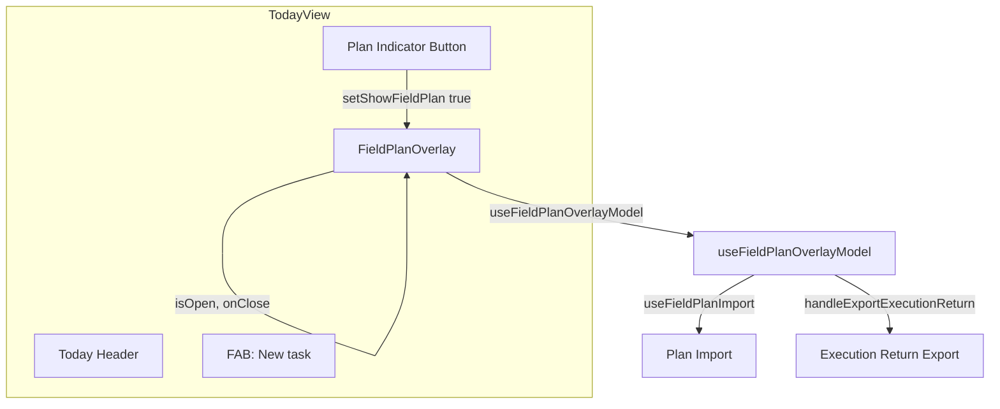
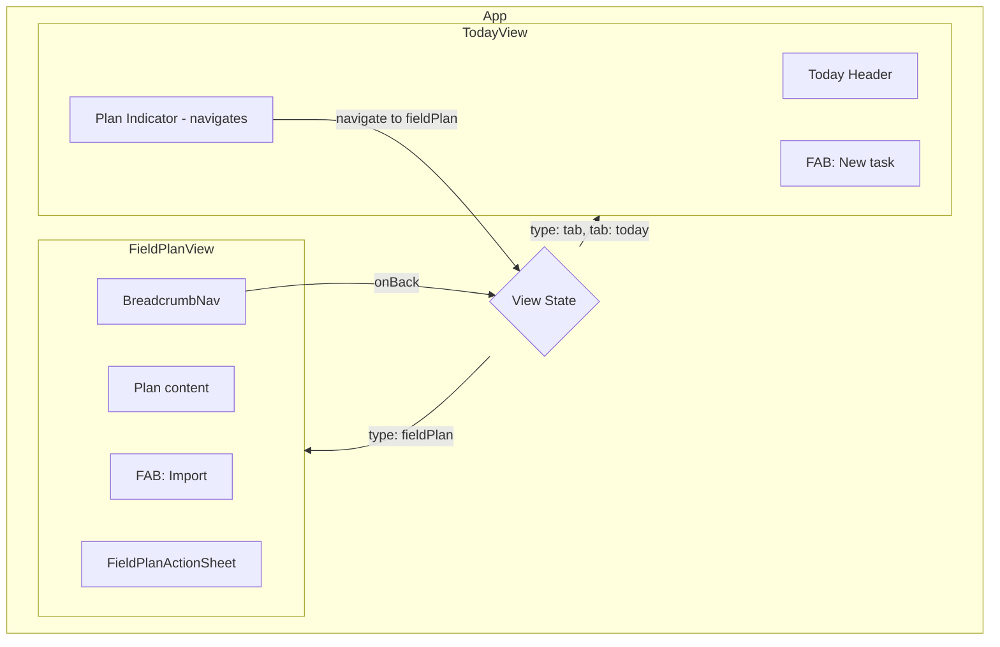

# Field Plan Overlay to Page Conversion

## Current Architecture



**Key functionality to preserve:**
- **Plan Import**: File picker → preview (conflict handling, diff summary) → Apply/Skip → `applyPlanPackageImport` ([useFieldPlanImport.ts](src/pages/field-plan/useFieldPlanImport.ts))
- **Execution Export**: "Export Execution Return" button → `buildExecutionReturnEnvelope` → `downloadJson` → plan status reset ([useFieldPlanOverlayModel.ts](src/pages/field-plan/useFieldPlanOverlayModel.ts) lines 246-286)
- **Line item actions**: Release to Today, Block, Defer, Note, Clear Block, Reactivate (via [FieldPlanActionSheet](src/pages/field-plan/components/FieldPlanActionSheet.tsx))

---

## Target Architecture



---

## Implementation Plan

### 1. Add Field Plan view type to App routing

**File:** [src/App.tsx](src/App.tsx)

- Add `{ type: 'fieldPlan'; returnTo: ReturnTo }` to the `View` union. No change to the `ReturnTo` type itself — it already supports `tab` and `detail`; `returnTo` is where Back navigates to.
- In `handleBack`, add branch: when `view.type === 'fieldPlan'`, call `setView(view.returnTo)`.
- Add render branch: when `view.type === 'fieldPlan'`, render `<FieldPlanView onBack={handleBack} />` (omit `onSelectTask` — Field Plan line items do not navigate to task detail; add later if needed).
- **Feature flag guard**: When `view.type === 'fieldPlan'` and `!getFeatureFlag('fieldPlanExecution')`, redirect to Today (defense in depth if flag is toggled while on another tab).
- Tab bar remains hidden for `fieldPlan` (tab bar only shows when `view.type === 'tab'`).

### 2. Create FieldPlanView page component

**New file:** `src/pages/field-plan/FieldPlanView.tsx`

- Refactor from [FieldPlanOverlay.tsx](src/pages/field-plan/FieldPlanOverlay.tsx): remove overlay semantics and layout.
- **Remove overlay semantics**: Do not use `role="dialog"`, `aria-modal="true"`, or `aria-label="Field Plan View"` — this is a normal page, not a modal.
- **Layout**: Use page structure similar to [ProjectDetail.tsx](src/pages/ProjectDetail.tsx):
  - `div.field-plan-view` as root (use consistently; matches `task-detail`, `project-detail` pattern)
  - `div.field-plan-view__title-section` with `BreadcrumbNav`
  - Scrollable content area with `padding-bottom: calc(var(--space-xl) + 64px)` for FAB clearance
  - FAB for Import
- **BreadcrumbNav**: `onBack={onBack}`. Segments: `[{ label: 'Field Plan' }]` when no plan selected; `[{ label: 'Field Plan' }, { label: selectedPlan.title }]` when a plan is selected (matches ProjectDetail/TaskDetail pattern).
- **Import**: Keep hidden file input; FAB triggers `fileInputRef.current?.click()`. FAB disabled when `isLoadingPreview || isApplyingImport`; `aria-label="Import plan"`.
- **Content**: Reuse existing content (import preview card, empty state, plan selector, plan detail). No structural changes to the content tree.
- **Empty state**: Keep the "Import Plan Package" button in the empty state as a secondary affordance alongside the FAB.
- **ActionSheet**: Keep `FieldPlanActionSheet` as-is.
- **Feature flag**: Gate rendering on `getFeatureFlag('fieldPlanExecution')`; when disabled, call `onBack()` to redirect.

### 3. Rename/refactor the model hook

**File:** [src/pages/field-plan/useFieldPlanOverlayModel.ts](src/pages/field-plan/useFieldPlanOverlayModel.ts)

- Rename to `useFieldPlanModel.ts` (or keep name and update usage).
- Remove `isOpen` parameter: the hook runs only when the Field Plan page is mounted, so `isOpen` is always true.
- Update `useEffect` that depended on `isOpen`: run on mount instead (remove `if (!isOpen) return` guards, or replace with unconditional logic).
- All import/export logic stays unchanged.

### 4. Update TodayView to navigate instead of overlay

**File:** [src/pages/TodayView.tsx](src/pages/TodayView.tsx)

- Add prop: `onNavigateToFieldPlan?: () => void`.
- Remove `showFieldPlan` state and `FieldPlanOverlay` import/usage.
- Change plan indicator button: `onClick={() => onNavigateToFieldPlan?.()}` instead of `setShowFieldPlan(true)`.
- **executorPlans fetch**: Update `useEffect` to run on mount and when `fieldPlanEnabled` changes (remove `showFieldPlan` from deps). Keeps the indicator label (e.g. "Plan: X" or "Field Plan") up to date.
- Parent (App) will pass `onNavigateToFieldPlan` that sets view to `{ type: 'fieldPlan', returnTo: { type: 'tab', tab: 'today' } }`.

### 5. Wire App to Field Plan navigation

**File:** [src/App.tsx](src/App.tsx)

- When rendering `TodayView`, pass:
  ```ts
  onNavigateToFieldPlan={fieldPlanEnabled ? () => setView({ type: 'fieldPlan', returnTo: { type: 'tab', tab: 'today' } }) : undefined}
  ```
- Import `FieldPlanView` and render it when `view.type === 'fieldPlan'`.
- For nested navigation (e.g. from TaskDetail or ProjectDetail), `returnTo` should preserve the current view so Back returns correctly. For v1, navigation only from Today is sufficient.

### 6. Update CSS: overlay to page layout

**File:** [src/styles/components/field-plan.css](src/styles/components/field-plan.css)

- Replace `.field-plan-overlay` styles:
  - Remove `position: fixed`, `inset: 0`, `z-index: 1200`.
  - Use normal document flow: `display: flex`, `flex-direction: column`, `min-height` to fill viewport (similar to `.project-detail`).
- Replace `.field-plan-overlay__header` with a title section that matches `project-detail__title-section` / `task-detail__title-section` (BreadcrumbNav container).
- Add `.field-plan-view` as the page root class.
- Rename `.field-plan-overlay__content` to `field-plan-view__content` with `overflow-y: auto` and `padding-bottom: calc(var(--space-xl) + 64px)` for FAB.
- Preserve all other field-plan styles (plan selector, line items, import card, action sheet, etc.).

**File:** [src/styles/_dark.css](src/styles/_dark.css)

- Update any `.field-plan-overlay` / `.field-plan-overlay__header` selectors to the new class names.

### 7. Handle nested navigation (future)

If Field Plan is later reachable from TaskDetail or ProjectDetail, set `returnTo` from the current `view` (same pattern as `handleNavigateToProject`). For v1, navigation only from Today is sufficient.

### 8. Delete FieldPlanOverlay

**File:** [src/pages/field-plan/FieldPlanOverlay.tsx](src/pages/field-plan/FieldPlanOverlay.tsx)

- Remove this file after `FieldPlanView` is complete and wired up.
- Update any remaining imports.

### 9. Review and update tests

- Check [field-plan-model.test.ts](src/pages/field-plan/field-plan-model.test.ts) and any tests that reference `FieldPlanOverlay` or the overlay flow.
- Update or add tests as needed for the page-based flow.
- Consider a loading state: `reloadData` is async on mount; add a loading spinner or skeleton if desired for better UX.

---

## Verification Checklist

- [ ] Plan import: file picker opens from FAB; preview card shows; Apply/Skip work; plan appears after import
- [ ] Plan import: empty state "Import Plan Package" button still works as secondary affordance
- [ ] Execution export: "Export Execution Return" button in plan detail works; JSON downloads; plan status resets
- [ ] Line item actions: Release to Today, Block, Defer, Note, Clear Block, Reactivate all work
- [ ] Navigation: Today → Field Plan → Back returns to Today
- [ ] Tab bar hidden when on Field Plan page
- [ ] Feature flag: when `fieldPlanExecution` is false, plan indicator and Field Plan entry point are hidden
- [ ] Feature flag: when on Field Plan and flag is toggled off (e.g. from another tab), redirect to Today

---

## File Summary

| Action | File |
|--------|------|
| Modify | [src/App.tsx](src/App.tsx) — view type, routing, TodayView prop, feature flag guard |
| Modify | [src/pages/TodayView.tsx](src/pages/TodayView.tsx) — remove overlay, add navigation callback, fix executorPlans fetch deps |
| Create | `src/pages/field-plan/FieldPlanView.tsx` — new page component |
| Modify | [src/pages/field-plan/useFieldPlanOverlayModel.ts](src/pages/field-plan/useFieldPlanOverlayModel.ts) — remove isOpen |
| Modify | [src/styles/components/field-plan.css](src/styles/components/field-plan.css) — overlay → page layout |
| Modify | [src/styles/_dark.css](src/styles/_dark.css) — class name updates if needed |
| Delete | [src/pages/field-plan/FieldPlanOverlay.tsx](src/pages/field-plan/FieldPlanOverlay.tsx) — after migration |
| Review | Tests — field-plan-model.test.ts and any overlay references |
