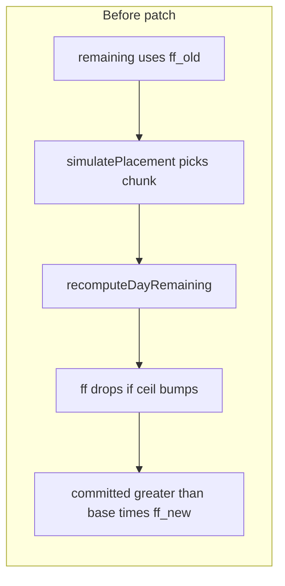

# Patch: prevent work-day overload from post-placement penalty

## Problem (recap)

- `[recomputeDayRemaining](src/lib/planning/scheduling/placement.ts)` updates `currentRequiredSkillCrew` when extra hours cross `ceil(PH / accessHours)` boundaries, then recomputes `ff` and `remainingPersonHours = base × ff − committed`.
- `[computeProspectiveCap](src/lib/planning/scheduling/placement.ts)` only limits placement when a skill/untagged group is **not** yet on the day (`alreadyPresent` → `Infinity`). Extra hours on an **existing** bucket can **lower** `ff` **after** the chunk is chosen using the **old** `remainingPersonHours`, so `committed` can exceed `base × ff_new` — the grid then shows effective crew over (e.g. 12.64/12).

## Approach

Add a **post-penalty cap** used inside `[simulatePlacement](src/lib/planning/scheduling/placement.ts)` **after** the existing `min(baseAvailablePH, skillAvailablePH, prospectiveCap)`:

- For days **without** a crew pool (`!skillCrewAllocations` or empty), cap is a no-op (return the tentative max unchanged) — behavior unchanged.
- With a pool: compute the **largest** `x ∈ [0, tentativeMax]` such that, mirroring `recomputeDayRemaining`’s crew math,
`round2(day.baseEffectivePersonHours × ff(after(x)) − (day.committedPersonHours + x)) ≥ 0`
where `after(x)` is the **projected** `currentRequiredSkillCrew` after adding `x` person-hours for this row’s `skillTagId` (tagged vs untagged branches must match `[recomputeDayRemaining](src/lib/planning/scheduling/placement.ts)` lines 262–279 exactly: `oldPH` / `newPH` / `ceil` deltas for skills; `oldUntaggedPH` / `newUntaggedPH` for untagged).
- `**ff(requiredCrew)`** matches the existing formula in `recomputeDayRemaining` (lines 283–291): `1` if `requiredCrew ≤ availableCrew`, else `taskSwitchingFactor^(requiredCrew − availableCrew)`.

**Monotonicity:** As `x` increases, `committed + x` rises and `requiredCrew(x)` is non-decreasing, so `ff` is non-increasing; the feasible margin is decreasing → **binary search** on `[0, tentativeMax]` (~50 iterations) is sufficient. Use the same `round2` as production code; treat feasibility with the same `0.01` tolerance style as `[simulatePlacement](src/lib/planning/scheduling/placement.ts)` (`assignablePH <= 0.01`).

**Refactor (small):** Extract a shared pure `ffFromRequiredSkillCrew(day, requiredCrew, tsf)` (or inline the 6 lines) so `recomputeDayRemaining` and the new projector stay in sync — optional but reduces drift risk.

**Policy (locked):** Apply the post-penalty cap **whenever a crew pool is present** on that day (`skillCrewAllocations` non-empty and `availableCrew > 0`), **independent of `allowOverAllocation`**. Order inside `simulatePlacement`: compute `tentativeMax = min(baseAvailablePH, skillAvailablePH, prospectiveCap)` as today, then `availablePH = min(tentativeMax, postPenaltyCap)`. So `allowOverAllocation` can still raise hours versus raw `remainingPersonHours`, but **cannot** commit more than `base × ff_after − committed_before` under the pool penalty model.

## Files to change

| File                                                                                             | Change                                                                                                                                                                                                                                                                                                                                                                                                                                                                                                                                                                                                                             |
| ------------------------------------------------------------------------------------------------ | ---------------------------------------------------------------------------------------------------------------------------------------------------------------------------------------------------------------------------------------------------------------------------------------------------------------------------------------------------------------------------------------------------------------------------------------------------------------------------------------------------------------------------------------------------------------------------------------------------------------------------------- |
| `[src/lib/planning/scheduling/placement.ts](src/lib/planning/scheduling/placement.ts)`           | Add `projectRequiredSkillCrewAfterAdditionalPH(...)` + `maxPersonHoursFeasibleUnderPostPenalty(...)` (names up to implementer); call from `simulatePlacement` after existing caps. Update the `simulatePlacement` doc comment: clarify that with a crew pool, **post-penalty** caps apply for every chunk (including when `allowOverAllocation` is true and for already-present skills); `remainingPersonHours` alone is not the only binding constraint.                                                                                                                                                                          |
| `[src/lib/planning/scheduling/placement.test.ts](src/lib/planning/scheduling/placement.test.ts)` | Add a focused regression: `DayState` with non-empty `skillCrewAllocations`, `committedSkillPHByTag`, `currentRequiredSkillCrew` / `committedPersonHours` / `remainingPersonHours` consistent with a penalized day; call `simulatePlacement` with the **same** `skillTagId` and a `requiredPH` that would previously force overload after `recomputeDayRemaining`; assert assigned hours on that day stay ≤ `base × ff_after − committed_before` (or equivalently assert the cap reduced the chunk below naive `remainingPersonHours`). Optionally a second case for **untagged** `skillTagId` undefined with prior untagged hours. |

## Out of scope (explicit)

- **Rebalancing pass** across line items — not part of this patch.
- Changing `[computeProspectiveCap](src/lib/planning/scheduling/placement.ts)`’s heuristic for **new** skills (unless tests show double-counting; the new cap should `min` with existing caps, so overlap is safe).
- `**allowOverAllocation: true` with a crew pool** — Callers can still use `max(remainingPersonHours, preferredDayTarget)` for the **first** bound, but the post-penalty cap **always** applies second, so penalized capacity cannot be exceeded. Without a pool, behavior is unchanged from today.

## Verification

- `npx vitest run src/lib/planning/scheduling/placement.test.ts`
- `npx vitest run src/lib/planning/scheduling/auto-schedule.test.ts` (sanity: no API breakage)
- `npx vitest run src/lib/planning/scheduling/shared-auto-schedule.test.ts` if present (same `simulatePlacement` path)

---

## Plan review: ambiguity, enhancements, edge cases

### Resolved ambiguities (spell out in implementation)

1. **Predicate must match `recomputeDayRemaining` exactly** — Feasibility for additional hours `x` is: `round2(day.baseEffectivePersonHours * ff(projectedRequired(x)) - (day.committedPersonHours + x)) >= 0`, where `projectedRequired(x)` is `day.currentRequiredSkillCrew` plus the **same delta** `recomputeDayRemaining` would add for this `skillTagId` and `x` (tagged: `oldPH` from `committedSkillPHByTag.get(skillTagId) ?? 0`, `newPH = oldPH + x`, `ceil` delta; untagged: `oldUntaggedPH = committed - committedSkillPersonHours`, `newUntaggedPH = oldUntaggedPH + x`, `ceil` delta). Do not use `resolveRequiredSkillCrew` from scratch for the projection — incremental delta must match lines 262–279 or drift will reintroduce bugs.
2. **When to skip the post-penalty cap (no-op)** — Align with when penalty logic runs in `recomputeDayRemaining`: skip (return `tentativeMax` unchanged) when `!skillCrewAllocations || Object.keys(...).length === 0` **or** `day.availableCrew <= 0` (same guard as `ff` branch). This matches `computeProspectiveCap` early exits and avoids `ceil`/`pow` edge cases.
3. **Tagged skill but no `committedSkillPHByTag`** — In production, a non-empty pool implies the map exists (`buildDayStates`). If `skillTagId` is set but the map is missing, `recomputeDayRemaining` does **not** bump `currentRequiredSkillCrew` (only mutates aggregate `committedSkillPersonHours`). The projector must mirror that: treat skill crew delta as **0** when the map is absent, so the cap does not invent penalty steps that runtime would not apply.
4. `**allowOverAllocation` (locked)** — Apply post-penalty **after** `baseAvailablePH` (including `max(remaining, preferredDayTarget)` when over-allocation is on). **No** `if (!allowOverAllocation)` gate: pool present ⇒ post-penalty always runs (see **Policy (locked)** above).

### Edge cases

| Case                           | Handling                                                                                                                                                                                                                                                                                                                                                                                                                                             |
| ------------------------------ | ---------------------------------------------------------------------------------------------------------------------------------------------------------------------------------------------------------------------------------------------------------------------------------------------------------------------------------------------------------------------------------------------------------------------------------------------------- |
| `tentativeMax <= 0`            | Return 0; `simulatePlacement` already skips `<= 0.01`.                                                                                                                                                                                                                                                                                                                                                                                               |
| `accessHours <= 0`             | `ceil`/`Math.ceil(oldPH / accessHours)` is unsafe; match any existing guard in `recomputeDayRemaining` (today none explicit). Prefer: if `day.accessHours <= 0`, treat post-penalty cap as no-op or return `0` — same as “no meaningful crew steps”.                                                                                                                                                                                                 |
| `taskSwitchingFactor === 1`    | `ff` is always 1 whenever `requiredCrew > availableCrew` still yields `1^overSub = 1` — actually `pow(1, n) = 1`, so no penalty; cap reduces to `x <= base - committed`. Consistent.                                                                                                                                                                                                                                                                 |
| Binary search float noise      | Prefer **50–60 iterations** on `[0, tentativeMax]`; feasibility check uses `round2` identical to `recomputeDayRemaining`. Optional **enhancement**: after search, clamp with a single `feasible(round2(mid))` walk down by `0.01` if needed for determinism.                                                                                                                                                                                         |
| **Exact max at ceil boundary** | Margin is piecewise linear between `ceil` jumps; binary search on doubles can land epsilon-below the true supremum. For scheduling, **underestimating** assignable hours by `< 0.01` is acceptable (may leave a sliver of capacity unused); document as acceptable. **Optional**: enumerate breakpoints `x_k = k * accessHours - oldPH` (tagged) within `[0, tentativeMax]` and evaluate feasibility at each segment endpoint — exact but more code. |

### Possible enhancements (post-MVP)

- **Unify caps** — `computeProspectiveCap` (new skill, heuristic `extraCrew`) and the new post-penalty cap overlap conceptually. Long-term, a single “max `x` such that post-state is feasible” could replace `computeProspectiveCap` for pool days, removing duplicate mental models; short-term keep both and `min` (safer, smaller diff).
- **Capacity/grid parity** — Grid overload uses `fragmentationFactors` from `computeCapacitySummary` (`resolveOverSubscriptionFactor` on **full** committed maps). Scheduler uses incremental `DayState`. After this patch, invariant is local to `DayState`; add one integration test with `runAutoSchedule` + `computeCapacitySummary` if we want end-to-end assurance (heavier than unit tests).

### Test construction (remove “consistent penalized day” vagueness)

- **Preferred:** Build calendar + `committed` + `skillCommitted` maps, call `buildDayStates(..., crewPool, skillCommitted, tsf)`, optionally simulate one or more `recomputeDayRemaining` calls to advance state, then call `simulatePlacement` on the **mutated** `DayState[]` — state stays internally consistent.
- **Alternative:** Hand-built `DayState` must satisfy `remainingPersonHours === round2(baseEffectivePersonHours * ff - committedPersonHours)` for the **current** `currentRequiredSkillCrew` before the row under test, or tests will be flaky / meaningless.

### Scope note

- This patch fixes **crew-pool over-subscription** (`skillCrewAllocations` non-empty). It does **not** change overload from **rounding** in `getCrewEquivalentForDate` sums or from **fragmentation** metrics on the grid — those are separate if they still appear after this fix.

