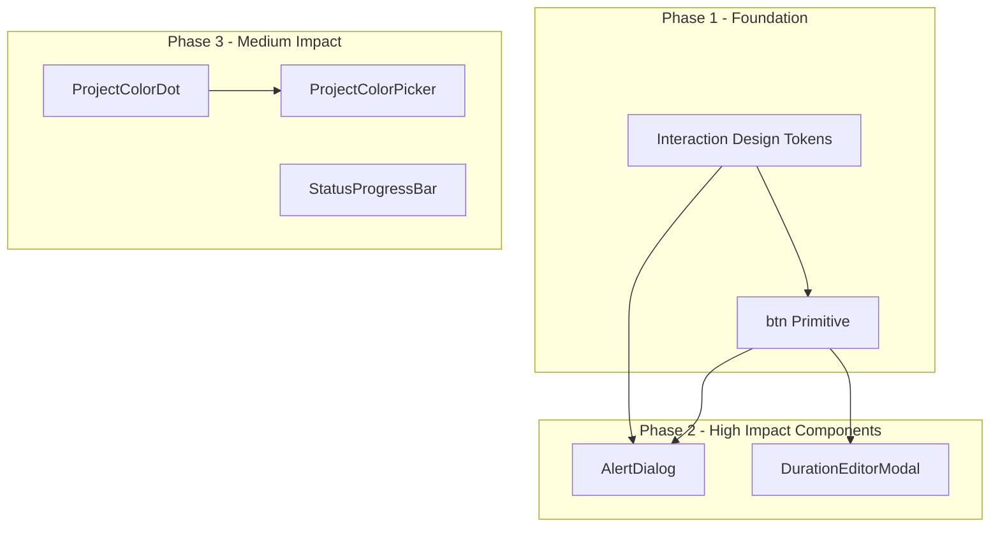

# High-Impact Duplication Refactor Plan

## Strategy Overview

Refactor in dependency order: design tokens and shared styles first, then components that consume them. Each phase is independently testable and can be done incrementally.




---

## Phase 1: Foundation (Styles)

### 1.1 Interaction Design Tokens

**File:** [src/styles/_variables.css](src/styles/_variables.css)

Add semantic tokens for repeated hardcoded colors found in entry-modal.css, modal.css, project.css, task-detail.css, task-action-bar.css:

```css
/* Add to :root */
--color-surface-hover: #d1d5db;      /* neutral button hover */
--color-surface-pressed: #f9fafb;   /* light surface hover */
--color-danger-hover: #b91c1c;      /* red button hover */
--color-success-hover: #15803d;      /* green button hover */
--color-danger-bg-hover: #fecaca;   /* light red hover (options) */
```

Update `@media (prefers-contrast: high)` block to define high-contrast variants if needed.

**Replace usages:** Search for `#d1d5db`, `#b91c1c`, `#15803d`, `#f9fafb`, `#fecaca` across:

- [src/styles/components/entry-modal.css](src/styles/components/entry-modal.css)
- [src/styles/components/modal.css](src/styles/components/modal.css)
- [src/styles/components/project.css](src/styles/components/project.css)
- [src/styles/components/task-detail.css](src/styles/components/task-detail.css)
- [src/styles/components/task-action-bar.css](src/styles/components/task-action-bar.css)

### 1.2 btn Primitive

**New file:** `src/styles/components/btn.css`

Create a shared `.btn` base with CSS custom property variants:

```css
.btn {
  display: inline-flex;
  align-items: center;
  justify-content: center;
  gap: var(--space-xs);
  min-height: var(--touch-min);
  padding: var(--space-sm) var(--space-md);
  border: none;
  border-radius: 8px;
  font-size: var(--font-body);
  font-weight: 600;
  cursor: pointer;
  transition: background-color 0.15s, transform 0.1s;
}

.btn:active { transform: scale(0.98); }

/* Variants via data attributes or classes */
.btn--primary { background: var(--color-primary); color: white; }
.btn--primary:hover:not(:disabled) { background: var(--color-primary-hover); }

.btn--secondary { background: var(--color-border); color: var(--color-text); }
.btn--secondary:hover { background: var(--color-surface-hover); }

.btn--danger { background: var(--color-recording); color: white; }
.btn--danger:hover { background: var(--color-danger-hover); }

.btn--success { background: var(--color-ready); color: white; }
.btn--success:hover { background: var(--color-success-hover); }

.btn--ghost { background: none; color: var(--color-recording); }
.btn--ghost:hover { background: var(--color-recording-bg); }

/* Sizes */
.btn--sm { min-height: 36px; padding: var(--space-xs) var(--space-sm); }
.btn--icon { padding: var(--space-sm); min-width: var(--touch-min); }
.btn--full { width: 100%; }
```

**Migration:** Gradually replace component-specific button classes (e.g. `entry-modal__btn entry-modal__btn--save`, `delete-confirm__btn delete-confirm__btn--cancel`) with `btn btn--primary`, `btn btn--secondary`, etc. in components. Keep BEM where layout differs (e.g. `entry-modal__actions .btn`).

---

## Phase 2: High-Impact Components

### 2.1 DurationEditorModal

**New file:** `src/components/DurationEditorModal.tsx`

Extract shared logic from AddEntryModal, EditEntryModal, EstimateInput:

**Sub-component:** `DurationStepper` (can be internal or exported) – hour/minute grid with clamp logic:

- `clampHours(v) => Math.max(0, Math.min(99, v))`
- `clampMinutes(v) => Math.max(0, Math.min(59, v))`
- Minutes step +5 in Add/Edit; could be configurable (default 5).

**Props:**


| Prop           | Type                               | Notes                                             |
| -------------- | ---------------------------------- | ------------------------------------------------- |
| isOpen         | boolean                            |                                                   |
| title          | string                             |                                                   |
| initialHours   | number                             |                                                   |
| initialMinutes | number                             |                                                   |
| showWorkers    | boolean                            | AddEntryModal, EditEntryModal only                |
| initialWorkers | number                             | when showWorkers                                  |
| showDelete     | boolean                            | EditEntryModal – delete button with confirm state |
| showClear      | boolean                            | EstimateInput – clears estimate to null           |
| durationLabel  | string                             | "Duration"                                        |
| previewLabel   | string                             | null                                              |
| onSave         | (hours, minutes, workers?) => void | workers optional                                  |
| onDelete       | () => void                         | when showDelete                                   |
| onClear        | () => void                         | when showClear                                    |
| onClose        | () => void                         |                                                   |


**Output handling:** Caller normalizes: AddEntryModal converts to ms and workers; EditEntryModal same; EstimateInput converts to minutes and passes null on clear.

**Refactor targets:**

- [src/components/AddEntryModal.tsx](src/components/AddEntryModal.tsx) – thin wrapper, ~20 lines
- [src/components/EditEntryModal.tsx](src/components/EditEntryModal.tsx) – wrapper with delete confirmation state
- [src/components/EstimateInput.tsx](src/components/EstimateInput.tsx) – wrapper with useEffect for initial sync from `currentEstimate`

### 2.2 AlertDialog

**New file:** `src/components/AlertDialog.tsx`

Unified confirm/prompt dialog with backdrop, focus trap, title, description, and configurable actions.

**Props:**


| Prop           | Type                                             | Notes                                                       |
| -------------- | ------------------------------------------------ | ----------------------------------------------------------- |
| isOpen         | boolean                                          |                                                             |
| tone           | 'danger'                                         | 'warning'                                                   |
| title          | ReactNode                                        |                                                             |
| description    | ReactNode                                        | main message                                                |
| children       | ReactNode                                        | optional custom content (e.g. DeleteProjectConfirm options) |
| actions        | Array&lt;{ label, onClick, variant?, icon? }&gt; | Cancel, Delete, etc.                                        |
| onClose        | () => void                                       | backdrop click, Escape                                      |
| ariaLabelledBy | string                                           | for a11y                                                    |


**Icon mapping:** tone → WarningIcon (danger/warning), CheckIcon (success), or none.

**Refactor targets:**

- [src/components/DeleteTaskConfirm.tsx](src/components/DeleteTaskConfirm.tsx)
- [src/components/PurgeEntriesConfirm.tsx](src/components/PurgeEntriesConfirm.tsx)
- [src/components/PurgeResetConfirm.tsx](src/components/PurgeResetConfirm.tsx)
- [src/components/CompleteParentConfirm.tsx](src/components/CompleteParentConfirm.tsx)
- [src/components/CompleteParentPrompt.tsx](src/components/CompleteParentPrompt.tsx)
- [src/components/DeleteProjectConfirm.tsx](src/components/DeleteProjectConfirm.tsx) – use `children` for the two-option buttons (Unassign / Delete tasks)

**New shared CSS:** `alert-dialog.css` – consolidate `.delete-confirm`, `.complete-confirm`, `.complete-prompt` into `.alert-dialog` with tone modifiers. Deprecate component-specific classes.

---

## Phase 3: Medium-Impact Components

### 3.1 ProjectColorDot / ProjectChip

**New file:** `src/components/ProjectColorDot.tsx`

Simple presentational component for project color indicator.

**Props:**

- `color: string`
- `size?: 'sm' \| 'md' \| 'lg'` (7px, 10px, 12px, 24px – map to sm/lg or numeric)
- `shape?: 'dot' | 'badge'` – dot = circle only; badge = pill with label
- `label?: string` – for badge shape
- `className?: string`

**Usage mapping:**

- ProjectPicker: `shape="dot"` size="md"
- ProjectList item: `shape="dot"` size="md"
- ProjectDetail header: `shape="dot"` size="lg" (24px), clickable
- TaskDetailHeader breadcrumb: `shape="dot"` size="sm" (7px)
- TodayView section header: `shape="badge"` with project.name

**Files to update:**

- [src/components/ProjectPicker.tsx](src/components/ProjectPicker.tsx)
- [src/pages/ProjectList.tsx](src/pages/ProjectList.tsx)
- [src/pages/ProjectDetail.tsx](src/pages/ProjectDetail.tsx)
- [src/components/TaskDetailHeader.tsx](src/components/TaskDetailHeader.tsx)
- [src/pages/TodayView.tsx](src/pages/TodayView.tsx)

### 3.2 ProjectColorPicker

**New file:** `src/components/ProjectColorPicker.tsx`

Color swatch grid for selecting a project color.

**Props:**

- `colors: readonly string[]` (default PROJECT_COLORS)
- `value: string`
- `onChange: (color: string) => void`
- `size?: 'sm' | 'md'` (32px default)
- `showBorder?: boolean` (selected state border)
- `ariaLabelPrefix?: string` ("Select color")

**Usage:**

- [src/pages/ProjectList.tsx](src/pages/ProjectList.tsx) – create form
- [src/pages/ProjectDetail.tsx](src/pages/ProjectDetail.tsx) – edit color

Both currently use `PROJECT_COLORS.map` with nearly identical markup.

### 3.3 StatusProgressBar

**New file:** `src/components/StatusProgressBar.tsx`

Budget/subtask progress bar with status-based styling.

**Props:**

- `percent: number` (0–100, clamped)
- `status: 'under' | 'approaching' | 'over'` (determines fill + label color)
- `label?: ReactNode` – e.g. "45%", "3/5"
- `showPercent?: boolean` – show numeric label
- `height?: number` – bar height (4 or 6)
- `className?: string`

**Usage:**

- [src/components/TaskCard.tsx](src/components/TaskCard.tsx) – budget bar and subtask bar (two instances)
- [src/components/TaskTimeTracking.tsx](src/components/TaskTimeTracking.tsx) – budget bar in estimate section

**Note:** TaskCard has an expand button beside the progress; StatusProgressBar can accept `children` or a `trailing` slot for that. Alternatively, keep the expand button in TaskCard and only extract the bar + label.

---

## Execution Order and Dependencies


| Step | Task                                                  | Depends On |
| ---- | ----------------------------------------------------- | ---------- |
| 1    | Add interaction design tokens to _variables.css       | -          |
| 2    | Replace hardcoded colors with tokens                  | 1          |
| 3    | Create btn.css and wire into index.css                | 1          |
| 4    | Migrate button classes to btn primitive               | 3          |
| 5    | Create DurationEditorModal + DurationStepper          | 3, 4       |
| 6    | Refactor AddEntryModal, EditEntryModal, EstimateInput | 5          |
| 7    | Create AlertDialog + alert-dialog.css                 | 3, 4       |
| 8    | Refactor 6 confirm/prompt components                  | 7          |
| 9    | Create ProjectColorDot                                | -          |
| 10   | Replace inline color dots with ProjectColorDot        | 9          |
| 11   | Create ProjectColorPicker                             | 9          |
| 12   | Refactor ProjectList, ProjectDetail color pickers     | 11         |
| 13   | Create StatusProgressBar                              | -          |
| 14   | Refactor TaskCard, TaskTimeTracking                   | 13         |


---

## Risk Mitigation

- **DurationEditorModal:** EstimateInput uses `useEffect` to sync `currentEstimate` into local state when modal opens. Preserve this in the wrapper.
- **EditEntryModal:** Delete uses a two-step confirm (click "Delete" → "Confirm delete?"). Handle via `showDelete` + internal state or a separate mini-confirm.
- **DeleteProjectConfirm:** Custom options (Unassign vs Delete) – use `children` slot in AlertDialog.
- **btn migration:** Use composable approach: `className="btn btn--primary"` or `className={cn('entry-modal__btn', 'btn', 'btn--primary')}` during transition to avoid visual regressions.

---

## Files Summary

**New files (7):**

- `src/styles/components/btn.css`
- `src/styles/components/alert-dialog.css`
- `src/components/DurationEditorModal.tsx`
- `src/components/AlertDialog.tsx`
- `src/components/ProjectColorDot.tsx`
- `src/components/ProjectColorPicker.tsx`
- `src/components/StatusProgressBar.tsx`

**Modified files (~25):**

- `_variables.css`, `index.css`, `entry-modal.css`, `modal.css`, `project.css`, `task-detail.css`, `task-action-bar.css`
- AddEntryModal, EditEntryModal, EstimateInput
- DeleteTaskConfirm, PurgeEntriesConfirm, PurgeResetConfirm, DeleteProjectConfirm, CompleteParentConfirm, CompleteParentPrompt
- ProjectList, ProjectDetail, ProjectPicker
- TaskDetailHeader, TodayView
- TaskCard, TaskTimeTracking

