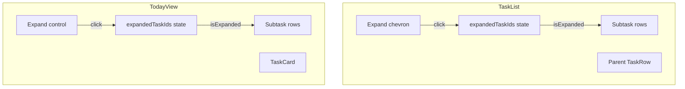

# Inline Subtask Expansion Plan

Show subtasks inline under parent tasks in TaskList and TodayView. User expands a parent to see its subtasks without navigating. Per PLAN.md §3.3, §4.2: "Inline expansion instead of drill-down where possible", "One-level subtasks only".

---

## Current State

- **TaskList:** Uses [TaskRow](src/components/TaskRow.tsx) with `subtaskCount` – shows "X subtasks" text, no expansion
- **TodayView:** Uses TaskCard with progress bar (completed/total), no subtask list
- **task-store:** `useSubtasks(parentId)` and `getSubtasksOf(parentId)` return direct children
- **One-level constraint:** Subtasks have no children; expansion shows only direct children

---

## 1. Expand Control UX

**Trigger:** Chevron or dedicated expand area. Separate from row tap (which goes to detail).

**Behavior:**

- Parent row: tap main area → navigate to TaskDetail; tap chevron (when `subtaskCount > 0`) → expand/collapse
- Chevron: down when collapsed, up when expanded (or rotate 90°)
- When `subtaskCount === 0`: chevron hidden or row tap only goes to detail

**State:** `expandedTaskIds: Set<string>` (or `Record<string, boolean>`) – which parents are expanded. Managed by each page (TaskList, TodayView).

---

## 2. TaskRow Changes

**File:** [src/components/TaskRow.tsx](src/components/TaskRow.tsx)

**New props:**

- `isExpanded?: boolean`
- `onExpandToggle?: (e: React.MouseEvent) => void`
- `isSubtask?: boolean` – for indented subtask rendering

**Changes:**

- When `subtaskCount > 0`: chevron becomes a button with `onClick={onExpandToggle}`, `e.stopPropagation()`
- Chevron direction: `isExpanded` ? up : down
- When `isSubtask`: apply indent class, hide chevron, compact layout
- Optional: subtask variant hides subtask count (it’s the child itself)

---

## 3. ExpandableTaskRow (or TaskRowWithSubtasks)

**Options:**

**A. Extend TaskRow in place** – Add optional `subtasks`, `expanded`, `onExpandToggle`, and render children below when expanded.

**B. Create wrapper component** – `ExpandableTaskRow` wraps TaskRow and renders parent + subtask rows. Parent page passes `subtasks` and expansion state.

**Recommendation:** Option B – keep TaskRow simple, add `TaskRowWithSubtasks` or an `ExpandableTaskBlock` that composes TaskRow.

**File:** `src/components/ExpandableTaskRow.tsx` (new)

**Props:** `task`, `subtasks`, `isExpanded`, `onExpandToggle`, `onSelectTask`, `onStartTimer`, `onStopTimer`, plus any TaskRow extras

**Renders:**

1. TaskRow (parent) with expand chevron when `subtasks.length > 0`
2. When expanded: a list of subtask rows below, indented
3. Subtask rows: compact TaskRow variant (`isSubtask`) – same status, title, timer; no chevron, no expand

**Subtask row:** Reuse TaskRow with `isSubtask={true}` and `subtaskCount={0}` (or a slim `SubtaskRow` if we want smaller tap targets – but 44px min per CONTEXT, so reuse TaskRow with indent).

---

## 4. TaskList Integration

**File:** [src/pages/TaskList.tsx](src/pages/TaskList.tsx)

**Changes:**

- Add state: `expandedTaskIds = useState<Set<string>>(new Set())` or `Record<string, boolean>`
- Use `useSubtasks(task.id)` or `getSubtasksOf` via `tasks.filter(t => t.parentId === task.id)` to get subtasks per parent
- Replace `TaskRow` with `ExpandableTaskRow` for tasks that have subtasks
  - Or: always use `ExpandableTaskRow`, pass `subtasks=[]` when none – component shows normal row
- Pass `isExpanded`, `onExpandToggle` to toggle expansion
- `onExpandToggle`: add/remove `task.id` from `expandedTaskIds`
- For blocked/completed sections: same pattern (expand applies there too)

**Data:** `tasks` already includes subtasks. For each top-level task, `tasks.filter(t => t.parentId === task.id)` gives subtasks. No new store calls if we filter from `tasks`.

---

## 5. TodayView Integration

**File:** [src/pages/TodayView.tsx](src/pages/TodayView.tsx)

**Changes:**

- Add `expandedTaskIds` state
- TaskCard needs expand control when `getSubtaskProgress(task.id)` returns non-null (has subtasks)
- When expanded: render subtask rows below TaskCard
- TaskCard is inside SwipeableRow – expand area must not conflict with swipe. Put expand control inside the card, e.g. a chevron or tap zone
- Subtask rows in TodayView: can use same `SubtaskRow` / TaskRow variant as TaskList for consistency
- Ensure expanded subtasks support: tap to select, timer button, status display

**Structure:** TaskCard expands to show a `today-view__subtasks` block with `SubtaskRow` items when `isExpanded`.

---

## 6. SubtaskRow Component (Optional)

**File:** `src/components/SubtaskRow.tsx` (new) – optional

A slim version of TaskRow for subtasks:

- Indented (e.g. `padding-left: var(--space-xl)` or similar)
- Status dot, title, timer button
- No chevron, no subtask count
- 44px min height
- `onSelect`, `onStartTimer`, `onStopTimer`

Alternative: Keep using TaskRow with `isSubtask={true}` and `subtaskCount={0}`. Add `.task-row--subtask` for indent and slight visual difference.

---

## 7. Accessibility

- Expand button: `aria-expanded={isExpanded}`, `aria-controls="subtasks-${taskId}"`
- Subtask container: `id="subtasks-${taskId}"`, `role="group"` or list
- `aria-label="Expand to show subtasks"` / "Collapse subtasks" on the chevron button
- Keyboard: Enter/Space on chevron toggles; parent row still navigates to detail on Enter/Space (need to ensure chevron is focusable separately)

---

## 8. Styling

**CSS additions:**

- `.task-row--subtask` or `.subtask-row` – left indent
- `.task-row__expand-btn` – chevron as button, 44px tap target
- `.task-row__expand-btn--expanded` – rotated chevron
- `.task-list__subtasks` / `.today-view__subtasks` – container for expanded subtasks
- Optional: light border or background to group parent + subtasks

---

## 9. Data Flow

---

## 10. Implementation Order

1. Add `ExpandableTaskRow` (or extend TaskRow with expand + subtask rendering)
2. Add `SubtaskRow` or `task-row--subtask` variant
3. Update TaskList: expansion state, use expandable row
4. Update TodayView: expansion state, expand control on TaskCard, subtask list
5. CSS for indent, chevron, expand button
6. Accessibility attributes

---

## 11. Files Summary

| File                                                     | Action                                                                    |
| -------------------------------------------------------- | ------------------------------------------------------------------------- |
| [src/components/TaskRow.tsx](src/components/TaskRow.tsx) | Add `isSubtask`, `isExpanded`, `onExpandToggle`, chevron as expand button |
| `src/components/ExpandableTaskRow.tsx`                   | Create – parent row + expand + subtask list (or fold into TaskRow)        |
| [src/pages/TaskList.tsx](src/pages/TaskList.tsx)         | Add expansion state, use expandable row, pass subtasks                    |
| [src/pages/TodayView.tsx](src/pages/TodayView.tsx)       | Add expansion state, expand control on TaskCard, subtask list             |
| `src/index.css`                                          | Styles for subtask indent, expand button, expanded block                  |

---

## 12. Edge Cases

- **No subtasks:** Chevron hidden; row behaves as today (tap → detail)
- **One expanded at a time vs many:** Allow multiple expanded – simpler, user can collapse when done
- **Long subtask list:** Normal scroll; no virtualization for typical counts

