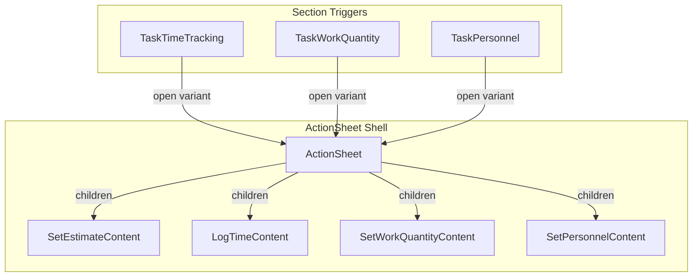

# iOS-Style Action Sheet for Task Detail

## Current State

**Inline editing today:**

- **TaskTimeTracking**: Uses centered modals for Set Estimate, Log Time, Edit Entry — all wrap [DurationEditorModal](src/components/DurationEditorModal.tsx)
- **TaskWorkQuantity**: Inline form inside expandable section (quantity input + unit select + Save/Clear/Cancel)
- **TaskPersonnel**: Inline WorkersStepper + Clear when expanded, or "+ Set default personnel" when collapsed
- **Task/Subtask creation**: [InlineCreateForm](src/components/InlineCreateForm.tsx) — title-only, used in TodayView, ProjectDetail, TaskDetailSubtasks

**Shared modal infra:** [useModalFocusTrap](src/lib/hooks/useModalFocusTrap.ts) (focus trap, Escape, scroll lock), [entry-modal.css](src/styles/components/entry-modal.css) (centered modal, slide-up from center).

---

## Architecture




**Design choice:** ActionSheet as a shell that accepts `children` — each caller passes the appropriate content panel. This keeps the shell generic and avoids a large switch on `variant`.

---

## Implementation Plan

### 1. Create ActionSheet shell component

**File:** `src/components/ActionSheet.tsx`

- Fixed to bottom of viewport, full width
- `isOpen`, `onClose`, `title`, `children`
- Slide-up animation (transform/translateY) — pure CSS, no new deps
- Backdrop (semi-transparent) with click-to-dismiss
- Reuse `useModalFocusTrap` for accessibility
- Safe-area handling for notched devices (`env(safe-area-inset-bottom)`)
- Optional: small drag handle at top for visual affordance (iOS convention)

**Styling:** `src/styles/components/action-sheet.css`

- `.action-sheet-backdrop` — fixed overlay, fade in
- `.action-sheet` — bottom-aligned panel, `border-radius` top corners, `box-shadow`, `slideUpFromBottom` keyframes
- Match existing tokens (`--color-bg`, `--space-*`, etc.)

### 2. Create content panels (or reuse existing)

Each panel is a presentational form; business logic stays in parent components.


| Action            | Content                    | Reuse / New                                                                                                          |
| ----------------- | -------------------------- | -------------------------------------------------------------------------------------------------------------------- |
| Set estimate      | Duration (hrs/min) + Clear | Extract from [DurationEditorModal](src/components/DurationEditorModal.tsx) — duration grid + WorkersStepper (hidden) |
| Log time          | Duration + Workers         | Same — use duration grid + WorkersStepper                                                                            |
| Set work quantity | Number input + unit select | Extract from [TaskWorkQuantity](src/components/TaskWorkQuantity.tsx) inline form                                     |
| Set personnel     | WorkersStepper + Clear     | Extract from [TaskPersonnel](src/components/TaskPersonnel.tsx) — WorkersStepper + Clear                              |


**Option A (recommended):** Create panel components that render *only* the form fields, no modal chrome. ActionSheet provides title + backdrop + panel. Example:

```tsx
// Usage in TaskTimeTracking
<ActionSheet isOpen={showEstimateModal} title="Set Estimate" onClose={() => setShowEstimateModal(false)}>
  <DurationEditorContent
    initialHours={...} initialMinutes={...}
    showClear onSave={handleSaveEstimate} onClear={() => handleSaveEstimate(null)}
  />
</ActionSheet>
```

**Option B:** Keep `DurationEditorModal` for duration-based flows but restyle it to render *inside* an ActionSheet when used from Task Detail. This would require passing a `presentation` prop (e.g. `"modal" | "sheet"`) or a wrapper. More coupling.

**Recommendation:** Option A. Create `DurationEditorContent` (presentational) that holds the duration grid + optional workers + actions. `AddEntryModal`, `EstimateInput`, `EditEntryModal` can either (a) use ActionSheet + DurationEditorContent when on Task Detail, or (b) be refactored to always use ActionSheet site-wide. For minimal disruption, migrate Task Detail first.

### 3. Migrate Task Detail sections to ActionSheet

**TaskTimeTracking** ([src/components/TaskTimeTracking.tsx](src/components/TaskTimeTracking.tsx)):

- Replace `EstimateInput` modal with `ActionSheet` + duration content
- Replace `AddEntryModal` with `ActionSheet` + duration + workers content
- EditEntryModal: either move to ActionSheet as well for consistency, or leave as centered modal (edit is less frequent; user didn’t explicitly request it)

**TaskWorkQuantity** ([src/components/TaskWorkQuantity.tsx](src/components/TaskWorkQuantity.tsx)):

- Remove inline form; on "+ Set work quantity" or edit icon, open ActionSheet with work-quantity form
- Section becomes read-only summary; tap to open sheet

**TaskPersonnel** ([src/components/TaskPersonnel.tsx](src/components/TaskPersonnel.tsx)):

- Remove inline WorkersStepper; on "+ Set default personnel" or when expanding, open ActionSheet with WorkersStepper + Clear
- Section shows summary only; tap opens sheet

**TaskStatusBanner** ([src/components/TaskStatusBanner.tsx](src/components/TaskStatusBanner.tsx)): Keep inline WorkersStepper for *timer* crew count — it’s contextual to “recording” and benefits from being visible without an extra tap.

### 4. Extract shared content components

To avoid duplication between ActionSheet usage and any remaining centered modals (e.g. EditEntryModal):

- **DurationEditorContent**: Duration grid (hrs/min steppers) + optional WorkersStepper + optional preview + action buttons. Used by Set Estimate, Log Time, Edit Entry.
- **WorkQuantityForm**: Number input + unit select + Save/Clear/Cancel. Used by Set Work Quantity.
- **PersonnelForm**: WorkersStepper + Clear. Used by Set Personnel.

`DurationEditorModal` can be refactored to render `DurationEditorContent` inside its dialog, so both ActionSheet and modal share the same form logic.

### 5. Optional: Task / subtask creation with details

**TodayView**, **ProjectDetail**, **TaskDetailSubtasks** currently use `InlineCreateForm` (title only). `createTask` already supports [CreateTaskInput](src/lib/stores/task-store.ts): `title`, `projectId`, `parentId`, `estimatedMinutes`, `workQuantity`, `workUnit`, `defaultWorkers`.

**Possible UX:**

- Keep InlineCreateForm for quick add (title + Enter)
- Add optional "Add with details" or long-press that opens ActionSheet with: title (required) + project (if ungrouped) + optional estimate, work quantity, personnel
- For subtasks: parentId is fixed; could add optional estimate/work/personnel

This is a follow-on enhancement; the core plan is Task Detail section migration.

---

## File Changes Summary


| Action       | Files                                                                                              |
| ------------ | -------------------------------------------------------------------------------------------------- |
| **New**      | `src/components/ActionSheet.tsx`, `src/styles/components/action-sheet.css`                         |
| **New**      | `DurationEditorContent`, `WorkQuantityForm`, `PersonnelForm` (or inline in panels)                 |
| **Refactor** | `DurationEditorModal` to use `DurationEditorContent` (if extracting)                               |
| **Modify**   | `TaskTimeTracking`, `TaskWorkQuantity`, `TaskPersonnel` — use ActionSheet instead of inline/modals |
| **Modify**   | `src/index.css` — import `action-sheet.css`                                                        |
| **Optional** | `EditEntryModal` → ActionSheet; TodayView/ProjectDetail/TaskDetailSubtasks extended add            |


---

## Open Questions

1. **Edit Entry** — Move to ActionSheet too (tap row → bottom sheet) or keep as centered modal?
2. **Task creation** — Add “Create with details” flow now, or defer?
3. **Swipe-to-dismiss** — Implement gesture (would need a small gesture lib or manual touch handling) or stick to backdrop tap + Cancel?

