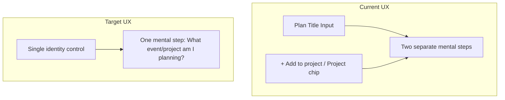

# Merge Plan Title and Project into Unified Identity Control

## Current State

In [PlanEditor.tsx](src/pages/planning/PlanEditor.tsx), the overview block has two separate controls:

1. **Plan Title** (lines 359–372): Text input with label "Plan Title" in `planning-view__overview-identity`
2. **Project** (lines 377–403): Labeled "Project" with either selected project name (clickable chip) or "+ Add to project" button in `planning-view__overview-content`

Layout: grid with `planning-view__overview-identity` (title row) and `planning-view__overview-context` (helper text + project row). Both are visually and conceptually separate.

**Data model** ([plan-model.ts](src/lib/planning/plan-model.ts)): `Plan` has both `title: string` and `projectId: string | null` stored independently. New plans use `createPlan('New Plan')` with `projectId: null`.

---

## Target Mental Model

- **Before**: "I'm making a plan and optionally tying it to a project"
- **After**: "I'm planning the delivery of [event/project or this work]"

The identity of what the user is planning should feel like one thing. Two valid paths:

- **Project-linked** — Event, client project, deliverable. Identity = project name.
- **Standalone** — Maintenance, internal work, ad-hoc. Identity = user-typed plan title.

---

## Resolved Implementation Approach

**Single unified control** using **Input + Browse Icon (Option A)**:

**When no project assigned:**

- Text input with placeholder `"What event or project are you planning?"`
- User types directly → `plan.title` (maintenance/standalone; blur saves)
- Browse/chevron icon opens ProjectPicker (select project, create project, or None)

**When project assigned:**

- Project chip showing project name (reuse existing styles)
- Click opens ProjectPicker to change or unassign

**Data behavior:**

- On project select: sync `plan.title` to `project.name`
- On unassign (None): keep `plan.title` as-is
- Plan name for display: `getPlanDisplayName(plan, project)` → `project?.name ?? plan.title` (used everywhere)

---

## Key Files to Modify

- [src/pages/planning/PlanEditor.tsx](src/pages/planning/PlanEditor.tsx) — Merge identity and project into one control; update state/save flow
- [src/styles/components/planning/editor-shell.css](src/styles/components/planning/editor-shell.css) — Layout for merged control; remove/reuse project-row and title-input styles
- [src/pages/planning/hooks/usePlanningData.ts](src/pages/planning/hooks/usePlanningData.ts) — Optional: change `createPlan` default (e.g. empty string)
- [src/components/ProjectPicker.tsx](src/components/ProjectPicker.tsx) — Likely reuse as-is
- **New**: `getPlanDisplayName(plan, projectById)` — Add to `src/lib/planning/plan-model.ts` or `plan-utils.ts`; returns `project?.name ?? plan.title`
- **Update display surfaces** — PlanList, PlanningWorkspaceShell, SharedScheduleView, WrapUpReviewPane, FieldPlanPlanSelector, AddFromPlanSheet, InsightsView

---

## Resolved Decisions

- **Standalone plans**: Yes — Support both project-linked and None (maintenance use case)
- **Empty-state pattern**: Input + browse icon (Option A)
- **Unassign (None)**: Keep `plan.title` as-is when user selects None
- **Title sync on assign**: Sync `plan.title` to `project.name`
- **Display name**: Use `getPlanDisplayName(plan, project)` → `project?.name ?? plan.title` everywhere
- **ProjectPicker**: Keep modal; reuse existing [+ Create project] flow; keep None option
- **Phase scope**: Phase 1 only — no inline typeahead this build
- **Helper text**: Update to align with identity-first mental model
- **Stepper label**: Rename step 1 to "Event/Project" or "Identity"
- **Project rename**: Known limitation — display uses live `project.name` via helper
- **Empty validation**: Require non-empty identity (project OR title) before save/activate

---

## Mermaid: Before vs After

---

## Implementation Spec

### Display Surfaces to Update

Replace `plan.title` with `getPlanDisplayName(plan, project)` in:

- [PlanList.tsx](src/pages/planning/PlanList.tsx)
- [PlanningWorkspaceShell.tsx](src/pages/planning/workspace/PlanningWorkspaceShell.tsx)
- [SharedScheduleView.tsx](src/pages/planning/SharedScheduleView.tsx) — consolidate `planTitleByPlanId` and `selectedProjectNamesByPlanId` into one display-name map
- [WrapUpReviewPane.tsx](src/pages/planning/WrapUpReviewPane.tsx)
- [FieldPlanPlanSelector.tsx](src/pages/field-plan/components/FieldPlanPlanSelector.tsx)
- [AddFromPlanSheet.tsx](src/components/AddFromPlanSheet.tsx)
- [InsightsView.tsx](src/pages/planning/InsightsView.tsx) (via prop)

### Phase 1 Implementation Steps

1. Add `getPlanDisplayName(plan, projectById): string` to `plan-model.ts` or `plan-utils.ts` — returns `project?.name ?? plan.title`.
2. Replace identity + project rows with single unified control (Input + Browse Icon).
3. **Empty state**: Input (placeholder "What event or project are you planning?") + chevron/browse icon. Typing → `plan.title`, blur saves. Icon click → ProjectPicker.
4. **Assigned state**: Project chip, click opens ProjectPicker. On select: sync `plan.title` to `project.name`. On None: keep `plan.title`.
5. Adopt `getPlanDisplayName` in all display surfaces listed above.
6. Update `overviewHelperText` for identity-first mental model.
7. Rename stepper step 1 to "Event/Project".
8. New plans: `createPlan('')`; validation: block save/activate if empty identity (no project AND no title).
9. When `readOnly` or `isLocked`: show identity as read-only text, no picker.

### Phase 2 (Future)

- Inline typeahead combobox, "Create [name]" option, keyboard nav, ARIA.

---

## Next Steps

1. Implement Phase 1 per spec above.
2. Test: new plan, assign project, unassign (None), standalone (type title), existing plans with/without project, read-only, mobile PlanningView.

