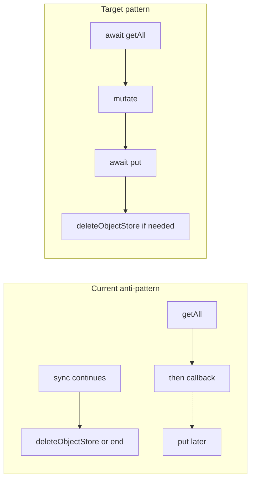

# Migration safety and ROI refactors (implementation handoff)

**Repository root:** `time-tracking` (this workspace). All paths below are relative to the repo root.

**Implementing agent:** Complete phases in order unless explicitly timeboxed to Phase 1 only. Do not skip Phase 0 verification.

---

## Non-goals (do not do in this plan)

- Bump `DB_VERSION` in [`src/lib/db/core.ts`](src/lib/db/core.ts) unless you are adding a **new** schema migration (Phases 1–2 are refactors only).
- Change runtime behavior of planning, schedule UI, or plan package import/export beyond what is required for migration correctness.
- Mass-update imports from `plan-model` in Phase 3 (barrel re-export only on first pass).

---

## Phase 0 — Verify `idb` contract (before coding)

**Why:** The plan assumes `openDB(..., { upgrade })` will wait if `upgrade` returns a `Promise`. Confirm for **idb ^8.0.3** (see [`package.json`](package.json)).

**Actions:**

1. Open `node_modules/idb/build/entry.d.ts` or equivalent published types and locate the `upgrade` callback type on `openDB`.
2. Confirm the upgrade function is allowed to return `void | Promise<void>` (or broader `Promise<unknown>`). If types only allow `void`, widen the local `DbUpgradeCallback` alias to match the library, or cast at the `openDB` call site in [`src/lib/db/core.ts`](src/lib/db/core.ts)—**do not** leave a type error.

**Done when:** `npm run build` (runs `tsc -b` per [`package.json`](package.json)) accepts `async` `applyDbMigrations` returning a Promise.

---

## Phase 1 — IndexedDB upgrade: awaitable, ordered, correct

### Problem statement

[`src/lib/db/migrations/apply-db-migrations.ts`](src/lib/db/migrations/apply-db-migrations.ts) uses patterns like `store.getAll().then(...)` without returning those promises from the upgrade handler. That makes completion ordering implicit and browser-dependent.

**Concrete bug (must fix):** In the version-6 `activeTimer` → `activeTimers` migration, the code schedules `oldStore.getAll().then(...)` and then **synchronously** calls `db.deleteObjectStore('activeTimer')`. The store can be deleted before the `getAll` callback runs. Fix by **awaiting** read + writes into `activeTimers`, then calling `deleteObjectStore`.

**Note on line numbers:** Do not rely on line numbers from an earlier review; use `rg '\.then\(' src/lib/db/migrations/apply-db-migrations.ts` to find all sites.

### Implementation rules

1. **`applyDbMigrations` must be `async`** and every IDB async operation in the upgrade path must be **`await`ed** (or aggregated with `await Promise.all(...)` only where you are sure all requests belong to the same upgrade transaction and ordering does not matter—**default to sequential `await`** for `put`/`getAll` unless profiling demands otherwise).

2. **`backfillStore` pattern:** Replace the inner `getAll().then` with:
   - `const records = await store.getAll()`
   - loop; if `mutate` returns true, `await store.put(record)`
   Pass `transaction` and store name into a typed helper; keep the same `TimeTrackingDBSchema` typing approach as today.

3. **Preserve control flow:** Keep the existing **sequential order** of `if (oldVersion < N)` blocks. A user upgrading from e.g. 5 → 38 runs **all** applicable blocks in **one** upgrade transaction; do not parallelize across version blocks.

4. **Destructive operations:** Any `deleteObjectStore`, schema deletes, or renames must run **only after** all async reads/writes targeting the affected store(s) in that step have completed.

5. **Nested branches:** For blocks that call `backfillStore` multiple times or combine `getAll` with other work, use explicit `await` in source order.

### Tests

[`src/lib/db/migrations/apply-db-migrations.test.ts`](src/lib/db/migrations/apply-db-migrations.test.ts) currently calls `applyDbMigrations(...)` without awaiting, then `flushMicrotasks()`.

**Required changes:**

- Change tests to **`await applyDbMigrations(...)`** (signature gains fifth parameter only if library requires it—match existing call sites).
- Remove reliance on double `flushMicrotasks()` unless a test covers non-IDB async; prefer deterministic `await`.

**Commands:** From repo root, `npm run test` (runs `vitest run` per [`package.json`](package.json)).

### Manual smoke (required for Phase 1 sign-off)

- Run the app in the browser with DevTools open.
- Prefer testing with a **copy** of a real DB or a controlled downgrade path if you have one; if not, at least cold-load after `npm run build` + `npm run preview` and confirm **no** `InvalidStateError`, **no** "transaction finished" errors during upgrade.
- If upgrade fails in the field, users may need to clear site data—document any new failure mode in the PR if introduced.

### Phase 1 acceptance criteria (checklist)

- [ ] Phase 0 verified; TypeScript build passes.
- [ ] `rg '\.then\(' src/lib/db/migrations/apply-db-migrations.ts` shows **no** fire-and-forget IDB `getAll().then` / `put` chains left in the upgrade path (or each remaining `.then` is documented with why it is safe).
- [ ] v6 migration: data copied to `activeTimers` before `deleteObjectStore('activeTimer')`.
- [ ] `npm run test` passes full suite.
- [ ] Manual browser smoke done; console clean on upgrade.

---

## Phase 2 — Split migration file (structure only)

### Goal

Reduce merge conflicts and cognitive load while keeping **one** public entry: `applyDbMigrations` from [`src/lib/db/migrations/apply-db-migrations.ts`](src/lib/db/migrations/apply-db-migrations.ts). [`src/lib/db/core.ts`](src/lib/db/core.ts) import path should stay the same unless you intentionally re-export.

### Suggested layout (pick one; stay within 3–6 new files)

**Option A — version bands:**

- `src/lib/db/migrations/migration-helpers.ts` — `formatLocalDate`, `addDays`, `listDateRange`, `accessHoursForDay`, `renameField`, async `backfillStore`, shared types for `ctx`.
- `src/lib/db/migrations/migrate-v1-v15.ts` — `export async function migrateV1ToV15(ctx): Promise<void>`
- `src/lib/db/migrations/migrate-v16-v28.ts` — same pattern
- `src/lib/db/migrations/migrate-v29-v38.ts` — same pattern
- `apply-db-migrations.ts` — `export async function applyDbMigrations(...) { if (oldVersion < 16) await migrateV1ToV15(...); ... }`

**Option B — single `versions/` folder** with similarly grouped files. Names are not prescriptive; **grouping by version range** matters more than file names.

### Constraints

- **No** `DB_VERSION` bump for file moves alone.
- Each band module receives an explicit **context object** (e.g. `{ db, transaction, oldVersion }`) so signatures stay testable.
- Unit tests should still be able to invoke the **full** `applyDbMigrations` with fakes (keep fake `IDBDatabase` + `IDBTransaction` style tests working).

### Phase 2 acceptance criteria

- [ ] `apply-db-migrations.ts` orchestrator is short and readable.
- [ ] No behavior change: same tests, same upgrade outcomes.
- [ ] New migration work in the future touches one small band file + orchestrator guard.

---

## Phase 3 — `plan-model` split (low churn)

### Files

- Add [`src/lib/planning/plan-model-types.ts`](src/lib/planning/plan-model-types.ts) — interfaces, type aliases, enums currently in [`src/lib/planning/plan-model.ts`](src/lib/planning/plan-model.ts).
- [`src/lib/planning/plan-model.ts`](src/lib/planning/plan-model.ts) becomes a **barrel**: `export type { ... } from './plan-model-types'` and `export { ...functions... }` from the same file or from `./plan-model-ops` if you split further.

### Cycle avoidance

- `plan-model-types.ts` must **not** import from `plan-model.ts`.
- If adding `plan-model-ops.ts`, it may import types from `plan-model-types.ts` only; `plan-model.ts` re-exports for consumers.

### Acceptance criteria

- [ ] No mass `import` path changes across the app in the first PR.
- [ ] `npm run test` + `tsc -b` pass.

---

## Phase 4 — `ScheduleView` incremental extractions

### Goal

Shrink [`src/pages/planning/ScheduleView.tsx`](src/pages/planning/ScheduleView.tsx) without behavior changes.

### Approach

- One PR = one hook or one presentational extraction under [`src/pages/planning/hooks/`](src/pages/planning/hooks/) or colocated `schedule/` helpers.
- First candidates called out in review: **sequence tag IDs** `useMemo` block (comment in file explains parity with tag sequence settings), **amendment popover** state + handlers, **persist-after-mutation** patterns already partially centralized in `usePlanEditorState`.

### Acceptance criteria

- [ ] No user-visible behavior change; no new dependencies unless justified.
- [ ] Targeted test updates only if extracting tested logic.

---

## Deferred (explicit)

[`src/lib/interop/data-transfer/plan-package.ts`](src/lib/interop/data-transfer/plan-package.ts) — large but lower correctness pressure than migrations; split only when touching import/export.

---

## Reference diagram

---

## Suggested PR sequence

1. **PR1:** Phase 0 + Phase 1 (migrations async + tests + smoke notes in PR description).
2. **PR2:** Phase 2 (file split only).
3. **PR3 (optional):** Phase 3 barrel.
4. **PR4+:** Phase 4 one hook at a time.
