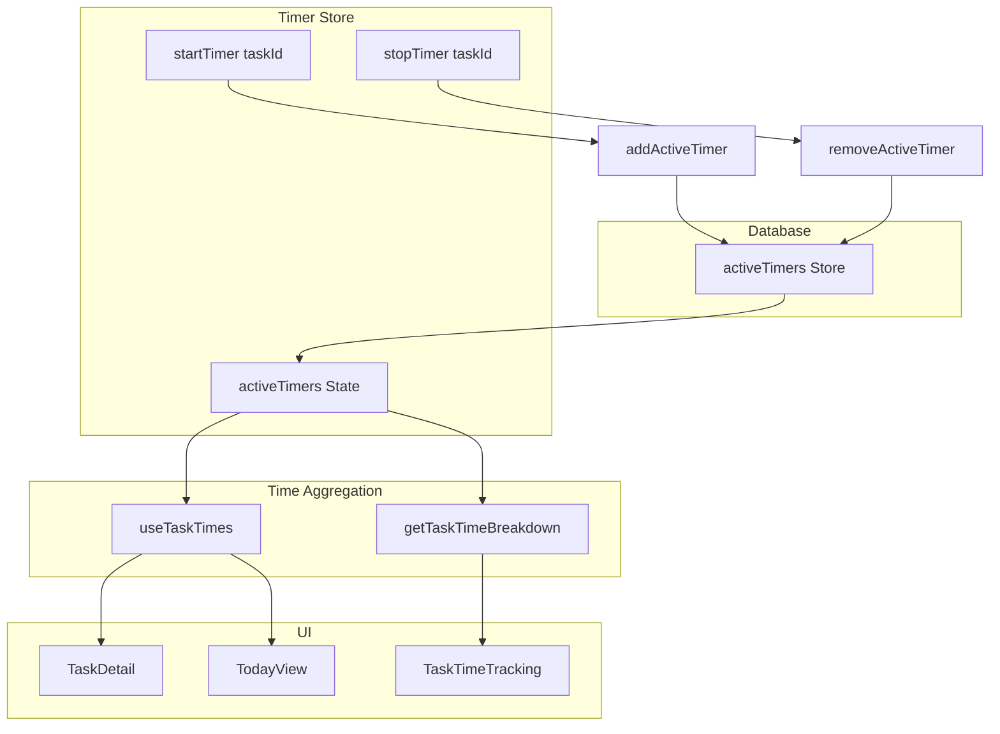

# Multiple Active Timers Plan

## Current State

- **Singleton timer**: IndexedDB `activeTimer` store uses fixed key `'current'`; only one timer globally
- **Time aggregation**: [getTaskTimeBreakdown](src/lib/time-aggregation.ts) adds at most one active timer's elapsed to direct or subtask time
- **UI**: `isTimerActive` and timer controls assume a single `activeTimer`; starting a new timer stops the existing one ([TodayView](src/pages/TodayView.tsx) L93-96)
- **Rules** (CONTEXT.md): "Only one active timer per user" — **removed**

## Rules (Target)

- **Direct timers**: A task may have at most one active direct timer. A subtask may have at most one active timer.
- **Same unit, one timer**: Multiple active timers directly on the same task/subtask are not allowed.
- **Indirect timers**: A parent task may have multiple active timers *indirectly* only via its subtasks (each subtask 0 or 1).
- **Parallel toggle**: When ON, subtasks can run in parallel; when OFF, one timer app-wide (sequential).
- **Total time**: Parent total = (direct entries + 0-or-1 direct timer) + sum over subtasks of (subtask entries + 0-or-1 subtask timer)

---

## 1. Database Layer

**File:** [src/lib/db.ts](src/lib/db.ts)

- **Schema change**: Convert `activeTimer` from singleton to multi-record store (key by `id`), add `by-task` index
- **timeEntries index**: Add `by-startUtc` index on `startUtc` for efficient date-range queries (overview page, exports)
- **Bump DB version** (e.g. to 6); migration: copy existing singleton record into new structure, then delete old store and recreate; add timeEntries index in same upgrade
- **New API**:
  - `getAllActiveTimers(): Promise<ActiveTimer[]>` — replace `getActiveTimer()`
  - `addActiveTimer(timer: ActiveTimer): Promise<void>` — insert (unique id)
  - `removeActiveTimer(taskId: string): Promise<void>` — delete by taskId
  - `updateActiveTimer(taskId: string, updates: Partial<ActiveTimer>): Promise<void>` — update workers etc.
  - `getActiveTimerByTask(taskId: string): Promise<ActiveTimer | null>` — for single-task lookup

Remove `setActiveTimer` and `clearActiveTimer`; replace with add/remove/update.

---

## 2. Timer Store

**File:** [src/lib/stores/timer-store.ts](src/lib/stores/timer-store.ts)

- **State**: `activeTimers: ActiveTimer[]` instead of `activeTimer: ActiveTimer | null`
- **startTimer(taskId)**:
  - If this task already has a timer: return `timer_active` (one direct timer per task)
  - **Parallel toggle OFF**: If any other timer exists, return `timer_active` (sequential mode — one app-wide)
  - **Parallel toggle ON**: No block for other tasks; only enforce one per task
  - Call `addActiveTimer` with new timer
- **stopTimer(taskId: string)**:
  - New signature: `stopTimer(taskId: string)` — stops timer for that task only
  - Find timer by taskId, create time entry, call `removeActiveTimer(taskId)`
- **setTimerWorkers(taskId: string, count: number)** — update the timer for that task
- **discardTimer(taskId: string)** — remove without saving
- **initializeTimerStore**: Load via `getAllActiveTimers()`, handle legacy singleton migration in DB

---

## 2b. Parallel Subtask Timers (Feature Toggle)

**Storage**: Add a setting — e.g. `parallelSubtaskTimers: boolean` — stored in localStorage or a small prefs store. Default: `false` (sequential, legacy behavior).

**File:** New or extended — e.g. `src/lib/prefs.ts` or extend SettingsView state

- `getParallelSubtaskTimers(): boolean`
- `setParallelSubtaskTimers(enabled: boolean): void`

**File:** [src/pages/SettingsView.tsx](src/pages/SettingsView.tsx)

- Add a toggle row: "Parallel subtask timers" — when on, multiple subtasks can each run a timer; when off, only one timer app-wide

**Timer store dependency**: `startTimer` reads the toggle and enforces:

- OFF: block if `activeTimers.length > 0`
- ON: block only if this task already has a timer

---

## 3. Time Aggregation

**File:** [src/lib/time-aggregation.ts](src/lib/time-aggregation.ts)

- **getTaskTimeBreakdown(taskId, subtaskIds, activeTimers: ActiveTimer[])**:
  - For direct: add elapsed from each timer where `t.taskId === taskId` (max one)
  - For each subtask: add elapsed from each timer where `t.taskId === subtaskId`
  - Ensures total = direct (entries + timer) + subtasks (entries + timers)

**File:** [src/lib/hooks/useTaskTimes.ts](src/lib/hooks/useTaskTimes.ts)

- **useTaskTimes(tasks, activeTimers: ActiveTimer[])**:
  - Sum directMs from entries
  - Add elapsed from *all* active timers to their taskIds
  - Roll up to parents as today (direct + children)

**File:** [src/lib/hooks/useTaskTimeBreakdown.ts](src/lib/hooks/useTaskTimeBreakdown.ts)

- Pass `activeTimers`; dependency key on `activeTimers.map(t => t.id).join(',')` or similar

---

## 4. UI Updates

### 4.1 Timer display and selection

**File:** [src/components/TimerDisplay.tsx](src/components/TimerDisplay.tsx)

- Add optional `taskId?: string` prop
- If `taskId` provided: show elapsed for that task's timer only
- If not provided: show sum of all timers (for a future global bar)

**File:** [src/components/TaskStatusBanner.tsx](src/components/TaskStatusBanner.tsx)

- `isTimerActive`: `activeTimers.some(t => t.taskId === task.id)`
- `activeTimer`: `activeTimers.find(t => t.taskId === task.id)` — for workers stepper
- Pass `taskId` to `TimerDisplay` when showing elapsed
- Pass `taskId` to `onSetWorkers` so parent can call `setTimerWorkers(taskId, n)`

### 4.2 Task detail and action bar

**File:** [src/lib/hooks/useTaskDetail.ts](src/lib/hooks/useTaskDetail.ts)

- Use `activeTimers`; derive `isTimerActive` and `activeTimer` for current task
- `handleStopTimer`: call `stopTimer(task.id)`
- `handleSetWorkers`: call `setTimerWorkers(task.id, n)`

**File:** [src/components/TaskActionBar.tsx](src/components/TaskActionBar.tsx)

- Ensure `onStopTimer` is invoked with task context (already passed from useTaskDetail)

### 4.3 TodayView and task lists

**File:** [src/pages/TodayView.tsx](src/pages/TodayView.tsx)

- **Parallel ON**: Remove auto-stop; starting a timer does not stop others
- **Parallel OFF**: Optional "switch" UX: when user taps Start on Task B while Task A has a timer, auto-stop A then start B (or show error and require explicit stop)
- `isTimerActive`: `activeTimers.some(t => t.taskId === task.id)` per task
- `useCompletionFlow(tasks, activeTimerTaskIds)` → pass set of taskIds with timers; on complete, stop timer for that task only

**File:** [src/lib/hooks/useCompletionFlow.ts](src/lib/hooks/useCompletionFlow.ts)

- Param: `activeTimerTaskIds: Set<string>` (or array)
- On complete: `if (activeTimerTaskIds.has(task.id)) await stopTimer(task.id)`

**File:** [src/components/TaskCard.tsx](src/components/TaskCard.tsx)

- `isTimerActive` comes from parent (TodayView) — no change if parent passes correct value

**File:** [src/components/TaskRow.tsx](src/components/TaskRow.tsx), [src/components/SwipeableTaskRow.tsx](src/components/SwipeableTaskRow.tsx)

- `isTimerActive`: `activeTimers.some(t => t.taskId === task.id)`

### 4.4 TaskTimeTracking

**File:** [src/components/TaskTimeTracking.tsx](src/components/TaskTimeTracking.tsx)

- Use `activeTimers`; `isTimerOnTask` = any timer on taskId; `isTimerOnSubtask` = any timer on subtaskIds
- Pass `activeTimers` to `useTaskTimeBreakdown`

---

## 5. Task Operations (stop on delete/complete)

**Files:** [src/lib/stores/task-store.ts](src/lib/stores/task-store.ts), [src/lib/stores/task-store-delete.ts](src/lib/stores/task-store-delete.ts)

- `completeTaskAndChildren`, `deleteTaskWithEntries`, project delete: call `getAllActiveTimers()`, then `stopTimer(taskId)` for each affected taskId that has a timer
- `getDeletePreview` (task-store-delete): sum elapsed from all timers on task + subtasks

---

## 6. Documentation and Types

**File:** [src/lib/types.ts](src/lib/types.ts)

- Update `ActiveTimer` comment: "One per task max; multiple tasks can each have a timer. Parents aggregate indirect timers from subtasks."
- Update `TimeTrackingDB` if needed for schema docs

**File:** [CONTEXT.md](CONTEXT.md)

- Remove "Only one active timer per user". Add: "One direct timer per task; parents may have multiple indirect timers via subtasks. Parallel subtask timers optional (feature toggle)."

---

## 7. Optional: Global Timer Bar

**File:** [src/components/TimerBar.tsx](src/components/TimerBar.tsx)

- TimerBar exists but is not rendered in App. Consider:
  - Render when `activeTimers.length > 0` (e.g. sticky bottom when any timer runs)
  - Show list of tasks with timers + elapsed + stop per task
  - Or a compact "N timers active" with expand to see/stop each

This can be phase 2 if scope is tight.

---

## Data Flow (Mermaid)

---

## Migration Checklist

1. DB schema + migration (v6): activeTimers store + `by-startUtc` on timeEntries
2. db.ts API (getAllActiveTimers, add, remove, update, getByTask)
3. Prefs: parallel subtask timers toggle (localStorage or prefs store) + SettingsView UI
4. timer-store state and actions (incl. parallel-toggle logic in startTimer)
5. time-aggregation.ts and useTaskTimes, useTaskTimeBreakdown
6. useTaskDetail, TaskStatusBanner, TaskActionBar
7. TodayView, useCompletionFlow (parallel ON: no auto-stop; OFF: switch or error)
8. TaskRow, SwipeableTaskRow, TaskTimeTracking
9. task-store, task-store-delete (stop on complete/delete)
10. CONTEXT.md and types (rule removed; new rules documented)
11. (Optional) TimerBar integration

