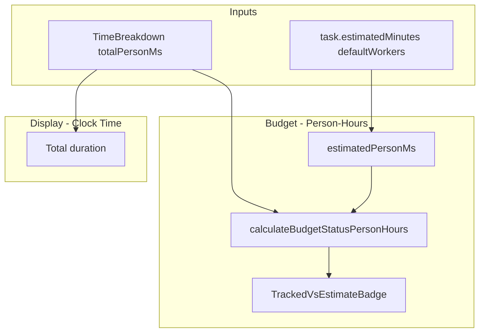

# Person-Hours for Budget/Estimate Comparison

## Goal

- **Budget comparison:** Use person-hours (tracked person-ms vs estimated person-ms). Correct for crew work: "1h with 4 crew" = 4 person-hours.
- **"How long did it take?":** Keep clock time for duration display (TIME TRACKED "Total", list row badges when no estimate).

## Semantic Change

| Context                  | Before                                | After                                |
| ------------------------ | ------------------------------------- | ------------------------------------ |
| Budget status            | trackedMs vs estimatedMinutes (clock) | trackedPersonMs vs estimatedPersonMs |
| Badge "tracked/estimate" | Clock time                            | Person-hours                         |
| TIME TRACKED "Total"     | Clock time                            | Unchanged (clock)                    |
| Badge when no estimate   | Clock time                            | Unchanged (clock)                    |

**Estimated person-ms:** `(estimatedMinutes / 60) × (defaultWorkers ?? 1) × 3_600_000`

---

## Architecture

---

## Implementation Plan

### 1. Add calculateBudgetStatusPersonHours

- **File:** [src/lib/types.ts](src/lib/types.ts)
- **New function:** `calculateBudgetStatusPersonHours(trackedPersonMs: number, estimatedPersonMs: number | null): BudgetStatus`
- Same logic as `calculateBudgetStatus` (thresholds, percentUsed, varianceText) but uses person-ms. Returns `varianceMs` as person-ms (varianceText will say "Over by 2h" meaning 2 person-hours).
- Keep existing `calculateBudgetStatus` for any clock-time uses (or deprecate if unused after this change).

### 2. Add formatTrackedVsEstimatePersonHours

- **File:** [src/lib/types.ts](src/lib/types.ts)
- **New function:** `formatTrackedVsEstimatePersonHours(trackedPersonMs: number, estimatedPersonMs: number | null): string`
- Same output shape as `formatTrackedVsEstimate`: "6h 30m / 8h" when both set, "6h 30m" when no estimate.
- **New function:** `formatTrackedVsEstimateBadgePersonHours(trackedPersonMs, estimatedPersonMs)` for badge text (mirrors `formatTrackedVsEstimateBadge`).

### 3. Add estimatedPersonMs helper

- **File:** [src/lib/types.ts](src/lib/types.ts) or a small util
- **New function:** `getEstimatedPersonMs(estimatedMinutes: number | null, defaultWorkers: number | null): number | null`
- Returns `estimatedMinutes * 60_000 * (defaultWorkers ?? 1)` when estimate > 0, else null.

### 4. Extend useTaskTimes to return person-ms

- **File:** [src/lib/hooks/useTaskTimes.ts](src/lib/hooks/useTaskTimes.ts)
- **Return type change:** From `Map<string, number>` to `{ durationByTask: Map<string, number>; personMsByTask: Map<string, number> }`
- **Simple mode:** For each entry, `durationMs` and `durationMs * (workers ?? 1)`. Accumulate both. Timer: add `elapsed` and `elapsed * workers`.
- **Attribution mode:** Sum `durationMs` per owner (unchanged). Add `personHours * 3_600_000` per owner for person-ms (AttributedEntry has both).
- **Callers:** Update to use the new shape.

### 5. Update useTaskTimes callers

- **File:** [src/pages/TodayView.tsx](src/pages/TodayView.tsx) — Destructure `{ durationByTask, personMsByTask }`, pass both to TaskCard. For SwipeableTaskRow (blocked), pass `durationByTask.get(id)` (clock for "how long").
- **File:** [src/lib/hooks/useTaskDetail.ts](src/lib/hooks/useTaskDetail.ts) — useTaskTimes returns the new shape. useTaskDetail exposes `taskTimes` to TaskDetail. TaskDetailSubtasks and TaskCard need it. Need to define what `taskTimes` contains: either both maps or a getter. For TaskDetailSubtasks (subtask rows), they show `totalMs` — use clock time (duration). For TaskCard (parent), use personMs for budget when estimate exists.
- **Proposed:** Expose `taskTimes: { durationByTask, personMsByTask }` from useTaskDetail. Components that need "time" for subtasks (no budget) use duration. TaskCard uses personMs for budget, duration for "has time" / fallback.

### 6. Update TaskCard

- **File:** [src/components/TaskCard.tsx](src/components/TaskCard.tsx)
- **Props:** Add `totalPersonMs?: number` (or derive from taskTimes + task.id).
- **Budget:** Use `calculateBudgetStatusPersonHours(totalPersonMs ?? 0, getEstimatedPersonMs(task.estimatedMinutes, task.defaultWorkers))`.
- **Badge text:** When estimate exists, use `formatTrackedVsEstimatePersonHours(totalPersonMs, getEstimatedPersonMs(...))`. When no estimate, use `formatDurationShort(totalMs)` (clock time for "how long").
- **"Has time" check:** Keep `totalMs > 0` (duration) so the badge appears when any time is tracked.

### 7. Update TrackedVsEstimateBadge

- **File:** [src/components/TrackedVsEstimateBadge.tsx](src/components/TrackedVsEstimateBadge.tsx)
- **Props:** Support person-hours mode: add optional `usePersonHours?: boolean`. When true, `trackedMs` and `estimatedMinutes` are interpreted as person-ms and estimated-person-ms. Or accept `trackedPersonMs` and `estimatedPersonMs` explicitly to avoid overloading.
- **Cleaner:** Add `TrackedVsEstimateBadgePersonHours({ trackedPersonMs, estimatedPersonMs, status })` — a variant component or overloaded props.
- **Recommendation:** Add optional `trackedPersonMs` and `estimatedPersonMs`; when provided, use person-hours logic. Otherwise keep current (clock) for backward compat during migration. Once all callers use person-hours, simplify.

### 8. Update TaskTimeTracking

- **File:** [src/components/TaskTimeTracking.tsx](src/components/TaskTimeTracking.tsx)
- **Budget:** `calculateBudgetStatusPersonHours(breakdown.totalPersonMs, getEstimatedPersonMs(task?.estimatedMinutes, task?.defaultWorkers))`.
- **TrackedVsEstimateBadge:** Pass `trackedPersonMs={breakdown.totalPersonMs}`, `estimatedPersonMs={getEstimatedPersonMs(...)}`, and `status={budgetStatus.status}`. Use the person-hours variant or extended props.
- **ExpandableSection timeBadge:** When collapsed, the badge shows "tracked/estimate". Pass `timeBadgePersonMs` and `estimatedPersonMs` when we have an estimate (person-hours). When no estimate, pass `timeBadgeMs` (clock) for "how long". ExpandableSection needs to support both — add optional `timeBadgePersonMs` and `estimatedPersonMs`; when both present, format as person-hours.
- **TIME TRACKED "Total":** Unchanged — keep `breakdown.totalMs` (clock time).

### 9. Update ExpandableSection

- **File:** [src/components/ExpandableSection.tsx](src/components/ExpandableSection.tsx)
- Currently: `timeBadgeMs`, `estimatedMinutes` — formats "tracked/estimate" as clock.
- **Change:** When `estimatedMinutes != null` and we want person-hours, we need `timeBadgePersonMs` and `estimatedPersonMs`. Add optional props `timeBadgePersonMs?: number` and `estimatedPersonMs?: number`. When both provided (and we're in "budget" context), use those for the badge. Otherwise fall back to timeBadgeMs/estimatedMinutes. TaskTimeTracking will pass person-hours when estimate exists.

### 10. Update SwipeableTaskRow / TaskRow / TaskDetailSubtasks

- **SwipeableTaskRow:** Receives `totalMs` — use clock (duration) for "how long" on blocked tasks. No estimate/budget here; keep as-is.
- **TaskDetailSubtasks:** Passes `totalMs={taskTimes?.get(subtask.id)}` to SwipeableTaskRow. taskTimes will be the new object — use `taskTimes?.durationByTask?.get(subtask.id)` for clock. Subtasks typically have no estimate; show duration.
- **TaskRow:** Receives totalMs, displays it. No budget. Keep clock time.

### 11. Tests

- Unit test `calculateBudgetStatusPersonHours` (thresholds, variance).
- Unit test `getEstimatedPersonMs`.
- Update any tests that assert on `calculateBudgetStatus` with clock inputs if we keep that function; add tests for person-hours variant.

---

## Files to Modify

- [src/lib/types.ts](src/lib/types.ts) — new functions and helper
- [src/lib/hooks/useTaskTimes.ts](src/lib/hooks/useTaskTimes.ts) — return both maps
- [src/pages/TodayView.tsx](src/pages/TodayView.tsx) — use new useTaskTimes shape
- [src/lib/hooks/useTaskDetail.ts](src/lib/hooks/useTaskDetail.ts) — expose new taskTimes shape
- [src/pages/TaskDetail.tsx](src/pages/TaskDetail.tsx) — pass both to children if needed
- [src/components/TaskCard.tsx](src/components/TaskCard.tsx) — person-hours for budget
- [src/components/TaskTimeTracking.tsx](src/components/TaskTimeTracking.tsx) — person-hours for budget
- [src/components/TrackedVsEstimateBadge.tsx](src/components/TrackedVsEstimateBadge.tsx) — person-hours variant
- [src/components/ExpandableSection.tsx](src/components/ExpandableSection.tsx) — person-hours badge support
- [src/components/TaskDetailSubtasks.tsx](src/components/TaskDetailSubtasks.tsx) — use durationByTask from taskTimes

---

## Display Semantics (Summary)

| Location                                        | Display   | Unit         |
| ----------------------------------------------- | --------- | ------------ |
| TIME TRACKED "Total"                            | Unchanged | Clock        |
| TIME TRACKED "Person-hours" (when multi-worker) | Unchanged | Person-hours |
| Budget badge "tracked/estimate"                 | New       | Person-hours |
| Budget progress bar %                           | New       | Person-hours |
| TaskCard badge (with estimate)                  | New       | Person-hours |
| TaskCard badge (no estimate)                    | Unchanged | Clock        |
| Subtask row total                               | Unchanged | Clock        |

