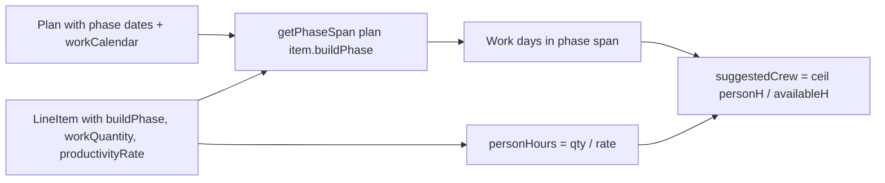

# Phase-Aware Crew Suggestions for Work Packages

## Goal

When build phases are set, suggest minimum crew for each line item so it can be completed within its **phase window** given:

- Available work days in that phase
- Access hours per day (from work calendar)
- Productivity rate (item rate or KPI historical rate)

---

## Formula

Solving for crew given fixed available time:

```
personHours = workQuantity / productivityRate    // e.g. 100 m² at 10 m²/h = 10 person-hours
totalAvailableHours = workDaysInPhase × accessHoursPerDay
suggestedCrew = ceil(personHours / totalAvailableHours)  // min 1
```

So: **crew × workDaysInPhase × accessHoursPerDay >= personHours** → crew >= personHours / (workDaysInPhase × accessHoursPerDay)

---

## Data Flow




---

## Implementation

### 1. Extend `generatePlanSuggestions` signature

**File:** [src/lib/planning/plan-suggestions.ts](src/lib/planning/plan-suggestions.ts)

```ts
export function generatePlanSuggestions(
  lineItems: PlanLineItem[],
  kpis: WorkTypeKpi[],
  plan?: Plan | null,
): PlanSuggestions
```

### 2. Add phase-aware crew computation

When `plan != null` and `hasPhaseDates(plan)` (from schedule-span):

For each item:

1. **Phase span:** `phaseSpan = getPhaseSpan(plan, item.buildPhase)` — returns `{ start, end }` for build-up or tear-down
2. **Work days in phase:**
  - If `plan.workCalendar.length > 0`: filter days where `date >= phaseSpan.start && date <= phaseSpan.end && day.isWorkDay`
  - Else: `generateDefaultWorkCalendar(phaseSpan.start, phaseSpan.end, plan.defaultCrewSize)` filtered by `isWorkDay`
3. **Access hours per day:** from first work day or default 8
4. **Person-hours:** `workQuantity / (productivityRate || suggestedRate || 1)`
5. **Suggested crew:** `suggestedCrew = Math.max(1, Math.ceil(personHours / (workDaysInPhase × accessHoursPerDay)))`

Use existing `[dayAccessHours](src/lib/planning/scheduling/work-calendar.ts)` and `[generateDefaultWorkCalendar](src/lib/planning/scheduling/work-calendar.ts)`. Import `getPhaseSpan` and `hasPhaseDates` from schedule-span (or plan-model re-exports).

### 3. Wire PlanEditor

**File:** [src/pages/planning/PlanEditor.tsx](src/pages/planning/PlanEditor.tsx) line 98:

```ts
const suggestions = generatePlanSuggestions(currentPlan.lineItems, kpis, currentPlan);
```

### 4. LineItemCard UI (already present)

LineItemCard already shows `"Suggested: X crew for phase"` when `suggestedCrew != null` — no change needed.

---

## Edge Cases


| Case                                  | Behavior                                      |
| ------------------------------------- | --------------------------------------------- |
| No plan passed                        | `suggestedCrew: null` (unchanged)             |
| Plan has no phase dates               | `suggestedCrew: null`                         |
| Phase span has 0 work days            | Avoid division by zero: `suggestedCrew: null` |
| workQuantity or productivityRate <= 0 | `suggestedCrew: null`                         |
| Legacy plan (event dates only)        | `suggestedCrew: null` until phase dates added |


---

## Dependencies

- `getPhaseSpan`, `hasPhaseDates` — [schedule-span.ts](src/lib/planning/scheduling/schedule-span.ts) or [plan-model.ts](src/lib/planning/plan-model.ts)
- `generateDefaultWorkCalendar`, `dayAccessHours` — [work-calendar.ts](src/lib/planning/scheduling/work-calendar.ts)
- Plan type — ensure it accepts phase date fields (plan currently may have them as extra props; Plan interface can be extended per phase-bound plan)

---

## Example

- Build-up: Mar 1–5 (5 days, weekdays only → 5 work days)
- Tear-down: Mar 8–10 (3 work days)
- Line item: build-up, 100 m², 10 m²/h productivity → 10 person-hours
- Work days in build-up: 5, access 8h/day → 40h available
- suggestedCrew = ceil(10 / 40) = 1

If 200 m² at 10 m²/h → 20 person-hours, ceil(20/40) = 1. If 400 m² → 40 person-hours, ceil(40/40) = 1. If 500 m² → 50 person-hours, ceil(50/40) = 2 crew.