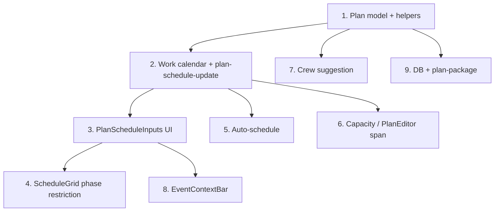

# Phase-Bound Event Time and Crew Suggestion

## Summary

Replace the single event date range with explicit build-up and tear-down spans. Work packages are restricted to their phase. Optional event-opening dates for visualization, with validation when set. Crew suggestions become phase-aware.

---

## 1. Plan Model Changes

**File:** [src/lib/planning/plan-model.ts](src/lib/planning/plan-model.ts)

Add to `Plan` interface:

```ts
buildUpStartDate: string | null;
buildUpEndDate: string | null;
tearDownStartDate: string | null;
tearDownEndDate: string | null;
// eventStartDate, eventEndDate retained for legacy + optional visualization
```

Add helpers:

- `hasPhaseDates(plan)`: `true` when all four phase dates are non-null. Use for phase enforcement and crew suggestion.
- `getPlanEffectiveSpan(plan)`: `{ start: string, end: string } | null` — when `hasPhaseDates`, return `buildUpStartDate`–`tearDownEndDate`; else return `eventStartDate`–`eventEndDate` (legacy). `null` when neither is usable.
- `getPhaseSpan(plan, phase: BuildPhase)`: `{ start: string, end: string } | null` — build-up span or tear-down span; `null` when `!hasPhaseDates`.
- `validatePlanDateRanges(plan)`: `string[]` — returns error messages:
  - `buildUpEndDate` must be before `tearDownStartDate`
  - When both `eventStartDate` and `eventEndDate` set: `buildUpEndDate < eventStartDate` and `eventEndDate < tearDownStartDate`

Update `createPlan()`: initialize `buildUpStartDate`, `buildUpEndDate`, `tearDownStartDate`, `tearDownEndDate` to `null`.

---

## 2. Work Calendar and Effective Span

**File:** [src/lib/planning/scheduling/work-calendar.ts](src/lib/planning/scheduling/work-calendar.ts)

- `hasSchedulingCalendar(plan)`: use `getPlanEffectiveSpan(plan)` instead of `eventStartDate`/`eventEndDate`. Valid when span exists and `workCalendar.length > 0`.

**File:** [src/lib/planning/scheduling/plan-schedule-update.ts](src/lib/planning/scheduling/plan-schedule-update.ts)

- Add `setPlanPhaseDate(plan, field, value)`: field is one of the four phase date keys. On change, call `reconcileWorkCalendar` with `getPlanEffectiveSpan(updatedPlan)`.
- Add `setPlanEventDate` for optional `eventStartDate`/`eventEndDate` (visualization only; no reconcile needed unless used as fallback in legacy).
- When phase dates change: if plan is active and any scheduled line item’s span falls outside its phase, reset that item’s schedule (scheduledStart/End, crewByDate) to avoid inconsistent state.
- `setPlanDefaultCrewSize`: pass `getPlanEffectiveSpan(plan)` to reconcile.

---

## 3. UI — PlanScheduleInputs

**File:** [src/pages/planning/schedule/PlanScheduleInputs.tsx](src/pages/planning/schedule/PlanScheduleInputs.tsx)

Replace current inputs with:

- **Build-up:** From (date), To (date)
- **Tear-down:** From (date), To (date)
- **Default crew** (unchanged)
- **Event (optional):** From (date), To (date) — show period for visualization

Props: pass phase dates, event dates, defaultCrewSize, and `onPhaseDateChange`, `onEventDateChange`, `onDefaultCrewSizeChange`.

`onPhaseDateChange(field, value)`: field = `'buildUpStartDate' | 'buildUpEndDate' | 'tearDownStartDate' | 'tearDownEndDate'`.

When `validatePlanDateRanges(plan)` returns errors, display them inline (e.g. below inputs or in a validation banner). Validate on change.

---

## 4. Phase-Bound Scheduling

**File:** [src/lib/planning/scheduling/plan-schedule-update.ts](src/lib/planning/scheduling/plan-schedule-update.ts)

Add `isDateInPhase(date: string, phase: BuildPhase, plan: Plan): boolean`:

- When `hasPhaseDates(plan)`: return true iff date is within `getPhaseSpan(plan, phase)`.
- When legacy: return true for any date in `getPlanEffectiveSpan(plan)`.

**File:** [src/pages/planning/schedule/ScheduleGrid.tsx](src/pages/planning/schedule/ScheduleGrid.tsx)

- Add `plan: Plan` to props.
- For each cell `(item, day)`: when `hasPhaseDates(plan)` and `!isDateInPhase(day.date, item.buildPhase, plan)`, treat as non-assignable (e.g. `disabled`, or same UX as non–work day).
- Legacy: all work days remain assignable.

In `updateLineItemAssignment`: when `hasPhaseDates`, ensure all dates in `nextSpan` lie within the item’s phase; otherwise do not apply (keep plan unchanged and optionally surface error).

---

## 5. Auto-Schedule Phase-Awareness

**File:** [src/lib/planning/scheduling/auto-schedule.ts](src/lib/planning/scheduling/auto-schedule.ts)

- Use `getPlanEffectiveSpan(plan)` for “has dates” check.
- For each unscheduled item, filter `workDays` to dates within `getPhaseSpan(plan, item.buildPhase)`.
- Run the existing greedy algorithm over that item’s phase work days only.
- Build-up and tear-down items never share capacity (disjoint phase spans).

---

## 6. Capacity and Availability

**File:** [src/lib/planning/scheduling/capacity.ts](src/lib/planning/scheduling/capacity.ts)

- When building the day map without work calendar, use `getPlanEffectiveSpan(plan)` instead of `eventStartDate`/`eventEndDate`.

**File:** [src/pages/planning/PlanEditor.tsx](src/pages/planning/PlanEditor.tsx)

- `availableScope`: use `getPlanEffectiveSpan(currentPlan)` for calendar/headroom.

---

## 7. Crew Suggestion (Phase-Aware)

**File:** [src/lib/planning/plan-suggestions.ts](src/lib/planning/plan-suggestions.ts)

- Extend `generatePlanSuggestions(lineItems, kpis, plan?: Plan)` with optional `plan`.
- When `plan` and `hasPhaseDates(plan)`:
  - `phaseSpan = getPhaseSpan(plan, item.buildPhase)`
  - `workDaysInPhase`: count work days in phase from `plan.workCalendar` filtered by span; if empty, use `generateDefaultWorkCalendar(phaseSpan.start, phaseSpan.end)` filtered by `isWorkDay`.
  - `personHours = workQuantity / (productivityRate || suggestedRate || 1)`
  - `accessHoursPerDay`: from work calendar or default 8
  - `suggestedCrew = max(1, ceil(personHours / (workDaysInPhase * accessHoursPerDay)))`
- Add to `LineItemSuggestion`: `suggestedCrew: number | null`

**File:** [src/pages/planning/LineItemCard.tsx](src/pages/planning/LineItemCard.tsx)

- When `suggestion?.suggestedCrew != null`, show hint near crew input, e.g. “Min 2 crew for phase” or “Suggested: 2 crew (fits in 5 days)”.

---

## 8. EventContextBar and Display

**File:** [src/pages/planning/schedule/EventContextBar.tsx](src/pages/planning/schedule/EventContextBar.tsx)

- Primary range: `getPlanEffectiveSpan(plan)` (build-up start to tear-down end, or event dates when legacy).
- When `eventStartDate` and `eventEndDate` are both set: optionally show “Event: X–Y” as secondary detail.

---

## 9. DB and Plan Package

**File:** [src/lib/db.ts](src/lib/db.ts)

- In plan normalize: add `buildUpStartDate`, `buildUpEndDate`, `tearDownStartDate`, `tearDownEndDate` with `undefined` → `null`.

**File:** [src/lib/interop/data-transfer/plan-package.ts](src/lib/interop/data-transfer/plan-package.ts)

- Export/import: include phase dates.
- `normalizeIncomingPlan`: set phase dates from payload or `null`.
- On merge: if incoming plan has phase dates, use them; else keep existing plan’s phase dates.

---

## 10. Backward Compatibility

- **Legacy plans** (no phase dates): `getPlanEffectiveSpan` uses `eventStartDate`–`eventEndDate`; no phase restriction.
- **New plans**: Phase dates optional until set; when all four are set, phase enforcement applies.
- **Partial phase dates**: If 1–3 phase dates are set, treat as invalid for phase logic: use event dates for span (if present), no phase enforcement. Optionally show validation hint.

---

## 11. Phase Date Change When Plan Active

When phase dates are edited and the plan is active (has scheduled items):

- If any scheduled item’s span falls outside its phase after the change, reset that item’s schedule (scheduledStart/End, crewByDate) to avoid inconsistent state.
- Alternatively: block phase date edits when plan is active and has scheduled items; show message “Revert to draft to change phase dates.”

Recommended: block edits when active to avoid subtle data loss; simpler UX.

---

## Implementation Order




---

## Files to Modify


| File                      | Changes                                                                                           |
| ------------------------- | ------------------------------------------------------------------------------------------------- |
| `plan-model.ts`           | Phase dates, helpers, validation                                                                  |
| `work-calendar.ts`        | Use effective span                                                                                |
| `plan-schedule-update.ts` | setPlanPhaseDate, setPlanEventDate, reconcile, isDateInPhase, updateLineItemAssignment validation |
| `PlanScheduleInputs.tsx`  | 4 phase inputs, optional 2 event inputs, validation display                                       |
| `ScheduleGrid.tsx`        | Accept plan, disable out-of-phase cells                                                           |
| `auto-schedule.ts`        | Phase-aware work days per item                                                                    |
| `capacity.ts`             | Effective span for day map                                                                        |
| `PlanEditor.tsx`          | Wire new inputs, pass plan to suggestions, availableScope                                         |
| `ScheduleView.tsx`        | Wire new inputs, pass plan to ScheduleGrid                                                        |
| `plan-suggestions.ts`     | suggestedCrew, plan param                                                                         |
| `LineItemCard.tsx`        | Show suggested crew hint                                                                          |
| `EventContextBar.tsx`     | Phase dates display, optional event                                                               |
| `db.ts`                   | Normalize new fields                                                                              |
| `plan-package.ts`         | Export/import phase dates                                                                         |


