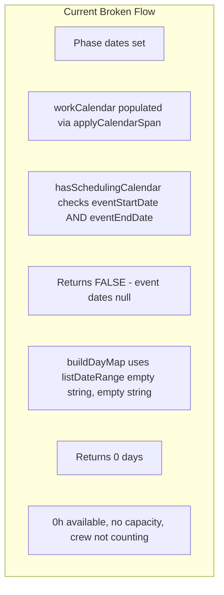

# Phase Dates and Capacity Wiring Fix

## Root Cause Analysis

When using **phase dates only** (build-up + tear-down, no event dates), the capacity and scheduling logic breaks:




**Key finding:** [work-calendar.ts](src/lib/planning/scheduling/work-calendar.ts) line 149–150:

```ts
export function hasSchedulingCalendar(plan): boolean {
  return plan.eventStartDate != null && plan.eventEndDate != null && plan.workCalendar.length > 0;
}
```

With phase dates only, `eventStartDate` and `eventEndDate` are null, so this returns false. [capacity.ts](src/lib/planning/scheduling/capacity.ts) then falls back to `listDateRange(plan.eventStartDate ?? '', plan.eventEndDate ?? '')`, which returns `[]` for empty strings. Result: **0 days, 0h available**. ScheduleGrid receives empty `capacity.days`, so `dayByDate` is empty, `accessHours` is 0 for every date, and `getScheduledHours` / `getWorkHoursForDate` always return 0. Crew changes do not affect displayed hours, and under/over estimate badges never appear correctly.

---

## 1. Fix hasSchedulingCalendar (work-calendar.ts)

**File:** [src/lib/planning/scheduling/work-calendar.ts](src/lib/planning/scheduling/work-calendar.ts)

Change:

```ts
return plan.eventStartDate != null && plan.eventStartDate != null && plan.workCalendar.length > 0;
```

to:

```ts
return plan.workCalendar.length > 0;
```

`workCalendar` is already populated by ScheduleView when `getPrimaryScheduleRange` yields a range (phase or event dates). Using it as the sole signal is sufficient and fixes phase-only plans.

---

## 2. Fix buildDayMap fallback for phase-only plans (capacity.ts)

**File:** [src/lib/planning/scheduling/capacity.ts](src/lib/planning/scheduling/capacity.ts)

When `workCalendar` is empty, the fallback currently uses only `eventStartDate`/`eventEndDate`. For phase-only plans or legacy plans with empty `workCalendar`, we need a fallback span.

- Add an optional effective-span helper or accept plan-like objects with phase date fields.
- When `workCalendar.length === 0`, compute an effective range:
  - If plan has complete phase dates (`buildUpStartDate`…`tearDownEndDate`), use `buildUpStartDate`–`tearDownEndDate`.
  - Else use `eventStartDate`–`eventEndDate` (legacy).

To avoid coupling the lib to UI code, add a shared helper in work-calendar (or a small planning util) that returns `{ start, end } | null` from a plan-like object. The Plan interface should be extended with optional phase date fields per the phase-bound plan; until then, use a plan-like type that can include phase dates.

**Minimal approach:** If `hasSchedulingCalendar` is fixed and ScheduleView always reconciles `workCalendar` when phase/event range exists, `workCalendar` should rarely be empty. As a safety net, add a fallback in `buildDayMap`:

```ts
const effectiveSpan = getEffectiveScheduleSpan(plan);
const days = hasSchedulingCalendar(plan)
  ? plan.workCalendar
  : effectiveSpan
    ? listDateRange(effectiveSpan.start, effectiveSpan.end).map(...)
    : [];
```

Implement `getEffectiveScheduleSpan` in work-calendar (or planning) to handle phase dates and event dates.

---

## 3. Add getEffectiveScheduleSpan (work-calendar or schedule-date-ui)

To support the fallback above:

- Accept a plan-like object with optional phase and event date fields.
- If phase dates are complete, return `{ start: buildUpStartDate, end: tearDownEndDate }`.
- Else if event dates are set, return `{ start: eventStartDate, end: eventEndDate }`.
- Else return `null`.

Place this in a module used by both capacity and ScheduleView. The phase-bound plan suggests `getPlanEffectiveSpan` in plan-model; that can be implemented here or in plan-model if phase date fields are added.

---

## 4. Fix auto-schedule for phase-only plans (auto-schedule.ts)

**File:** [src/lib/planning/scheduling/auto-schedule.ts](src/lib/planning/scheduling/auto-schedule.ts) line 24–27:

```ts
if (!eventStartDate || !eventEndDate) return plan;
const calendar = workCalendar.length > 0 ? workCalendar : [];
```

Change to:

- If `workCalendar.length === 0`, return plan (no calendar to schedule).
- Otherwise use `workCalendar` and remove the event-date guard so auto-schedule works for phase-only plans.

---

## 5. Phase-aware auto-schedule (optional per plan)

The phase-bound plan requires auto-schedule to assign build-up items only to build-up days and tear-down items only to tear-down days. Implement when wiring is complete: filter `workDayDates` by `item.buildPhase` using `getPhaseRange` so each item is scheduled only within its phase span.

---

## Summary of Changes


| File             | Change                                                                                     |
| ---------------- | ------------------------------------------------------------------------------------------ |
| work-calendar.ts | `hasSchedulingCalendar`: require `workCalendar.length > 0` only                            |
| work-calendar.ts | Add `getEffectiveScheduleSpan(plan)` for fallback span (phase or event)                    |
| capacity.ts      | Use `getEffectiveScheduleSpan` in `buildDayMap` fallback when `workCalendar` empty         |
| auto-schedule.ts | Remove event-date guard; rely on `workCalendar.length > 0`; optionally add phase filtering |


---

## Plan model (phase-bound plan)

For full compatibility, add phase date fields to the Plan interface and wire `getEffectiveScheduleSpan` / `getPlanEffectiveSpan` so capacity, work-calendar, and auto-schedule all use a single source of truth for the effective schedule span.