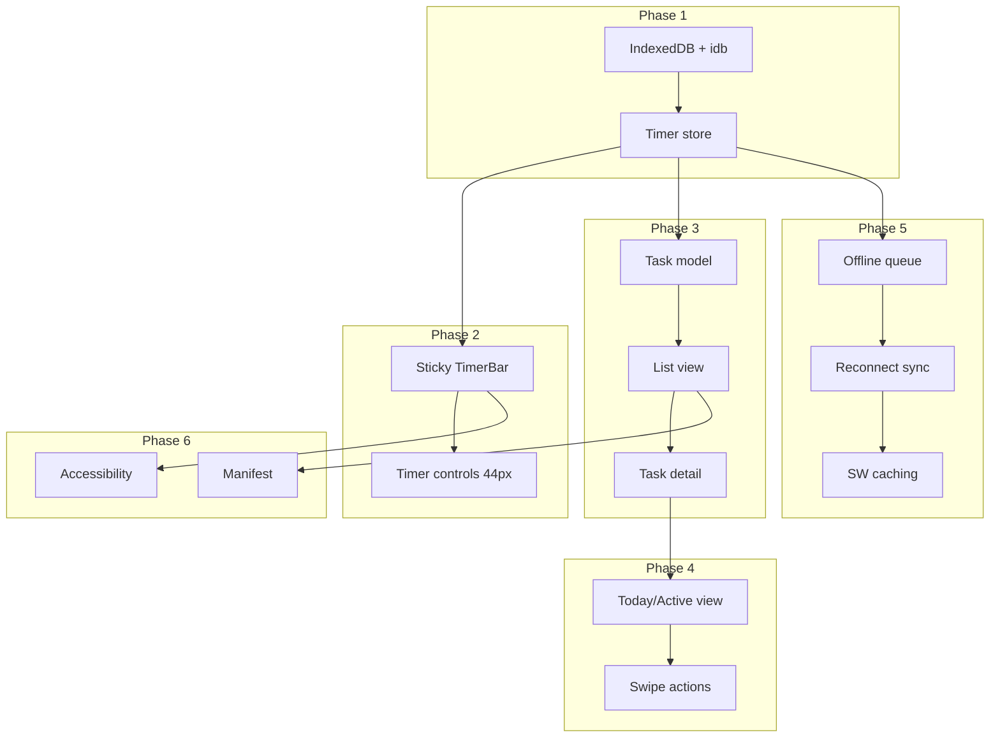

# Phased Implementation Plan

Turns the vision in [PLAN.md](PLAN.md) into actionable phases. Constraints from [CONTEXT.md](CONTEXT.md) apply throughout.

---

## Phase 1: Data Layer and Timer Core

**Goal:** Timer logic that survives reload and works offline.

**Deliverables:**

- Add `idb` for IndexedDB (small, free, open-source)
- Define schema: `timers` (taskId, startUtc, endUtc, source, syncStatus), `tasks`, `projects`, `timeEntries`
- Implement timer store with rules: one active timer only, timestamps for accuracy, no `setInterval` for elapsed
- Persist active timer to IndexedDB on start/stop
- Recover active timer on app load

**Files to create:** `src/lib/db.ts`, `src/lib/stores/timer-store.ts`, `src/lib/types.ts`

---

## Phase 2: Minimal Timer UI

**Goal:** One-tap start/stop with visible active state.

**Deliverables:**

- Sticky bottom bar with timer controls (per PLAN §3.1, §4.2)
- Start/stop button(s) at least 44px height
- Elapsed time computed from stored timestamps on mount and on resume
- Clear “recording” state (color + layout)
- Single placeholder task (e.g. “Unassigned”) if no tasks exist yet

**Files to create:** `src/components/TimerBar.tsx`, `src/components/TimerDisplay.tsx`; update [src/App.tsx](src/App.tsx)

---

## Phase 3: Tasks, Projects, and List View

**Goal:** Tasks and projects so timers can be attached to real work.

**Deliverables:**

- Task model: id, title, status, projectId, blockedReason
- Project model: id, name
- One-level subtasks only
- List view optimized for scanning
- Task detail view with timer controls always visible
- Blocked tasks clearly marked with reason

**Files to create:** `src/pages/TaskList.tsx`, `src/pages/TaskDetail.tsx`, `src/components/TaskRow.tsx`; extend stores and types

---

## Phase 4: Today / Active View

**Goal:** Prioritize active work and make status glanceable (PLAN §4.1).

**Deliverables:**

- “Today / Active” as primary view with active timer and current tasks
- Project/phase grouping
- Progress bars where relevant (color-first)
- Swipe actions with long-press fallback (Complete, Start timer)
- Minimal metadata in list rows

---

## Phase 5: Offline and Sync

**Goal:** No time loss when offline; sync when back online.

**Deliverables:**

- Refine Service Worker caching (static: cache-first; API: stale-while-revalidate; writes: network-first with offline fallback)
- Offline mutation queue for time entries
- Sync on reconnect
- Safe conflict resolution for aggregated time

**Reference:** [vite.config.ts](vite.config.ts) already uses `vite-plugin-pwa`; extend Workbox config.

---

## Phase 6: PWA and Accessibility

**Goal:** Installable, usable in real conditions.

**Deliverables:**

- Manifest tuning (name, icons, display: standalone)
- High-contrast mode support
- 44px minimum tap targets
- Reduce-motion handling
- Visual states beyond color alone
- Basic installability checks on iOS Safari and Android Chrome

---

## Dependency Flow

---

## Execution Order

| Phase | Depends on | Outcome                                  |
| ----- | ---------- | ---------------------------------------- |
| 1     | None       | Timer works offline, survives reload     |
| 2     | Phase 1    | One-tap start/stop, visible active state |
| 3     | Phase 1–2  | Tasks and projects, list + detail views  |
| 4     | Phase 3    | Today/Active view and swipe actions      |
| 5     | Phases 1–4 | Offline queue and sync on reconnect      |
| 6     | All        | Installable, accessible PWA              |

---

## Notes

- Each phase ends with a runnable app; no big-bang release.
- CONTEXT rules (no paid libs, timestamps-only, one active timer) apply in every phase.
- Backend is optional until sync is needed; Phase 5 can use a local-only queue first.

