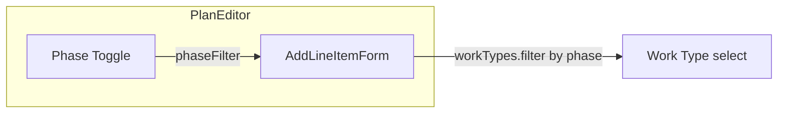

# Planning Enhancements — Phase 2

## Overview

Three enhancements building on the Release-to-Today foundation:

1. **Phase toggle** — Segmented control (Build-up | Tear-down) filters work types when adding line items.
2. **Project assignment** — Reuse `ProjectPicker` in AddFromPlanSheet so released tasks can be assigned to a project.
3. **Duplicate work package** — Copy work-type-related properties, append " (copy)" to title.

---

## 1. Planning Phase Toggle

### Goal

Direct coupling to work types: selected phase filters the work type dropdown in AddLineItemForm.

### Implementation

**PlanEditor** ([PlanningView.tsx](src/pages/PlanningView.tsx)):

- Add state: `phaseFilter: BuildPhase` (default `'build-up'`).
- Add segmented control above "Add Work Package" (or in the header area when draft):

```
[ Build-up ] [ Tear-down ]
```

- Pass `phaseFilter` to `AddLineItemForm`.

**AddLineItemForm** (same file):

- Accept prop `phaseFilter: BuildPhase`.
- Filter work types: `workTypes.filter((wt) => wt.buildPhase === phaseFilter)`.
- When `phaseFilter` changes and `selectedWorkTypeId` is no longer in the filtered list, reset to first available work type (or empty).
- Empty state: "No work types for Tear-down. Add work types in Settings." when filtered list is empty.

**Data flow:**




**Files:** [PlanningView.tsx](src/pages/PlanningView.tsx) — PlanEditor and AddLineItemForm.

---

## 2. Project Assignment for Released Tasks

### Goal

Reuse the existing "Add to project" flow. User selects a project (or None) before releasing line items; all created tasks get that `projectId`.

### Implementation

**AddFromPlanSheet** ([AddFromPlanSheet.tsx](src/components/AddFromPlanSheet.tsx)):

- Add state: `selectedProjectId: string | null` (default `null`).
- Add "Assign to project" UI:
  - Option A: Inline project selector (compact) — button that opens ProjectPicker, shows "None" or project name when selected.
  - Option B: Embed ProjectPicker-style list in the sheet (more space).
- Reuse [ProjectPicker](src/components/ProjectPicker.tsx): Add state `showProjectPicker: boolean`. Render ProjectPicker when true. A "Project" row/button shows current selection and opens ProjectPicker on tap.
- On confirm: pass `projectId: selectedProjectId` to each `createTask` call.

**Release flow** ([release-plan.ts](src/lib/planning/release-plan.ts)):

- Extend `lineItemToCreateTaskInput` to accept optional `projectId`:

```ts
export function lineItemToCreateTaskInput(
  item: PlanLineItem,
  overrides?: { projectId?: string | null }
): CreateTaskInput
```

- Merge `overrides.projectId` into the returned object.

**AddFromPlanSheet** confirm handler:

```ts
await createTask({
  ...lineItemToCreateTaskInput(item),
  projectId: selectedProjectId ?? undefined,
});
```

Or pass `projectId` into the converter for consistency.

**UX:** Place project selector above the plan list (or in the actions area). Label: "Assign to project" with "None" or project name. Tap opens ProjectPicker modal.

**Files:** [AddFromPlanSheet.tsx](src/components/AddFromPlanSheet.tsx), [release-plan.ts](src/lib/planning/release-plan.ts).

---

## 3. Duplicate Work Package

### Goal

Copy a line item with work type and related fields; only change title (append " (copy)" or similar). No rationale copy.

### Implementation

**plan-model.ts** ([plan-model.ts](src/lib/planning/plan-model.ts)):

Add `duplicateLineItem(item: PlanLineItem): PlanLineItem`:

- Copy: `workTypeTitle`, `workUnit`, `buildPhase`, `workTypeId`, `workQuantity`, `crew`, `timeHours`, `productivityRate`, `rateSource`.
- New `id` via `generateId()`.
- Title: `item.title.trim().replace(/\s*\(copy\)\s*$/i, '') + ' (copy)'` to avoid "Foo (copy) (copy)" when duplicating again.
- `rationale: null`.

**LineItemCard** ([PlanningView.tsx](src/pages/PlanningView.tsx)):

- Add prop `onDuplicate?: (item: PlanLineItem) => void`.
- Add Duplicate button (only when `!isLocked`), next to Remove. Icon or text: "Duplicate" / copy icon.
- On click: `onDuplicate?.(item)`.

**PlanEditor** ([PlanningView.tsx](src/pages/PlanningView.tsx)):

- `handleDuplicateLineItem = (item) => addLineItemToPlan(currentPlan, duplicateLineItem(item)); onSave(updated)`.
- Pass `onDuplicate={handleDuplicateLineItem}` to LineItemCard.

**Title convention:** Use " (copy)" suffix. Alternative " — copy" if preferred; keep consistent.

**Files:** [plan-model.ts](src/lib/planning/plan-model.ts), [PlanningView.tsx](src/pages/PlanningView.tsx). Add test in [plan-model.test.ts](src/lib/planning/plan-model.test.ts) for `duplicateLineItem`.

---

## File Summary


| File                                                        | Changes                                                                                                                        |
| ----------------------------------------------------------- | ------------------------------------------------------------------------------------------------------------------------------ |
| [PlanningView.tsx](src/pages/PlanningView.tsx)              | Phase toggle in PlanEditor; pass phaseFilter to AddLineItemForm; filter work types; duplicate handler + button in LineItemCard |
| [plan-model.ts](src/lib/planning/plan-model.ts)             | Add `duplicateLineItem`                                                                                                        |
| [plan-model.test.ts](src/lib/planning/plan-model.test.ts)   | Tests for `duplicateLineItem`                                                                                                  |
| [AddFromPlanSheet.tsx](src/components/AddFromPlanSheet.tsx) | Project selection state; ProjectPicker integration; pass projectId to createTask                                               |
| [release-plan.ts](src/lib/planning/release-plan.ts)         | Optional `projectId` override in `lineItemToCreateTaskInput`                                                                   |


---

## Implementation Order

1. **Duplicate work package** — Isolated, no UI dependencies.
2. **Phase toggle** — PlanEditor + AddLineItemForm only.
3. **Project assignment** — AddFromPlanSheet + release-plan.

