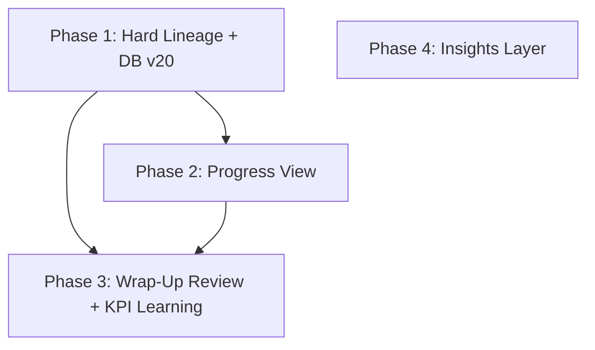

# Planning Review, Wrap-Up, and Insights

This plan implements the architectural direction defined in this conversation across four phases. Each phase is shippable independently, and later phases depend on earlier ones.

## Dependency chain




Phase 4 (Insights) is independent of Phases 2-3 and can be built in parallel.

---

## Phase 1 -- Hard Lineage (Foundation)

Add `sourcePlanId`, `sourceLineItemId`, and `excludeFromKpi` to the Task model. Add `reviewedAt` to the Plan model. DB v20 migration backfills all to null/false.

### Data model changes

**[src/lib/types.ts](src/lib/types.ts)** -- Add three fields to the `Task` interface (after `archiveVersion`, line ~144):

- `sourcePlanId: string | null` -- which plan this task was released from
- `sourceLineItemId: string | null` -- which line item this task maps to
- `excludeFromKpi: boolean` -- whether excluded from KPI computation (set during review)

**[src/lib/planning/plan-model.ts](src/lib/planning/plan-model.ts)** -- Add one field to the `Plan` interface (after `lockedAt`, line ~51):

- `reviewedAt: string | null` -- ISO timestamp of final wrap-up review; null until "Archive and Complete"

Update `createPlan` factory to initialize `reviewedAt: null`.

### Release path changes

**[src/lib/stores/task-store.ts](src/lib/stores/task-store.ts)** -- Add `sourcePlanId` and `sourceLineItemId` to `CreateTaskInput` interface (line ~108). Initialize both in `createTask` (line ~124) with `?? null` pattern matching existing fields.

**[src/lib/planning/release-plan.ts](src/lib/planning/release-plan.ts)** -- Update `lineItemToCreateTaskInput` signature to accept `planId` alongside existing `overrides`:

- Add `planId?: string` to the overrides parameter
- Return `sourcePlanId: overrides?.planId` and `sourceLineItemId: item.id`

**[src/lib/planning/release-selection.ts](src/lib/planning/release-selection.ts)** -- Pass `plan.id` through to `lineItemToCreateTaskInput` in the `selectedPlanItemsToCreateTaskInputs` loop.

### KPI filter update

**[src/lib/kpi.ts](src/lib/kpi.ts)** -- In `computeWorkTypeKpis` (line ~115), add `!t.excludeFromKpi` to the qualifying filter:

```
t.status === 'completed' && ... && (!archiveOnly || t.archivedAt != null) && !t.excludeFromKpi
```

### DB migration

**[src/lib/db.ts](src/lib/db.ts)** -- Bump `DB_VERSION` to `20`. Add v20 migration:

- Backfill tasks: `sourcePlanId = null`, `sourceLineItemId = null`, `excludeFromKpi = false`
- Backfill plans: `reviewedAt = null`

### AddFromPlanSheet filter fix

**[src/components/AddFromPlanSheet.tsx](src/components/AddFromPlanSheet.tsx)** -- Update the plan filter (line ~35) from `p.status === 'locked'` to `p.status === 'locked' || p.reviewedAt !== null` so reviewed plans with unreleased line items remain accessible.

### Tests

- **[src/lib/planning/release-plan.test.ts](src/lib/planning/release-plan.test.ts)** -- Assert `sourcePlanId` and `sourceLineItemId` are set correctly on output
- **[src/lib/planning/release-selection.test.ts](src/lib/planning/release-selection.test.ts)** -- Assert lineage fields propagate through selection
- **[src/lib/planning/plan-model.test.ts](src/lib/planning/plan-model.test.ts)** -- Assert `reviewedAt` is null on new plans

---

## Phase 2 -- Progress View (Read-Only)

A plan-anchored view showing live plan-vs-actual comparison. No side effects, no archiving. Available on any locked plan with at least one linked task.

### Computation module

**New: [src/lib/planning/plan-progress.ts](src/lib/planning/plan-progress.ts)** -- Pure computation, no DB access:

- `LineItemProgress` type: planned hours, planned person-hours, planned productivity, actual hours, actual person-hours, actual productivity, variance %, completion status (`completed` / `in-progress` / `not-started` / `unreleased`), task count
- `PlanProgress` type: array of `LineItemProgress`, unplanned work summary (hours, person-hours, task count for tasks with matching `projectId` but no `sourcePlanId`), overall completion ratio, orphan line items (tasks whose `sourceLineItemId` no longer exists in the plan)
- `computePlanProgress(plan, tasks, timeEntries)` -- core function. Joins plan line items to tasks via `sourceLineItemId`, computes actuals from time entries with workers factor

### Progress view component

**New: [src/pages/planning/ProgressView.tsx](src/pages/planning/ProgressView.tsx)** -- Read-only display:

- Per-line-item row: title, planned vs actual hours/person-hours/productivity, variance % with color (green under, amber approaching, red over), status badge
- Unplanned work section at the bottom (aggregate only)
- Orphan tasks section if any exist (tasks with lineage to this plan but no matching line item)
- No action buttons or side effects

### Wiring into PlanningView

**[src/pages/PlanningView.tsx](src/pages/PlanningView.tsx)** -- Extend `PlanningSubView` type:

```
type PlanningSubView = 'list' | 'edit' | 'compare' | 'progress';
```

Add a "Progress" action in PlanEditor header for locked plans with linked tasks. Route to `ProgressView` component.

### Tests

- **New: [src/lib/planning/plan-progress.test.ts](src/lib/planning/plan-progress.test.ts)** -- Unit tests for `computePlanProgress`: correct line-item matching, variance calculation, unplanned work aggregation, orphan detection, handling of zero/missing data

---

## Phase 3 -- Wrap-Up Review + KPI Learning

The terminal project close-out flow. Triggered from progress view or plan list. Archives all project tasks, optionally excludes outliers from KPI, sets `reviewedAt`.

### Review-ready detection

**New: [src/lib/planning/plan-lifecycle.ts](src/lib/planning/plan-lifecycle.ts)** -- Pure functions:

- `isPlanReviewReady(plan, tasks)` -- returns true when: `plan.status === 'locked'` AND `plan.reviewedAt === null` AND at least one task exists with `sourcePlanId === plan.id` AND all such tasks have `status === 'completed'`
- `getPlanLinkedTasks(plan, tasks)` -- returns all tasks where `sourcePlanId === plan.id`
- `getUnplannedProjectTasks(plan, tasks)` -- returns tasks with matching `projectId` but `sourcePlanId === null`

### Wrap-up flow

**New: [src/lib/planning/wrap-up.ts](src/lib/planning/wrap-up.ts)** -- Orchestrates the wrap-up action:

- Input: plan, list of task IDs to exclude from KPI, all project task IDs
- Actions:
  1. Set `excludeFromKpi = true` on deselected (outlier) tasks
  2. Archive all project tasks (plan-linked + ad-hoc) via `archiveTask`
  3. Set `reviewedAt = nowUtc()` on the plan
  4. Call `invalidateAttributionCache()` to clear stale snapshots
  5. Return updated plan

### Wrap-up confirmation UI

**New: [src/pages/planning/WrapUpSheet.tsx](src/pages/planning/WrapUpSheet.tsx)** -- ActionSheet or full-screen confirmation:

- Shows all project tasks grouped by work type (matching plan line items)
- Each task row: title, actual productivity rate, checkbox (pre-selected)
- System-flagged outliers: use `detectOutliers` from [src/lib/kpi.ts](src/lib/kpi.ts) on per-task productivity rates within each work type group. Flagged tasks show an outlier indicator but remain selected by default
- "Archive and Complete" button -- calls wrap-up flow, closes sheet
- "Save Review Only" button -- available when review is mid-execution; does NOT set `reviewedAt`, does NOT archive. Only archives selected tasks for KPI contribution (not the full project). This mode is for mid-execution KPI updates without closing out.

### Review notes

**[src/lib/planning/plan-model.ts](src/lib/planning/plan-model.ts)** -- Add `reviewNote: string | null` to `PlanLineItem` interface. Initialize to `null` in `createLineItem`, copy as `null` in `duplicateLineItem`. This field holds post-execution annotations (separate from pre-execution `rationale`).

### StatusBadge update

**[src/components/StatusBadge.tsx](src/components/StatusBadge.tsx)** -- Add `review-ready` and `reviewed` variants to display in PlanList.

### PlanList updates

**[src/pages/planning/PlanList.tsx](src/pages/planning/PlanList.tsx)** -- Show `review-ready` badge on plans where `isPlanReviewReady` returns true. Show `reviewed` badge on plans where `reviewedAt !== null`. Add "Wrap Up" action alongside existing plan actions for review-ready plans.

### ProjectDetail secondary entry point

**[src/pages/ProjectDetail.tsx](src/pages/ProjectDetail.tsx)** -- When a project has an associated locked plan (query plans by `projectId`) that is review-ready, show a callout: "This project has a completed plan. View review." Navigating opens PlanningView with the plan selected in progress/review mode.

### DB migration for reviewNote

**[src/lib/db.ts](src/lib/db.ts)** -- Bump `DB_VERSION` to `21` if Phase 3 ships separately from Phase 1. Backfill `reviewNote = null` on all plan line items (same nested-iteration pattern as the scheduling fields migration).

### Tests

- **New: [src/lib/planning/plan-lifecycle.test.ts](src/lib/planning/plan-lifecycle.test.ts)** -- Unit tests for `isPlanReviewReady`, `getPlanLinkedTasks`, `getUnplannedProjectTasks`
- **New: [src/lib/planning/wrap-up.test.ts](src/lib/planning/wrap-up.test.ts)** -- Unit tests for the wrap-up flow: correct archiving, KPI exclusion, `reviewedAt` set, cache invalidation called

---

## Phase 4 -- Insights Layer (Work Type Performance)

A plan-agnostic analytical view inside the planning workspace. Shows work type KPI trends, confidence signals, and variance. Independent of lineage -- uses existing `computeWorkTypeKpis` and `computeWorkTypeTrends` from [src/lib/kpi.ts](src/lib/kpi.ts).

### Insights view component

**New: [src/pages/planning/InsightsView.tsx](src/pages/planning/InsightsView.tsx)**:

- Time window selector: "This month" (default), "Last 3 months", "Last 6 months", "All time"
- Work type performance table: work type title, unit, phase, avg productivity, sample count, confidence badge (high/medium/low/insufficient), CV (stability), trend direction (improving/stable/declining with `changePercent`), outlier count
- High-variance work types grouped separately under "Less Reliable for Estimating" (CV > threshold, e.g., > 0.3)
- KPI confidence visual distinction: work types with < 3 samples are dimmed or marked "insufficient data"

### Wiring into PlanningView

**[src/pages/PlanningView.tsx](src/pages/PlanningView.tsx)** -- Extend `PlanningSubView`:

```
type PlanningSubView = 'list' | 'edit' | 'compare' | 'progress' | 'insights';
```

Add an "Insights" entry point in PlanList (e.g., a section header or a button in the planning view header). When selected, main pane renders `InsightsView` with no plan context required.

### Computation

No new computation module needed. `InsightsView` calls:

- `computeWorkTypeKpis` with time-filtered tasks (filter `updatedAt` by selected window)
- `computeWorkTypeTrends` for trend direction
- Both from [src/lib/kpi.ts](src/lib/kpi.ts), using `buildAttributedRollup` from [src/lib/attributed-rollup.ts](src/lib/attributed-rollup.ts) for entry data

### Tests

- Component-level testing for InsightsView (renders correctly with mock KPI data, time window filter works)

---

## Styling

Each new view component will need a corresponding CSS file in [src/styles/components/](src/styles/components/):

- `progress-view.css` (Phase 2)
- `wrap-up-sheet.css` (Phase 3)  
- `insights-view.css` (Phase 4)

Import each in [src/index.css](src/index.css).

---

## Summary of all files touched

Phase 1 (7 existing + 0 new):

- `src/lib/types.ts`, `src/lib/planning/plan-model.ts`, `src/lib/stores/task-store.ts`, `src/lib/planning/release-plan.ts`, `src/lib/planning/release-selection.ts`, `src/lib/kpi.ts`, `src/lib/db.ts`, `src/components/AddFromPlanSheet.tsx`

Phase 2 (1 existing + 2 new):

- Modified: `src/pages/PlanningView.tsx`
- New: `src/lib/planning/plan-progress.ts`, `src/pages/planning/ProgressView.tsx`

Phase 3 (4 existing + 4 new):

- Modified: `src/lib/planning/plan-model.ts`, `src/components/StatusBadge.tsx`, `src/pages/planning/PlanList.tsx`, `src/pages/ProjectDetail.tsx`, `src/lib/db.ts`
- New: `src/lib/planning/plan-lifecycle.ts`, `src/lib/planning/wrap-up.ts`, `src/pages/planning/WrapUpSheet.tsx`

Phase 4 (1 existing + 1 new):

- Modified: `src/pages/PlanningView.tsx`
- New: `src/pages/planning/InsightsView.tsx`

