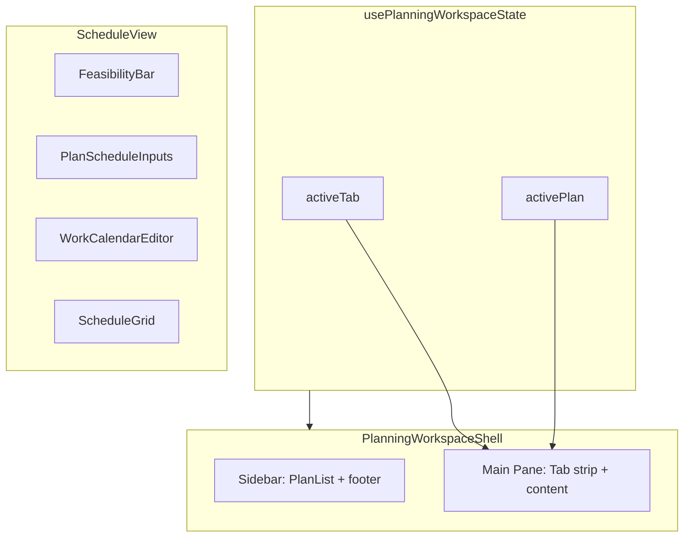

# Planning Workspace UX Implementation

Based on [planning-workspace-ux-implementation-plan.md](.cursor/plans/planning-workspace-ux-implementation-plan.md). Implement in order; each phase should be validated before proceeding.

---

## Architecture Context

**Key files:**

- [src/pages/planning/workspace/PlanningWorkspaceShell.tsx](src/pages/planning/workspace/PlanningWorkspaceShell.tsx) - shell layout, sidebar structure
- [src/pages/planning/PlanList.tsx](src/pages/planning/PlanList.tsx) - sidebar content (actions, zones)
- [src/pages/planning/hooks/usePlanningWorkspaceState.ts](src/pages/planning/hooks/usePlanningWorkspaceState.ts) - tab state
- [src/pages/planning/ScheduleView.tsx](src/pages/planning/ScheduleView.tsx) - schedule orchestration; currently uses `window.prompt` at line 63
- [src/pages/planning/schedule/ScheduleGrid.tsx](src/pages/planning/schedule/ScheduleGrid.tsx) - grid layout uses `repeat(auto-fit, minmax(88px, 1fr))` via [schedule-view.css](src/styles/components/schedule-view.css)

---

## Phase 1: Sidebar Structure and Layout

Restructure sidebar: Insights to footer, New Plan primary, exit control updated. Foundation for Phase 2.

### 1.1 Relocate Insights to Sidebar Footer

- In `PlanningWorkspaceShell`, add `planning-workspace__sidebar-footer` below `planning-workspace__sidebar-content`, outside the scroll region. Footer receives `onOpenInsights`, `activeTab === 'insights'`.
- In `PlanList` (sidebar mode), remove Insights from `planning-sidebar__actions`. Keep only New Plan there.
- Add CSS: footer `flex-shrink: 0`, top border, distinct nav styling.
- Update `planning-workspace.css` for `.planning-workspace__sidebar-footer` and `.planning-workspace__sidebar-footer-item--active`.

### 1.2 Differentiate New Plan Visually

- In `planning-workspace.css`: update `.planning-sidebar__create-btn` with solid primary fill (or stronger accent), larger padding. Ensure it reads as the primary CTA.

### 1.3 Improve Exit Control Labeling

- In `PlanningWorkspaceShell`: change button label from "Exit" to "All Plans", add `HomeIcon` (from [icons.tsx](src/components/icons.tsx)) alongside or instead of `ChevronLeftIcon`, update `aria-label` to "Back to all plans".

---

## Phase 2: Sidebar Behavior and State

Collapsible zones, Insights active state, collapsible sidebar. Depends on Phase 1.

### 2.1 Collapsible Archive Zone

- Add `SidebarZone` variant in `PlanList`: archive zone has chevron header, `expanded` state (default `false`). Click toggles.
- Add `archiveExpanded` to `usePlanningWorkspaceState` (or new `useSidebarPreferences`) and persist in sessionStorage. Pass to `PlanList` as prop.
- CSS: chevron rotation, hide list when collapsed.

### 2.2 Insights Active State

- In footer (Phase 1.1), when `activeTab === 'insights'` apply modifier class. Add `.planning-workspace__sidebar-footer-item--active` styles.

### 2.3 Collapsible Sidebar

- Add sidebar collapse state: `'expanded' | 'icons' | 'hidden'` in workspace state or sidebar prefs.
- Add collapse toggle in header (next to exit). When collapsed: narrow strip (icons only) or hidden; main pane expands.
- Pass `sidebarCollapsed` to `PlanList` and footer; render icon-only variant when collapsed.
- Persist collapse state in sessionStorage; restore on mount.

---

## Phase 3: Empty State and Tab Strip

Empty state, tab overflow, Review tab.

### 3.1 Improve Empty State

- Replace `planning-workspace__empty` in `PlanningWorkspaceShell` with structured content: icon (e.g. `TaskListIcon`), conditional copy ("Select a plan to edit..." vs "Create your first plan..." when `plans.length === 0`), prominent CTA button.

### 3.2 Tab Strip Overflow

- In `planning-workspace.css`: `.planning-workspace__tabs` add `overflow-x: auto`, `overflow-y: hidden`, `-webkit-overflow-scrolling: touch`.
- Optional: right-edge fade when scrollable; optional compact labels/icons at narrow breakpoints.

### 3.3 Add Review Tab

- Extend `WorkspaceTab` in `usePlanningWorkspaceState` with `'review'` if needed.
- In `buildWorkspaceTabs` in `PlanningWorkspaceShell`: add Review tab when `hasLinkedTasks && reviewReady && !isReviewed`. Review tab content: launch wrap-up sheet via `onOpenWrapUp(plan)` with contextual messaging.

### 3.4 Remove planningScheduleV1 Flag

- Remove `planningScheduleV1` usage; Schedule tab always available in workspace mode when plan has calendar. App is not shipped; no rollout gating needed.

### 3.5 Remove Compare (Ground-Up Later)

- Remove Compare tab from `buildWorkspaceTabs`, CompareView from main pane, `onOpenCompare`/`comparePlanId` from `usePlanningWorkspaceState`, Compare dropdown from PlanEditor. Compare to be rebuilt ground-up in future.

---

## Phase 5: Schedule View — Critical Fixes

High-impact schedule changes: amendment popover, feasibility bar, day labels, over-allocation visibility. Sticky column and grid redesign deferred (future: kanban-style, line items in sidebar).

### 5.1 Inline Amendment Popover (replace window.prompt)

- Create `AmendmentPopover` in `src/pages/planning/schedule/`. Props: anchor element, lineItem, date, onConfirm(note), onCancel.
- Derive assign vs remove: `isAssigning = !getAssignedDates(lineItem).includes(date)` (no extra prop).
- Render: "Assigning [title] to [date]" or "Removing [title] from [date]", optional reason input, confirm/cancel. Anchor near cell; handle overflow.
- In `ScheduleView.handleToggleAssignment`: when `status === 'active'`, show popover instead of `window.prompt`; on confirm pass note to `applyScheduleAmendment`. Use controlled open state.

### 5.2 Feasibility Bar

- Create `FeasibilityBar`: compact one-line from `capacity` (headroom, over-allocated count, totals). Place at top of Schedule content; `position: sticky; top: 0`.
- Remove `CapacitySummaryPanel`. Utilization footer in grid (Phase 8.1) covers per-day details. Metric cards in sidebar: future scope.

### 5.3 Event-Relative Day Labels

- In `ScheduleGrid`, update `formatDayLabel(date, index)`: render `Day ${index + 1} | ${formattedDate}`.

### 5.4 Over-Allocation in Grid

- Add modifier classes to `.schedule-grid__day-col` and `.schedule-grid__cell` when `day.isOverAllocated`. Day header shows utilization badge (e.g. "32h OK" or "40h 125%" with warning).
- CSS: `.schedule-grid__day-col--over`, `.schedule-grid__cell--over` with red tint/border.
- Grid column alignment: use inline style `gridTemplateColumns: \`minmax(220px, 1.3fr) repeat(${calendar.length}, minmax(72px, 1fr))` for predictable day column widths.

---

## Phase 6: Schedule View — Layout and UX Refinements

Event context bar, cell affordance, unscheduled improvements, Event Inputs compact, Work Calendar collapsed-by-default.

### 6.1 Compact Event Context Bar

- Create `EventContextBar`: "Event: 3–5 Mar · 3 days · 5 crew · 120h available" with [Edit] link. Place at top (can merge with FeasibilityBar). Edit expands PlanScheduleInputs or scrolls to inputs.

### 6.2 Cell Affordance

- In `ScheduleGrid`: replace bullet with `CheckIcon` for assigned; outline/square for empty. Add `title="Click to assign/unassign"`. Add `:focus-visible` styles for focus ring.

### 6.3 Unscheduled as Assignable

- Extend unscheduled item: show hours per item. Keep core assignability (click cell in grid to assign). No "Assign to Day X" dropdown; no link/scroll-to-item in this scope.
- Layout: on desktop (e.g. min-width 900px), render Unscheduled as right-hand column beside grid; mobile stacked below.
- Update `ScheduleGrid` structure and CSS for side-panel layout.

### 6.4 Event Inputs Compact (Always Visible)

- Event Inputs: compact by default, always visible. One-line or minimal summary; [Edit] to expand if needed. Takes minimal screen real estate.

### 6.5 Work Calendar — Collapsed by Default

- Work Calendar collapsed by default. Only expand when any day deviates from default (different work hours or crew override). If no action needed, planner should not have to dismiss a view.
- Add `expanded` state. Auto-expand when deviations exist that need attention; otherwise stay collapsed.
- Pass `planDefaultCrewSize` from `ScheduleView` to `WorkCalendarEditor` for context (Phase 8.3 Crew override label).

---

## Phase 7: Schedule View — Advanced Features

Phase grouping, keyboard nav, print/export. DnD deferred to future grid redesign.

### 7.1 Group by Build Phase

- In `ScheduleGrid`: group `lineItems` by `buildPhase`. Render section headers ("Build-up", "Tear-down"); collapsible sections (expand/collapse per phase).

### 7.2 Keyboard Navigation

- Add `role="grid"`, `aria-rowindex`, `aria-colindex` to grid. Focus trap; arrow keys move focus; Enter toggles assignment.
- Coordinate with Phase 8.2 for full a11y.

### 7.3 Print / Export

- Add Print/Export button to Schedule header or context bar. Print: `window.print` with print CSS. Export: jspdf or html2canvas for PDF.

---

## Phase 8: Polish and Accessibility

### 8.1 Utilization Footer

- Progress-bar styling for utilization; clearer hierarchy for over-allocated.

### 8.2 Grid Accessibility

- Ensure `role="grid"`, `aria-rowindex`, `aria-colindex`, proper labels. Focus ring in Phase 6.2.

### 8.3 WorkCalendarEditor Fixes

- Responsive grid: improve `schedule-calendar__row` at narrow widths; field order/labels clear when stacked.
- Pass `planDefaultCrewSize` from `ScheduleView` to `WorkCalendarEditor`. Replace placeholder "default" with "Crew (override)" when `planDefaultCrewSize != null`.

---

## Incremental Rollout

- Gate sidebar-specific changes by `sidebarMode` so mobile stack mode is unchanged.
- Validate each phase in isolation before proceeding.

---

## Future Scope (Out of Scope for This Plan)

- **Compare:** Build ground-up later.
- **Schedule grid redesign:** Kanban-style, line items in sidebar with date-aware drag-and-drop. Fundamental rethink.
- **Metric cards in sidebar:** Dedicated section at top of sidebar for capacity/feasibility summary.
- **DnD for schedule:** When implemented, constraints — no paid add-ons, no user downloads/installations, browser-only, safe for work. Use native HTML5 DnD or free open-source lib that bundles with app (e.g. @dnd-kit).

