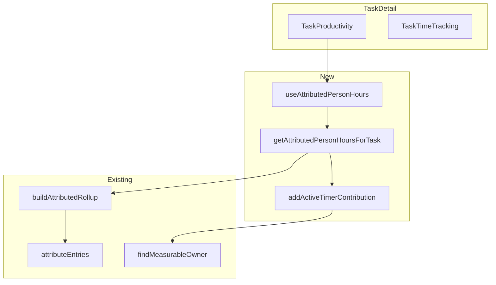

# Productivity Attribution Migration

## Goal

Switch TaskProductivity to use the attribution engine so that the actual rate denominator reflects only time attributed to the parent task (subtask entries roll up only when the subtask is not measurable). Reuse existing attribution and rollup logic where beneficial.

## Current vs Target Behavior

|                         | Current                                  | Target                                                               |
| ----------------------- | ---------------------------------------- | -------------------------------------------------------------------- |
| Actual rate denominator | Sum of all direct + subtask person-hours | Person-hours of entries attributed to task via `findMeasurableOwner` |
| Subtask entries         | Always included                          | Included only when subtask is not measurable (owner = parent)        |

## Architecture

## Reusable Components

1. `**buildAttributedRollup**` (existing) – Keep unchanged. It fetches entries for qualifying tasks + subtasks, runs attribution, groups by `ownerTaskId`. No active timer support (KPI/Calculator do not need it).
2. `**addActiveTimerContribution**` (new util) – Pure helper that, given a task map and active timers on task/subtasks, adds elapsed person-time to the correct owner via `findMeasurableOwner`. Reusable for any single-task attribution scenario.
3. `**getAttributedPersonHoursForTask**` (new async fn) – Orchestrates the TaskDetail flow: calls `buildAttributedRollup([task], allTasks)`, sums `personHours` from entries attributed to `taskId`, adds active timer contribution. Returns `attributedPersonMs`.
4. `**useAttributedPersonHours**` (new hook) – Wraps `getAttributedPersonHoursForTask` with loading state and refresh; used by TaskProductivity.

## Implementation Plan

### 1. Add attribution utilities

- **File**: [src/lib/attribution/utils.ts](src/lib/attribution/utils.ts) (new)
- `**sumAttributedPersonHours(entriesByTask, taskId): number`** – Sum `personHours` from `entriesByTask.get(taskId) ?? []`. Sync, pure.
- `**addActiveTimerContribution(taskId, timerTaskIds, activeTimers, taskMap): number`** – For each active timer whose `taskId` is in `timerTaskIds`, call `findMeasurableOwner`; if `ownerTaskId === taskId`, add `elapsedMs * workers`. Return additional person-ms. Uses `elapsedMs` and `findMeasurableOwner` from [src/lib/attribution/engine.ts](src/lib/attribution/engine.ts).

### 2. Add getAttributedPersonHoursForTask

- **File**: [src/lib/attributed-rollup.ts](src/lib/attributed-rollup.ts) or new [src/lib/attributed-person-hours.ts](src/lib/attributed-person-hours.ts)
- **Signature**: `getAttributedPersonHoursForTask(taskId, subtaskIds, allTasks, activeTimers, policy?): Promise<number>`
- **Logic**:
  1. Call `buildAttributedRollup([task], allTasks, policy)` where `task` is looked up in `allTasks`.
  2. Sum person-hours for `taskId` via `sumAttributedPersonHours(entriesByTask, taskId)`.
  3. Add active timer contribution: `timerTaskIds = [taskId, ...subtaskIds]`, `taskMap` from `allTasks`.
  4. Convert person-hours to person-ms and return.

### 3. Add useAttributedPersonHours hook

- **File**: [src/lib/hooks/useAttributedPersonHours.ts](src/lib/hooks/useAttributedPersonHours.ts)
- **Signature**: `useAttributedPersonHours(taskId, subtaskIds, allTasks, activeTimers, refreshKey?): { attributedPersonMs, isLoading, refresh }`
- Same dependency pattern as `useTaskTimeBreakdown`: refetch when `taskId`, `subtaskIds`, `activeTimers` change. Optional `refreshKey` to force refetch from parent.
- Internally calls `getAttributedPersonHoursForTask`.

### 4. Update TaskDetail and TaskProductivity

- **TaskProductivity** ([src/components/TaskProductivity.tsx](src/components/TaskProductivity.tsx)):
  - Replace `useTaskTimeBreakdown` with `useAttributedPersonHours`.
  - Use `attributedPersonMs` instead of `breakdown.totalPersonMs` for `actualPersonHours` and `actualRate`.
  - Requires `task`, `subtasks`, `parentTask` to build `allTasks` – pass these as props or obtain via store hooks.
- **TaskDetail** ([src/pages/TaskDetail.tsx](src/pages/TaskDetail.tsx)):
  - Pass `task`, `subtasks`, `parentTask` (or `allTasks`) to TaskProductivity so it can call `useAttributedPersonHours` correctly.
- **Refresh coordination**: TaskTimeTracking calls `refresh()` after add/edit/delete entries. Add optional `onEntriesChange` prop to TaskTimeTracking; TaskDetail passes a callback that also invokes `refresh` from `useAttributedPersonHours`. TaskDetail will need to hold both `useTaskTimeBreakdown` and `useAttributedPersonHours` refresh functions, or use a shared `refreshKey` state that both hooks depend on. Recommended: TaskDetail passes `refresh={refreshAll}` to TaskTimeTracking where `refreshAll` is a wrapper that calls both breakdown and attributed refresh.

### 5. Wire refresh between sections

- **TaskTimeTracking** currently uses `useTaskTimeBreakdown` internally and calls `refresh()` after mutations.
- Options:
  - **A** (recommended): Lift `useTaskTimeBreakdown` to TaskDetail; pass `breakdown`, `refresh` to TaskTimeTracking. Add `useAttributedPersonHours` in TaskDetail; pass `attributedPersonMs` to TaskProductivity. Create `refreshAll` that calls both. Pass `refresh={refreshAll}` to TaskTimeTracking.
  - **B**: Keep TaskTimeTracking using its own `useTaskTimeBreakdown`. Add `onEntriesChange?: () => void` to TaskTimeTracking; TaskDetail passes `onEntriesChange` that calls `refresh` from `useAttributedPersonHours`. TaskProductivity still uses `useAttributedPersonHours`. No shared refresh for breakdown, but attributed data updates on entry changes.

Option B is simpler (no prop threading of breakdown). TaskTimeTracking keeps its internal hook; we only add `onEntriesChange` and wire it in TaskDetail.

## Files to Create

- [src/lib/attribution/utils.ts](src/lib/attribution/utils.ts) – `sumAttributedPersonHours`, `addActiveTimerContribution`
- [src/lib/attributed-person-hours.ts](src/lib/attributed-person-hours.ts) – `getAttributedPersonHoursForTask`
- [src/lib/hooks/useAttributedPersonHours.ts](src/lib/hooks/useAttributedPersonHours.ts)

## Files to Modify

- [src/components/TaskProductivity.tsx](src/components/TaskProductivity.tsx) – Switch to `useAttributedPersonHours`
- [src/components/TaskTimeTracking.tsx](src/components/TaskTimeTracking.tsx) – Add optional `onEntriesChange` callback, call it after `refresh()` on mutations
- [src/pages/TaskDetail.tsx](src/pages/TaskDetail.tsx) – Wire `onEntriesChange` to refresh attributed hook

## Policy

Use `DEFAULT_ATTRIBUTION_POLICY` (`soft_allow_flag`) consistently with KPI/Calculator. No new policy options for this migration.

## Testing

- Add unit tests for `sumAttributedPersonHours` and `addActiveTimerContribution` (mock `findMeasurableOwner` or use real engine).
- Add unit tests for `getAttributedPersonHoursForTask` with scenarios: measurable subtask (excluded), unmeasurable subtask (included), active timer on subtask that attributes to parent.
- Existing [attributed-rollup.test.ts](src/lib/attributed-rollup.test.ts) and [engine.test.ts](src/lib/attribution/engine.test.ts) remain valid; no changes to attribution engine itself.

## What Stays Unchanged

- [src/lib/time-aggregation.ts](src/lib/time-aggregation.ts) – `getTaskTimeBreakdown` unchanged; TaskTimeTracking keeps using it for raw time display (direct vs subtask).
- [src/lib/attribution/engine.ts](src/lib/attribution/engine.ts) – No changes.
- [src/lib/attributed-rollup.ts](src/lib/attributed-rollup.ts) – No changes (reused as-is).
- KPI, Calculator, PlanningView, SettingsInteropView – No changes.

