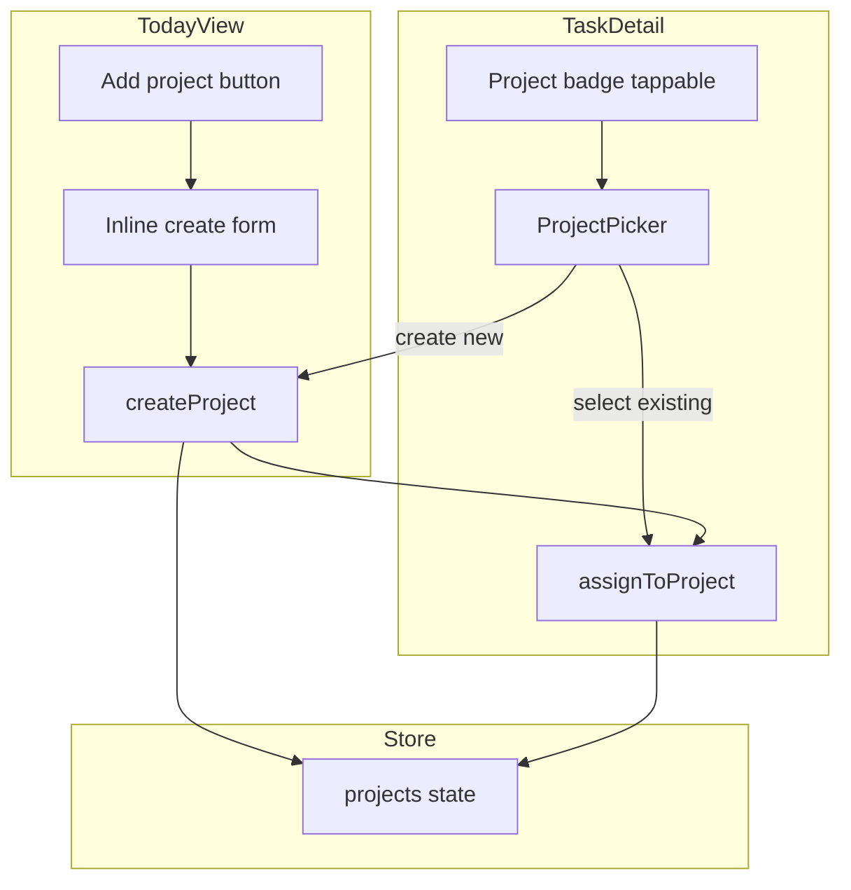

# Project Creation and Assignment Plan

Enable creating projects and assigning tasks to projects. Store functions exist (`createProject`, `assignToProject`); add UI only. Per PLAN.md: fewer screens, minimal decisions.

---

## Current State

- [src/lib/stores/task-store.ts](src/lib/stores/task-store.ts): `createProject(name)`, `assignToProject(taskId, projectId | null)` exist
- [src/pages/TaskDetail.tsx](src/pages/TaskDetail.tsx): Shows `project.name` when assigned, read-only
- [src/pages/TodayView.tsx](src/pages/TodayView.tsx): Groups by project, creates tasks with `projectId` omitted (ungrouped)
- [src/pages/TaskList.tsx](src/pages/TaskList.tsx): No project UI

---

## 1. ProjectPicker Component

**File:** `src/components/ProjectPicker.tsx` (new)

Reusable sheet/modal for selecting or creating a project.

**Props:** `isOpen`, `onClose`, `onSelect: (projectId: string | null) => void`, `currentProjectId: string | null`

**Content:**

- "None" option (clears assignment)
- List of projects (from `useTaskStore().projects`)
- "+ Create project" that expands to inline input + Add button
- On "+ Create project" submit: `createProject(name)`, then `onSelect(newId)`, close
- On "None" or existing project: `onSelect(null)` or `onSelect(id)`, close

**UX:** Dialog/sheet pattern like [DeleteTaskConfirm.tsx](src/components/DeleteTaskConfirm.tsx) - backdrop, Escape, focus trap. 44px tap targets per CONTEXT.

**Create flow:** When user taps "+ Create project", show input inline. Submit calls `createProject`, adds to store, then invokes `onSelect` with new id so the caller can assign immediately.

---

## 2. TaskDetail: Assign Project

**File:** [src/pages/TaskDetail.tsx](src/pages/TaskDetail.tsx)

**Changes:**

- Add state: `showProjectPicker: boolean`
- Make project area tappable:
  - If `project`: show `project.name` as button/chip
  - If no project: show "Add to project" (text or icon)
- On tap: set `showProjectPicker = true`
- Render `ProjectPicker` when `showProjectPicker`
- `onSelect`: call `assignToProject(task.id, projectId)`, close picker
- Import `assignToProject` from task-store

**Placement:** In the title section, next to or below the title. The existing `{project && ` becomes a button that opens the picker.

---

## 3. TodayView: Create Project

**File:** [src/pages/TodayView.tsx](src/pages/TodayView.tsx)

**Option A (minimal):** Add "Add project" only in ProjectPicker's create flow. No standalone creation in TodayView. User creates projects when assigning a task. (Fewer UI surfaces.)

**Option B:** Add project creation entry in TodayView for pre-creating projects (e.g. before any tasks).

**Recommendation:** Option B for flexibility. Add a compact "Projects" row above or within the first section:

- When `projects.length > 0`: Show chips `[Project A] [Project B] [+]`
- When `projects.length === 0`: Show "Add project" button or inline input
- Tapping `[+]` or "Add project": expand inline form (input + Add) or open small modal
- On submit: `createProject(name)`

**Placement:** Between Quick Add and first task section. Single row, horizontal scroll if many projects. `[+]` opens inline input that replaces or appends below the row.

**Simpler variant:** Single "+ Project" button that toggles an inline form. No chip list (projects already appear as section headers). Just "+ Project" → input + Add → createProject.

---

## 4. Task Creation with Project (Optional)

When creating a task in TodayView or TaskList, optionally set `projectId`. Adds a dropdown or project chip selector next to the quick-add. Lower priority; can be Phase 2. Default: omit for now (task created ungrouped, user assigns in detail).

---

## 5. Subtask Inheritance

Already implemented: `handleAddSubtask` passes `projectId: task.projectId` to `createTask`. No change needed.

---

## Data Flow

---

## Files Summary

| File                                                 | Action                                                                     |
| ---------------------------------------------------- | -------------------------------------------------------------------------- |
| `src/components/ProjectPicker.tsx`                   | Create - modal with None, list, Create new inline                          |
| [src/pages/TaskDetail.tsx](src/pages/TaskDetail.tsx) | Make project badge tappable, integrate ProjectPicker, call assignToProject |
| [src/pages/TodayView.tsx](src/pages/TodayView.tsx)   | Add "+ Project" with inline create form                                    |
| `src/index.css`                                      | Styles for ProjectPicker (dialog/chip), project create form                |

---

## Implementation Order

1. ProjectPicker component (with create inline)
2. TaskDetail integration
3. TodayView "+ Project" create
4. CSS for new elements

---

## Out of Scope

- Edit/rename project
- Delete project
- TaskList project creation (TodayView only for create; assignment via TaskDetail)

