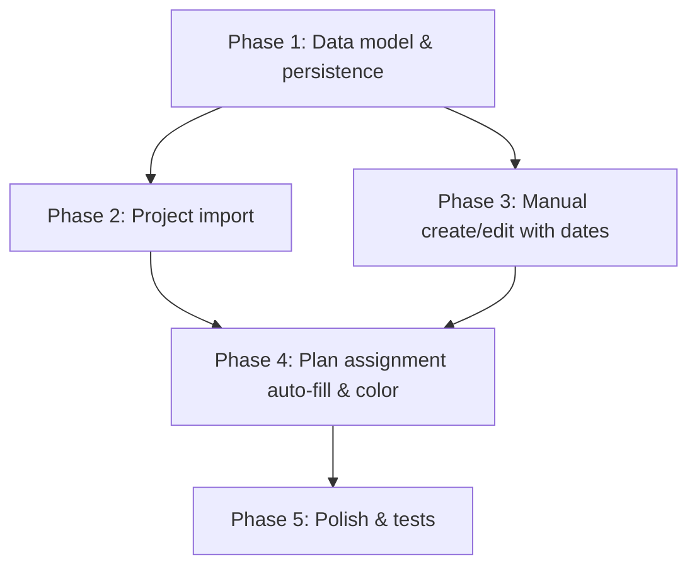

# Project Phase Dates — Phased Implementation Plan

## Design Summary

- **Project template**: dates only (assembly, dismantle, event). No crew size, no color in import.
- **Import**: CSV in Settings; mapping key = `name`; re-import updates existing projects (date fields only).
- **Color**: auto-assigned when a project is first linked to a plan; users can override via ProjectDetail color picker.
- **Manual creation**: both manual and import paths support phase dates.
- **Schedule auto-fill**: when a plan is linked to a project with phase dates, plan schedule inputs are populated (replace existing values). When unassigning project, keep plan phase dates; only clear `projectId`.

---

## Phase 1: Data Model and Persistence

**Objective:** Extend Project with phase/event date fields and migrate existing data.

### 1.1 Extend Project type

**File:** [src/lib/types.ts](src/lib/types.ts)

- Add `PROJECT_COLOR_UNASSIGNED = ''` constant (sentinel for projects not yet linked to a plan).
- Add optional date fields to `Project`:

```ts
export const PROJECT_COLOR_UNASSIGNED = '';

export interface Project {
  id: string;
  name: string;
  color: string;  // PROJECT_COLOR_UNASSIGNED until first plan link or manual pick in ProjectDetail
  createdAt: string;
  updatedAt: string;
  // Phase/event dates (optional)
  assemblyStartDate?: string | null;
  assemblyEndDate?: string | null;
  dismantleStartDate?: string | null;
  dismantleEndDate?: string | null;
  eventStartDate?: string | null;
  eventEndDate?: string | null;
}
```

### 1.2 Schema and migration

**File:** [src/lib/db/schema.ts](src/lib/db/schema.ts) — no structural change (IndexedDB stores objects; new fields are additive).

**File:** [src/lib/db/migrations/apply-db-migrations.ts](src/lib/db/migrations/apply-db-migrations.ts)

- Add migration (next version): for existing projects, add date fields only if missing (set to `null`). Do **not** change existing `color` — migration v2 already assigned colors; they remain.

### 1.3 Update project creation and store

**Files:** [src/lib/stores/task-store.ts](src/lib/stores/task-store.ts), [src/lib/db/projects-repo.ts](src/lib/db/projects-repo.ts)

- `createProject(name, options?)`: support optional `{ color?, phaseDates? }`; new projects get `color: PROJECT_COLOR_UNASSIGNED` when no color provided.
- Add `updateProjectPhaseDates(id, dates)` for import apply and manual edit.
- Add `findProjectByName(name): Project | undefined` for import matching.
- Add `hasProjectPhaseDates(project: Project): boolean` — true when at least one phase (assembly or dismantle) has both start and end dates.

---

## Phase 2: Project Import (Settings)

**Objective:** Import events/projects from CSV, mirroring WorkType import pattern.

### 2.1 Settings entry point

**Files:** [src/pages/SettingsView.tsx](src/pages/SettingsView.tsx), [src/App.tsx](src/App.tsx)

- Add `'projects'` to `SettingsSection` type (both files define it — keep in sync).
- Add drill-down: `{ key: 'projects', label: 'Projects / Events', helper: 'Import event schedule and manage project phase dates' }`.
- Add route in App: `view.section === 'projects'` renders `SettingsProjectsView` with `onBack`.

### 2.2 Project import interop

**New file:** `src/lib/interop/project-import.ts`

- `ImportedProject`: `{ mappingKey: name, name, assemblyStartDate?, assemblyEndDate?, dismantleStartDate?, dismantleEndDate?, eventStartDate?, eventEndDate? }`.
- `parseProjectCsv(csvText)`: parse CSV with headers (case-insensitive): `name`, `assemblyStartDate`, `assemblyEndDate`, `dismantleStartDate`, `dismantleEndDate`, `eventStartDate`, `eventEndDate`. Reuse `detectCsvDelimiter`, `parseCsvLine` from [src/lib/interop/csv-utils.ts](src/lib/interop/csv-utils.ts).
- **Date format:** `YYYY-MM-DD` (ISO date, same as plan model).
- **Validation:** `name` required; at least one phase (assembly or dismantle) with valid date range; start < end per phase; assembly before dismantle when both present.
- `generateProjectImportPreview(items, existingProjects)`: match by `name`; assign `create` or `update`; detect duplicate names within import.
- `applyProjectImport(items)`: for each item, `findProjectByName`; create new (with `PROJECT_COLOR_UNASSIGNED`) or `updateProjectPhaseDates` existing. **On update: only date fields are changed; `name` is never overwritten** to avoid accidental renames.

### 2.3 Settings Projects view

**New file:** `src/pages/settings/SettingsProjectsView.tsx`

- Layout similar to [SettingsWorkTypesView](src/pages/settings/SettingsWorkTypesView.tsx).
- Project list (from `useTaskStore().projects`) with edit/delete.
- `ProjectImportCard` (new component, mirror [WorkTypeImportCard](src/pages/settings/WorkTypeImportCard.tsx)): file input, preview summary (create/update counts, duplicate warning), apply button.
- Project edit via shared `ProjectFormSheet` (create/edit mode) — see Phase 3.3.
- **Export:** Add project CSV export (Phase 5 enhancement) for round-trip and backup.

### 2.4 Project import card component

**New file:** `src/pages/settings/ProjectImportCard.tsx`

- Reuse patterns from [WorkTypeImportCard](src/pages/settings/WorkTypeImportCard.tsx): hidden file input, `accept=".csv,text/csv"`, summary text, apply disabled when duplicates or applying.
- Provide downloadable CSV sample/template in UI (link or button) so users know expected columns and format.

---

## Phase 3: Manual Project Creation and Editing with Phase Dates

**Objective:** Support phase dates in manual creation and editing flows.

### 3.1 Create project sheet

**File:** [src/components/CreateProjectSheet.tsx](src/components/CreateProjectSheet.tsx)

- Refactor to use `ProjectFormSheet` in create mode (`project={null}`). Remove color picker; `ProjectFormSheet` does not include color (handled in ProjectDetail).
- **Context:** CreateProjectSheet is used from [ProjectList](src/pages/ProjectList.tsx) FAB. It becomes a thin wrapper: `<ProjectFormSheet project={null} onClose={onClose} onSaved={onCreated} />`.

### 3.2 Project picker inline create

**File:** [src/components/ProjectPicker.tsx](src/components/ProjectPicker.tsx)

- Inline create remains name-only (minimal flow). Phase dates can be added later in Settings Projects or project edit.
- When user selects newly created project, `handleAssignProject` runs — color is auto-assigned at that moment (Phase 4).

### 3.3 Project edit flow

**New component:** `src/components/ProjectFormSheet.tsx`

- Shared sheet for create and edit modes (mirror [WorkTypeFormSheet](src/components/WorkTypeFormSheet.tsx)).
- Props: `project: Project | null` (null = create, non-null = edit), `onClose`, `onSaved`.
- Fields: name, assembly (From/To), dismantle (From/To), event (From/To). No color in form — color edited in ProjectDetail.
- Create: calls `createProject(name, { phaseDates })` with `PROJECT_COLOR_UNASSIGNED`. Edit: calls `updateProjectName` and `updateProjectPhaseDates`.
- Used by: CreateProjectSheet (renders ProjectFormSheet with `project={null}`), Settings Projects view (edit button opens ProjectFormSheet with `project={selected}`).

---

## Phase 4: Plan–Project Assignment with Schedule Auto-Fill and Color

**Objective:** When a plan is linked to a project, auto-fill schedule inputs from project phase dates and assign project color if unset.

### 4.1 Bulk apply helper

**File:** [src/lib/planning/scheduling/plan-schedule-update.ts](src/lib/planning/scheduling/plan-schedule-update.ts)

- Add `applyProjectPhaseDatesToPlan(plan: Plan, project: Project): Plan` — copies date fields from project to plan only when `hasProjectPhaseDates(project)`; copies `eventStartDate`/`eventEndDate` when present. Then calls `reconcilePlanCalendar` once.

### 4.2 Plan assignment handler

**File:** [src/pages/planning/PlanEditor.tsx](src/pages/planning/PlanEditor.tsx)

- Make `handleAssignProject` **async**. `ProjectPicker`'s `onSelect` can be `(id) => void` — caller invokes `handleAssignProject(id)` and does not need to await; PlanEditor handles the async internally.
- Flow:
  1. **projectId === null:** `mutatePlan(prev => ({ ...prev, projectId: null }))`. Plan phase dates are **kept** (unlinking project does not clear schedule).
  2. **projectId non-null:**
    - Await `ensureProjectColorAssigned(projectId)` (updates DB, calls `refreshProjects`).
    - Resolve project from refreshed `projects`.
    - Single `mutatePlan`: set `projectId` and, if `hasProjectPhaseDates(project)`, apply `applyProjectPhaseDatesToPlan(prev, project)`; otherwise only set `projectId`.

### 4.3 Color auto-assignment

**File:** [src/lib/stores/task-store.ts](src/lib/stores/task-store.ts)

- Add `ensureProjectColorAssigned(projectId: string): Promise<void>`.
- Logic: get project; if `project.color === PROJECT_COLOR_UNASSIGNED` (or empty), assign `PROJECT_COLORS.find(c => !usedColors.has(c)) ?? PROJECT_COLORS[0]`, call `updateProjectColor`, then `refreshProjects`.
- Users can still override color via [ProjectDetail](src/pages/ProjectDetail.tsx) color picker (retained).

### 4.4 Display handling for unassigned color

Touch points that use `project.color` — add fallback when `color === PROJECT_COLOR_UNASSIGNED` or empty:


| File                                                                               | Component                               | Fallback                                                                         |
| ---------------------------------------------------------------------------------- | --------------------------------------- | -------------------------------------------------------------------------------- |
| [ProjectColorDot.tsx](src/components/ProjectColorDot.tsx)                          | `ProjectColorDot`                       | Accept `color?: string`; when empty, render neutral gray (e.g. `#9ca3af`)        |
| [useProjectColorResolver.ts](src/lib/hooks/useProjectColorResolver.ts)             | Resolver                                | Return fallback when project.color is sentinel                                   |
| [ActiveSection.tsx](src/pages/today/ActiveSection.tsx)                             | `backgroundColor: project.color`        | Use fallback when sentinel                                                       |
| [ProjectList.tsx](src/pages/ProjectList.tsx)                                       | `ProjectColorDot`                       | Via ProjectColorDot fallback                                                     |
| [ProjectDetail.tsx](src/pages/ProjectDetail.tsx)                                   | `ProjectColorDot`, `ProjectColorPicker` | Picker shows palette; when color is sentinel, treat as "unset" and let user pick |
| [ProjectPicker.tsx](src/components/ProjectPicker.tsx)                              | `ProjectColorDot`                       | Via ProjectColorDot fallback                                                     |
| [TaskDetailHeader.tsx](src/components/TaskDetailHeader.tsx)                        | `ProjectColorDot`                       | Via resolver/fallback                                                            |
| [TaskItemMeta.tsx](src/components/TaskItemMeta.tsx)                                | `ProjectColorDot`                       | Via resolver/fallback                                                            |
| [FieldPlanPlanDetail.tsx](src/pages/field-plan/components/FieldPlanPlanDetail.tsx) | `ProjectColorDot`                       | Via projectColor prop — ensure caller passes fallback when empty                 |


---

## Phase 5: Polish and Edge Cases

**Objective:** Handle edge cases, validation, and UX polish.

### 5.1 Validation

- Reuse schedule date validation from [schedule-span.ts](src/lib/planning/scheduling/schedule-span.ts) (`getScheduleDateValidationErrors`) for project phase dates in manual create/edit and import.
- Import: reject rows with invalid date ranges; show clear error messages.
- Date format: enforce `YYYY-MM-DD` in CSV.

### 5.2 Work calendar reconciliation

- `applyProjectPhaseDatesToPlan` triggers `reconcilePlanCalendar`, which uses `getWorkCalendarPhaseSpans` and `reconcileWorkCalendarForSpans`. No change needed — existing logic applies.

### 5.3 Plan package and execution return

- Plan packages already carry plan-level phase dates. Project phase data is planner-side only; no change to package format.

### 5.4 Project deletion and plan references

- [getDeleteProjectPreview](src/lib/stores/task-store.ts) and [deleteProjectWithMode](src/lib/stores/task-store.ts) handle tasks only. When deleting a project, plans with `projectId` pointing to it become orphaned.
- **Enhancement:** Extend `deleteProjectWithMode` (or pre-delete hook) to set `projectId: null` on all plans that reference the project. Alternatively, include plan count in delete preview and warn user.

### 5.5 Project export and CSV sample

- **New file:** `src/lib/interop/project-export.ts` — `exportProjectsCsv(projects: Project[]): string` (mirror [work-type-export.ts](src/lib/interop/work-type-export.ts)).
- Add export button in Settings Projects view.
- Provide downloadable CSV sample/template (e.g. static sample or minimal generated file) so users know expected columns and `YYYY-MM-DD` format.

### 5.6 Tests

- Unit tests: `parseProjectCsv`, `generateProjectImportPreview`, `applyProjectImport`, `applyProjectPhaseDatesToPlan`, `hasProjectPhaseDates`.
- Integration: project import flow, plan assignment with auto-fill.

---

## Implementation Order




**Suggested sequence:** Phase 1 (foundation) → Phase 2 (import) and Phase 3 (manual) in parallel or Phase 2 first → Phase 4 (core value) → Phase 5.

---

## Key Files Reference


| Purpose                                  | Path                                                                                                       |
| ---------------------------------------- | ---------------------------------------------------------------------------------------------------------- |
| Project type                             | [src/lib/types.ts](src/lib/types.ts)                                                                       |
| Task store, createProject, updateProject | [src/lib/stores/task-store.ts](src/lib/stores/task-store.ts)                                               |
| DB migrations                            | [src/lib/db/migrations/apply-db-migrations.ts](src/lib/db/migrations/apply-db-migrations.ts)               |
| WorkType import (pattern)                | [src/lib/interop/work-type-import.ts](src/lib/interop/work-type-import.ts)                                 |
| Settings sections                        | [src/pages/SettingsView.tsx](src/pages/SettingsView.tsx), [src/App.tsx](src/App.tsx)                       |
| Plan assignment handler                  | [src/pages/planning/PlanEditor.tsx](src/pages/planning/PlanEditor.tsx)                                     |
| Plan schedule update                     | [src/lib/planning/scheduling/plan-schedule-update.ts](src/lib/planning/scheduling/plan-schedule-update.ts) |


---

## Open Decisions (Resolved)

- Color timing: on first plan link (user confirmed).
- Color override: users retain manual color picker in ProjectDetail (user confirmed).
- Import location: Settings (user confirmed).
- Re-import: update existing projects, date fields only; never overwrite `name` (resolved).
- Manual projects: both manual and import support phase dates (user confirmed).
- Project mapping key: `name` only (user confirmed — events unique or include year in name).
- Unassign project: keep plan phase dates; only clear `projectId` (resolved).

