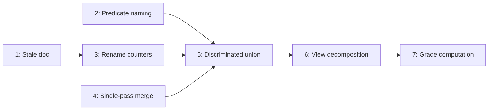

# Remediation System Refactoring

## Dependency graph




---

## 1. Fix stale `personHours` doc comment

**File:** [src/lib/remediation/issue-queue.ts](src/lib/remediation/issue-queue.ts) line 43

The comment `/** Person-hours affected by this issue (0 for task-level issues). */` is no longer accurate — noWorkContext items now carry real hours.

- Change to: `/** Person-hours affected by this issue. */`

---

## 2. Rename attribution predicates for self vs child semantics

**File:** [src/lib/attribution/engine.ts](src/lib/attribution/engine.ts) lines 34-41, 52-61

`taskHasQuantityContext` and `isMeasurable` are used at different hierarchy levels with different intent, but their names don't convey that. Introduce intent-revealing aliases:

- Add `canSelfOwnEntries` as an alias for `taskHasQuantityContext` (used in `findMeasurableOwner` self-check, line 53)
- Add `canReceiveChildEntries` as an alias for `isMeasurable` (used in `findMeasurableOwner` parent-check, line 60)
- Keep the originals exported (they are used in issue-queue.ts and tests) but use the new names inside `findMeasurableOwner` to make the asymmetry self-documenting
- Update the doc comments on `findMeasurableOwner` to reference the named concepts

---

## 3. Rename `getNeedsActionCounters` to `getQueueCounters`

**File:** [src/pages/settings/SettingsRemediationView.tsx](src/pages/settings/SettingsRemediationView.tsx) lines 31-40, 157-158

The function is now used for both `needsMeasurableOwner` and `noWorkContext` queues. The name `getNeedsActionCounters` is misleading.

- Rename to `getQueueCounters`
- Rename the interface from `NeedsActionCounters` to `QueueCounters`
- Update all call sites (lines 157-158)

---

## 4. Merge the two `attributedEntries` passes into one

**File:** [src/lib/remediation/issue-queue.ts](src/lib/remediation/issue-queue.ts) lines 100-164 and 235-247

`buildIssueQueues` iterates `attributedEntries` twice — once for the entry-level scan (needs/ambiguous classification) and once to build `entriesByOwner`. Merge into a single loop:

- Move the `entriesByOwner` map initialization before the entry scan loop (line 100)
- Inside the existing `for (const entry of attributedEntries)` loop, add the owner-indexing logic alongside the status branching:

```typescript
  for (const entry of attributedEntries) {
    // existing unattributed/ambiguous branching...

    // also index attributed entries by owner
    if (entry.status === 'attributed' && entry.ownerTaskId) {
      const list = entriesByOwner.get(entry.ownerTaskId);
      if (list) list.push(entry);
      else entriesByOwner.set(entry.ownerTaskId, [entry]);
    }
  }
  

```

- Remove the second loop (lines 237-247)

---

## 5. Introduce discriminated union for `IssueQueueItem`

**Files:**

- [src/lib/remediation/issue-queue.ts](src/lib/remediation/issue-queue.ts) — type definition + `buildIssueQueues`
- [src/pages/settings/SettingsRemediationView.tsx](src/pages/settings/SettingsRemediationView.tsx) — consumer
- [src/lib/remediation/worktype-classify.ts](src/lib/remediation/worktype-classify.ts) — `bulkClassifyToRecommendedWorkType` consumer

Split `IssueQueueItem` into a discriminated union on `category`:

```typescript
interface BaseIssueItem {
  taskId: string;
  scopeTaskId: string;
  entryId: string | null;
  entryIds: string[];
  entryCount: number;
  taskTitle: string;
  description: string;
  personHours: number;
}

interface NeedsMeasurableOwnerItem extends BaseIssueItem {
  category: 'needs_measurable_owner';
  suggestedTargetId: string | null;
  suggestedTargetTitle: string | null;
  recommendedWorkTypeId: string | null;
  conflictingRecommendedWorkTypeIds: string[];
  suggestionSource: 'engine' | 'nearest' | null;
}

interface AmbiguousOwnerItem extends BaseIssueItem {
  category: 'ambiguous_owner';
  suggestedTargetId: string | null;
  suggestedTargetTitle: string | null;
  recommendedWorkTypeId: string | null;
  conflictingRecommendedWorkTypeIds: string[];
  suggestionSource: 'engine' | 'nearest' | null;
}

interface NoWorkContextItem extends BaseIssueItem {
  category: 'no_work_context';
  missingFields: ('work type' | 'work unit' | 'work quantity')[];
}

type IssueQueueItem = NeedsMeasurableOwnerItem | AmbiguousOwnerItem | NoWorkContextItem;
```

- `NeedsMeasurableOwnerItem` and `AmbiguousOwnerItem` share suggestion/recommendation fields (could share an intermediate `EntryLevelIssueItem` base)
- `NoWorkContextItem` drops all suggestion fields and adds `missingFields` (structured data instead of string-concatenated `description`)
- Update `IssueQueueResult` to use the specific types for each queue array
- Update `buildIssueQueues` to construct the correct variant
- Update `renderIssueCard` in the view to narrow on `category` before accessing variant-specific fields
- Update `getQueueCounters` (renamed in step 3) to accept `BaseIssueItem[]` for the common fields, and provide a separate helper for suggestion-aware counters that only accepts entry-level items
- Update `bulkClassifyToRecommendedWorkType` parameter type (it only processes entry-level items)

---

## 6. Decompose `SettingsRemediationView` into smaller components

**File:** [src/pages/settings/SettingsRemediationView.tsx](src/pages/settings/SettingsRemediationView.tsx) (409 lines)

Extract three things:

- `**RemediationIssueCard` component** — extract `renderIssueCard` (lines 163-229) into a standalone component in `src/components/RemediationIssueCard.tsx`. Props: `item: IssueQueueItem`, `workTypeTitleById: Map`, `onAssign`, `onCreateAssign`, `onMoveEntry`. This eliminates the closure over `setAssignEntry`/`setReassignEntry` and makes the card testable in isolation.
- `**RemediationQueueSummary` component** — extract the queue summary section (lines 294-319) into `src/components/RemediationQueueSummary.tsx`. Props: `queues: IssueQueueResult`, `needsCounters`, `noWorkContextCounters`. Each row is identical in structure, so this collapses the repetition.
- `**useRemediationData` hook** — extract the loading/state management logic (lines 62-100, 106-155) into `src/lib/hooks/useRemediationData.ts`. Returns `{ isLoading, isApplying, queues, progress, error, lastUpdatedAt, actionMessage, load, applyQueue, handleClassificationApplied, handleManualReassigned }`. This leaves the view as a thin layout-and-wiring layer.

---

## 7. Factor noWorkContext hours into quality grade

**File:** [src/lib/remediation/data-quality.ts](src/lib/remediation/data-quality.ts) lines 51-73

Currently the grade is based solely on `attributionRate` (entry-level), which can be 100% while noWorkContext issues with real hours exist. Options:

- Add an `effectiveRate` that accounts for attributed-but-incomplete hours: `effectiveRate = (attributedHours - noWorkContextAffectedHours) / totalHours * 100`, clamped to 0. Use `effectiveRate` for grade classification instead of raw `attributionRate`.
- Alternatively, keep `attributionRate` for the grade but add a separate `completenessRate` field so the view can display both (e.g., "100% attributed, 85% complete").
- Add a test in [src/lib/remediation/data-quality.test.ts] (create if missing) that verifies the grade degrades when noWorkContext items carry significant hours.

