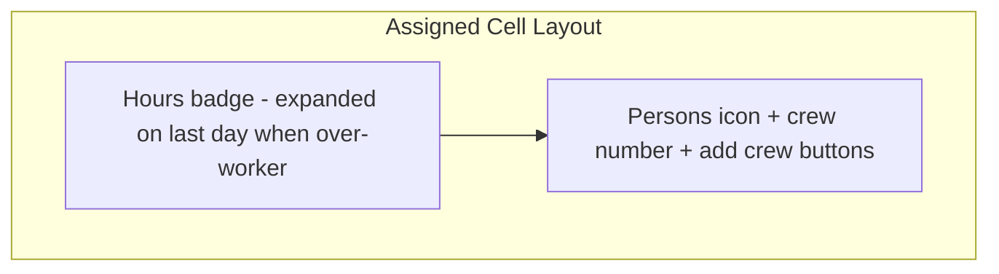

# Schedule Grid Cell Redesign

## Current State

- **Assigned cells**: hours badge (top) + CheckIcon or WarningIcon, `schedule-grid__cell--assigned` (light blue bg)
- **Crew editing**: separate expandable row "Crew/day" with per-day number inputs below each line item
- **Cell**: single `<button>` for assign toggle; no inline crew controls

## Target Design




1. **Icon**: Replace `CheckIcon` with `PeopleIcon` (persons/crew icon) with solid primary fill
2. **Styling**: No cell background, no border, no icon background — only the icon itself with solid primary color fill
3. **Crew inline**: Persons icon + crew number + add/remove buttons in each assigned cell (per-day crew editing)
4. **Hours badge**: Top of cell; on the item's last day when over-worker, show "Xh need" (work needed to meet target) instead of just "Xh work"

---

## Implementation

### 1. Cell Structure Change

**File:** [src/pages/planning/schedule/ScheduleGrid.tsx](src/pages/planning/schedule/ScheduleGrid.tsx)

Current cell is a single `<button>`. For assigned cells we need:

- Hours badge (top)
- PeopleIcon + crew count + stepper (inline)

**Approach**: Keep cell as a container. When assigned:

- Use a wrapper `div`/`button` for the assign toggle (so click outside crew controls unassigns)
- Inner crew stepper uses `onClick` `stopPropagation` so +/- does not bubble to unassign
- Or: cell remains `<button>`, but crew controls are `button` elements with `onClick={(e) => { e.stopPropagation(); ... }}` so they don't trigger the parent button's click

**Layout**:

```
[Assigned cell]
  ┌─────────────────┐
  │  48h need       │  <- badge: "48h" normally, "39.1h need" on last day when over-worker
  │  👥 6 [−][+]    │  <- PeopleIcon + crew value + StepperPill (compact)
  └─────────────────┘
```

### 2. Replace CheckIcon with PeopleIcon

- Import `PeopleIcon` from [src/components/icons.tsx](src/components/icons.tsx) (already exists)
- Use `PeopleIcon` instead of `CheckIcon` for assigned, non-over-worker cells
- Keep `WarningIcon` for over-worker (or optionally keep PeopleIcon + warning styling)

### 3. PeopleIcon with Solid Primary Fill

**File:** [src/styles/components/schedule-view.css](src/styles/components/schedule-view.css)

- **Remove** cell-level background and border for assigned state (no `.schedule-grid__cell--assigned` bg/border)
- Style `PeopleIcon` with solid primary fill only (no background wrapper):
  - `color: var(--color-primary)` so the SVG fills with primary color
  - No background on icon or cell

### 4. Inline Crew Controls

**File:** [src/pages/planning/schedule/ScheduleGrid.tsx](src/pages/planning/schedule/ScheduleGrid.tsx)

- **Remove** the expandable crew row (`schedule-grid__crew-row`) and the "Crew/day" toggle
- **Add** per-cell crew UI when `isAssigned && onCrewForDateChange`:
  - `PeopleIcon` + `{crewValue}` + compact `StepperPill` (or small +/- buttons)
  - `crewValue = item.crewByDate?.[day.date] ?? item.crew`
  - `onChange` calls `onCrewForDateChange(item.id, day.date, newValue)`
- Reuse [StepperPill](src/components/StepperPill.tsx) with `variant="with-value"`, `size="compact"`, min=0, max=reasonable limit (e.g. 99)
- Crew controls must `stopPropagation` on click so they don't trigger assign toggle
- Non-editable mode (`!onCrewForDateChange` or `readOnly`): show PeopleIcon + number only, no stepper

**State**: Remove `expandedCrewItemId` and crew toggle; crew is always visible per cell when assigned.

### 5. Hours Badge Expansion on Last Day

**File:** [src/pages/planning/schedule/ScheduleGrid.tsx](src/pages/planning/schedule/ScheduleGrid.tsx)

- Add helper `getNeedForDay(item, date, dayByDate, cap)`: returns `{ need }` when this is the item's last day AND the day has `isOverWorkerCapacity`, else `null`. Compute via sequential fill: when `remaining > 0.01` after processing this date, `need = work + remaining`.
- In the cell badge:
  - Normal: `{hours.toFixed(1)}h` (when `hours > 0`)
  - Last day + over-worker: `{need.toFixed(1)}h need` (or "Xh need · Yh cap" if we want to mirror header)
- Use `cap?.isOverWorkerCapacity` and check if `date === item.scheduledEnd` for "last day"

**Logic** (pseudo):

```ts
function getNeedForDay(item, date, assignedDates, dayByDate): number | null {
  if (assignedDates[assignedDates.length - 1] !== date) return null;
  // Sequential fill to get work and remaining
  let remaining = item.timeHours * item.crew;
  let workThisDay = 0;
  for (const d of assignedDates) { ... }
  if (remaining > 0.01) return workThisDay + remaining;
  return null;
}
```

### 6. CSS Updates

**File:** [src/styles/components/schedule-view.css](src/styles/components/schedule-view.css)

- `.schedule-grid__cell-icon` (PeopleIcon): `color: var(--color-primary)` for solid fill
- `.schedule-grid__cell-badge`: ensure it sits above; add variant `.schedule-grid__cell-badge--need` for "need" styling (e.g. warning color when over-worker)
- `.schedule-grid__cell-crew`: new class for the inline row (PeopleIcon + number + stepper), flex row, centered
- Cell min-height may need to increase to fit badge + crew row
- Remove or repurpose `.schedule-grid__crew-row`, `.schedule-grid__crew-cell-wrap`, `.schedule-grid__crew-input`, `.schedule-grid__crew-hint`, `.schedule-grid__crew-toggle` styles (crew row removed)

---

## Files to Modify


| File                                                             | Changes                                                                                     |
| ---------------------------------------------------------------- | ------------------------------------------------------------------------------------------- |
| [ScheduleGrid.tsx](src/pages/planning/schedule/ScheduleGrid.tsx) | PeopleIcon, inline crew with StepperPill, hours badge expansion, remove crew row and toggle |
| [schedule-view.css](src/styles/components/schedule-view.css)     | PeopleIcon solid primary fill (no bg), cell-crew layout, badge variants, remove crew row    |


---

## Key Decisions

- **Unassigned cells**: Remain minimal (empty, clickable to assign); no change to structure
- **Over-worker cells**: Show WarningIcon alongside PeopleIcon, or replace with warning-styled PeopleIcon; badge shows "Xh need"
- **Crew stepper**: Min 0 (allows "unassign" by setting 0? — probably no; keep min 1 or handle 0 as unassign in parent). Check existing crew semantics: `crewByDate` can be 0? Plan model uses `getEffectiveCrewForDate` which returns 0 for dates outside span; for dates in span, `crewByDate?.[date] ?? item.crew`. So we can have 0 crew for a day. Use min=0 for stepper.
- **Keyboard nav**: Ensure grid navigation still works; crew stepper buttons should not steal focus in a way that breaks arrow-key grid movement. May need `tabIndex={-1}` on stepper buttons if grid uses arrow keys.

---

## Accessibility

- `PeopleIcon` with `aria-hidden` or `aria-label="Assigned"`
- Crew stepper: `StepperPill` has `role="spinbutton"` and labels
- Unassign: click on cell background/empty area; add explicit "Unassign" affordance if needed (e.g. tooltip "Click to unassign")

