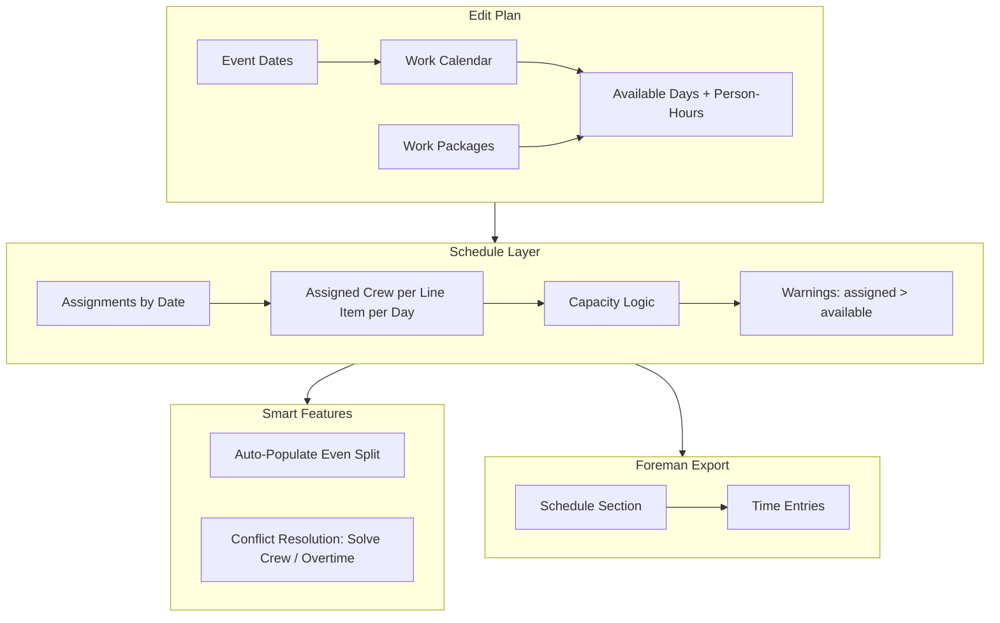

# Schedule Intelligence Feature Implementation Plan

## Context Summary

From our discussion:

- **Edit Plan** sets scope (event dates, work packages); should show available work days and total person-hours.
- **Schedule** is where planning happens: allocate work in time, crew per day, capacity-aware.
- **Crew model**: Available crew = headcount (limits person-hours/day). Assigned crew per line item per day = workers on each package. Sum of assigned ≤ available; else warning → resolve via more crew or overtime.
- **Variable crew**: Work packages need per-day assigned crew (not single `item.crew`).
- **Smart features**: Auto-populate (even split), conflict warning with "solve for crew" or "solve for overtime".
- **Foreman export**: Schedule section tied to time entries.

---

## Architecture Overview

---

## Phase 1: Edit Plan — Available Scope Visibility

**Goal:** Surface available work days and total person-hours in PlanEditor so planners see feasibility before scheduling.

**Changes:**

- [PlanEditor.tsx](src/pages/planning/PlanEditor.tsx): Compute `totalAvailablePersonHours` and `workDayCount` from `eventStartDate`, `eventEndDate`, `workCalendar`, `defaultCrewSize`.
- Reuse existing logic: `listDateRange` + `dayAvailablePersonHours` from [work-calendar.ts](src/lib/planning/scheduling/work-calendar.ts). **If `workCalendar` is empty** (user has not opened Schedule), call `generateDefaultWorkCalendar(eventStartDate, eventEndDate, defaultCrewSize)` — do not depend on Schedule having been opened. See Weakness 3.
- Add MetricCards or summary text: e.g. "X work days · Yh available" alongside existing "Work packages" and "Person-hours" (required).
- Optional: "Headroom" indicator when required < available (or deficit when required > available).

**Dependencies:** None. PlanEditor already has `PlanScheduleInputs`; work calendar may be empty until Schedule tab opened — handle both cases (derive from dates if calendar empty).

---

## Phase 2: Variable Crew per Line Item per Day

**Goal:** Replace single `item.crew` with per-day assigned crew so schedule reflects reality and capacity can enforce FTE logic.

### 2.1 Data Model

**PlanLineItem** ([plan-model.ts](src/lib/planning/plan-model.ts)):

- Keep `crew: number` as planning default/suggestion for new line items and unscheduled items.
- Add `crewByDate?: Record<string, number>` — date (YYYY-MM-DD) → assigned crew count.
- When assigned to dates: `crewByDate` populated. When unassigned: clear or derive from `crew`.
- Migration: Existing plans have `crew` only. Treat `crewByDate` as optional; fallback: spread `crew` evenly across assigned dates (current capacity behavior) until explicitly edited.

**Capacity logic** ([capacity.ts](src/lib/planning/scheduling/capacity.ts)):

- For each day: `assignedCrewTotal = sum(crewByDate[date] ?? derivedCrew) for all items on that day`.
- Add `assignedCrewTotal` and `availableCrew` to `DailyCapacity`.
- Add `isOverAssignedCrew: boolean` when `assignedCrewTotal > availableCrew`.
- `requiredPersonHours` per day: use `(crewByDate[date] ?? item.crew) * allocatedHoursPerDay` — allocation logic must change from even-split to respect per-day crew.

**Allocation model:** Total person-hours = `item.timeHours * item.crew`. Distribute proportionally to crew per day:

- `effectiveCrew(date) = crewByDate?.[date] ?? item.crew` when date in assigned span.
- `sumCrew = sum(effectiveCrew over assigned dates)`; if sumCrew === 0, use `item.crew * dates.length` (fallback).
- `personHoursPerDay[date] = totalPersonHours * (effectiveCrew(date) / sumCrew)`.
- See Weakness 1 for division-by-zero handling.

### 2.2 UI for Per-Day Crew Assignment

- [ScheduleGrid.tsx](src/pages/planning/schedule/ScheduleGrid.tsx): Row already shows line item. Add inline crew input or expandable row to set `crewByDate[date]` for assigned dates.
- [WorkCalendarEditor](src/pages/planning/schedule/WorkCalendarEditor.tsx): Already edits `day.crewSize` (available crew). No change needed.
- **Assignment integration:** Add `updateLineItemAssignment(plan, lineItemId, nextSpan)` in [plan-schedule-update.ts](src/lib/planning/scheduling/plan-schedule-update.ts) to: (a) set scheduledStart/End, (b) initialize `crewByDate[date] = item.crew` when span extends, (c) prune crewByDate when span shrinks or clears. Wire into ScheduleView `applyToggle` and `applyScheduleAmendment`. See Weakness 2 and 12.

### 2.3 Task / Release Plan

- [release-plan.ts](src/lib/planning/release-plan.ts), [work-package-core.ts](src/lib/work-package-core.ts): Tasks are created per line item. Task has `defaultWorkers` (from `item.crew` today).
- With variable crew: Option A — one task per line item, task gets aggregate/average crew. Option B — one task per line item per day (more granular).
- For foreman export, Option A is simpler initially: task retains `sourceLineItemId`; schedule section in export carries per-day crew from plan. Task's `defaultWorkers` could be `max(crewByDate)` or average.
- Defer complex task-per-day split; focus on plan model first. Task stays 1:1 with line item; export includes schedule (line item + crewByDate + dates).

### 2.4 DB / Schema

- Plans stored as JSON. `PlanLineItem` is part of plan document. Adding `crewByDate` is additive; no migration if optional.
- [plan-model.ts](src/lib/planning/plan-model.ts): Add `crewByDate?: Record<string, number>` to interface; ensure `createLineItem`, `duplicateLineItem`, `normalizeImportedLineItem` handle it.

---

## Phase 3: Capacity Intelligence & Warnings

**Goal:** Bidirectional math, correct capacity computation with variable crew, and visual warnings (no hard blocks).

### 3.1 Capacity Updates

- [capacity.ts](src/lib/planning/scheduling/capacity.ts): Full rewrite of allocation + aggregation to use `crewByDate`.
- Per day: `availableCrew`, `availablePersonHours`, `assignedCrewTotal`, `requiredPersonHours`, `isOverAllocated` (person-hours), `isOverAssignedCrew` (crew).
- [FeasibilityBar](src/pages/planning/schedule/FeasibilityBar.tsx): Show crew warning when any day has `isOverAssignedCrew`.
- [ScheduleGrid](src/pages/planning/schedule/ScheduleGrid.tsx): Extend over-allocation styling for crew (e.g. `schedule-grid__cell--over-crew`).

### 3.2 Bidirectional Math

- Line item: `quantity`, `crew`, `timeHours`, `productivityRate`. Invariant: `timeHours = quantity / (rate * crew)` (when crew fixed) or `personHours = quantity / rate`, `timeHours = personHours / crew`.
- With variable crew: `personHours` total = `quantity / rate`. Distribute across days via `crewByDate`; `timeHours` per day derives from that.
- When user edits rate in LineItemCard → recompute `timeHours`. When user edits `crewByDate` in Schedule → `requiredPersonHours` updates; rate unchanged.
- Key files: [LineItemCard.tsx](src/pages/planning/LineItemCard.tsx) (recompute handlers), [plan-suggestions.ts](src/lib/planning/plan-suggestions.ts), capacity aggregation.

---

## Phase 4: Smart Features

### 4.1 Auto-Populate (Even Split)

- New action in ScheduleView: "Auto-schedule" or "Suggest schedule".
- Algorithm: For unscheduled line items, distribute total required person-hours evenly across work days in event span. Assign each item to a contiguous span of days such that daily load is balanced.
- Greedy approach: Sort items by person-hours descending. For each, pick earliest span of days where adding that item's load keeps total per-day under available (or closest to balanced). Initialize `crewByDate` from `item.crew` spread evenly.
- Result: Populates `scheduledStart`, `scheduledEnd`, `crewByDate` for all items. User can adjust.

### 4.2 Conflict Resolution UI

- When `isOverAllocated` or `isOverAssignedCrew`: Show warning banner with actions.
- "Solve for crew": Suggest `crewSize` increases on over-loaded days (WorkCalendarEditor). Preview: "Add 2 crew on Mon, 1 on Tue".
- "Solve for overtime": For over-allocated day, `deficit = requiredPersonHours - availablePersonHours`. Extra hours needed: `extendHours = deficit / availableCrew`. Suggest `accessEnd` = current end + ceil(extendHours) to nearest 30 min. Preview: "Extend Mon to 20:00, Tue to 18:00". See Weakness 4.
- Both open WorkCalendarEditor (or a modal) with suggested values; user applies manually.
- No automatic writes; suggest and let user confirm.

### 4.3 Surface Intelligent Calculator in Schedule

- Entry point: Button or affordance in ScheduleView (e.g. per line item row or global).
- Opens calculator with context: selected date(s), line item quantity/rate, available person-hours from calendar.
- Scenarios: Target (template rate), Recommended (historical), Headroom (conservative).
- Time derived from schedule: e.g. "You're assigning to Mon–Wed; 3 days × 8h × 2 crew = 48h available."
- Implementation can extend or replace CalculatorSheet with schedule-aware variant; placement in ScheduleView.

---

## Phase 5: Foreman Export — Schedule Section

**Goal:** Schedule section in foreman/execution context tied to time entries.

### 5.1 Export Structure

- Plan package already includes `plan` with `lineItems` (scheduledStart, scheduledEnd), `workCalendar`.
- Add `crewByDate` to line items when present.
- Execution return ([ExecutionReturnPayload](src/lib/interop/data-transfer/contracts.ts)) has `lineItems` (ExecutionReturnLineItem), `tasks`, `timeEntries`.
- ExecutionReturnLineItem has `scheduledStart`, `scheduledEnd`. Add `crewByDate` or equivalent for per-day crew.
- New section: Explicit "schedule" structure in export: per day, per line item, assigned crew and person-hours. Ties `lineItemId` → tasks (via sourceLineItemId) → time entries (via taskId).

### 5.2 Foreman View / Import

- On executor device, imported plan shows work packages. Field plan view ([FieldPlanOverlay](src/pages/field-plan/FieldPlanOverlay.tsx)) shows line items.
- Add schedule section: By date, list line items assigned, crew per item, and linked tasks + time entries.
- Enables foreman to see: "Mon: Carpet (4 crew, 32h planned) — Task X: 6h logged, Task Y: 4h logged."
- Implementation: New ScheduleSection component or expanded FieldPlanOverlay; query tasks by sourceLineItemId, entries by taskId, group by date.

---

## Implementation Order

| Phase | Description                        | Dependencies                      |
| ----- | ---------------------------------- | --------------------------------- |
| 1     | Edit Plan scope visibility         | None                              |
| 2     | Variable crew model + capacity     | None                              |
| 3     | Capacity intelligence + warnings   | Phase 2                           |
| 4a    | Auto-populate                      | Phase 2, 3                        |
| 4b    | Conflict resolution UI             | Phase 3                           |
| 4c    | Intelligent calculator in Schedule | Phase 2 (optional dependency)     |
| 5     | Foreman schedule section           | Phase 2, execution return payload |

**Test coverage** (per phase): Phase 2 — capacity unit tests (crewByDate, fallbacks). Phase 3 — isOverAssignedCrew, bidirectional math. Phase 4 — auto-populate algorithm fixtures. See Weakness 11.

---

## Dependencies & Risks

- **Task/LineItem consolidation** ([task_lineitem_consolidation.plan.md](.cursor/plans/task_lineitem_consolidation.plan.md)): Renames `defaultWorkers` → `crew` on Task. Variable crew adds `crewByDate` to PlanLineItem; Task may carry max/avg crew. Coordinate so Task schema changes don't conflict.
- **Plan package handoff** ([plan_package_export_handoff_aeae63fa.plan.md](.cursor/plans/plan_package_export_handoff_aeae63fa.plan.md)): Export already includes plan. Extend to include `crewByDate`; ensure import normalizes it.
- **Backward compatibility**: Plans without `crewByDate` must work — fallback to current even-split using `item.crew`.

---

## Weaknesses of Proposed Plan & Suggested Updates

### 1. Allocation Model — Division by Zero & Fallback Gaps

**Weakness:** Option B formula `personHoursPerDay[date] = (crewByDate[date] ?? item.crew) * (totalPersonHours / sum(crewByDate))` fails when:

- `crewByDate` is empty (newly assigned item): `sum(crewByDate)` = 0.
- `crewByDate` is partial (user edited some days only).

**Update:** Add explicit fallback: when `crewByDate` is empty or sum is 0, use `item.crew` for every assigned date (current even-split behavior). Define helper `getEffectiveCrewForDate(item, date): number` returning `crewByDate?.[date] ?? item.crew` when date is in assigned span, else 0. For allocation, `sumCrew = sum(getEffectiveCrewForDate over assigned dates)`; if sumCrew === 0, use `item.crew * dates.length`.

---

### 2. Assignment Flow — crewByDate Not Wired

**Weakness:** Plan says "when user assigns: initialize crewByDate" but does not specify where. [ScheduleView.tsx](src/pages/planning/ScheduleView.tsx) calls `toggleAssignmentDate` and `updatePlanLineItem` with only `nextSpan`. [assignment.ts](src/lib/planning/scheduling/assignment.ts) returns `ScheduleSpan` only. There is no hook to initialize or prune `crewByDate` when span changes.

**Update:** Add `updateLineItemAssignment(plan, lineItemId, nextSpan)` in a new helper (e.g. `plan-schedule-update.ts`) that:

- Sets `scheduledStart`, `scheduledEnd` from nextSpan.
- When span extends (new date added): set `crewByDate[date] = item.crew` for new dates.
- When span shrinks or clears: delete `crewByDate[date]` for dates no longer in span.
- Use this in ScheduleView's `applyToggle` instead of raw `updatePlanLineItem`. Alternatively, extend `applyScheduleAmendment` to accept a `crewByDate` updater.

---

### 3. Work Calendar May Be Empty in Edit Plan

**Weakness:** Phase 1 says "derive from dates if calendar empty." But `reconcileWorkCalendar` is called when event dates change; it runs in ScheduleView's useEffect and in `setPlanEventDate`. In PlanEditor, user can set dates without ever opening Schedule — `workCalendar` may stay `[]` until Schedule tab is opened.

**Update:** In Phase 1, compute available scope using `generateDefaultWorkCalendar(eventStartDate, eventEndDate, defaultCrewSize)` from [work-calendar.ts](src/lib/planning/scheduling/work-calendar.ts) when `workCalendar.length === 0`. PlanEditor should not depend on Schedule having been opened.

---

### 4. Hours per Worker per Day — Implicit Constraint

**Weakness:** Plan does not state that allocating more person-hours to a day than `accessHours × assignedCrew` implies overtime. If item has 4 crew on Mon and we allocate 40 person-hours to Mon, that's 10h/worker — exceeds 8h unless overtime. The capacity check (required vs available) catches this, but the "solve for overtime" logic must account for it.

**Update:** In Phase 4.2, define: for an over-allocated day, `deficit = requiredPersonHours - availablePersonHours`. "Solve for overtime": `extendHours = deficit / availableCrew` (extra hours needed). Suggest `accessEnd` = current end + ceil(extendHours) to nearest 30 min. Document this in the plan.

---

### 5. workPackageCoreToCreateTaskInput — crew Source Undefined

**Weakness:** [work-package-core.ts](src/lib/work-package-core.ts) `lineItemToWorkPackageCore` uses `item.crew`. With variable crew, Task needs a single crew value. Plan says "max(crewByDate) or average" but `workPackageCoreToCreateTaskInput` is not updated. Task creation happens at release; if plan has crewByDate, we need a policy.

**Update:** In Phase 2.3, specify: add `lineItemToEffectiveCrew(item): number` returning `Math.max(...Object.values(item.crewByDate ?? {}), item.crew)` when crewByDate exists, else `item.crew`. Use this in `lineItemToWorkPackageCore` for the `crew` field. Add to plan.

---

### 6. Assignment Middle-Day Removal — crewByDate Orphaned

**Weakness:** [assignment.ts](src/lib/planning/scheduling/assignment.ts) `toggleAssignmentDate`: when user removes a day from the middle, it returns `{ scheduledStart: null, scheduledEnd: null }` — full unschedule. So we clear the whole span. But if we ever support split spans (we don't today), crewByDate for removed dates would be orphaned. For now, clearing span clears all — but we must prune crewByDate when span becomes null.

**Update:** In the `updateLineItemAssignment` helper, when `nextSpan.scheduledStart === null`, set `crewByDate = undefined` or `{}`.

---

### 7. ExecutionReturnLineItem — crewByDate Schema

**Weakness:** [ExecutionReturnLineItem](src/lib/interop/data-transfer/contracts.ts) does not have `crewByDate`. [execution-return.ts](src/lib/interop/data-transfer/execution-return.ts) builds lineItems from plan items but only maps a fixed set of fields. Adding crewByDate requires contract change and import/export normalization.

**Update:** In Phase 5.1, add `crewByDate?: Record<string, number>` to ExecutionReturnLineItem. In `buildExecutionReturnEnvelope`, include `crewByDate: item.crewByDate ?? undefined`. In execution-return-import, ensure normalization preserves it. Bump schema compat if needed.

---

### 8. plan-package Import — crewByDate Normalization

**Weakness:** [plan-package.ts](src/lib/interop/data-transfer/plan-package.ts) `normalizeImportedLineItem` does not handle `crewByDate`. Imported plans may have it; we must normalize (trim invalid dates, coerce values).

**Update:** In Phase 2.4, extend `normalizeImportedLineItem` to optionally include `crewByDate` with validation: only keep dates in YYYY-MM-DD format, values as non-negative integers.

---

### 9. Auto-Populate — Work Days vs Calendar Days

**Weakness:** Phase 4.1 says "distribute across work days in event span." Algorithm must filter to `day.isWorkDay === true`. Otherwise we might assign to weekends/off-days. Greedy must respect work calendar.

**Update:** In Phase 4.1, specify: `workDays = calendar.filter(d => d.isWorkDay)`. Only assign to work days. Initialize crewByDate only for work days in assigned span.

---

### 10. Phase Ordering — Foreman View Depends on Schedule Section

**Weakness:** Phase 5.2 (Foreman view schedule section) requires tasks and time entries. But the "schedule section tied to time entries" is the foreman's view of planned vs actual. The plan package export (handoff to foreman) already includes the plan. The execution return (foreman → planner) includes time entries. The gap: does the foreman device need a new ScheduleSection UI that shows plan schedule + time entries? Plan says "Add schedule section" — is that on planner import of execution return, or on foreman device?

**Update:** Clarify Phase 5 scope:

- 5a: Extend plan package and execution return payloads with crewByDate / schedule structure (planner → foreman, foreman → planner).
- 5b: Foreman device UI — new ScheduleSection in FieldPlanOverlay that groups line items by date, shows crew, links to tasks and their time entries. Foreman sees planned schedule + actuals.
- 5c: Planner device — when importing execution return, the existing flow may not need a schedule section (we have line items with actuals). Optionally add a "Schedule vs Actual" view for wrap-up. Defer 5c if out of scope.

---

### 11. Test Coverage Gaps

**Weakness:** Plan does not mention tests. Capacity logic, allocation math, crewByDate initialization, and fallbacks are subtle.

**Update:** Add Phase 0 or per-phase test requirements:

- Phase 2: Unit tests for capacity with crewByDate (even split, variable crew, empty fallback).
- Phase 3: Tests for isOverAssignedCrew, bidirectional recompute.
- Phase 4: Auto-populate algorithm tests (fixture with N items, M work days).

---

### 12. amend schedule — crewByDate and Amendments

**Weakness:** [amendments.ts](src/lib/planning/scheduling/amendments.ts) handles schedule changes when plan is active (baseline). It updates `scheduledStart`, `scheduledEnd`, `originalScheduledStart`, `originalScheduledEnd`. It does not touch crewByDate. When amending, do we preserve crewByDate? If user amends span (e.g. extend by a day), we need to initialize crewByDate for the new day. If we shrink span, prune crewByDate.

**Update:** Extend `applyScheduleAmendment` to also update crewByDate when span changes — same logic as updateLineItemAssignment. Ensure amendment flow goes through the unified updater.

---

## Revised Open Questions

1. **Task granularity**: One task per line item vs one per line item per day. Recommendation: Start 1:1; schedule section carries per-day detail.
2. **Auto-populate strategy**: Balance load vs. minimize span? Recommend: minimize total days first, then balance.
3. **Overtime UX**: WorkCalendarEditor has access times. Add "Extend by 2h" quick action, or keep manual time picker only?
4. **Phase 5 scope**: Is the ScheduleSection UI for foreman device, planner device, or both? Clarify before implementation.

