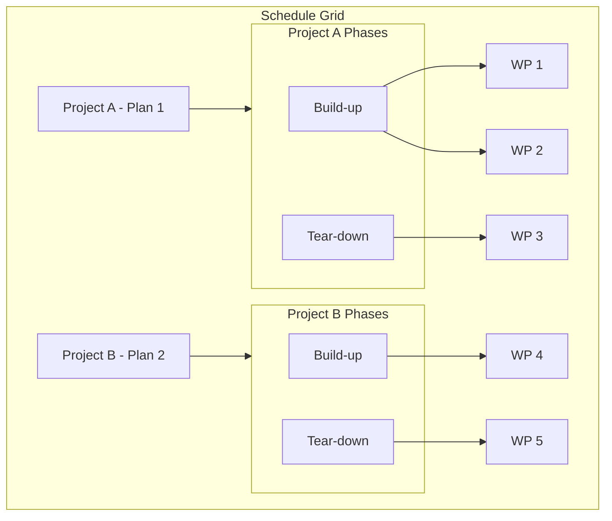

# Shared Schedule Grid Implementation Plan

## Goal

All work packages in a single schedule grid with collapsible hierarchy: **Project (Plan) → Build Phase → Work Packages**, and shared crew capacity across projects.

---

## Hierarchy Structure




---

## Phase 1: Data Aggregation and Shared Capacity

### 1.1 Shared Schedule Input Types

Add a new module [src/lib/planning/scheduling/shared-schedule-types.ts](src/lib/planning/scheduling/shared-schedule-types.ts):

```ts
// Item with plan context for phase dates and persistence
export interface ScheduledLineItem {
  item: PlanLineItem;
  plan: Plan;  // for getPhaseSpan, projectId, save targeting
}

export interface SharedScheduleInput {
  calendar: WorkCalendarDay[];
  defaultCrewSize: number | null;
  lineItems: ScheduledLineItem[];
}
```

### 1.2 Generalize Capacity Module

In [src/lib/planning/scheduling/capacity.ts](src/lib/planning/scheduling/capacity.ts):

- Add `computeSharedCapacitySummary(input: SharedScheduleInput): CapacitySummary` that:
  - Uses `input.calendar` and `input.defaultCrewSize` for `buildDayMap` instead of `plan.workCalendar`
  - Iterates over `input.lineItems` (each `{ item, plan }`), applying sequential fill and over-allocation logic
  - Phase constraints: use `getPhaseSpan(plan, item.buildPhase)` per item when checking valid date ranges
- Keep existing `computeCapacitySummary(plan: Plan)` for single-plan ScheduleView (reuse via thin wrapper if desired)

---

## Phase 2: Hierarchy Aggregation Logic

### 2.1 Build Hierarchy Structure

Add [src/lib/planning/scheduling/schedule-hierarchy.ts](src/lib/planning/scheduling/schedule-hierarchy.ts):

```ts
export interface ScheduleHierarchyNode {
  type: 'project' | 'phase' | 'item';
  planId: string;
  plan?: Plan;
  phase?: BuildPhase;
  phaseLabel?: string;
  item?: PlanLineItem;
  children?: ScheduleHierarchyNode[];
}
```

- `buildScheduleHierarchy(plans: Plan[]): ScheduleHierarchyNode[]` — group by plan, then by build phase within each plan, then by line items within phase
- Order: projects by plan title/ID; phases by `BUILD_PHASES` order; items within phase preserve source order
- Flatten for grid row iteration: project header → phase header → item rows (when expanded)

---

## Phase 3: Extend ScheduleGrid for Hierarchy

### 3.1 New Props and Modes

Modify [src/pages/planning/schedule/ScheduleGrid.tsx](src/pages/planning/schedule/ScheduleGrid.tsx):

- Add **optional** `mode: 'single' | 'shared'`
- When `mode === 'shared'`:
  - Accept `hierarchyNodes: ScheduleHierarchyNode[]` and `phaseDatesByPlanId: Map<string, PhaseDateValues>`
  - Collapse state: `collapsedProjects: Set<string>`, `collapsedPhases: Set<string>` (key = `planId:phase`)
- When `mode === 'single'` (default): preserve current `lineItems` + `phaseDates` API for backward compatibility

### 3.2 Hierarchy Rendering

- For shared mode, render:
  1. **Project row** — collapsible header spanning work-package column; day columns show aggregate utilization for that project (or leave blank)
  2. **Phase row** — collapsible sub-header under project; day columns show phase aggregate
  3. **Item row** — same as current `renderRow(item)`; use `phaseDatesByPlanId.get(planId)` for `getPhaseRange`
- Collapse: clicking project collapses all phases and items; clicking phase collapses only that phase’s items

### 3.3 Toggle Handlers

- `onToggleAssignment` must receive `(item, date, plan, cellElement?)` so the parent can route to the correct plan’s save
- `onCrewForDateChange` same: `(lineItemId, date, crew, planId)` to target the correct plan

---

## Phase 4: Shared Schedule View and Workspace Integration

### 4.1 Shared Schedule View

Create [src/pages/planning/SharedScheduleView.tsx](src/pages/planning/SharedScheduleView.tsx):

- **Plan selection**: Multi-select from Active plans (draft + active). Store `selectedPlanIds: Set<string>`
- **Shared calendar derivation**:
  - Option A (MVP): Union of date ranges from selected plans; merge work calendars (day is work day if any plan has it; `crewSize` = max of plan defaults for that day, or configurable)
  - Option B (later): Explicit "Crew pool" config — user sets date range and crew per day
  - Start with Option A
- **Capacity**: Call `computeSharedCapacitySummary` with merged calendar and `ScheduledLineItem[]` from selected plans
- **Hierarchy**: Call `buildScheduleHierarchy(selectedPlans)`
- **Save**: On assignment/crew change, `onSavePlan(plan)` for the affected plan
- Reuse: `FeasibilityBar`, `ConflictResolutionBanner`, `WorkCalendarEditor` (configure merged calendar), `PlanScheduleInputs` (for shared range/crew) or simplified shared inputs

### 4.2 Shared Calendar Merge

Add [src/lib/planning/scheduling/merge-work-calendars.ts](src/lib/planning/scheduling/merge-work-calendars.ts):

- `mergeWorkCalendars(plans: Plan[], defaultCrewSize?: number | null): WorkCalendarDay[]`
- Union date range: `min(eventStartDate, buildUpStartDate)` to `max(eventEndDate, tearDownEndDate)` across plans
- Per day: `isWorkDay = plans.some(p => dayIsWorkDay(p, date))`; `crewSize = max(plan crew for that day)` or passed `defaultCrewSize`
- Handle plans with empty `workCalendar` by deriving from `eventStartDate/eventEndDate` + `generateDefaultWorkCalendar`

### 4.3 Workspace Tab Integration

In [src/pages/planning/workspace/PlanningWorkspaceShell.tsx](src/pages/planning/workspace/PlanningWorkspaceShell.tsx):

- Add `WorkspaceTab = 'shared-schedule'` and tab button "Shared Schedule"
- When `activeTab === 'shared-schedule'`: render `SharedScheduleView` instead of single-plan `ScheduleView`
- `SharedScheduleView` does not require `activePlan`; it uses `selectedPlanIds` from local state
- Persist `selectedPlanIds` in sessionStorage for session restore

In [src/pages/planning/hooks/usePlanningWorkspaceState.ts](src/pages/planning/hooks/usePlanningWorkspaceState.ts):

- Add `selectedPlanIdsForSharedSchedule: Set<string>` and `setSelectedPlanIdsForSharedSchedule` (or equivalent) for the shared schedule multi-select
- Include in session persist/restore

---

## Phase 5: Plan Selector and Persistence

### 5.1 Plan Selector UI

In `SharedScheduleView` (or a sub-component):

- Checkboxes / multi-select for plans in Active zone (draft + active)
- Show plan title + project name (from `projects` by `plan.projectId`)
- Minimum 1 plan selected; disable "Shared Schedule" tab or show empty state if none selected

### 5.2 Assignment Persistence

- `ScheduleView` currently uses `usePlanEditorState` and `onSavePlan`. For shared:
  - `SharedScheduleView` receives `plans`, `onSavePlan`, `projects`
  - On `onToggleAssignment` or `onCrewForDateChange`: identify plan by `item` (via hierarchy’s `planId`), apply update with `updateLineItemAssignment` / `updateLineItemCrewForDate`, then `onSavePlan(updatedPlan)`
  - Amendment flow for active plans: reuse `AmendmentPopover` when changing an active plan’s items

---

## Phase 6: Auto-Schedule (Optional / Follow-up)

- Extend [src/lib/planning/scheduling/auto-schedule.ts](src/lib/planning/scheduling/auto-schedule.ts) to accept `SharedScheduleInput`
- Phase windows: `getPhaseSpan(item.plan, item.buildPhase)` per item
- Update `dayLoadMap` across all items
- Return: map of `planId → updated Plan` so caller can save each affected plan

---

## File Summary


| Action | Path                                                                                                          |
| ------ | ------------------------------------------------------------------------------------------------------------- |
| Create | `src/lib/planning/scheduling/shared-schedule-types.ts`                                                        |
| Create | `src/lib/planning/scheduling/schedule-hierarchy.ts`                                                           |
| Create | `src/lib/planning/scheduling/merge-work-calendars.ts`                                                         |
| Modify | `src/lib/planning/scheduling/capacity.ts` — add `computeSharedCapacitySummary`                                |
| Modify | `src/pages/planning/schedule/ScheduleGrid.tsx` — hierarchy mode, collapse state, per-plan phase dates         |
| Create | `src/pages/planning/SharedScheduleView.tsx`                                                                   |
| Modify | `src/pages/planning/workspace/PlanningWorkspaceShell.tsx` — add Shared Schedule tab                           |
| Modify | `src/pages/planning/hooks/usePlanningWorkspaceState.ts` — `selectedPlanIdsForSharedSchedule`, session persist |


---

## Dependency Order

1. `shared-schedule-types.ts` and `merge-work-calendars.ts` (no deps)
2. `capacity.ts` generalization
3. `schedule-hierarchy.ts`
4. `ScheduleGrid` hierarchy support
5. `SharedScheduleView` + workspace integration
6. Auto-schedule (optional)

