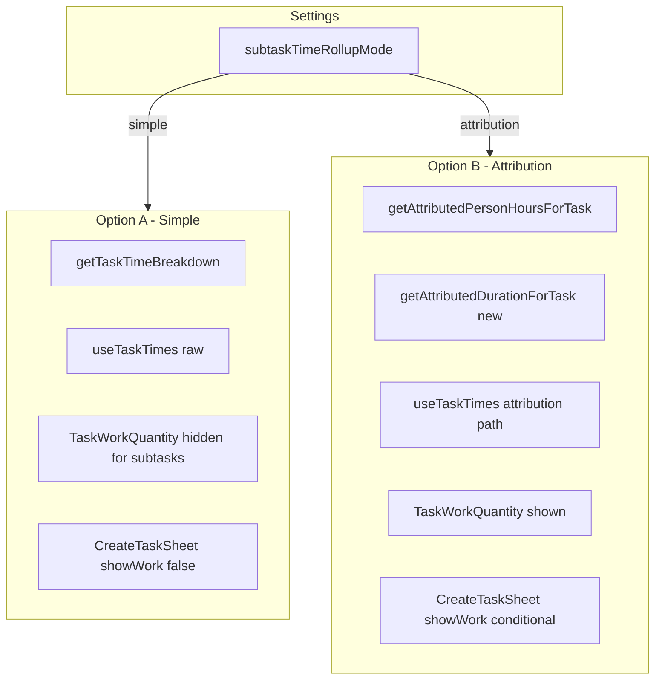

# Subtask Time Rollup Toggle (Option A/B)

## Goal

Add an advanced setting to toggle between:

- **Option A (simple):** Raw time rollup (direct + all subtasks). No work UI for subtasks.
- **Option B (attribution):** Attribution-based time rollup. Subtasks can have their own work. Time/productivity exclude subtask time when the subtask is measurable.

## Architecture

## Implementation Plan

### 1. Add Setting Store

- **File:** [src/lib/stores/subtask-time-rollup-settings.ts](src/lib/stores/subtask-time-rollup-settings.ts) (new)
- **API:** `getSubtaskTimeRollupMode(): 'simple' | 'attribution'`, `setSubtaskTimeRollupMode(mode)`
- **Storage:** localStorage key `subtaskTimeRollupMode`
- **Default:** `'simple'` (Option A)
- Follow pattern from [src/lib/stores/kpi-settings.ts](src/lib/stores/kpi-settings.ts)

### 2. Add durationMs to AttributedEntry

- **File:** [src/lib/types.ts](src/lib/types.ts)
- Add `durationMs: number` to `AttributedEntry` interface (clock duration of the entry)
- **File:** [src/lib/attribution/engine.ts](src/lib/attribution/engine.ts)
- In `attributeEntry`, compute `durationMs = durationMs(entry.startUtc, entry.endUtc)` and include in returned object
- Update all `AttributedEntry` constructions in the engine (several return sites)

### 3. Add getAttributedDurationForTask

- **File:** [src/lib/attributed-person-hours.ts](src/lib/attributed-person-hours.ts) or new [src/lib/attributed-duration.ts](src/lib/attributed-duration.ts)
- New function: `getAttributedDurationForTask(taskId, subtaskIds, allTasks, activeTimers): Promise<number>`
- Logic: Same as getAttributedPersonHoursForTask but sum `entry.durationMs` (not personHours) for entries attributed to taskId. For active timers, add `elapsedMs` when timer attributes to task. Return total duration in ms.
- Reuse `buildAttributedRollup`, `sumAttributedDurationMs` (new util in attribution/utils.ts), `addActiveTimerContribution` (needs to return clock-time contribution - currently returns personMs; we need elapsed only for duration, or a variant that returns duration contribution)
- **Note:** `addActiveTimerContribution` returns person-ms. For duration we need elapsed ms per timer. Add `addActiveTimerDurationContribution(taskId, timerTaskIds, activeTimers, allTasks): number` that returns elapsed ms (not × workers) for timers attributing to taskId.

### 4. Attribution Utils

- **File:** [src/lib/attribution/utils.ts](src/lib/attribution/utils.ts)
- Add `sumAttributedDurationMs(entriesByTask, taskId): number` — sum durationMs from entries attributed to taskId
- Add `addActiveTimerDurationContribution(...): number` — for each timer on timerTaskIds whose measurable owner is taskId, add `elapsedMs(timer.startUtc)` (clock time, not person-time)

### 5. Extend getTaskTimeBreakdown

- **File:** [src/lib/time-aggregation.ts](src/lib/time-aggregation.ts)
- Keep current implementation as-is (no signature change). Callers will choose which function to call based on setting.
- **Alternative:** Add optional `attributionAware?: boolean` param. When true, delegate to attribution-based logic. Simpler for TaskTimeTracking but mixes concerns. Prefer: TaskTimeTracking and useTaskTimes read the setting and call the appropriate function.

### 6. Extend useTaskTimes

- **File:** [src/lib/hooks/useTaskTimes.ts](src/lib/hooks/useTaskTimes.ts)
- Read `getSubtaskTimeRollupMode()` at start of effect
- **Simple mode:** Current logic (raw rollup) — no change
- **Attribution mode:** Fetch entries, build task map from tasks, run `attributeEntries` (need to ensure it returns durationMs — we add it in step 2). For each task, sum `durationMs` of entries where `ownerTaskId === task.id`. Add active timer elapsed for timers that attribute to each task. Build result Map.
- Add `tasks` to the flow (we already have it as param). Need to get all tasks that could be owners — we have tasks from param. For entries on tasks not in our list (orphan entries), attribution may set ownerTaskId to a task in our list or null. We only need times for tasks we're passed. So we run attribution on all entries with taskMap = all tasks. Then for each task in our task list, sum duration where ownerTaskId === task.id.
- **Timer handling:** In attribution mode, for each active timer, find measurable owner. Add elapsed to that owner's total. Use `findMeasurableOwner` from engine.

### 7. Extend useTaskTimeBreakdown / TaskTimeTracking

- **File:** [src/lib/hooks/useTaskTimeBreakdown.ts](src/lib/hooks/useTaskTimeBreakdown.ts)
- When mode is 'attribution', we need attribution-based breakdown. Current `getTaskTimeBreakdown` returns TimeBreakdown (totalMs, directMs, subtaskMs, etc.). For attribution mode, we need an equivalent.
- **Option:** Add `getTaskTimeBreakdownAttribution` in time-aggregation or attributed-person-hours that returns a TimeBreakdown-like object where totalMs = attributed duration. directMs and subtaskMs could be "attributed to parent from direct" vs "attributed to parent from subtasks" — or we simplify to just totalMs for budget.
- **Simpler approach:** Add `getAttributedDurationForTask` and use it in TaskTimeTracking when mode is attribution. TaskTimeTracking currently needs: `breakdown.totalMs` for budget and display. So we could have `useTaskTimeBreakdown` accept a mode and when attribution, call getAttributedDurationForTask and return a synthetic breakdown with totalMs = that value, directMs/subtaskMs as best-effort split or zeros. The budget and badge only need totalMs.
- **Recommendation:** Create `getTaskTimeBreakdownAttribution(taskId, subtaskIds, allTasks, activeTimers)` that returns `Promise<TimeBreakdown>` with totalMs = attributed duration. Compute directMs as sum of duration of entries on taskId attributed to taskId; subtaskMs as sum of duration of entries on subtaskIds attributed to taskId. This gives a meaningful breakdown for the "direct vs from subtasks" display.

### 8. TaskProductivity

- **File:** [src/components/TaskProductivity.tsx](src/components/TaskProductivity.tsx)
- Read `getSubtaskTimeRollupMode()` at render
- **Simple mode:** Use `useTaskTimeBreakdown`, compute actual rate from `breakdown.totalPersonMs` (raw)
- **Attribution mode:** Use `useAttributedPersonHours` (current behavior)
- Conditional hook calls are invalid in React — use a wrapper: always call both hooks, or use a single hook that returns both and pick based on mode. Cleaner: create `useProductivityDenominator(taskId, subtaskIds, ...)` that internally reads the setting and returns either attributedPersonMs or totalPersonMs. Or: have TaskProductivity call a hook that takes the mode and returns the right denominator. Simplest: pass mode to useAttributedPersonHours and when simple, have that hook call getTaskTimeBreakdown and return totalPersonMs instead. So useAttributedPersonHours becomes useProductivityTime(taskId, subtaskIds, ..., mode) and returns the appropriate person-ms.

### 9. TaskTimeTracking

- **File:** [src/components/TaskTimeTracking.tsx](src/components/TaskTimeTracking.tsx)
- Read `getSubtaskTimeRollupMode()` 
- **Simple mode:** Use current `useTaskTimeBreakdown` (unchanged)
- **Attribution mode:** Use a new hook `useTaskTimeBreakdownAttribution` or extend `useTaskTimeBreakdown` to accept mode and fetch accordingly. When attribution, the breakdown's totalMs comes from attributed duration.
- **Recommendation:** Extend `useTaskTimeBreakdown` to read the setting and call either getTaskTimeBreakdown (simple) or getTaskTimeBreakdownAttribution (attribution). Both return TimeBreakdown.

### 10. TaskWorkQuantity

- **File:** [src/components/TaskWorkQuantity.tsx](src/components/TaskWorkQuantity.tsx)
- When `task.parentId != null` and mode is 'simple', return null (hide section)
- When mode is 'attribution', show as today (subtasks can have work)

### 11. CreateTaskSheet (subtask creation)

- **File:** [src/components/TaskDetailSubtasks.tsx](src/components/TaskDetailSubtasks.tsx)
- Currently passes `showWork={false}` for subtasks. Change to: `showWork={getSubtaskTimeRollupMode() === 'attribution'}`
- So when simple, subtasks get no work. When attribution, they can.

### 12. Settings UI

- **File:** [src/pages/SettingsView.tsx](src/pages/SettingsView.tsx)
- Add new section "Advanced" (or add to Feature Flags section)
- Add toggle: "Subtask work and attribution"
  - Label: "Allow subtasks to have work"
  - Helper: "When on: subtasks can have their own work; time and productivity use attribution (subtask time counts toward parent only when the subtask has no work). When off: subtasks are phases only; all time rolls to the parent."
  - Checked = attribution mode, unchecked = simple mode
- Use `getSubtaskTimeRollupMode` and `setSubtaskTimeRollupMode`
- Settings must trigger re-renders when changed. Components read the setting at render. Since it's localStorage, we need a way to invalidate. Options: (a) use a React state that components subscribe to via a hook, e.g. `useSubtaskTimeRollupMode()` that returns [mode, setMode] and triggers re-render on change; (b) use a simple event/pubsub. The kpi-settings and attribution-settings are read at call time — they don't cause re-renders when changed. For the toggle to take effect immediately, we need components to re-run when the setting changes. Easiest: create a hook `useSubtaskTimeRollupMode()` that wraps the getter/setter and uses useState — when setter is called, it updates localStorage and setState, causing subscribers to re-render. But that requires a single source of truth. Simpler: add a `useEffect` in SettingsView that listens to... we don't have a global event. We could add a custom event: `window.dispatchEvent(new CustomEvent('subtaskRollupModeChanged'))` when the toggle fires, and components that use the mode could subscribe. Or we use a tiny Zustand slice or similar. The codebase uses React state. The simplest is: a module-level `listeners` set and a hook that subscribes. When setSubtaskTimeRollupMode is called, we notify listeners to forceUpdate. Or: use a simple store like the timer store. Check if there's a pattern — the parallel timer setting uses `getParallelSubtaskTimers` and `setParallelSubtaskTimers` from timer-store. When the toggle changes, setParallelSubtaskTimers updates the store and presumably triggers re-renders. Let me check — the timer store is likely a Zustand store. So when we call setParallelSubtaskTimers, it updates state and any component using that state re-renders. For our setting, we could add it to an existing store or create a minimal one. The feature flags use getFeatureFlags/setFeatureFlag and the SettingsView keeps featureFlags in local state — when you toggle, it calls setFeatureFlag and setFeatureFlags to update local state. Other components that care about feature flags would need to read getFeatureFlag() — but that doesn't trigger re-renders. So when you navigate away from Settings and come back, the toggle reflects the stored value. When you go to TaskDetail, it would read the current value. The "stale" issue: if you toggle while on TaskDetail, TaskDetail wouldn't re-render. For a settings toggle, that's often acceptable — you'd need to navigate away and back. To get instant updates, we'd need a store. Add a minimal store: `useSubtaskRollupStore` with mode state. setSubtaskTimeRollupMode updates both localStorage and the store. Components use the store. When they're not mounted, no issue. When Settings changes the toggle, store updates, all consumers re-render. Create a small store for this.

### 13. Store for React Reactivity

- **File:** [src/lib/stores/subtask-time-rollup-settings.ts](src/lib/stores/subtask-time-rollup-settings.ts)
- Export both the localStorage getter/setter AND a hook `useSubtaskTimeRollupMode(): ['simple'|'attribution', (mode) => void]` that uses useState + useEffect to sync with localStorage. On mount, read from localStorage. When setter is called, write to localStorage and setState. Other components need to re-render — if we use a simple React pattern, each component would need to call the hook. That works: TaskProductivity, TaskTimeTracking, useTaskTimes, TaskWorkQuantity, TaskDetailSubtasks all call `useSubtaskTimeRollupMode()` and branch on the mode. When Settings changes the mode (and calls the setter), those components will... only re-render if they're using state from the same source. The setter would need to live in a shared store. Use a Zustand store or a module that holds state and notifies. Looking at the codebase — they have stores. The simplest is to add this to a new store that uses the same pattern as the timer store. Or add to an existing "app settings" store. I'll create a minimal store: `subtaskRollupStore` with `mode` and `setMode`. Persist to localStorage on set. Components use `useSubtaskRollupStore()` or similar. One store, one source of truth.

## Files to Create

- [src/lib/stores/subtask-time-rollup-settings.ts](src/lib/stores/subtask-time-rollup-settings.ts)

## Files to Modify

- [src/lib/types.ts](src/lib/types.ts) — add durationMs to AttributedEntry
- [src/lib/attribution/engine.ts](src/lib/attribution/engine.ts) — populate durationMs in attributeEntry
- [src/lib/attribution/utils.ts](src/lib/attribution/utils.ts) — add sumAttributedDurationMs, addActiveTimerDurationContribution
- [src/lib/attributed-person-hours.ts](src/lib/attributed-person-hours.ts) or new file — add getAttributedDurationForTask
- [src/lib/time-aggregation.ts](src/lib/time-aggregation.ts) — add getTaskTimeBreakdownAttribution (or in attributed-*)
- [src/lib/hooks/useTaskTimeBreakdown.ts](src/lib/hooks/useTaskTimeBreakdown.ts) — branch on mode, call appropriate breakdown function
- [src/lib/hooks/useTaskTimes.ts](src/lib/hooks/useTaskTimes.ts) — branch on mode, attribution path for rollup
- [src/components/TaskProductivity.tsx](src/components/TaskProductivity.tsx) — branch on mode for denominator source
- [src/components/TaskTimeTracking.tsx](src/components/TaskTimeTracking.tsx) — no change if useTaskTimeBreakdown handles it
- [src/components/TaskWorkQuantity.tsx](src/components/TaskWorkQuantity.tsx) — hide when subtask + simple mode
- [src/components/TaskDetailSubtasks.tsx](src/components/TaskDetailSubtasks.tsx) — showWork based on mode
- [src/pages/SettingsView.tsx](src/pages/SettingsView.tsx) — add Advanced section with toggle

## Testing

- Unit tests for sumAttributedDurationMs, addActiveTimerDurationContribution
- Unit tests for getAttributedDurationForTask, getTaskTimeBreakdownAttribution
- Test that toggle persists and affects TaskProductivity, TaskTimeTracking, TaskWorkQuantity, CreateTaskSheet
- Test useTaskTimes in both modes with parent + measurable subtask

