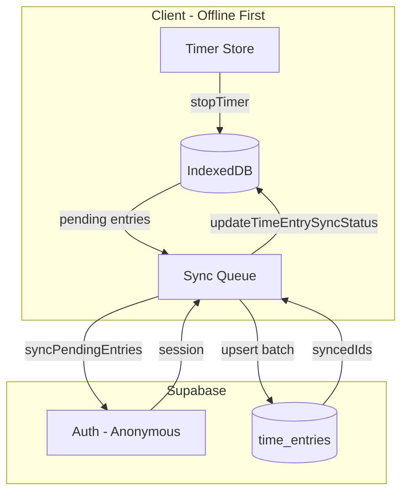

# Supabase Time Entries Sync Integration

## Architecture




## 1. Dependencies and environment

- Add `@supabase/supabase-js` (open-source, MIT)
- Create `.env.local` with `VITE_SUPABASE_URL` and `VITE_SUPABASE_ANON_KEY` (Vite exposes only `VITE_*` vars to client)
- Add `.env.example` with placeholder values (commit this; exclude `.env.local` via gitignore)

## 2. Supabase project setup (manual)

**In Supabase Dashboard:**

1. Create project; obtain URL and anon key from Project Settings > API.
2. Run SQL to create table and RLS:

```sql
-- Table: time_entries
create table public.time_entries (
  id uuid primary key,
  task_id uuid not null,
  start_utc timestamptz not null,
  end_utc timestamptz not null,
  source text not null check (source in ('manual', 'resumed')),
  created_at timestamptz not null,
  updated_at timestamptz not null,
  user_id uuid not null references auth.users(id) on delete cascade
);

-- RLS: users only see their own rows
alter table public.time_entries enable row level security;

create policy "Users can manage own entries" on public.time_entries
  for all using (auth.uid() = user_id);

-- Enable anonymous auth (Authentication > Providers > Anonymous)
```

1. In Auth > Providers, enable "Anonymous" sign-in.

## 3. Supabase client module

**New file: [src/lib/supabase/client.ts**](src/lib/supabase/client.ts)

- Create Supabase client with `createClient(url, anonKey)`
- Export typed client; return `null` if env vars are missing (graceful no-op when Supabase is not configured)

**New file: [src/lib/supabase/types.ts**](src/lib/supabase/types.ts)

- Define `SupabaseTimeEntry` type: `id`, `task_id`, `start_utc`, `end_utc`, `source`, `created_at`, `updated_at`, `user_id`
- Map to/from app `TimeEntry` (camelCase ↔ snake_case); `syncStatus` stays client-side only

## 4. Supabase auth (anonymous)

**New file: [src/lib/supabase/auth.ts**](src/lib/supabase/auth.ts)

- `ensureAnonymousSession()`: call `supabase.auth.signInAnonymously()` if no session; return session or null
- Export `getSession()` for use by sync
- Handle errors (e.g. anonymous auth disabled); surface via sync state if needed

## 5. Sync implementation

**New file: [src/lib/sync/supabase-sync.ts**](src/lib/sync/supabase-sync.ts)

- `createSupabaseSyncFunction()`: returns a `SyncFunction` for [sync-queue.ts](src/lib/sync/sync-queue.ts)
- Logic:
  1. Get Supabase client; if null, return `{ success: false, syncedIds: [], failedIds: all, conflicts: [] }`
  2. Call `ensureAnonymousSession()`; if no session, return same failure
  3. Map `TimeEntry[]` to `SupabaseTimeEntry[]` and add `user_id: session.user.id`
  4. `upsert(rows, { onConflict: 'id' })` – idempotent for retries
  5. On success: return `{ success: true, syncedIds: entries.map(e => e.id), failedIds: [], conflicts: [] }`
  6. On error: return `{ success: false, syncedIds: [], failedIds: entries.map(e => e.id), conflicts: [] }`
- No conflict resolution for now (first-write wins via upsert); existing `handleConflict` remains for future use.

## 6. App wiring

**File: [src/App.tsx**](src/App.tsx)

- Import `registerSyncFunction` and `createSupabaseSyncFunction`
- After `initializeSyncQueue()`, call `registerSyncFunction(createSupabaseSyncFunction())`
- If Supabase client is null, sync continues to run but stays in "no backend" mode (current behavior)

**Optional: refresh pending count after timer stop**

- In [timer-store.ts](src/lib/stores/timer-store.ts), after `addTimeEntry(entry)` in `stopTimer()`, trigger `getPendingCount()` from sync-queue so NetworkStatus updates immediately. Alternatively, call `syncPendingEntries()` when online. Keeps UI in sync without extra complexity.

## 7. File summary


| Action | File                                       |
| ------ | ------------------------------------------ |
| Create | `src/lib/supabase/client.ts`               |
| Create | `src/lib/supabase/types.ts`                |
| Create | `src/lib/supabase/auth.ts`                 |
| Create | `src/lib/sync/supabase-sync.ts`            |
| Create | `.env.example`                             |
| Edit   | `package.json` (add @supabase/supabase-js) |
| Edit   | `src/App.tsx` (register sync function)     |
| Edit   | `.gitignore` (ensure .env.local ignored)   |


## 8. Verification

- Start timer, stop offline: entry stays pending
- Go online: entry syncs; NetworkStatus clears
- Stop timer while online: entry syncs immediately
- Check Supabase Table Editor: rows appear with correct `user_id`
- Use different browser/incognito: new anonymous user, separate rows (expected)

