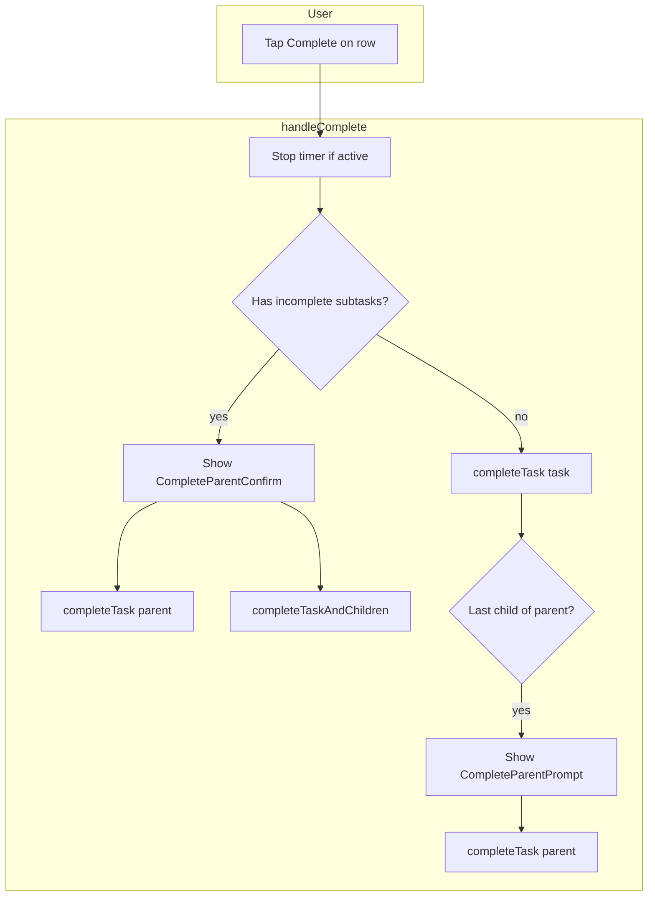

# Task Completion Logic Plan

Implement smart task completion: complete from row, parent-with-children confirmation, and last-child-complete parent prompt. One-level subtasks only.

---

## Current State

- **task-store:** [completeTask(id)](src/lib/stores/task-store.ts) marks single task complete; no parent/child logic
- **TaskList:** [ExpandableTaskRow](src/components/ExpandableTaskRow.tsx) and [TaskRow](src/components/TaskRow.tsx) have no `onComplete`; no completion from list
- **TodayView:** [TaskCard](src/pages/TodayView.tsx) has `onComplete` via SwipeableRow and long-press; `handleComplete` calls `completeTask(id)` directly
- **TaskDetail:** Complete button calls `completeTask(task.id)` directly
- **Pattern:** [DeleteTaskConfirm](src/components/DeleteTaskConfirm.tsx) provides dialog pattern (backdrop, focus trap, Escape)

---

## 1. Store: completeTaskAndChildren

**File:** [src/lib/stores/task-store.ts](src/lib/stores/task-store.ts)

Add:

```ts
export async function completeTaskAndChildren(parentId: string): Promise<void>
```

- Stop timer if active on parent or any subtask (import `stopTimer`, `useTimerStore` state or pass active timer check)
- Get subtasks: `state.tasks.filter(t => t.parentId === parentId)`
- For each subtask: `await completeTask(subtask.id)` (or batch-update for performance)
- Then `await completeTask(parentId)`
- Order: complete children first, then parent (so UI reflects children done before parent)

---

## 2. CompleteParentConfirm Component

**File:** `src/components/CompleteParentConfirm.tsx` (new)

**Props:** `isOpen`, `taskTitle`, `subtaskCount`, `onCompleteOnly`, `onCompleteAll`, `onCancel`

**Content:**

- Title: "Complete task?"
- Message: "[TaskTitle] has X subtask(s)."
- Buttons: Cancel | Complete only | Complete all
- 44px min tap targets
- Dialog pattern like DeleteTaskConfirm (backdrop, Escape, focus trap)
- `onCompleteOnly` = complete parent only; `onCompleteAll` = complete parent + children

---

## 3. CompleteParentPrompt Component

**File:** `src/components/CompleteParentPrompt.tsx` (new)

**Props:** `isOpen`, `parentTitle`, `onYes`, `onNo`

**Content:**

- Title: "Subtasks complete"
- Message: "All subtasks are done. Also complete [ParentTitle]?"
- Buttons: No | Yes
- 44px min tap targets
- Same dialog pattern

---

## 4. Smart handleComplete Logic

Shared logic (implement in each page, or extract to a hook):

```
handleComplete(task):
  1. Stop timer if active on task.id
  2. subtasks = tasks.filter(t => t.parentId === task.id)
  3. isParent = subtasks.length > 0
  4. incompleteSubtasks = subtasks.filter(t => t.status !== 'completed')

  If isParent && incompleteSubtasks.length > 0:
    - Show CompleteParentConfirm
    - On "Complete only": completeTask(task.id)
    - On "Complete all": completeTaskAndChildren(task.id)
    - On Cancel: nothing
    return

  5. completeTask(task.id)  // single task or parent with all children done

  6. If task.parentId:
     siblings = tasks.filter(t => t.parentId === task.parentId)
     // After our completeTask, "this" task is done; siblings exclude it
     allSiblingsNowDone = siblings.every(t => t.id === task.id || t.status === 'completed')
     If allSiblingsNowDone:
       Show CompleteParentPrompt
       On Yes: completeTask(task.parentId)
       On No: done
```

Note: In step 6, we complete the subtask first. After that, `tasks` will update (React re-render). We need the parent id and can show the prompt; when we check "are all siblings done", we must account for the fact that we just completed `task`. So: `siblings.filter(t => t.id !== task.id)` are the others. All of those should already be completed for us to prompt. Correct check: `siblings.filter(t => t.id !== task.id).every(t => t.status === 'completed')`.

---

## 5. TaskRow: Add Completion Control

**File:** [src/components/TaskRow.tsx](src/components/TaskRow.tsx)

**New prop:** `onComplete?: (task: Task) => void`

**Changes:**

- When `!isCompleted && !isBlocked && onComplete`: render a checkmark button (44px) that calls `onComplete(task)` with `stopPropagation`
- Placement: next to timer button or between content and chevron
- `aria-label="Complete task"`
- Use CheckIcon or a circle-check style

---

## 6. ExpandableTaskRow: Pass onComplete

**File:** [src/components/ExpandableTaskRow.tsx](src/components/ExpandableTaskRow.tsx)

**New prop:** `onComplete?: (task: Task) => void`

**Changes:**

- Pass `onComplete` to parent TaskRow and to each subtask TaskRow
- Enables completion from both parent and subtask rows

---

## 7. TaskList Integration

**File:** [src/pages/TaskList.tsx](src/pages/TaskList.tsx)

**Changes:**

- Add `completeTask`, `completeTaskAndChildren` imports from task-store
- Add state: `completeParentConfirm`, `completeParentPrompt` (task/parent for which we're showing)
- Implement `handleComplete` with the smart logic above
- Pass `onComplete={handleComplete}` to ExpandableTaskRow for active and blocked sections
- Render `CompleteParentConfirm` and `CompleteParentPrompt` when state indicates
- Blocked tasks: completion may be allowed (user unblocks implicitly?) or disabled per product choice. Plan assumes blocked tasks can be completed; if not, omit `onComplete` for blocked section.

---

## 8. TodayView Integration

**File:** [src/pages/TodayView.tsx](src/pages/TodayView.tsx)

**Changes:**

- Add `completeTaskAndChildren` import
- Add state for `CompleteParentConfirm` and `CompleteParentPrompt`
- Replace current `handleComplete` with the smart logic
- Wire confirm/prompt dialogs
- TaskCard already calls `onComplete`; no structural change needed
- When TaskCard shows inline subtasks (expanded), ensure subtask rows also have `onComplete` if they render a complete control

---

## 9. TaskDetail Integration

**File:** [src/pages/TaskDetail.tsx](src/pages/TaskDetail.tsx)

**Changes:**

- Add `completeTaskAndChildren` import
- Add state for `CompleteParentConfirm` (no CompleteParentPrompt here; user is on detail, completing from detail)
- Update `handleComplete`:
  - If task has subtasks and any are incomplete: show CompleteParentConfirm
  - Else: `completeTask(task.id)`
  - If task is a subtask and we just completed it: after `completeTask`, check if all siblings done; if yes, show CompleteParentPrompt (same as list flow)

---

## 10. Data Flow




---

## 11. Edge Cases

- **Parent, all children already completed:** Skip Confirm; call `completeTask(parentId)` directly.
- **Subtask, not last:** Complete subtask only; no parent prompt.
- **Single task (no parent, no children):** `completeTask(id)` only.
- **Blocked task:** No complete action (keep current behavior).
- **Timer on subtask when completing parent:** `completeTaskAndChildren` stops timer before completing.

---

## 12. Files Summary


| File                                                                         | Action                                                        |
| ---------------------------------------------------------------------------- | ------------------------------------------------------------- |
| [src/lib/stores/task-store.ts](src/lib/stores/task-store.ts)                 | Add `completeTaskAndChildren(parentId)`                       |
| `src/components/CompleteParentConfirm.tsx`                                   | Create                                                        |
| `src/components/CompleteParentPrompt.tsx`                                    | Create                                                        |
| [src/components/TaskRow.tsx](src/components/TaskRow.tsx)                     | Add `onComplete` prop and checkmark button                    |
| [src/components/ExpandableTaskRow.tsx](src/components/ExpandableTaskRow.tsx) | Add `onComplete` prop, pass to TaskRow                        |
| [src/pages/TaskList.tsx](src/pages/TaskList.tsx)                             | Add `handleComplete`, confirm/prompt state, pass `onComplete` |
| [src/pages/TodayView.tsx](src/pages/TodayView.tsx)                           | Replace `handleComplete` with smart logic, add dialogs        |
| [src/pages/TaskDetail.tsx](src/pages/TaskDetail.tsx)                         | Update `handleComplete` with parent/child logic               |
| `src/index.css`                                                              | Styles for complete button, new dialogs                       |


---

## 13. Implementation Order

1. `completeTaskAndChildren` in task-store
2. CompleteParentConfirm and CompleteParentPrompt components
3. TaskRow `onComplete` + checkmark button
4. ExpandableTaskRow `onComplete` propagation
5. TaskList `handleComplete` and dialogs
6. TodayView `handleComplete` and dialogs
7. TaskDetail `handleComplete` update
8. CSS for new UI

