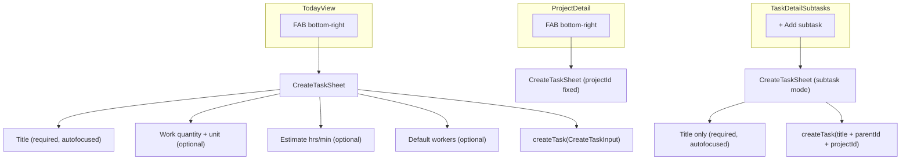

# Task Creation Action Sheet

## Domain context (from BRIEF.md)

Job-card app for exhibition build operations. Tasks are defined deliverables: "Lay 120 m² carpet tiles". Work scope, estimate, and crew are known before work begins. The creation sheet is the primary task definition workflow.

## Entry points




## Fields per context

- **TodayView FAB** — title + work quantity + estimate + workers (no project picker; assignable post-creation)
- **ProjectDetail FAB** — same; `projectId` passed into sheet
- **TaskDetailSubtasks ghost button** — title only; `showWork=false`, `showEstimate=false`, `showWorkers=false`; `parentId` + `projectId` passed into sheet

## Floating Action Button

Replaces `InlineCreateForm` entirely in TodayView and ProjectDetail. Positioned `fixed` above the tab nav (56px high) and safe area inset.

```css
.fab {
  position: fixed;
  bottom: calc(56px + env(safe-area-inset-bottom, 0px) + var(--space-md));
  right: var(--space-md);
  z-index: 200;
  width: 56px;
  height: 56px;
  border-radius: 50%;
  background: var(--color-primary);
  color: #fff;
  border: none;
  font-size: 1.75rem;
  box-shadow: 0 4px 12px rgba(0, 0, 0, 0.2);
  cursor: pointer;
  -webkit-tap-highlight-color: transparent;
}
```

The FAB lives in the page component (TodayView, ProjectDetail), not inside `CreateTaskSheet`.

## Sheet layout (full mode)

```
New Task
─────────────────────────────────────
[ Task title...                    ]  ← .input, autofocused

WORK QUANTITY
[ 120   m² ]                          ← task-work-quantity__input-wrap
[ m² ][ m ][ pcs ][ orders ]          ← task-work-quantity__unit-pills

ESTIMATE
[ ⌃ ] 2 [ ⌄ ] hrs  [ ⌃ ] 30 [ ⌄ ] min  ← entry-modal__duration-grid (2-col)

WORKERS
[ ⌃ ]  3  [ ⌄ ]  workers              ← entry-modal__stepper-btn chevrons

─────────────────────────────────────
                      Cancel   Create
```

All optional fields visible and empty by default — no accordion. Create enabled as soon as title is non-empty.

## New component: `CreateTaskSheet`

**File:** `[src/components/CreateTaskSheet.tsx](src/components/CreateTaskSheet.tsx)`

```ts
interface CreateTaskSheetProps {
  isOpen: boolean;
  onClose: () => void;
  onCreated?: () => void;
  sheetTitle?: string;        // "New Task" | "New Subtask"
  projectId?: string | null;
  parentId?: string | null;
  showWork?: boolean;         // default true
  showEstimate?: boolean;     // default true
  showWorkers?: boolean;      // default true
}
```

Reuses existing classes: `.input`, `.entry-modal__label`, `.entry-modal__duration-grid`, `.entry-modal__stepper-btn`, `.entry-modal__stepper-chevron`, `.task-work-quantity__input-wrap`, `.task-work-quantity__unit-pills`, `.task-work-quantity__unit-pill`, `.task-work-quantity__unit-pill--active`, `.action-sheet__actions`, `.action-sheet__actions-right`.

New class only: `.create-task-sheet__section` for vertical spacing between field groups.

## Removals

- `InlineCreateForm` import + state (`newTaskTitle`, `isAdding`, `handleAddTask`) removed from `[src/pages/TodayView.tsx](src/pages/TodayView.tsx)`
- `InlineCreateForm` import + state (`newTaskTitle`, `handleAddTask`) removed from `[src/pages/ProjectDetail.tsx](src/pages/ProjectDetail.tsx)`
- `InlineCreateForm` import + state (`newSubtaskTitle`, `handleAddSubtask`) removed from `[src/components/TaskDetailSubtasks.tsx](src/components/TaskDetailSubtasks.tsx)`
- `InlineCreateForm` component itself is **not deleted** — check for other usages first

## Files changed

- **New:** `[src/components/CreateTaskSheet.tsx](src/components/CreateTaskSheet.tsx)`
- **New:** `[src/styles/components/create-task-sheet.css](src/styles/components/create-task-sheet.css)` — FAB + `.create-task-sheet__section` only
- **Modified:** `[src/pages/TodayView.tsx](src/pages/TodayView.tsx)`
- **Modified:** `[src/pages/ProjectDetail.tsx](src/pages/ProjectDetail.tsx)`
- **Modified:** `[src/components/TaskDetailSubtasks.tsx](src/components/TaskDetailSubtasks.tsx)`

## What is NOT in scope

- Project picker in the sheet
- Notes at creation
- Status or blocking reason at creation
- Deleting `InlineCreateForm` component

