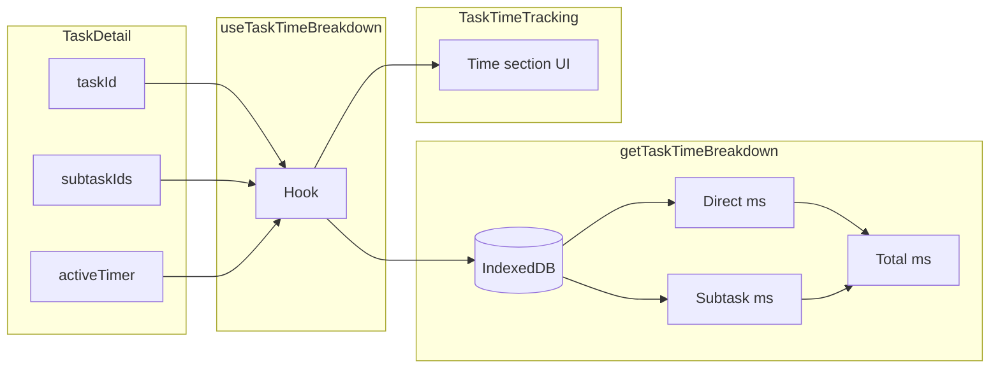

# Task Detail Time Tracking Section

Add a **Time Tracking** section to the task detail page showing total time tracked, with direct and indirect (subtask) breakdown. One-level subtasks only.

---

## Current State

- [src/pages/TaskDetail.tsx](src/pages/TaskDetail.tsx): Has timer controls, status, subtasks; no time summary
- [src/lib/db.ts](src/lib/db.ts): `getTimeEntriesByTask(taskId)` returns completed entries for a task
- [src/lib/types.ts](src/lib/types.ts): `durationMs`, `formatDuration` (HH:MM:SS), `TimeEntry` has taskId
- Tasks use `parentId` for one-level subtasks; subtasks have no children

---

## Implementation

### 1. Time breakdown utility

**File:** `src/lib/time-aggregation.ts` (new)

- `getTaskTimeBreakdown(taskId, subtaskIds, activeTimer)` (async)
  - Direct: sum of `durationMs` for entries where `taskId` matches
  - If `activeTimer?.taskId === taskId`: add `elapsedMs(activeTimer.startUtc)` to direct
  - Subtask: for each subtask ID, sum entry durations + add active timer elapsed if running on that subtask
  - Total: direct + subtask
- Uses `getTimeEntriesByTask` from db; subtask IDs from `getSubtasks(parentId)`

### 2. Floor-friendly duration format

**File:** [src/lib/types.ts](src/lib/types.ts)

- Add `formatDurationShort(ms: number): string` returning `"1h 45m"` or `"12m"` or `"0m"` (per PLAN §5.1)

### 3. `useTaskTimeBreakdown` hook

**File:** `src/lib/hooks/useTaskTimeBreakdown.ts` (new)

- Inputs: `taskId`, `subtaskIds`, `activeTimer`
- Fetches entries via `getTaskTimeBreakdown`, stores result in state
- Refetches when `taskId`, `subtaskIds`, or `activeTimer` change (refetch when timer stops so new entry is included)

### 4. TaskTimeTracking component

**File:** `src/components/TaskTimeTracking.tsx` (new)

- Renders a section with:
  - **Total:** X (direct + subtask)
  - **Direct:** Y (time on this task)
  - **Subtasks:** Z (time on direct children; one level only)
- Uses `formatDurationShort` for values
- 44px+ tap target if the section is interactive (display-only for now)
- Placed between timer controls and actions in TaskDetail

### 5. Integrate into TaskDetail

**File:** [src/pages/TaskDetail.tsx](src/pages/TaskDetail.tsx)

- Insert `<TaskTimeTracking taskId={task.id} subtaskIds={subtasks.map(s => s.id)} />` after the timer controls block (around line 240)
- Pass `subtasks` so the component never looks up nested subtasks (enforces one-level constraint at the call site)

---

## Data Flow

---

## One-Level Constraint

- `subtaskIds` comes from `useSubtasks(taskId)` which returns `tasks.filter(t => t.parentId === parentId)`
- Subtasks have `parentId === task.id`; they have no children (creating tasks with `parentId` of a subtask is prevented by the add-subtask form, which only adds to the current task)
- No code change needed to enforce; the breakdown only sums entries for the passed subtask IDs

---

## Edge Cases

- No entries: show "0m" for all
- Active timer on task: include in direct
- Active timer on subtask: include in subtask total
- No subtasks: subtask total is 0

---

## Files Changed

| File                                    | Action                           |
| --------------------------------------- | -------------------------------- |
| `src/lib/time-aggregation.ts`           | Create                           |
| `src/lib/types.ts`                      | Add `formatDurationShort`        |
| `src/lib/hooks/useTaskTimeBreakdown.ts` | Create                           |
| `src/components/TaskTimeTracking.tsx`   | Create                           |
| `src/pages/TaskDetail.tsx`              | Add TaskTimeTracking, pass props |

