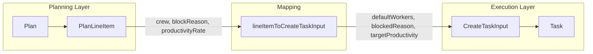

# Task and Line Item Consolidation Refactor

## Scope

**What we are doing:** Extract shared abstractions, unify naming, and reduce duplication. Both entities remain separate (planning vs execution domains).

**What we are not doing:** Merging into a single entity. The lifecycle and 1:N relationship are preserved.

---

## Current State




**Naming divergence:**

- Crew: `crew` (PlanLineItem) vs `defaultWorkers` (Task, CreateTaskInput, TaskTemplate)
- Block: `blockReason` (PlanLineItem) vs `blockedReason` (Task)
- Productivity: `productivityRate` vs `targetProductivity`
- Time: `timeHours` vs `estimatedMinutes`

---

## Phase 0: Low-Risk Adapter-Only Path (Recommended First)

**Goal:** Achieve consolidation at the type/abstraction level without touching persisted schema or external formats.

**Actions:**

1. Create [src/lib/work-package-core.ts](src/lib/work-package-core.ts) with `WorkPackageCore` interface and adapters.
2. `taskToWorkPackageCore(task, workType?)` — adapts Task to shared shape (workTypeTitle optional, from WorkType lookup when provided).
3. `lineItemToWorkPackageCore(item)` — adapts PlanLineItem to shared shape.
4. `lineItemToCreateTaskInput` continues mapping `crew` → `defaultWorkers`, `blockReason` → `blockedReason` (no renames).
5. No DB migration, no CSV/JSON format changes.
6. Field renames (Phase 2) become optional and can be deferred to a later release.

---

## Phase 1: Extract Shared Work Package Core

**Goal:** Define a single source of truth for overlapping fields.

**New file:** [src/lib/work-package-core.ts](src/lib/work-package-core.ts)

```ts
/** Shared work-package fields used by PlanLineItem, Task, and CreateTaskInput. */
export interface WorkPackageCore {
  title: string;
  workTypeId: string | null;
  /** Optional — Task lacks this; resolved via WorkType lookup when adapting. */
  workTypeTitle?: string;
  workUnit: WorkUnit;
  buildPhase: BuildPhase;
  workQuantity: number;
  crew: number;           // canonical name
  productivityRate: number;
  /** Time estimate in minutes. */
  estimatedMinutes: number;
  blockReason: string | null;  // canonical name
}

export function lineItemToWorkPackageCore(item: PlanLineItem): WorkPackageCore;
export function taskToWorkPackageCore(task: Task, workType?: WorkType | null): WorkPackageCore;
export function workPackageCoreToCreateTaskInput(core: WorkPackageCore, overrides?): CreateTaskInput;
```

**Update:** [src/lib/planning/release-plan.ts](src/lib/planning/release-plan.ts) — `lineItemToCreateTaskInput` delegates to `workPackageCoreToCreateTaskInput` (with field mapping during transition).

**Impact:** Low-risk, additive. No schema changes in Phase 0/1.

---

## Phase 2: Unify Field Names

### 2a. Standardize on `crew` (Task side)

Rename `Task.defaultWorkers` → `Task.crew` and `CreateTaskInput.defaultWorkers` → `CreateTaskInput.crew`. Same for `TaskTemplate`.

**DB Migration (Version 26):**

```ts
backfillStore('tasks', (task) => {
  const t = task as Record<string, unknown>;
  if (t.crew !== undefined) return false;
  t.crew = t.defaultWorkers ?? null;
  delete t.defaultWorkers;
  return true;
});
```

**Backward compatibility:**

- **JSON import (execution return):** Add `normalizeTaskFromPayload(raw)` before `upsertTasksFromPayload`:
  - `crew = raw.crew ?? raw.defaultWorkers ?? null`
- **CSV import:** Accept both `defaultWorkers` and `crew` as valid headers (case-insensitive). Map both to `crew` after parsing.
- **CSV export:** Keep `defaultWorkers` as the public header for stability, or document both during transition.

**Files to update:** [src/lib/types.ts](src/lib/types.ts), [src/lib/stores/task-store.ts](src/lib/stores/task-store.ts), [src/lib/interop/import.ts](src/lib/interop/import.ts), [src/lib/interop/work-package-import-apply.ts](src/lib/interop/work-package-import-apply.ts), [src/lib/interop/template-export.ts](src/lib/interop/template-export.ts), [src/lib/calculator-save.ts](src/lib/calculator-save.ts), components, tests (50+ references).

### 2b. Standardize on `blockReason` (Task side)

Rename `Task.blockedReason` → `Task.blockReason`.

**DB Migration (Version 27 or combined with 2a):**

```ts
backfillStore('tasks', (task) => {
  const t = task as Record<string, unknown>;
  if (t.blockReason !== undefined) return false;
  t.blockReason = t.blockedReason ?? null;
  delete t.blockedReason;
  return true;
});
```

**Backward compatibility:**

- **JSON import:** In `normalizeTaskFromPayload`: `blockReason = raw.blockReason ?? raw.blockedReason ?? null`
- Apply normalization in [src/lib/interop/data-transfer/execution-return-import.ts](src/lib/interop/data-transfer/execution-return-import.ts) before calling `addTask`/`updateTask`.

**Files to update:** [src/lib/types.ts](src/lib/types.ts), [src/lib/stores/task-store.ts](src/lib/stores/task-store.ts), [src/lib/planning/task-plan-block-sync.ts](src/lib/planning/task-plan-block-sync.ts), [src/lib/interop/data-transfer/execution-return.ts](src/lib/interop/data-transfer/execution-return.ts) (reads `task.blockedReason`), components, tests (40+ references).

---

## Phase 3: Unify Productivity and Time (Optional)

### 3a. Task: `targetProductivity` → `productivityRate`

**Recommendation:** Mark as optional, low priority. Lower reference count than crew/blockReason. Defer until Phase 2 is stable.

### 3b. Time units

Keep `timeHours` for line items (plan math), `estimatedMinutes` for tasks. No structural change. Document convention.

---

## Phase 4: Simplify Mapping and Block Sync

After Phase 2, `lineItemToCreateTaskInput` maps directly (no rename):

```ts
crew: item.crew,
blockReason: item.blockReason,  // if we add to CreateTaskInput
```

[src/lib/planning/task-plan-block-sync.ts](src/lib/planning/task-plan-block-sync.ts) — both Task and PlanLineItem use `blockReason`; sync logic simplifies.

---

## Phase 5: Shared Work Type Keying

Move `lineItemWorkTypeKey` to [src/lib/work-package-core.ts](src/lib/work-package-core.ts) or [src/lib/kpi.ts](src/lib/kpi.ts). Accept `{ workTypeId, workTypeTitle?, workUnit, buildPhase }` so both Task and PlanLineItem use it.

---

## Backward Compatibility Summary


| Format                | Old fields                    | New fields        | Strategy                             |
| --------------------- | ----------------------------- | ----------------- | ------------------------------------ |
| IndexedDB tasks       | defaultWorkers, blockedReason | crew, blockReason | Migration backfill + delete old      |
| Execution return JSON | blockedReason, defaultWorkers | blockReason, crew | `normalizeTaskFromPayload` on import |
| Work package CSV      | defaultWorkers                | crew              | Accept both headers; map to crew     |
| Template export CSV   | defaultWorkers                | crew              | Same as work package                 |


---

## Data Transfer Schema Version

- **Option A:** Bump `DATA_TRANSFER_SCHEMA_VERSION` to `1.2` after renames. Keep `1.1` in `DATA_TRANSFER_SCHEMA_COMPAT`; normalize legacy payloads on import.
- **Option B:** Keep `1.1`; rely on `normalizeTaskFromPayload` to accept both old and new field names. No version bump needed.
- **Recommendation:** Option B for minimal disruption.

---

## Testing Strategy

1. **Migration test:** Create tasks with old field names → run migration → assert new fields present, old absent.
2. **Execution return import:** Fixture with `blockedReason`/`defaultWorkers` → import → assert tasks load and display correctly.
3. **Work package CSV:** Parse row with `defaultWorkers` and with `crew` headers → assert correct mapping.
4. **Smoke test:** Run full migration on a copy of production-like data; verify tasks and plans load.

---

## Migration Order and Risks


| Phase               | Risk   | Rollback                                  |
| ------------------- | ------ | ----------------------------------------- |
| 0. Adapter-only     | Low    | Remove new file                           |
| 1. WorkPackageCore  | Low    | Revert release-plan                       |
| 2a. crew            | Medium | DB migration reversible; many file edits  |
| 2b. blockReason     | Medium | Same as 2a                                |
| 3. productivityRate | Low    | Fewer references; defer recommended       |
| 4. Mapping          | Low    | Revert release-plan, task-plan-block-sync |
| 5. Work type keying | Low    | Revert plan-model, plan-suggestions       |


**Suggested order:** 0 → 1 → 4 (partial) → 2a (+ compat) → 2b (+ compat) → 5. Phase 3 optional. Phase 2a and 2b can be separate PRs.

---

## File Summary

**New:** `src/lib/work-package-core.ts`, `normalizeTaskFromPayload` (in work-package-core or execution-return-import)

**Heavily touched:**

- [src/lib/types.ts](src/lib/types.ts) — Task, TaskTemplate
- [src/lib/stores/task-store.ts](src/lib/stores/task-store.ts)
- [src/lib/db.ts](src/lib/db.ts) — migrations
- [src/lib/planning/task-plan-block-sync.ts](src/lib/planning/task-plan-block-sync.ts)
- [src/lib/planning/release-plan.ts](src/lib/planning/release-plan.ts)
- [src/lib/interop/*](src/lib/interop) — import, export, work-package-import, execution-return
- [src/components/](src/components)* — TaskCard, CreateTaskSheet, TaskProductivity, TemplateFormSheet
- Test files across `src/**/*.test.ts`

**Moderately touched:**

- [src/lib/planning/plan-model.ts](src/lib/planning/plan-model.ts)
- [src/lib/calculator-save.ts](src/lib/calculator-save.ts)
- [src/lib/kpi.ts](src/lib/kpi.ts)

