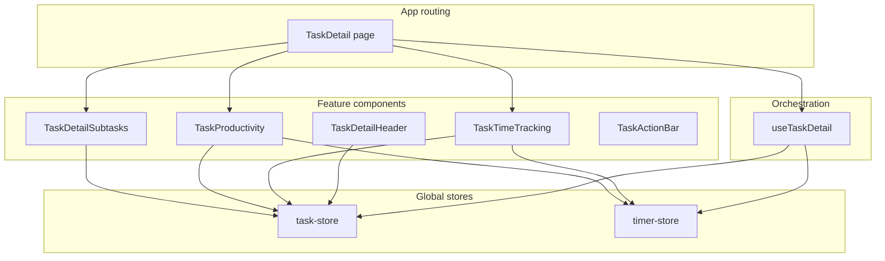

# TaskDetail: capabilities, boundaries, and code health

## System responsibilities (this slice)


| Layer                                                                                                     | Responsibility                                                                                                                                                                                         |
| --------------------------------------------------------------------------------------------------------- | ------------------------------------------------------------------------------------------------------------------------------------------------------------------------------------------------------ |
| `**[src/pages/TaskDetail.tsx](src/pages/TaskDetail.tsx)**`                                                | Compose layout: header, banners, expandable sections, action bar, modals. Minimal local state (ref bridge for attributed refresh).                                                                     |
| `**[src/lib/hooks/useTaskDetail.ts](src/lib/hooks/useTaskDetail.ts)**`                                    | Orchestrate task-scoped flows: timer start/stop, complete (with parent/subtask dialogs), delete preview/confirm, block/unblock, project assignment. Derive parent/project context from `useTaskStore`. |
| **Child components** (`TaskTimeTracking`, `TaskProductivity`, `TaskDetailSubtasks`, etc.)                 | Each owns UI + store/hook subscriptions for its concern (entries, breakdown, productivity, subtask list).                                                                                              |
| **Stores** (`[task-store](src/lib/stores/task-store.ts)`, `[timer-store](src/lib/stores/timer-store.ts)`) | Source of truth; hooks call imperative actions (`completeTask`, `startTimer`, …).                                                                                                                      |





**Boundary note:** The page comment says “all logic lives in `useTaskDetail`,” but `[TaskDetailHeader](src/components/TaskDetailHeader.tsx)` calls `[updateTaskTitle](src/lib/stores/task-store.ts)` directly via `EditableTitle`. That is intentional local CRUD (same pattern as `[ProjectDetail](src/pages/ProjectDetail.tsx)`); the comment overstates centralization.

**Navigation boundary:** `[App.tsx](src/App.tsx)` owns `View` state and lazy-loads `TaskDetail`; the page receives `taskId`, `onBack`, `onSelectTask`, `onNavigateToProject` only—good isolation from global routing.

---

## Evolution and consistency

- **Duplicated completion UX:** `[useCompletionFlow](src/lib/hooks/useCompletionFlow.ts)` implements the same parent/subtask confirm + “complete parent?” prompt flow used in `[TodayView](src/pages/TodayView.tsx)` and `[ProjectDetail](src/pages/ProjectDetail.tsx)`. `[useTaskDetail](src/lib/hooks/useTaskDetail.ts)` reimplements equivalent logic with separate `useState` fields (`showCompleteConfirm`, `completePromptParentId`, `lastCompletedSubtaskId`, …). **Reason to converge:** one behavioral change (e.g. prompt copy or undo rules) currently requires two edits; risk of subtle drift.
- **Productivity vs time entries:** `[TaskTimeTracking](src/components/TaskTimeTracking.tsx)` calls `onEntriesChange` after entry CRUD so `[TaskDetail](src/pages/TaskDetail.tsx)` can refresh attributed person-hours via a ref populated by `[TaskProductivity](src/components/TaskProductivity.tsx)`. That coordination is the right *idea*; the mechanism has a flaw (below).

---

## Code health: issues and reasoned improvements

### 1. Unused public surface on `useTaskDetail` (cleanup)

`[UseTaskDetailReturn](src/lib/hooks/useTaskDetail.ts)` exposes `activeTimers` and `handleSetWorkers`, but only `[TaskDetail.tsx](src/pages/TaskDetail.tsx)` consumes the hook—and it uses neither. `handleSetWorkers` is not wired to `[TaskActionBar](src/components/TaskActionBar.tsx)` (no crew stepper there).

- **Reason to remove or use:** Shrinks the contract, avoids implying future callers should use timer state from the hook when child components already subscribe to `useTimerStore` where needed. If crew editing is planned on this page, wire `WorkersStepper` once and then expose `handleSetWorkers`; otherwise remove from the return type and implementation.

### 2. Side effect during render in `TaskProductivity` (bug risk / React rules)

In `[TaskProductivity.tsx](src/components/TaskProductivity.tsx)`, `onAttributedRefresh(refresh)` runs **inside the render path** when `onAttributedRefresh` is truthy:

```37:40:src/components/TaskProductivity.tsx
  // Expose refresh to parent for coordination
  if (onAttributedRefresh) {
    onAttributedRefresh(refresh);
  }
```

- **Reason to change:** This violates the “render must be pure” rule, can cause extra work every render, and may conflict with Strict Mode or future concurrent features. Prefer `useLayoutEffect` (or `useEffect` if order is not critical) with `[refresh, onAttributedRefresh]` deps to register the callback, or lift `refresh` via a stable ref pattern from the parent.

### 3. Heavy `useTaskTimes` on the full task list for TaskDetail (optimization, optional)

`[useTaskDetail](src/lib/hooks/useTaskDetail.ts)` calls `useTaskTimes(tasks, activeTimers)` where `tasks` is the **entire** store list. `[useTaskTimes](src/lib/hooks/useTaskTimes.ts)` runs an effect that loads **all** time entries from IndexedDB and recomputes maps for every task when `taskKey` / `timerKey` changes.

- **Reason:** TaskDetail only needs rolled-up durations for **subtask rows** in `[TaskDetailSubtasks](src/components/TaskDetailSubtasks.tsx)` (and the same data is conceptually list-scoped). For large projects this is redundant work on every navigation to a task.
- **Direction:** Introduce a scoped variant (e.g. `useTaskTimesForIds(taskIds)` or pass a filtered `tasks` slice) so the detail page only recomputes for the current task subtree—or accept current cost until profiling shows a problem (same pattern as `[ProjectDetail](src/pages/ProjectDetail.tsx)` / `[TodayView](src/pages/TodayView.tsx)`, so this is a **consistency vs perf** tradeoff).

### 4. Repeated `subtasks.map((s) => s.id)` (small clarity win)

`[TaskDetail.tsx](src/pages/TaskDetail.tsx)` builds `subtaskIds` inline in four places.

- **Reason:** `useMemo(() => subtasks.map((s) => s.id), [subtasks])` avoids repeated allocation and keeps a single source for the dependency list passed to `TaskTimeTracking`, `TaskProductivity`, and `TaskAttributionBreakdown`.

### 5. Section comment numbering in `TaskDetail.tsx` (documentation)

Comments reuse step numbers (“7”, “7b”, “8”, “9” twice).

- **Reason:** Renumber once to match visual order so future edits do not confuse “which 9 is the action bar.”

### 6. Architectural alignment: unify completion flow (larger refactor)

- **Reason:** `[useCompletionFlow](src/lib/hooks/useCompletionFlow.ts)` and `[useTaskDetail](src/lib/hooks/useTaskDetail.ts)` encode the same product rules with different state shapes. Extracting shared helpers (e.g. “after completing task X, should we prompt for parent Y?”) or parameterizing `useCompletionFlow` for “current task only” would reduce duplication. This is a **medium** effort—only worth it when the team expects more changes to completion behavior.

---

## Related files (for follow-up)


| Area                   | Files                                                                                                                                                                                                                        |
| ---------------------- | ---------------------------------------------------------------------------------------------------------------------------------------------------------------------------------------------------------------------------- |
| Page + hook            | `[src/pages/TaskDetail.tsx](src/pages/TaskDetail.tsx)`, `[src/lib/hooks/useTaskDetail.ts](src/lib/hooks/useTaskDetail.ts)`                                                                                                   |
| Header / subtasks      | `[src/components/TaskDetailHeader.tsx](src/components/TaskDetailHeader.tsx)`, `[src/components/TaskDetailSubtasks.tsx](src/components/TaskDetailSubtasks.tsx)`                                                               |
| Coordination / perf    | `[src/components/TaskProductivity.tsx](src/components/TaskProductivity.tsx)`, `[src/components/TaskTimeTracking.tsx](src/components/TaskTimeTracking.tsx)`, `[src/lib/hooks/useTaskTimes.ts](src/lib/hooks/useTaskTimes.ts)` |
| Shared list completion | `[src/lib/hooks/useCompletionFlow.ts](src/lib/hooks/useCompletionFlow.ts)`, `[src/pages/ProjectDetail.tsx](src/pages/ProjectDetail.tsx)`                                                                                     |


---

## ROI evaluation (ordered by return on investment)

ROI here means **benefit divided by effort**, with benefit weighted toward user-visible correctness/perf and long-term maintainability where effort is similar.


| Rank  | Item                                                                   | Effort                                            | Benefit                                                                                                                                         | ROI rationale                                                                                                                                        |
| ----- | ---------------------------------------------------------------------- | ------------------------------------------------- | ----------------------------------------------------------------------------------------------------------------------------------------------- | ---------------------------------------------------------------------------------------------------------------------------------------------------- |
| **1** | Fix `TaskProductivity` `onAttributedRefresh` during render             | **Low** (~one effect + deps)                      | **High** — aligns with React rules, reduces risk under Strict Mode / concurrent React, stops parent ref churn on every render                   | Best ratio: small change, meaningful robustness                                                                                                      |
| **2** | Remove unused `activeTimers` / `handleSetWorkers` from `useTaskDetail` | **Very low**                                      | **Medium** — shrinks public API, removes false signals for future callers; no user-visible change                                               | Quick win; do right after #1                                                                                                                         |
| **3** | Scope `useTaskTimes` for TaskDetail (subtree only)                     | **Medium–high** (new API or slice + tests)        | **Variable** — **high** if task/entry counts are large (every task open hits full DB scan + full-map recompute); **low** if datasets stay small | **Measure first** (DevTools / simple timing around `getAllTimeEntries` + effect). Highest *potential* user ROI, but wrong to prioritize before #1–#2 |
| **4** | Memoize `subtaskIds` + renumber section comments                       | **Trivial**                                       | **Low** — micro clarity; saves a few allocations                                                                                                | Fine to batch with any PR touching `TaskDetail.tsx`; not worth a dedicated cycle                                                                     |
| **5** | Unify `useTaskDetail` completion with `useCompletionFlow`              | **High** (shared abstraction, regression surface) | **Medium over time** — pays off when completion rules change often; **low short-term** if that code is stable                                   | Defer until the next product change to completion/prompt/undo behavior (amortize refactor with that feature)                                         |


**Summary order for implementation:** (1) productivity effect → (2) trim hook API → (3) scoped `useTaskTimes` *if* profiling warrants → (4) polish opportunistically → (5) completion unify when touching that domain anyway.