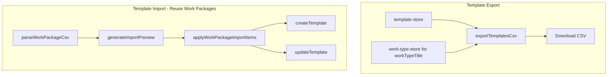

# Templates Import/Export — Implementation Plan

## Summary

Add export and import capabilities to [src/pages/settings/SettingsTemplatesView.tsx](src/pages/settings/SettingsTemplatesView.tsx), following the pattern established for Work Types in [src/pages/settings/SettingsWorkTypesView.tsx](src/pages/settings/SettingsWorkTypesView.tsx).

---

## Architecture




---

## 1. Template Export Module

**New file:** [src/lib/interop/template-export.ts](src/lib/interop/template-export.ts)

- Function `exportTemplatesCsv(templates: TaskTemplate[], workTypeTitleById: Map<string, string>): string`
- Columns (match work package import): `title`, `workTypeTitle`, `workUnit`, `buildPhase`, `workQuantity`, `estimatedMinutes`, `defaultWorkers`, `targetProductivity`
- For each template: resolve `workTypeTitle` via `workTypeTitleById.get(template.workTypeId) ?? ''` when `workTypeId` is set; empty string when null
- Use `csvRow` from [src/lib/interop/csv-utils.ts](src/lib/interop/csv-utils.ts)
- Produces round-trip compatible CSV for work package import

---

## 2. Template Import — Reuse Existing Flow

Import reuses the work package machinery:

- `parseWorkPackageCsv` from [src/lib/interop/import.ts](src/lib/interop/import.ts)
- `generateImportPreview` from [src/lib/interop/import-preview.ts](src/lib/interop/import-preview.ts)
- `applyWorkPackageImportItems` from [src/lib/interop/work-package-import-apply.ts](src/lib/interop/work-package-import-apply.ts)
- `WorkPackageImportCard` from [src/pages/settings/interop/cards/WorkPackageImportCard.tsx](src/pages/settings/interop/cards/WorkPackageImportCard.tsx)

---

## 3. Import Hook for Templates Page

**New file:** [src/pages/settings/hooks/useTemplateImport.ts](src/pages/settings/hooks/useTemplateImport.ts)

Mirror [src/pages/settings/interop/hooks/useInteropWorkPackageImport.ts](src/pages/settings/interop/hooks/useInteropWorkPackageImport.ts) with:

- Same parse/preview/apply logic
- No rollout gate — pass `importApplyGateOpen: true` so Apply is never blocked on Templates page
- Optional: skip stale guard (`staleGuardEnabled: false`) for simpler UX
- Inputs: `tasks`, `templates`, `workTypeTitleById` (from stores)

---

## 4. SettingsTemplatesView Changes

**File:** [src/pages/settings/SettingsTemplatesView.tsx](src/pages/settings/SettingsTemplatesView.tsx)

**Add imports:** `useTaskStore`, `useWorkTypeStore`, `exportTemplatesCsv`, `downloadCsv`, `WorkPackageImportCard`, `useTemplateImport`

**Add Export card** (after Templates list card, before TemplateFormSheet):

- Header "Export Templates", Export button
- On click: `exportTemplatesCsv(templates, workTypeTitleById)` then `downloadCsv(\`templates-${stamp}.csv, csv)`
- Helper: "Export template definitions as CSV."

**Add Import card:**

- Use `WorkPackageImportCard` with props from `useTemplateImport`
- Pass `importApplyGateOpen={true}` (no gate on Templates page)
- Consider passing `title="Import Templates"` — WorkPackageImportCard currently uses "Import Work Packages"; may need a prop to customise the header or accept a generic label

---

## 5. WorkPackageImportCard Header Customisation

**File:** [src/pages/settings/interop/cards/WorkPackageImportCard.tsx](src/pages/settings/interop/cards/WorkPackageImportCard.tsx)

Add optional prop `title?: string` (default `"Import Work Packages"`). When used on Templates page, pass `title="Import Templates"` so the header matches the context.

---

## 6. Export CSV Format (Round-Trip)

```
title,workTypeTitle,workUnit,buildPhase,workQuantity,estimatedMinutes,defaultWorkers,targetProductivity
Install carpet,Carpet Tiles,m2,build-up,100,60,2,10
Walls phase 1,Walls,m,tear-down,,,,
```

Matches work package import columns for seamless edit-and-reimport in Excel.

---

## 7. Tests

- **template-export.test.ts:** Export columns, workTypeTitle resolution, null workTypeId handling, empty templates
- Existing work package import tests cover the import path; no new import tests required unless adding template-specific scenarios

---

## File Summary


| Action | File                                                                                       |
| ------ | ------------------------------------------------------------------------------------------ |
| Create | `src/lib/interop/template-export.ts`                                                       |
| Create | `src/lib/interop/template-export.test.ts`                                                  |
| Create | `src/pages/settings/hooks/useTemplateImport.ts`                                            |
| Modify | `src/pages/settings/SettingsTemplatesView.tsx` — add export card, import card, hook wiring |
| Modify | `src/pages/settings/interop/cards/WorkPackageImportCard.tsx` — add optional `title` prop   |


---

## Implementation Order

1. Create `template-export.ts` and tests
2. Add optional `title` prop to `WorkPackageImportCard`
3. Create `useTemplateImport` hook
4. Update `SettingsTemplatesView` with export and import cards
5. Manual verification in browser

