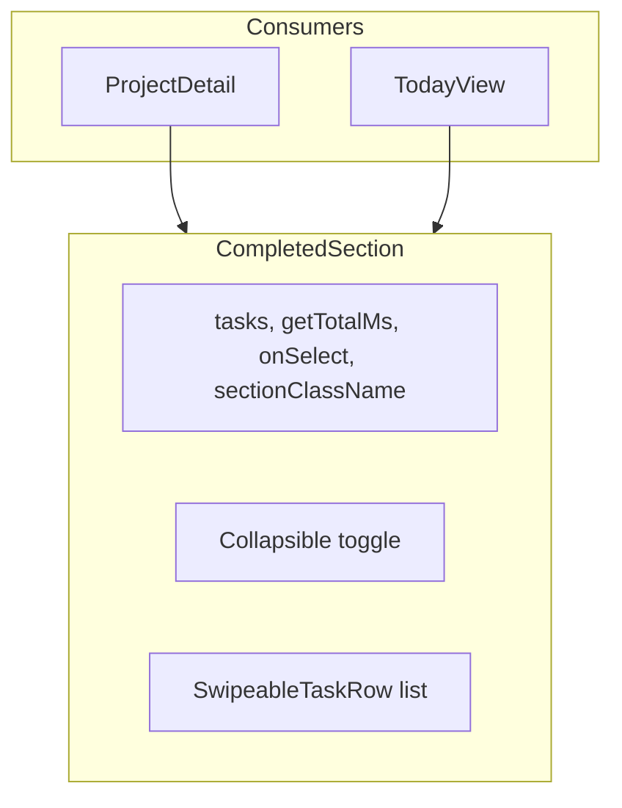

# Today View: Flat Completed Section (Reusable)

## Overview

Add a collapsible "Completed" section to Today View with a flat list of top-level completed tasks. **Extract a reusable `CompletedSection` component** used by both ProjectDetail and TodayView. Shared CSS for the collapsible toggle and green accent—no duplication.

## Architecture




## Implementation

### 1. Create CompletedSection component

**New file:** `src/components/CompletedSection.tsx`

Reusable component that encapsulates the completed section UI and expand/collapse state.

**Props:**

- `tasks: Task[]`
- `getTotalMs: (task: Task) => number | undefined`
- `onSelectTask: (task: Task) => void`
- `sectionClassName: string` — e.g. `"project-detail__section project-detail__section--completed"` or `"today-view__section today-view__section--completed"`
- `contentId: string` — for `aria-controls` (unique per page, e.g. `"project-detail__completed-list"` or `"today-view__completed-list"`)
- `defaultExpanded?: boolean` — default `false`

**Renders:**

- `<section className={sectionClassName}>`
- Toggle button with CheckIcon, "Completed", CountBadge, ExpandChevronIcon; uses shared `.collapsible-section-toggle` and `.collapsible-section__chevron` classes
- Conditional `today-view__task-list` with SwipeableTaskRow for each task (no onComplete)
- Internal `useState` for expanded; full `aria-expanded`, `aria-controls`, `aria-label`

**Imports:** Task, CheckIcon, ExpandChevronIcon, CountBadge, SwipeableTaskRow

### 2. Shared CSS for collapsible section

**New file:** `src/styles/components/collapsible-section.css`

Extract toggle and chevron styles used by both project-detail and today-view:

- `.collapsible-section-toggle` — button reset, flex, green text (`color: var(--color-ready)`), uppercase, font-weight 600, gap
- `.collapsible-section-toggle:hover` — opacity 0.9
- `.collapsible-section__chevron` — margin-left auto, transition
- `.collapsible-section-toggle:not(.collapsible-section-toggle--expanded) .collapsible-section__chevron` — `transform: rotate(-90deg)`
- `.collapsible-section__icon` — 20x20, flex-shrink 0

**Shared completed accent** (used by both section wrappers):

- `.section--completed .today-view__task-list` — `border-inline-start: 3px solid var(--color-ready)` plus border-radius for first/last swipeable-row children

**Import in** [src/index.css](src/index.css) after section-heading, before project/today-view.

### 3. Refactor ProjectDetail

**File:** [src/pages/ProjectDetail.tsx](src/pages/ProjectDetail.tsx)

- Replace the completed section JSX (lines 332–362) with:

```tsx
  <CompletedSection
    tasks={completedTasks}
    getTotalMs={(t) => durationByTask.get(t.id)}
    onSelectTask={onSelectTask}
    sectionClassName="project-detail__section project-detail__section--completed section--completed"
    contentId="project-detail__completed-list"
  />
  

```

- Remove `completedSectionExpanded` state.
- Remove CheckIcon, ExpandChevronIcon from imports if no longer used elsewhere.

**File:** [src/styles/components/project.css](src/styles/components/project.css)

- Remove project-detail-specific toggle/chevron styles (lines 258–294) — now in collapsible-section.css.
- Replace `.project-detail__section--completed` accent rules with the shared `.section--completed` in collapsible-section.css. Keep `.project-detail__section--completed` in the border-radius selector chain if needed, or consolidate under `.section--completed .today-view__task-list > .swipeable-row:first-child` etc. The shared rule targets `.section--completed` so both pages add that class.

### 4. TodayView integration

**File:** [src/pages/TodayView.tsx](src/pages/TodayView.tsx)

- Extend useMemo: add `completedTasks` — filter `status === 'completed'` and `parentId === null`. Return from useMemo.
- Insert Completed section after Blocked, before Empty State:

```tsx
  {completedTasks.length > 0 && (
    <CompletedSection
      tasks={completedTasks}
      getTotalMs={(t) => durationByTask.get(t.id)}
      onSelectTask={onSelectTask}
      sectionClassName="today-view__section today-view__section--completed section--completed"
      contentId="today-view__completed-list"
    />
  )}
  

```

- Import CompletedSection.
- Empty state logic unchanged (still based on ungrouped, grouped, blocked only).

### 5. CSS consolidation

**File:** [src/styles/components/collapsible-section.css](src/styles/components/collapsible-section.css)

Contains:

1. Toggle + chevron styles (shared)
2. `.section--completed .today-view__task-list` — green accent + corner radius for first/last children

**File:** [src/styles/components/project.css](src/styles/components/project.css)

- Remove duplicate toggle/chevron/accent rules; retain any project-detail-specific overrides only if needed.

**File:** [src/styles/components/today-view.css](src/styles/components/today-view.css)

- No new rules needed if `.section--completed` and `.today-view__task-list` selectors in collapsible-section.css cover the Today View case. The section uses `today-view__section today-view__section--completed section--completed`; the task list is `.today-view__task-list`; the shared rule `.section--completed .today-view__task-list` applies.

## Files Changed


| File                                            | Changes                                         |
| ----------------------------------------------- | ----------------------------------------------- |
| `src/components/CompletedSection.tsx`           | New component                                   |
| `src/styles/components/collapsible-section.css` | New shared styles                               |
| `src/index.css`                                 | Import collapsible-section.css                  |
| `src/pages/ProjectDetail.tsx`                   | Use CompletedSection, remove local state/JSX    |
| `src/pages/TodayView.tsx`                       | useMemo completedTasks, render CompletedSection |
| `src/styles/components/project.css`             | Remove duplicated toggle/accent                 |


## Visual Result

- Today View: Completed section after Blocked; same look as ProjectDetail.
- Single source of truth for completed section UI and styles.

