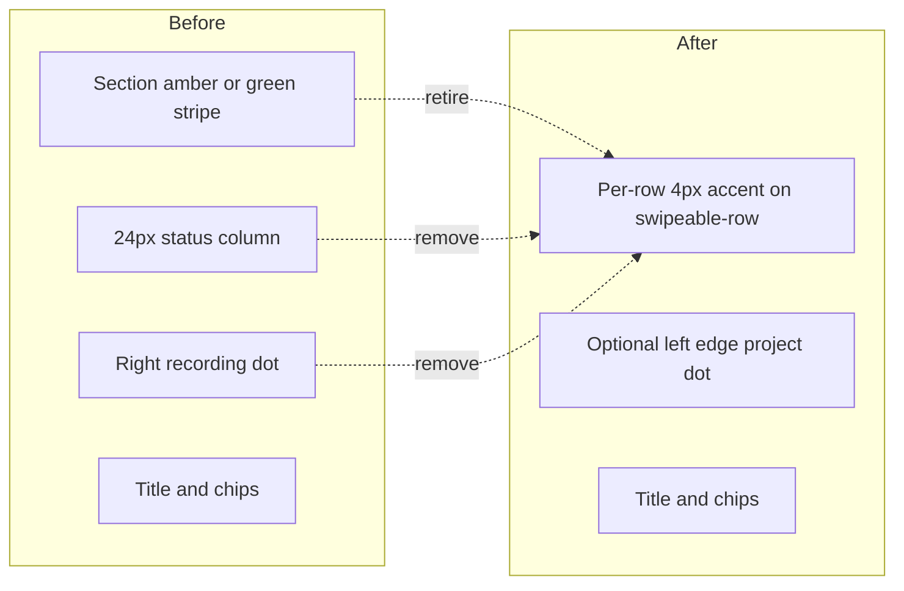

# Unified task accent visual language

## Goal

One status grammar for all task list surfaces:

| State | Leading accent | Row surface | Content cues (unchanged) |
|-------|----------------|-------------|---------------------------|
| Active + timer | 4px `--color-recording` | `--color-recording-bg` | — |
| Active (no timer) | none | default contained | — |
| Blocked | 4px `--color-amber` | existing muted blocked styles | Blocked chip + reason |
| Completed | 4px `--color-ready` | existing muted completed styles | Strikethrough + muted title |

Remove: status column (grey dot, check icon, placeholders), `TaskRecordingDot` on list rows/cards, redundant section-level list stripes, conflicting blue recording border in [`swipeable-row.css`](src/styles/components/swipeable-row.css).

**Out of scope (follow-up):** Field plan line items ([`FieldPlanLineItemRow`](src/pages/field-plan/components/FieldPlanLineItemRow.tsx)) use a different status model (`in-progress`, `pending`, …) and list-level accents in [`field-plan.css`](src/styles/components/field-plan.css). Align in a later pass if desired.



## 1. Centralize accent rules

Add unified selectors (prefer [`_task-shared.css`](src/styles/components/_task-shared.css) or a small new [`task-accents.css`](src/styles/components/task-accents.css) imported from the main stylesheet bundle):

```css
/* Per-row accents on swipeable wrapper */
.swipeable-row:has(.task-card--active),
.swipeable-row:has(.task-row--active) {
  border-inline-start: 4px solid var(--color-recording);
}
.swipeable-row:has(.task-row--blocked) {
  border-inline-start: 4px solid var(--color-amber);
}
.swipeable-row:has(.task-row--completed) {
  border-inline-start: 4px solid var(--color-ready);
}
```

- **Delete** the outdated blue rule in [`swipeable-row.css`](src/styles/components/swipeable-row.css) (lines 16–20: `border-inline-start: 3px solid var(--color-primary)` for active rows).
- Keep optional `border-color: var(--color-recording-border)` on recording rows only (today already does this for cards).
- Status classes remain on the inner row (`task-row--active` = recording); no TS rename required unless you want `task-row--recording` later.

## 2. Retire section-level list borders

Remove whole-list `border-inline-start` (and associated first/last corner-radius helpers tied only to section borders):

| File | Remove |
|------|--------|
| [`today-view.css`](src/styles/components/today-view.css) | `.today-view__section--blocked .today-view__task-list` amber stripe (lines 165–177) |
| [`collapsible-section.css`](src/styles/components/collapsible-section.css) | `.section--completed .today-view__task-list` green stripe (lines 46–59) |
| [`project.css`](src/styles/components/project.css) | `.project-detail__section--blocked .today-view__task-list` amber stripe (lines 228–238) |

Replace Today-specific **recording-only** row rules (lines 115–118, 152–163) with:

- Generic accent rules (step 1), scoped where flat lists zero out other borders: `.today-view__task-list > .swipeable-row` and **`.today-view__subtasks .swipeable-row`** (subtask drawer currently has no recording accent).
- Extended corner-radius selectors for first/last rows: group `:has(.task-row--active)`, `:has(.task-card--active)`, `:has(.task-row--blocked)`, `:has(.task-row--completed)` so accented rows in grouped lists still get correct card-radius corners.

## 3. Refactor `TaskRow` layout and markup

**[`TaskRow.tsx`](src/components/TaskRow.tsx)**

- Remove entire `task-row__status` block (check, dot, placeholder).
- Remove `TaskRecordingDot` from actions.
- Remove unused `CheckIcon` import and `showDefaultStatusDot` logic.
- Adopt **card-like edge layout** for all rows:
  - `position: relative` on `.task-row`
  - Absolute left `TaskProjectDot` with `task-card__edge-dot task-card__edge-dot--project` classes (reuse card positioning tokens)
  - Grid: `minmax(0, 1fr) auto` (drop `24px` status + `12px` project columns)
  - Padding: mirror card inset `calc(var(--space-md) + 18px)` left for dot clearance; keep right padding for chevron
- **Subtasks** (`.task-row--subtask`):
  - Keep extra hierarchy indent via `padding-left` (tune so title nests under parent, not under parent’s dot)
  - **`showProjectDot={false}`** when rendered from [`TaskCard`](src/components/TaskCard.tsx) (parent already shows project color); keep dot in [`TaskDetailSubtasks`](src/components/TaskDetailSubtasks.tsx) where there is no parent card
  - Implement via prop on `SwipeableTaskRow` / `TaskRow` (e.g. `showProjectDot?: boolean`, default `true`)

**[`task-row.css`](src/styles/components/task-row.css)**

- Delete `.task-row__status`, `__status-dot`, `__status-placeholder`, `__icon`, `__project` grid column rules
- Add edge-dot + simplified grid rules; adjust `.task-row--subtask` padding

## 4. Simplify `TaskCard`

**[`TaskCard.tsx`](src/components/TaskCard.tsx)**

- Remove `TaskRecordingDot` and `task-card__edge-dot--recording` branch; recording state = `task-card--active` + parent `SwipeableRow` accent only.
- Keep left project edge dot.

**[`task-card.css`](src/styles/components/task-card.css)**

- Remove `.task-card__edge-dot--recording` if unused
- Optionally reduce right padding (was reserving space for recording dot): `calc(var(--space-md) + 14px)` → `var(--space-md)` or similar

## 5. Surface coverage (no new components)

Accents apply via existing modifiers on rows inside `SwipeableRow`:

| Surface | Component path | Notes |
|---------|----------------|-------|
| Today active parents | `TaskCard` in [`ActiveSection`](src/pages/today/ActiveSection.tsx) | Recording accent on card’s swipeable row |
| Today expanded subtasks | `SwipeableTaskRow` in `TaskCard` | Per-row red/amber/green; no project dot; drawer accent rules |
| Today blocked | [`BlockedSection`](src/pages/today/BlockedSection.tsx) | Per-row amber (replaces section stripe) |
| Today completed | [`CompletedSection`](src/components/CompletedSection.tsx) | Per-row green (replaces section stripe) |
| Project detail | [`ProjectDetail`](src/pages/ProjectDetail.tsx) | Same patterns as Today |
| Task detail subtasks | [`TaskDetailSubtasks`](src/components/TaskDetailSubtasks.tsx) | Mixed-status list; per-row accents essential; keep project dot |

[`SwipeableTaskRow.tsx`](src/components/SwipeableTaskRow.tsx): pass `showProjectDot` through when `isSubtask`.

## 6. Accessibility and dark mode

- Row `aria-label` in `TaskRow` already includes blocked/completed/recording — keep as primary non-visual cue.
- Update [`_a11y.css`](src/styles/_a11y.css): high-contrast rules currently target `.task-item__recording-dot` and `.swipeable-row:has(.task-card--active)` border width — shift to generic accented `.swipeable-row` selectors; remove dot-specific rules if `TaskRecordingDot` is unused in lists.
- Verify [`_dark.css`](src/styles/_dark.css) blocked/completed row hovers still read well with per-row accents.

## 7. Cleanup

- If `TaskRecordingDot` is only used by removed list paths, keep export in [`TaskItemMeta.tsx`](src/components/TaskItemMeta.tsx) for now (task detail banner / future) or grep and prune dead CSS in [`_task-shared.css`](src/styles/components/_task-shared.css) for trailing dot variant if unused.
- Update stale comment in [`TaskRow.tsx`](src/components/TaskRow.tsx) header (PLAN.md “high-contrast status indicators” → leading-edge accents).

## Test plan (manual)

- **Today active:** parent recording → red accent + tint, no right dot; non-recording parent → no accent; expand → subtask open/blocked/completed/recording each show correct accent; no grey dot; no duplicate project dot on subtasks.
- **Today blocked:** each row amber accent; chip + reason visible; section has no extra list stripe.
- **Today completed (collapsed/expanded):** each row green accent; strikethrough; no check column.
- **Project detail:** mirror Today for active/blocked/completed.
- **Task detail subtasks:** mixed statuses in one flush list; accents per row; project dot present.
- **Corner cases:** first/last row in grouped list radius; subtask drawer bottom radius; row after `today-view__subtasks` divider.
- **Regression:** swipe actions still work; dark mode + prefers-contrast.
