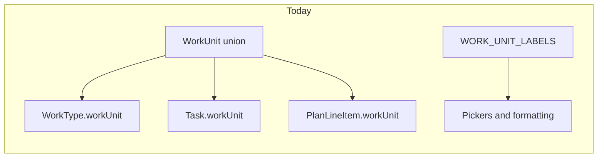

# User-definable unit types — architecture and evolution

## Current system snapshot

- **Closed catalog**: `[src/lib/types.ts](src/lib/types.ts)` defines `WorkUnit` as `'m2' | 'm' | 'pcs' | 'orders'`, plus `WORK_UNITS` and `WORK_UNIT_LABELS`. Work types use composite uniqueness **(title, workUnit)** via `workTypeKeyString`.
- **Persistence**: `WorkType`, `Task`, `TaskTemplate`, and plan line items (`[src/lib/planning/plan-model.ts](src/lib/planning/plan-model.ts)`) all store `workUnit` as that union. IndexedDB indexes work types by `by-title-unit` (`[src/lib/db/schema.ts](src/lib/db/schema.ts)`); history in `[src/lib/db/migrations/apply-db-migrations.ts](src/lib/db/migrations/apply-db-migrations.ts)`.
- **Settings pattern**: Hub in `[src/pages/SettingsView.tsx](src/pages/SettingsView.tsx)`; drill-down sections keyed in `[src/App.tsx](src/App.tsx)` (`SettingsSection` union + lazy subviews). Work types are already a settings sub-area (`[src/pages/settings/SettingsWorkTypesView.tsx](src/pages/settings/SettingsWorkTypesView.tsx)`); unit pickers are hard-coded in components like `[src/components/WorkTypeFormSheet.tsx](src/components/WorkTypeFormSheet.tsx)`, `[src/components/TaskWorkQuantity.tsx](src/components/TaskWorkQuantity.tsx)`, `[src/components/CreateTaskSheet.tsx](src/components/CreateTaskSheet.tsx)`.
- **Interop**: CSV and JSON paths validate against the same four values (`[src/lib/interop/work-type-import.ts](src/lib/interop/work-type-import.ts)`, `[src/lib/interop/plan-line-item-import.ts](src/lib/interop/plan-line-item-import.ts)`, `[src/lib/interop/import.ts](src/lib/interop/import.ts)`). Data transfer / plan package already treat `workUnit` as **string** at the edge (`[src/lib/interop/data-transfer/plan-package.ts](src/lib/interop/data-transfer/plan-package.ts)`), which aligns with moving to opaque ids.

## Target responsibilities and boundaries

| Concern                                                        | Owner                               | Notes                                                                                                                                                                                                                                                                                                                                                                        |
| -------------------------------------------------------------- | ----------------------------------- | ---------------------------------------------------------------------------------------------------------------------------------------------------------------------------------------------------------------------------------------------------------------------------------------------------------------------------------------------------------------------------- |
| **Unit catalog** (id, display label, ordering, optional flags) | New aggregate + store + settings UI | Single source of truth; not duplicated in each component.                                                                                                                                                                                                                                                                                                                    |
| **References** (tasks, work types, templates, plans, KPI keys) | Keep **string id** only             | No embedding of labels in persisted rows; formatting resolves id → label at read time.                                                                                                                                                                                                                                                                                       |
| **Validation on import**                                       | Interop layer                       | **Auto-provision** (locked): any referenced `workUnit` id not in the catalog is created as a new definition (id = string from file; label defaults to id unless CSV/payload supplies one). Importers run unit upserts **before** writing dependent records; UI shows how many units were added. Reject only invalid id **format** (e.g. fails slug regex), not “unknown id”. |
| **Deletion / rename**                                          | Domain rules                        | Deleting a unit in use is a **policy** decision: block, force remap, or orphan with remediation—align with existing remediation patterns (`[src/lib/remediation/](src/lib/remediation/)`).                                                                                                                                                                                   |

**Boundary principle**: Treat units like a small reference table (similar in spirit to work types library), not like free-form tags. Work type identity stays **(normalized title, unitId)**.

## Type and storage evolution

1. **Replace the union with `WorkUnitId = string`** (or rename to `QuantityUnitId` if you want to avoid confusion with “work units” in product language). Keep the four legacy values as **built-in ids** so existing IndexedDB rows require no data rewrite beyond a migration that seeds definitions.
2. **New entity** (conceptual): `WorkUnitDefinition { id, label, sortIndex, createdAt, updatedAt, readOnly?: boolean }` — `readOnly` optional for built-ins (`m2`, `m`, `pcs`, `orders`) to prevent id changes.
3. **New object store** in `[schema.ts](src/lib/db/schema.ts)` + version bump in `[src/lib/db/core.ts](src/lib/db/core.ts)` + seed migration in `[apply-db-migrations.ts](src/lib/db/migrations/apply-db-migrations.ts)`.
4. **App init**: Initialize `work-unit-store` in `[App.tsx](src/App.tsx)` alongside `[initializeWorkTypeStore](src/lib/stores/work-type-store.ts)`.

## Settings UX (fits existing navigation)

- Extend `SettingsSection` with e.g. `'workUnits'`.
- Add `[SettingsWorkUnitsView.tsx](src/pages/settings/)` using `[SettingsDetailLayout](src/pages/settings/SettingsDetailLayout.tsx)`: list, add, edit label/reorder, delete with guardrails.
- Link from **Work types** settings (“Manage units”) if product needs discoverability; optional.

## Cross-cutting application changes (blast radius)

The grep surface is large (~40+ TS/TSX files): every `WORK_UNITS.map`, `Record<WorkUnit, …>`, and `import type { WorkUnit }` tied to the union must move to **definition-driven lists** and `**string` ids**.

Recommended **single resolver API** (avoid prop drilling):

- Helpers like `getWorkUnitLabel(id, definitionsById)` or a small hook `useWorkUnitCatalog()` used by formatters currently in `[types.ts](src/lib/types.ts)` (`formatWorkQuantity`, `formatProductivity`) — those functions either take a label argument or accept the catalog map.

Some files already fallback when a label is missing (e.g. `WORK_UNIT_LABELS[x] ?? x` in `[src/pages/planning/ProgressView.tsx](src/pages/planning/ProgressView.tsx)`); that becomes the default behavior for unknown ids during loading or after import.

## Interop and compatibility

- **Locked policy — auto-provision**: All import paths that introduce `workUnit` ids MUST ensure definitions exist first (create stub rows in `workUnitDefinitions`). Executor handoffs and vendor CSVs work without pre-seeding the catalog. Optional: embed `workUnitDefinitions` in data-transfer payloads for richer labels; if omitted, auto-provision still satisfies references.
- **CSV columns**: Continue exporting **id** (stable). Import accepts ids; optional column for display label can upgrade the auto-provisioned stub’s label.
- **Id format validation**: Still reject malformed ids (empty, unsafe characters); valid unknown ids → provision, not error.
- **Tests**: Extend `[work-type-import.test.ts](src/lib/interop/work-type-export.test.ts)`, plan package tests, and DB migration tests—assert unknown-but-valid id creates definition and import completes.

## Risks and decisions to lock early

1. **Id format**: Restrict to slug-safe strings (regex) to keep CSV/JSON and composite keys predictable.
2. **Built-ins**: Keep `m2`, `m`, `pcs`, `orders` as reserved permanent ids (migration seeds them).
3. **KPI grouping**: `[src/lib/kpi.ts](src/lib/kpi.ts)` keys by `workUnit`; string ids preserve behavior as long as ids are stable.
4. **Maps typed as `Map<WorkUnit, number>`** (e.g. `[plan-model.ts](src/lib/planning/plan-model.ts)` `planTotalsByUnit`) become `Map<string, number>` keyed by id.
5. **Interop** (locked): auto-provision missing units on import; do not require users to pre-create units for handoffs.

## Suggested implementation sequence

1. Schema + migration + store + seed built-ins (app still compiles if types temporarily widen `WorkUnit` to `string` with type aliases).
2. Settings CRUD page + drill-down wiring.
3. Replace pickers/formatting to use catalog (components listed in grep results).
4. Interop: replace allow-list validation with **id format** checks + **auto-provision** step in each importer; bump data-transfer compatibility if payload shape adds embedded definitions.
5. Policies for delete/rename + remediation surfacing if references exist.

## Non-goals (keeps scope honest)

- **i18n of unit labels**: First version can stay single-locale (label is user-entered text). If product later needs locale-specific abbreviations, add `locale` or ICU—not required for MVP.
- **Unit conversion**: No automatic conversion between units (e.g. m → m²); quantities and rates stay in the user’s chosen id.
- **Per-project unit lists**: Global catalog only unless a future requirement explicitly needs scoping (would complicate interop and KPI global rollup).

## Acceptance criteria (definition of done)

- User can create, reorder, and edit **labels** for units; **ids** are immutable after create (or only deletable when unused—pick one rule and test it).
- New work types, tasks, templates, and plan line items can select any catalog unit; legacy data still renders and aggregates identically for built-in ids.
- CSV import/export and plan package handoff **auto-provision** unknown (valid-format) unit ids; malformed ids fail with a clear message; optional import summary lists newly added units.
- Deleting or restricting a unit never corrupts IndexedDB silently (blocked UX or batch remap with confirmation).

## Testing strategy (beyond unit tests)

- **Migration**: Open DB fixture from previous `DB_VERSION` and assert four built-ins exist and all existing `workUnit` strings still resolve.
- **Regression**: Snapshot or assert KPI keys and `planTotalsByUnit` for a plan using only legacy ids.
- **Import**: CSV / plan package with a new valid-format unit id—assert stub definition created and dependent rows import; assert invalid id string rejected.
- **Manual smoke**: Offline PWA refresh after adding units (store init order vs work-type store).

## How to improve this plan further

- **Interop policy (locked)**: Auto-provision on import—see Interop section above.
- **Split PRs** by layer: (1) types + migration + store + no UI, (2) settings UI, (3) component sweep, (4) interop—reduces review risk.
- **Add a short ADR** (why string ids, why global catalog, reserved built-ins) so future contributors do not reintroduce `Record<WorkUnit, …>` or hard-coded lists.
- **Rename vs label**: Allow editing display label freely; never rename primary key in place—if “id change” is ever needed, implement as copy+remap+delete behind a dedicated flow.

## Decision questionnaire (stakeholder lock-in)

Use this section to record choices. For each question, mark **one** option (or fill free-text where noted), then copy outcomes into **Recorded decisions** below.

---

### Q1 — Delete or restrict a unit that is still referenced

**Context:** Tasks, work types, templates, and plan line items reference `workUnit` by id. KPI rollups use the same id.

Pick the primary behavior:

- **A. Block:** Delete/disable is impossible until references are zero; UI shows counts by entity type and deep-links or suggests remediation.
- **B. Remap wizard:** User must choose a replacement unit; app batch-updates all references, then removes or archives the old definition.
- **C. Other** (describe): _______________

**Edge case:** Should “archive” (hidden from pickers but historical data unchanged) be allowed instead of delete?  

- Yes — describe rules: _______________  
- No

**Decision (one line):** _______________

---

### Q2 — Creating a unit manually in Settings

**Context:** Affects CSV round-trip: exported `workUnit` column must match stored ids.

Pick one:

- **A. User chooses id** — Form: id (slug-validated) + display label. Id is what appears in export/interop.
- **B. User chooses label only** — System generates id (e.g. slugify label); user sees generated id read-only after save.
- **C. Hybrid** — Label required; optional auto id with “advanced: edit id” collapsed.

**Decision (one line):** _______________

---

### Q3 — Built-in units (`m2`, `m`, `pcs`, `orders`)

**Display label**

- **Editable** for built-ins (display only; id fixed)  
- **Fixed** — always use built-in display strings; user cannot rename m², etc.

**Delete**

- **Never deletable**  
- **Deletable** only if zero references (not recommended)

**Reorder**

- Built-ins **participate** in user-defined sort order  
- Built-ins **pinned** (e.g. always first in fixed order)

**Decision (summary):** _______________

---

### Q4 — Import when unit id already exists (auto-provision upsert)

Import references `kg`; `kg` is already in the catalog with label “Kilogram”. File also has a column or payload field for label “kg (mass)”.

Pick default behavior:

- **A. Preserve** — Keep existing label; ignore conflicting label from file unless… (optional override below)  
- **B. Overwrite** — File label wins on every import  
- **C. Prompt / per-import toggle** — User chooses “keep catalog” vs “apply file labels” before apply

If **A**, allow optional advanced toggle “Apply labels from file”?  

- Yes  
- No

**Decision (one line):** _______________

---

### Q5 — Unit id format (validation)

Fill in technical rules (implementation will enforce exactly this):

| Rule                                            | Your choice                                                  |
| ----------------------------------------------- | ------------------------------------------------------------ |
| Character set                                   | [ ] ASCII slug `a-z0-9`_ only [ ] Allow `-` [ ] Other: _____ |
| Max length (chars)                              | _____ (suggest 32–64)                                        |
| Case                                            | [ ] Case-sensitive ids [ ] Normalize to lowercase on save    |
| Unicode in id                                   | [ ] Disallowed [ ] Allowed (explain): _____                  |
| Reserved words / collision with future features | _____                                                        |

**Decision (paste final spec):** _______________

---

### Q6 — Data-transfer / plan packages: embed unit definitions?

Pick MVP behavior:

- **A. Omit embedded definitions** — Receivers rely on auto-provision; label may default to id until edited in Settings.  
- **B. Always embed** — Package includes `workUnitDefinitions` subset for ids used in the payload so labels arrive intact.  
- **C. Best-effort embed** — Embed when available; receiver still auto-provisions gaps.

**Decision (one line):** _______________

---

### Q7 — Discoverability in the app

- **Dedicated Settings row** “Units” / “Quantity units” (same pattern as Work types).  
- **No dedicated row** — Manage only via Work types (“Manage units”) or deep link.  
- **Both** — Hub row + link from Work types.

**Decision (one line):** _______________

---

### Q8 — Naming in code/docs (optional)

- Keep type name **WorkUnit** as string alias  
- Rename to **QuantityUnitId** (or **WorkUnitId**) in code to avoid “unit” ambiguity

**Decision:** _______________

---

## Recorded decisions (paste from questionnaire when locked)

| #   | Topic                           | Locked answer |
| --- | ------------------------------- | ------------- |
| Q1  | Delete / remap / archive        | *Pending*     |
| Q2  | Manual create (id vs generated) | *Pending*     |
| Q3  | Built-in label, delete, reorder | *Pending*     |
| Q4  | Import label upsert             | *Pending*     |
| Q5  | Id format spec                  | *Pending*     |
| Q6  | Embed definitions in transfer   | *Pending*     |
| Q7  | Settings discoverability        | *Pending*     |
| Q8  | Type naming                     | *Pending*     |

*Update this table when stakeholders complete the questionnaire; treat rows as binding for implementation.*