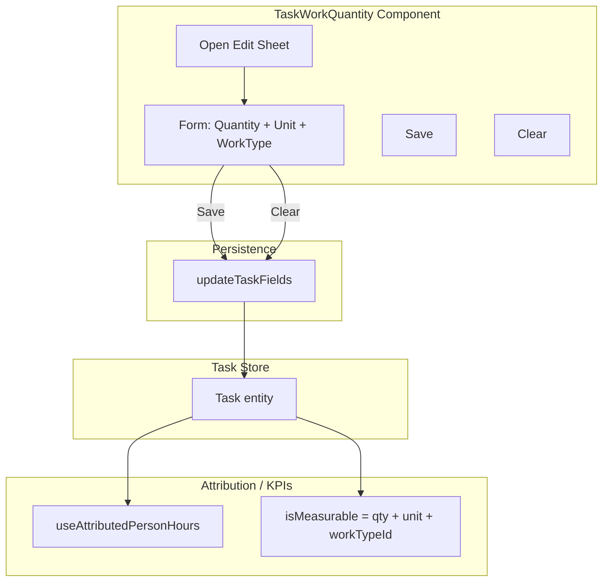

# Work Type in Task Detail — Option A Implementation

## Goal

Extend the TaskWorkQuantity "Set Work Quantity" sheet to support WorkType selection. Users can add WorkType to a task after creation or change it when editing. All updates are atomic via `updateTaskFields` to ensure attribution logic sees consistent state.

## Architecture




## Key Design Decisions


| Decision                 | Choice                                                                          | Rationale                                                                          |
| ------------------------ | ------------------------------------------------------------------------------- | ---------------------------------------------------------------------------------- |
| Persistence              | `updateTaskFields`                                                              | Atomic write of quantity, unit, workTypeId, buildPhase, targetProductivity         |
| Unit / WorkType coupling | Unit locked when WorkType selected; filter WorkTypes by unit when task has unit | Matches `resolveTaskUpdates` in worktype-classify; avoids unit mismatch            |
| Clear behavior           | Clear all (quantity, unit, WorkType)                                            | Single "remove work" mental model                                                  |
| WorkType optionality     | Optional — task can have quantity+unit without WorkType                         | Preserves current behavior; task self-owns but not measurable until WorkType added |


## Implementation Steps

### 1. Add `updateTaskWorkContext` to task store

**File:** [src/lib/stores/task-store.ts](src/lib/stores/task-store.ts)

Add a new function that updates the full work context in one write:

```typescript
export async function updateTaskWorkContext(
  id: string,
  workQuantity: number | null,
  workUnit: WorkUnit | null,
  workTypeId: string | null,
  buildPhase: BuildPhase | null,
  targetProductivity: number | null,
): Promise<void>
```

- If `workTypeId` is null, set `buildPhase` and `targetProductivity` to null.
- Otherwise persist all fields atomically via `updateTaskFields` (or inline the same pattern).
- This replaces calls to `updateTaskWork` from TaskWorkQuantity with a single API for the full work block.

**Alternative:** Keep `updateTaskWork` and call `updateTaskFields` from TaskWorkQuantity with the full patch. Simpler and avoids a new store function. Prefer `updateTaskFields` directly from the component for flexibility.

### 2. Extract unit/WorkType resolution logic

**File:** [src/lib/work-context-utils.ts](src/lib/work-context-utils.ts) (new)

Create a small utility module (or add to an existing lib file) to centralize the logic from `resolveTaskUpdates`:

```typescript
export function resolveWorkContextFromWorkType(
  currentUnit: WorkUnit | null,
  currentBuildPhase: BuildPhase | null,
  workType: WorkType,
): { workUnit: WorkUnit; buildPhase: BuildPhase; targetProductivity: number }
```

- If `currentUnit != null` and `currentUnit !== workType.workUnit`, throw (unit mismatch).
- Return `workUnit: currentUnit ?? workType.workUnit`, `buildPhase: currentBuildPhase ?? workType.buildPhase`, `targetProductivity: workType.expectedProductivity`.

This keeps TaskWorkQuantity from depending on worktype-classify (remediation-specific) while reusing the same rules.

**Alternative:** Import and reuse `resolveTaskUpdates` from worktype-classify by passing a minimal task-like object. That function is currently not exported. Either export it or duplicate the logic in the new util. Prefer a shared util to avoid divergence.

### 3. Extend TaskWorkQuantity component

**File:** [src/components/TaskWorkQuantity.tsx](src/components/TaskWorkQuantity.tsx)

**State:**

- Add `selectedWorkTypeId: string | null` to form state.
- Import `useWorkTypeStore`, `getWorkTypeById`, `BUILD_PHASE_LABELS` (from [src/lib/types.ts](src/lib/types.ts)), and `updateTaskFields` (from task-store).

**handleOpen:**

- When task has `workTypeId`, set `selectedWorkTypeId` to it; otherwise `null`.
- Existing quantity/unit logic unchanged.

**Form layout (inside ActionSheet):**

1. **Work Type** (new section)
  - Dropdown: "Select work type..." + list of work types.
  - When task has `workUnit`, filter `workTypes` to those with `wt.workUnit === task.workUnit`.
  - When task has no unit, show all work types; selecting one sets `unit` to `workType.workUnit`.
  - When WorkType selected, show read-only: "Expected: X {unit}/person-hr" (mirror CreateTaskSheet).
  - Optional: hide unit pills when WorkType selected (unit locked).
  - Empty state: "No work types yet" or "No work types for this unit" when filtered.
2. **Work Quantity** (existing)
  - Quantity input + unit pills.
  - When WorkType selected, unit pills hidden (unit = workType.workUnit).
3. **Actions**
  - Clear: sets quantity, unit, workTypeId, buildPhase, targetProductivity to null.
  - Save: validates quantity > 0; builds patch and calls `updateTaskFields`.

**handleSave:**

```typescript
const parsed = parseFloat(quantity);
if (isNaN(parsed) || parsed <= 0) return;

const patch: Partial<Task> = {
  workQuantity: parsed,
  workUnit: unit,
};

if (selectedWorkTypeId) {
  const wt = getWorkTypeById(selectedWorkTypeId);
  if (!wt) return; // guard
  // Resolve workUnit consistency (throw or filter already prevents mismatch)
  patch.workTypeId = wt.id;
  patch.buildPhase = wt.buildPhase;
  patch.targetProductivity = wt.expectedProductivity;
  patch.workUnit = unit; // use form unit (matches wt.workUnit when filtered)
} else {
  patch.workTypeId = null;
  patch.buildPhase = null;
  patch.targetProductivity = null;
}

await updateTaskFields(taskId, patch);
```

**handleClear:**

```typescript
await updateTaskFields(taskId, {
  workQuantity: null,
  workUnit: null,
  workTypeId: null,
  buildPhase: null,
  targetProductivity: null,
});
```

### 4. Update section summary to show WorkType

**File:** [src/components/TaskWorkQuantity.tsx](src/components/TaskWorkQuantity.tsx)

Expandable section summary:

- Current: `formatWorkQuantity(qty, unit)` when hasWork.
- New: When `workTypeId` present, append WorkType title, e.g. `"120 m² · Carpet Tiles"` or `"120 m²"` (keep compact).

Use `getWorkTypeById(task.workTypeId)?.title` for the WorkType label. Optional: show only when WorkType exists to avoid layout shift.

### 5. Attribution cache invalidation (optional)

**File:** [src/components/TaskWorkQuantity.tsx](src/components/TaskWorkQuantity.tsx) or [src/lib/stores/task-store.ts](src/lib/stores/task-store.ts)

After `updateTaskFields` when work-related fields change, consider calling `invalidateAttributionCache()` from [src/lib/attribution/cache.ts](src/lib/attribution/cache.ts). Attribution is recomputed on read from DB; `useAttributedPersonHours` uses `taskKey` including `workTypeId`, so it refetches when the task store updates. Remediation/other cache consumers may see stale data until TTL. For minimal scope, defer invalidation; add in a follow-up if needed.

### 6. Styling

**File:** [src/styles/components/task-work-quantity.css](src/styles/components/task-work-quantity.css)

- Add spacing for the Work Type section.
- Work Type select: use existing `input` or `create-task-sheet`-style select (see [src/components/CreateTaskSheet.tsx](src/components/CreateTaskSheet.tsx) lines 186–207).
- Expected rate line: reuse `settings-view__row-detail` or similar for subtle text.

### 7. Edge cases


| Case                                      | Handling                                                                                                                                                                                                                                   |
| ----------------------------------------- | ------------------------------------------------------------------------------------------------------------------------------------------------------------------------------------------------------------------------------------------ |
| No work types defined                     | Show helper: "Create work types in Settings." WorkType dropdown disabled or hidden. Save still allows quantity+unit only.                                                                                                                  |
| Task has unit, no WorkTypes for that unit | Show "No work types for {unit}." Allow saving quantity+unit without WorkType.                                                                                                                                                              |
| User clears WorkType but keeps quantity   | Add "Clear Work Type" (set workTypeId/buildPhase/targetProductivity to null, keep quantity+unit)? Per decision, "Clear" clears all. If we want partial clear, add a separate "Remove Work Type" control; otherwise omit.                   |
| buildPhase mismatch                       | `resolveTaskUpdates` in worktype-classify throws if task.buildPhase != null && !== workType.buildPhase. For edit, we can overwrite buildPhase when user picks new WorkType (we're adopting that WorkType). No need to throw for edit flow. |


## Files to Modify

- [src/components/TaskWorkQuantity.tsx](src/components/TaskWorkQuantity.tsx) — add WorkType picker, switch to `updateTaskFields`
- [src/styles/components/task-work-quantity.css](src/styles/components/task-work-quantity.css) — style Work Type section (if needed)

## Files to Create

- None (or [src/lib/work-context-utils.ts](src/lib/work-context-utils.ts) if extracting resolution logic; optional)

## Testing

- Manual: Add work with WorkType, edit to change WorkType, clear all.
- Verify TaskProductivity shows after adding WorkType (isMeasurable becomes true).
- Verify unit filtering when task has unit: only matching WorkTypes shown.
- Verify `useAttributedPersonHours` refetches (taskKey includes workTypeId).

