# Work Types Import/Export — Implementation Plan

## Summary of Design Decisions


| Decision                 | Choice                                                                              |
| ------------------------ | ----------------------------------------------------------------------------------- |
| Export content           | Definition-only: title, workUnit, buildPhase, expectedProductivity                  |
| Import strategy          | Update-if-exists — create if key missing, update if key exists (incremental)        |
| Placement                | Both Interop and Work Types settings, identical behavior                            |
| Work package integration | Auto-create missing work types when referenced work type does not exist (edge case) |
| Format                   | CSV                                                                                 |


---

## Architecture

```mermaid
flowchart TB
    subgraph Export [Work Type Export]
        WTStore1[work-type-store]
        ExportFn[exportWorkTypesCsv]
        Download[Download CSV file]
        WTStore1 --> ExportFn --> Download
    end

    subgraph Import [Work Type Import]
        Parse[parseWorkTypeCsv]
        Preview[generateWorkTypeImportPreview]
        Apply[applyWorkTypeImport]
        Parse --> Preview --> Apply
        Apply --> WTStore2[work-type-store]
    end

    subgraph WPImport [Work Package Import - Auto-create]
        ParseWP[parseWorkPackageCsv]
        EnsureWT[ensureWorkTypeExistsOrCreate]
        CreateTemplate[createTemplate]
        ParseWP --> EnsureWT
        EnsureWT --> CreateTemplate
    end
```




---

## 1. Work Type Export Module

**New file:** [src/lib/interop/work-type-export.ts](src/lib/interop/work-type-export.ts)

- Export function `exportWorkTypesCsv(workTypes: WorkType[]): string`
- Columns: `mappingKey`, `title`, `workUnit`, `buildPhase`, `expectedProductivity`
- Mapping key: use `workTypeKeyString(title, workUnit, buildPhase)` from [src/lib/types.ts](src/lib/types.ts) (line 75)
- Reuse CSV escaping pattern from [src/lib/interop/export.ts](src/lib/interop/export.ts) — either extract `csvEscape`/`csvRow` to a shared util or duplicate the small helpers in this module
- First row: headers; subsequent rows: one per work type

**Shared CSV utils (optional refactor):** Extract `csvEscape`, `csvRow` from export.ts and `parseCsvLine` from import.ts into [src/lib/interop/csv-utils.ts](src/lib/interop/csv-utils.ts) to avoid duplication. Both export and work-type-import will use them.

---

## 2. Work Type Import Module

**New file:** [src/lib/interop/work-type-import.ts](src/lib/interop/work-type-import.ts)

**Parse:**

- `parseWorkTypeCsv(csvText: string): WorkTypeImportParseResult`
- Required columns: `title`, `workUnit`, `buildPhase`, `expectedProductivity`
- Validate workUnit in `['m2','m','pcs','orders']`, buildPhase in `['build-up','tear-down']`, expectedProductivity positive number
- Return `{ items: ImportedWorkType[], errors: ImportValidationError[], valid: boolean }`
- Use same `parseCsvLine` logic as work package import (extract to csv-utils or import from import.ts)

**Preview (optional but recommended for UX consistency):**

- `generateWorkTypeImportPreview(items, existingWorkTypes): WorkTypeImportPreview`
- Match by `workTypeKeyString`; action: `create` | `update`; show summary (X create, Y update)

**Apply:**

- `applyWorkTypeImport(items: ImportedWorkType[]): Promise<{ created: number; updated: number }>`
- For each item: call `findWorkTypeByKey` from [src/lib/stores/work-type-store.ts](src/lib/stores/work-type-store.ts)
- If exists: `updateWorkTypeFields(id, { title, workUnit, buildPhase, expectedProductivity })`
- If not: `createWorkType({ title, workUnit, buildPhase, expectedProductivity })`
- Return counts

---

## 3. Work Type Store — Auto-create Helper

**File:** [src/lib/stores/work-type-store.ts](src/lib/stores/work-type-store.ts)

Add:

```ts
export async function ensureWorkTypeExistsOrCreate(
  title: string,
  workUnit: WorkUnit,
  buildPhase: BuildPhase,
  defaultExpectedProductivity: number = 0
): Promise<string>
```

- Call `findWorkTypeByKey(title, workUnit, buildPhase)`
- If found: return existing id
- If not: call `createWorkType` with given params, return new id
- Used by work package import when `workTypeId` is null

---

## 4. Work Package Import — Auto-create Integration

**File:** [src/pages/settings/SettingsInteropView.tsx](src/pages/settings/SettingsInteropView.tsx)

In `handleApply` loop (around line 136), when processing each `payload`:

- If `payload.workTypeId === null`: call `ensureWorkTypeExistsOrCreate(payload.workTypeTitle, payload.workUnit, payload.buildPhase, 0)` and use returned id as `workTypeId` for the template/task
- If `payload.workTypeId` is set: use as-is (no change)

This applies to create, update-template, and update-task branches. Resolve `workTypeId` once before branching.

---

## 5. UI — Settings Work Types View

**File:** [src/pages/settings/SettingsWorkTypesView.tsx](src/pages/settings/SettingsWorkTypesView.tsx)

- Add Export section: header "Export Work Types", button "Export" → call `exportWorkTypesCsv(workTypes)`, trigger download (reuse `downloadCsv` pattern from [SettingsInteropView.tsx](src/pages/settings/SettingsInteropView.tsx) lines 33–42)
- Add Import section: textarea, "Parse + Preview" button, preview summary (X create, Y update), "Apply Import" button
- Reuse the same interaction pattern as Interop work packages (textarea → parse → preview → apply)

---

## 6. UI — Settings Interop View

**File:** [src/pages/settings/SettingsInteropView.tsx](src/pages/settings/SettingsInteropView.tsx)

- Add card "Export Work Types" (above or below KPI export): button "Export" → `exportWorkTypesCsv(workTypes)`, download
- Add card "Import Work Types" (adjacent to Import Work Packages): textarea, Parse + Preview, Apply — identical behavior to Work Types view

---

## 7. Tests

- **work-type-export.test.ts:** export columns, mapping key, CSV escaping, empty list
- **work-type-import.test.ts:** parse valid/invalid rows, required headers, validation errors, mapping key
- **work-type-store:** ensureWorkTypeExistsOrCreate — creates when missing, returns existing when present
- **SettingsInteropView / work package apply:** when workTypeId is null, ensureWorkTypeExistsOrCreate is called and template gets the new id

---

## File Summary


| Action            | File                                                                                                 |
| ----------------- | ---------------------------------------------------------------------------------------------------- |
| Create            | `src/lib/interop/work-type-export.ts`                                                                |
| Create            | `src/lib/interop/work-type-import.ts`                                                                |
| Create (optional) | `src/lib/interop/csv-utils.ts`                                                                       |
| Modify            | `src/lib/stores/work-type-store.ts` — add `ensureWorkTypeExistsOrCreate`                             |
| Modify            | `src/pages/settings/SettingsInteropView.tsx` — add WT export/import cards, wire auto-create in apply |
| Modify            | `src/pages/settings/SettingsWorkTypesView.tsx` — add export + import UI                              |
| Create            | `src/lib/interop/work-type-export.test.ts`                                                           |
| Create            | `src/lib/interop/work-type-import.test.ts`                                                           |


---

## Implementation Order

1. CSV utils extraction (if doing refactor) or inline helpers in new modules
2. work-type-export.ts + tests
3. work-type-import.ts (parse, preview, apply) + tests
4. ensureWorkTypeExistsOrCreate in work-type-store + tests
5. SettingsWorkTypesView UI
6. SettingsInteropView — WT export/import cards
7. SettingsInteropView — auto-create in work package apply
8. Manual verification in browser

