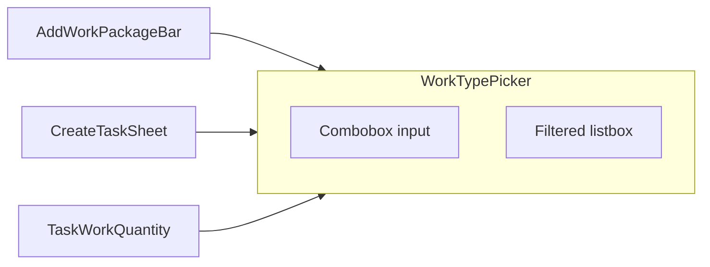

# Searchable WorkTypePicker — AddWorkPackageBar first

## Scope (this pass)

1. **Replace `[WorkTypePicker](src/components/WorkTypePicker.tsx)` internals** with a searchable combobox (same external contract: `workTypes`, `selectedId`, `onChange`, `emptyMessage`, `placeholder`, `showRate`, `className`).
2. **Migrate `[AddWorkPackageBar.tsx](src/pages/planning/AddWorkPackageBar.tsx)`** — the **Type** field is the explicit priority (replace `<select>` with `WorkTypePicker` + minimal new props).
3. **No extra migration** of other inline work-type `<select>`s in this pass (table, line cards, sheets, wrap-up, etc.).

**Automatic win:** `[CreateTaskSheet](src/components/CreateTaskSheet.tsx)` and `[TaskWorkQuantity](src/components/TaskWorkQuantity.tsx)` already use `WorkTypePicker`; they get search without file changes beyond QA.

**Explicitly out of scope here:** `orphanLabel` / table-specific API until WorkPackageTable is migrated later; optional CreateTaskSheet `scrollIntoView`; migrating TemplateFormSheet, CalculatorSheet, LineItemCard, WorkPackageTable, WrapUpReviewContent, RemediationWorkTypeAssignSheet.

## Recommended follow-ups (not committed in this plan)

| Priority | Target                                                                                                                                                     | Rationale                                                                                                                     |
| -------- | ---------------------------------------------------------------------------------------------------------------------------------------------------------- | ----------------------------------------------------------------------------------------------------------------------------- |
| High     | `[WorkPackageTable](src/pages/planning/WorkPackageTable.tsx)` + `[LineItemCard](src/pages/planning/LineItemCard.tsx)`                                      | Same planning surface as the add bar; users edit types repeatedly; needs `orphanLabel` (or equivalent) for missing-type rows. |
| Medium   | `[TemplateFormSheet](src/components/TemplateFormSheet.tsx)`, `[CalculatorSheet](src/components/CalculatorSheet.tsx)` (work-type row only)                  | Consistency; lower interaction density than grid.                                                                             |
| Low      | `[WrapUpReviewContent](src/pages/planning/WrapUpReviewContent.tsx)`, `[RemediationWorkTypeAssignSheet](src/components/RemediationWorkTypeAssignSheet.tsx)` | Infrequent flows; native `<select>` acceptable longer.                                                                        |

## Context

- Dependencies stay React-only (`[package.json](package.json)`): **custom combobox**.
- `[ActionSheet](src/components/ActionSheet.tsx)` + `[useModalFocusTrap](src/lib/hooks/useModalFocusTrap.ts)`: **Escape** must close the list first (`stopPropagation` while list open), then the sheet on a second Escape.

## Implementation

### 1. Combobox behavior in `WorkTypePicker`

Same as the full plan: combobox + listbox roles, `formatWorkTypeWithUnit` for filter/display, keyboard + click-outside, committed vs search string with blur snapback, nullable clear when `allowClear` applies (existing nullable flows).

**Defer until table migration:** `orphanLabel` / missing-id display (not needed for AddWorkPackageBar if `selectedId` always comes from the filtered list).

### 2. API extensions (minimal for this scope)

| Prop                                   | Purpose                                                                        |
| -------------------------------------- | ------------------------------------------------------------------------------ |
| `showLabel?: boolean` (default `true`) | Add bar already has a **Type** label; hide built-in “Work Type” label.         |
| `inputClassName?: string`              | Apply `planning-view__wp-add-bar-type` (and cell classes in a follow-up).      |
| `disabled?: boolean`                   | When `selectableWorkTypes.length === 0` (matches current `<select disabled>`). |

Add more props in a later PR when migrating WorkPackageTable / LineItemCard (`ariaLabel`, `orphanLabel`, `allowClear`, etc.).

### 3. Styles

- `[src/styles/components/work-type-picker.css](src/styles/components/work-type-picker.css)`; import from `[src/index.css](src/index.css)`.
- Validate the listbox is not clipped by `[AddWorkPackageBar](src/pages/planning/AddWorkPackageBar.tsx)` / parent overflow and sits above adjacent controls (`z-index`).

### 4. AddWorkPackageBar migration

- Import `WorkTypePicker`; pass `workTypes={selectableWorkTypes}` (existing `readOnly` filter unchanged).
- `selectedId={newWorkTypeId}` — today state may be `''`; align with `string | null` if the picker uses null for empty (normalize in bar or map `''` ↔ `null` once).
- `onChange` → `setNewWorkTypeId` with same semantics as current select.
- `showLabel={false}`, `placeholder` / `emptyMessage` aligned with current copy (“No work types. Add in Settings.”).
- `className` on wrapper for section spacing if needed; `inputClassName` for bar width styling.

### 5. Tests and verification

- `[WorkTypePicker.test.tsx](src/components/WorkTypePicker.test.tsx)`: type to filter; Escape closes list without relying on full sheet tests.
- Manual: add bar open, typeahead, pick, empty work-types disabled path; quick regression on CreateTaskSheet + TaskWorkQuantity sheets (Escape order).
- `npm run build` && `npm test`.

## ROI note

Narrow scope **front-loads** the combobox once, ships the **highest-priority surface** (add bar), and still upgrades **add task** / **set quantity** via the shared component—without committing to table/z-index QA for every planning control in the same PR.