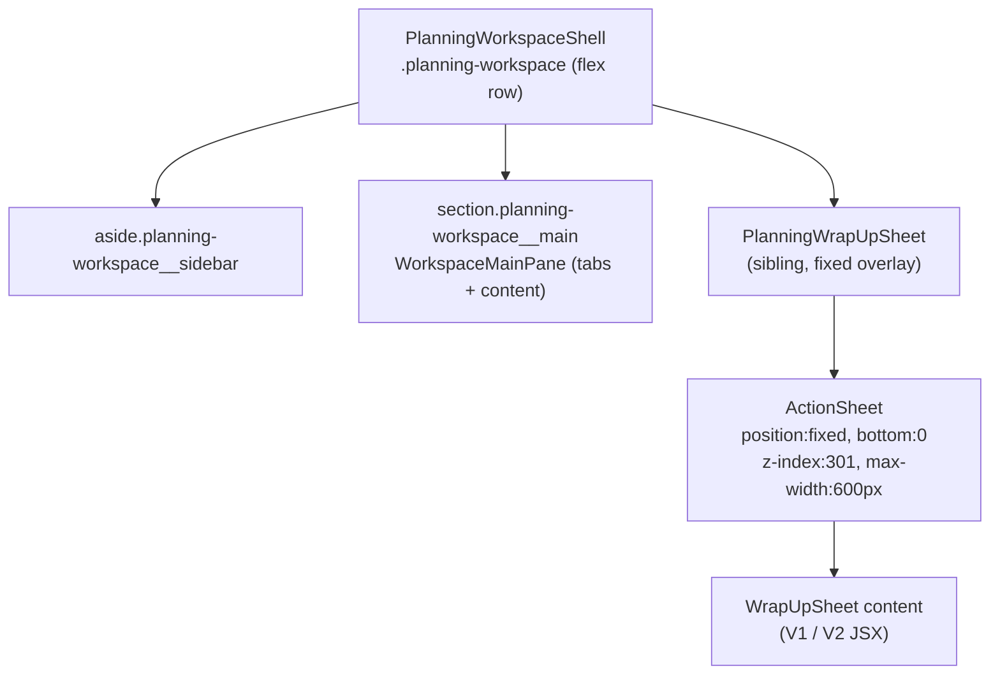
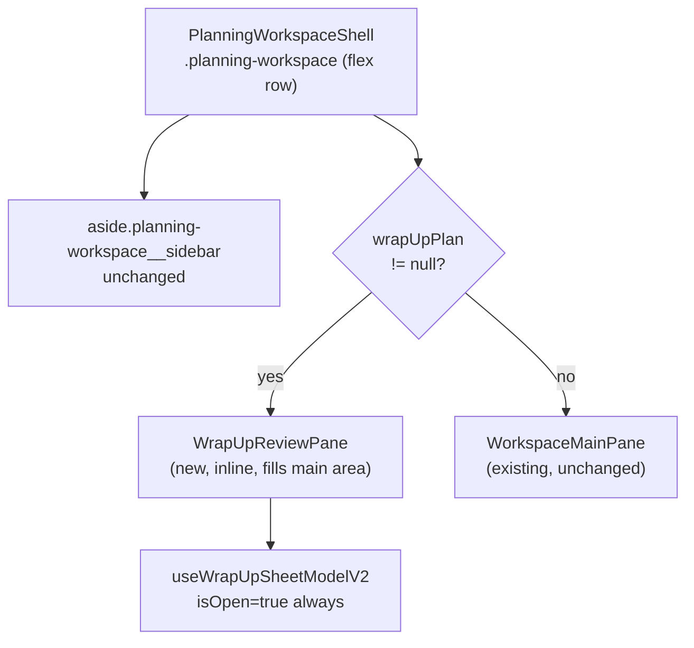

# Wrap Up: ActionSheet → On-Page Review

## Current Architecture




## Target Architecture




## Components & Files

### 1. New: `src/pages/planning/WrapUpReviewPane.tsx`

The sole new file. Same props as `WrapUpSheet` (`plan`, `tasks`, `timeEntriesByTask`, `onClose`, `onCompleted`). V2 content only — no V1 branch (flag is always-on; V1 remains in `WrapUpSheet` for the mobile path if ever needed).

**Hook contract:** Call `useWrapUpSheetModelV2` with `isOpen: true` always — the pane is only mounted when `wrapUpPlan != null`, so the hook's load `useEffect` fires immediately on mount and cancels correctly on unmount. No hook changes required.

**Layout — three-zone flex column, inner scroll:**

```
.wrap-up-review-pane              flex column, height: 100%, overflow: hidden
  .wrap-up-review-pane__header    sticky top bar — plan name + "Wrap Up Review" title + Cancel/Back button
  .wrap-up-review-pane__body      flex: 1, overflow-y: auto  ← inner scroll container
    [meta block — timestamps]
    [line item section]
    [unplanned work section]
  .wrap-up-review-pane__footer    sticky footer — validation errors + action buttons
```

The inner scroll is on `.wrap-up-review-pane__body`, not on the parent `section.planning-workspace__main`. This keeps `position: sticky` working correctly for header and footer, and avoids a double-scrollbar conflict with the parent section's existing `overflow-y: auto`.

**Card layout — two columns on wide screens:**

- Default (narrow): single-column stack (identical to current sheet behaviour)
- `@media (min-width: 900px)`: `.wrap-up-review-pane__card-grid` becomes `display: grid; grid-template-columns: 1fr 1fr; gap: var(--space-md)` — line-item cards and unplanned-work cards flow into a 2-col grid
- Cards reuse existing `.wrap-up-sheet__card-v2` styles; the grid wrapper is new

**Removed from this component (were iOS-specific):**

- No focus trap (`useModalFocusTrap`)
- No body scroll lock
- No Visual Viewport API keyboard compensation
- No drag handle
- No entry animation (instant content swap)

**Plan name in header:** The header shows the plan's name/date alongside the "Wrap Up Review" title, giving context since the tab strip and progress view are hidden while the pane is open.

### 2. Modified: `[src/pages/planning/workspace/PlanningWorkspaceShell.tsx](src/pages/planning/workspace/PlanningWorkspaceShell.tsx)`

Two targeted changes only:

- Remove the `<PlanningWrapUpSheet ... />` sibling at the bottom of the JSX tree.
- Wrap the main section's inner content:

```tsx
  {wrapUpPlan
    ? <WrapUpReviewPane
        plan={wrapUpPlan}
        tasks={tasks}
        timeEntriesByTask={timeEntriesByTask}
        onClose={onCloseWrapUp}
        onCompleted={onWrapUpCompleted}
      />
    : <WorkspaceMainPane ... />
  }
  

```

  All five values (`wrapUpPlan`, `tasks`, `timeEntriesByTask`, `onCloseWrapUp`, `onWrapUpCompleted`) are already present as props on `PlanningWorkspaceShell` — no prop drilling changes needed.

**Side effect:** When the pane is visible, `WorkspaceMainPane` (and its tabs and "Wrap Up" trigger button) are unmounted. This is intentional — you cannot trigger a second wrap-up while one is already open.

### 3. New: `src/styles/components/wrap-up-review-pane.css`

Key rules (no negative-margin hacks needed):

- `.wrap-up-review-pane` — `display: flex; flex-direction: column; height: 100%; overflow: hidden`
- `.wrap-up-review-pane__header` — `border-bottom; padding; background; display: flex; align-items: center; gap`
- `.wrap-up-review-pane__body` — `flex: 1; overflow-y: auto; padding: var(--space-lg)`
- `.wrap-up-review-pane__footer` — `border-top; padding; background; display: flex; flex-direction: column; gap`
- `.wrap-up-review-pane__card-grid` — single col by default; 2-col grid at `min-width: 900px`
- Import into the main CSS bundle alongside other component styles

### 4. Scoped CSS fix: `[src/styles/components/wrap-up-sheet.css](src/styles/components/wrap-up-sheet.css)`

The `.wrap-up-sheet__actions-bar` negative-margin hack exists to break out of `ActionSheet`'s padding:

```css
/* current — unscoped, affects any parent */
.wrap-up-sheet__actions-bar {
  margin-left: calc(-1 * var(--space-lg));
  margin-right: calc(-1 * var(--space-lg));
  padding-bottom: calc(var(--space-lg) + env(safe-area-inset-bottom, 0px));
  margin-bottom: calc(-1 * (var(--space-lg) + env(safe-area-inset-bottom, 0px)));
}
```

Scope it to the ActionSheet context so it doesn't leak:

```css
/* scoped — only applies when inside an action-sheet */
.action-sheet .wrap-up-sheet__actions-bar {
  margin-left: calc(-1 * var(--space-lg));
  /* ... rest unchanged */
}
```

The new pane's footer is a plain `.wrap-up-review-pane__footer` and doesn't need this hack at all.

### 5. Untouched (intentionally)

- `[src/pages/planning/WrapUpSheet.tsx](src/pages/planning/WrapUpSheet.tsx)` — kept as-is for `PlanningView.tsx` mobile path (V1 + V2 branches remain there)
- `[src/pages/planning/PlanningWrapUpSheet.tsx](src/pages/planning/PlanningWrapUpSheet.tsx)` — still used by `PlanningView.tsx`
- `[src/pages/planning/hooks/useWrapUpSheetModelV2.ts](src/pages/planning/hooks/useWrapUpSheetModelV2.ts)` — zero changes
- `[src/lib/planning/wrap-up.ts](src/lib/planning/wrap-up.ts)`, `[wrap-up-v2-projection.ts](src/lib/planning/wrap-up-v2-projection.ts)`, `[wrap-up-v2-model.ts](src/lib/planning/wrap-up-v2-model.ts)` — zero changes
- `[src/components/ActionSheet.tsx](src/components/ActionSheet.tsx)` — zero changes

## What Goes Away (from the workspace path)

- `position: fixed` overlay and backdrop for wrap-up
- `z-index: 301` stacking context
- Visual Viewport API / iOS keyboard compensation
- Drag handle and `actionSheetSlideUp` entry animation
- Body scroll lock during review
- 600px max-width constraint — desktop now gets full main area width with 2-col layout

